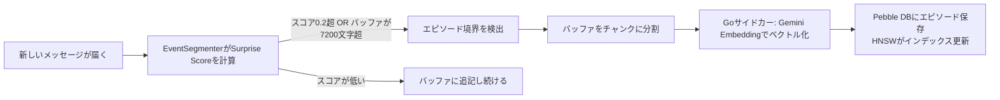

# episodic-claw

**OpenClawエージェントのための長期エピソード記憶プラグイン。**

> [🇺🇸 English](./README.md) · 🇯🇵 日本語 · [🇨🇳 中文](./README.zh.md)

[](CHANGELOG.md)
[](./LICENSE)
[](https://openclaw.ai)

会話を自動でローカルのベクトルDBに保存して、必要なときにキーワードではなく「意味」で検索し、関連する記憶をシステムプロンプトに注入してくれます。設定不要、コマンド不要、インストールするだけで動きます。

---

## なぜTypeScriptとGoの2言語？

ほとんどのプラグインは1言語で書かれていますが、これはあえて2言語を使っています。

ホテルで例えるとわかりやすいです。

**TypeScriptはフロントデスク。** OpenClawのプラグインAPIと話すのが得意で、ツール登録、フック配線、JSONのパース、エージェントとの接続など「窓口業務」を担当します。TypeScriptはこれが得意 — 柔軟で、npmで何でも揃う。

**GoはバックヤードのS倉庫作業員。** 会話をベクトルにして保存・検索する処理が来たら、TypeScriptはコンパイル済みのGoバイナリ（サイドカー）に仕事を渡します。GoはGemini Embedding APIへの並行リクエスト、HNSWベクトルインデックスの維持、Pebble DBへの読み書きを担当 — 高速で、メモリ安全で、Node.jsのシングルスレッド制約を受けない。

**この分担のおかげでエージェントは待たされない。** 保存はfire-and-forget（発火して忘れる）で動き、検索は1回の非同期ラウンドトリップで終わります。

---

## どうやって動くの？（アーキテクチャ）

> **TL;DR:** メッセージを送るたびに記憶の検索が走る。関連する過去のエピソードがAIのシステムプロンプトに自動注入される。

**Step 1 — あなたがメッセージを送る。**

**Step 2 — `assemble()` が発火する。** プラグインは直近5件のメッセージから検索クエリを構築します。

**Step 3 — Goサイドカーがクエリをベクトルに変換する。** Gemini Embedding APIを使ってテキストを768次元のベクトル（意味を数値化したもの）に変換します。

**Step 4 — HNSWが最も近い過去エピソードをトップK件で返す。** HNSWは「意味が近いものを爆速で探す」アルゴリズムです。何千件の記憶があってもミリ秒レベルで動きます。

**Step 5 — 一致したエピソードがシステムプロンプトに注入される。** AIはあなたのメッセージを読む前に過去の記憶を見るので、返答に自然に過去の文脈が入ります。


バックグラウンドでは、新しいエピソードが随時保存されています：

**Step A — Surprise Scoreがトピックの転換を検出する。** ターンごとに「会話の話題が変わったか？」を判定。変わったと判断したら今のバッファを閉じてエピソードとして保存します。

**Step B — テキストを分割 → Goサイドカー → Gemini Embedding → Pebble DBに保存。** エピソードテキストがベクトル付きで保存され、将来の会話でいつでも検索できます。




---

## 記憶の2層構造（D0 / D1）

> **TL;DR:** D0は生の日記。D1は日記をまとめた「読書メモ」。

### D0 — 生エピソード（Raw Episodes）

Surprise Scoreが閾値を超えるたびに、現在の会話バッファをそのままD0エピソードとして保存します。逐語的な会話ログで、詳細かつタイムスタンプ付き。

- Pebble DBにベクトル埋め込み付きで保存
- 自動タグ: `auto-segmented`、`surprise-boundary`、`size-limit`
- HNSWベクトル検索でいつでも取得可能

### D1 — LLM要約による長期記憶（Sleep Consolidation）

時間が経つと複数のD0エピソードをLLMが「眠りながら記憶を整理する（Sleep Consolidation）」ように圧縮します。本質だけ残って、ノイズは消える。

- D1ノードは元のD0エピソードへのリンクを保持
- `ep-expand` でD1サマリーからD0に掘り下げ可能
- トークン消費を抑えながら長期的な意味の一貫性を維持

### Surprise Scoreって何？

直近メッセージのベクトルを現在のバッファのベクトルと比較して**ベイジアン・サプライズ**を計算します。スコアが`0.2`を超えたら「会話の文脈が大きく変わった → 今のエピソードを閉じて新しいエピソードを始めよう」と判断。

```
バッファ:      "Reactでtodoアプリを作ろう"
次のメッセージ: "データベースのインデックス設計ってどうすればいい？"
→ Surprise: 高い → エピソード境界 → 前のエピソードを保存
```

---

## インストール

```bash
openclaw plugins install clawhub:episodic-claw
```

これだけです。プラグインは起動時に自動でフックに繋がります。設定ファイルの編集もAPIキーの設定も不要（GoサイドカーはOpenClaw環境に設定済みのGemini APIキーをそのまま使います）。

---

## エージェント向けインストールプロンプト

プロンプトが2つあります。**前半**はエージェント（Claude Code等）に渡してインストールを自動実行させるもの。**後半**はエージェントのシステムプロンプトに貼り付けて記憶の使い方を教えるものです。

### パート1 — インストール（エージェントに実行させる）

```
episodic-clawメモリプラグインをOpenClawエージェントにインストールして設定してください。
以下の手順を順番に実行してください：

Step 1 — OpenClawのプラグインマネージャーでインストール:
  openclaw plugins install clawhub:episodic-claw

Step 2 — プラグインがリストに表示されることを確認:
  openclaw plugins list

Step 3 — OpenClawの設定ファイル（openclaw.config.json等）にepisodic-clawが登録されているか確認。
  最小限の設定エントリはこちら:
  {
    "plugins": [
      { "id": "episodic-claw" }
    ]
  }
  "plugins"配列がすでにある場合は { "id": "episodic-claw" } を追加するだけでOK。

Step 4 — プラグインはOpenClaw環境に設定済みのGemini APIキーを使用します。
  GEMINI_API_KEYが未設定の場合は今すぐ設定してください:
  export GEMINI_API_KEY="your-key-here"
  （無料キーの取得: https://aistudio.google.com/app/apikey）

Step 5 — 変更を適用するためOpenClawゲートウェイを再起動:
  openclaw gateway restart
  （GUIアプリを使用中の場合はOpenClawデスクトップアプリを再起動）

Step 6 — ゲートウェイログに以下が表示されることを確認:
  [Episodic Memory] Plugin registered.
  [Episodic Memory] Gateway started.

以上でプラグインが稼働しています。追加設定は不要です。
```

### パート2 — システムプロンプト（エージェントのシステムプロンプトに貼り付け）

```
You have long-term episodic memory powered by the episodic-claw plugin.

Your memory tools:
- ep-recall <query>   — Search your memory for anything relevant to a topic
- ep-save <content>   — Save something important that you want to remember later
- ep-expand <slug>    — Expand a memory summary to read its full contents

How to use them well:
- Before answering questions that might benefit from past context, run ep-recall first.
- After completing something meaningful (a key decision, a fix, a preference learned),
  run ep-save to make sure it sticks.
- When a recalled memory summary is too brief and you need more detail, run ep-expand.
- You also have automatic memory: relevant past episodes are already injected at the top
  of every system prompt under "--- My Memory ---". Read those first before calling
  ep-recall manually.
- Your memory is stored locally and privately — it never leaves the machine.

The episodic-claw plugin runs silently in the background. You don't need to manage it.
Just use the tools when they make sense.
```

---

## 3つのメモリツール

### `ep-recall` — 記憶の手動検索

> トピックやキーワードで特定の記憶を掘り出す。

自動検索では足りないときや「あのとき何を話したっけ？」と明示的に聞くときに使います。

```
あなた: "先週決めたDBスキーマ覚えてる？"
AI:     [ep-recall を呼び出す → クエリ: "DBスキーマの決定"]
AI:     "[日付]に、usersテーブルを正規化で作ることにしましたね。..."
```

| パラメータ | 型 | 必須 | 説明 |
|---|---|---|---|
| `query` | string | Yes | 検索したい内容 |
| `k` | number | No | 取得するエピソード数（デフォルト: 3） |

---

### `ep-save` — 記憶の手動保存

> AIに「これを覚えておいて」と言えば、その場で保存される。

```
あなた: "このプロジェクトはSQLiteじゃなくてPostgreSQLを使ってること、覚えておいて。"
AI:     [ep-save を呼び出す]
AI:     "了解、しっかり記録しました。"
```

| パラメータ | 型 | 必須 | 説明 |
|---|---|---|---|
| `content` | string | Yes | 保存する内容（自然言語、最大約3600文字） |
| `tags` | string[] | No | 任意のタグ（例: `["決定事項", "DB"]`） |

---

### `ep-expand` — サマリーからフル内容を展開

> 圧縮された要約じゃなくて元のやり取りが見たいときに使う。

```
あなた: "認証バグを直したときの詳細を教えて。"
AI:     [サマリーを発見 → ep-expand でフル内容を取得]
AI:     "あのときの全部の流れはこうでした: ..."
```

| パラメータ | 型 | 必須 | 説明 |
|---|---|---|---|
| `slug` | string | Yes | 展開したいサマリーエピソードのID/スラッグ |

---

## 設定一覧

すべてのキーは任意項目です。

| キー | 型 | デフォルト | 説明 |
|---|---|---|---|
| `enabled` | boolean | `true` | プラグインの有効/無効 |
| `reserveTokens` | integer | `6144` | システムプロンプトに注入する記憶の最大トークン数 |
| `recentKeep` | integer | `30` | コンパクション時に保持する直近の会話ターン数 |
| `dedupWindow` | integer | `5` | 重複チェックするバッファの件数。フォールバックが多い環境では10以上推奨 |
| `maxBufferChars` | integer | `7200` | 強制フラッシュのバッファ文字数上限。最小500 |
| `maxCharsPerChunk` | integer | `9000` | 1チャンクの最大文字数。`maxBufferChars`より小さい値で1フラッシュが複数エピソードに分割される。最小500 |
| `sharedEpisodesDir` | string | — | *(計画中 — Phase 6)* 複数エージェント間でエピソードを共有するパス。現バージョンでは効果なし |
| `allowCrossAgentRecall` | boolean | — | *(計画中 — Phase 6)* 他エージェントのエピソードを検索に含めるか。現バージョンでは効果なし |

---

## 研究的背景

このプラグインはAI記憶研究の先端をベースに設計されています：

- **EM-LLM** — 人間の記憶機構にインスパイアされた、無限コンテキストLLMのためのエピソード記憶
  Watson et al., 2024 · [arXiv:2407.09450](https://arxiv.org/abs/2407.09450)

- **MemGPT** — LLMをOSとして動かす発想の論文
  Packer et al., 2023 · [arXiv:2310.08560](https://arxiv.org/abs/2310.08560)

- **ポジションペーパー** — エージェント記憶システムの総合サーベイ
  2025 · [arXiv:2502.06975](https://arxiv.org/abs/2502.06975)

---

## 自己紹介

AIエージェントに、コンテキストウィンドウの圧縮要約より賢い記憶を持たせたくて作りました。

独学のAIオタクで、現在NEET生活中 — チームもなし、会社の後ろ盾もなし、ただ深夜に自分が欲しいものを作ってます。このプラグインは **100% バイブコーディング製** です。AIにやりたいことを話して、間違ってたら言い直して、動くまで繰り返す。それだけです。

### スポンサー

続けるにはClaudeかOpenAI Codexのサブスクリプションが必要で、スポンサーシップがそのままAIトークン代になります。役に立ってるなと思ったら、月$5でも本当に助かります。

**予定している今後のアップデート:**
- **Cross-agent recall** — 複数エージェント間での記憶共有
- **Memory decay** — 低関連度の古いエピソードが自然にフェードアウト
- **Web UI** — エージェントの記憶をブラウザで閲覧・編集

👉 **[GitHub Sponsors](https://github.com/sponsors/YoshiaKefasu)**

無理しなくていいです。プラグインはMPL-2.0ライセンスで永遠に無料です。

---

## ライセンス

[Mozilla Public License 2.0 (MPL-2.0)](LICENSE) © 2026 YoshiaKefasu

**なぜ MIT ではなく MPL 2.0 なのか？**

MIT ライセンスだと誰でもこのコードを改善して、その改善を非公開のままにできます。ライブラリならそれでいいですが、実際のワークフローの基盤になるメモリプラグインでは、フォークもオープンソースのままでいてほしい。

MPL 2.0 はファイル単位のコピーレフト：このリポジトリの `.ts` や `.go` ソースファイルを変更したら、その変更されたファイルは MPL のままオープンソースで公開する義務があります。でも自分のプロプライエタリなコードと組み合わせるのは自由 — コピーレフトはあなたのコードベースには広がりません。episodic-claw を使った商用プロダクトを作れる。ただし、プラグイン自体を改善してソースを非公開にすることはできない。

ゴールはシンプル：**episodic-claw への改善はコミュニティに還元される。**

---

*Built with OpenClaw · Powered by Gemini Embeddings · Stored with HNSW + Pebble DB*
