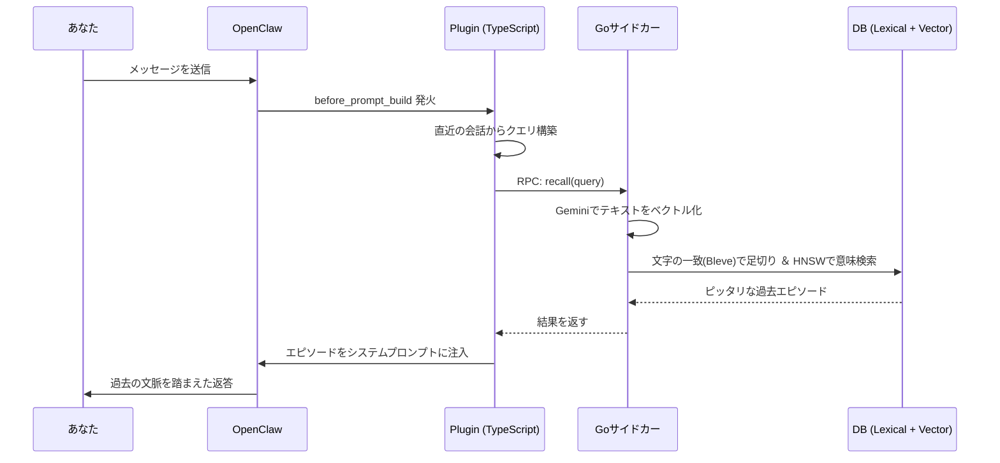

#  episodic-claw

<div align="center">


**OpenClawエージェントのための「ガチで忘れない」長期エピソード記憶プラグイン。**

[](./CHANGELOG.md) [](./LICENSE) [](https://openclaw.ai)

[English](./README.md) | 日本語 | [中文](./README.zh.md)
</div>

会話をローカルにずっと保存して、必要なときに「キーワード」だけじゃなく「意味」で探し出し、今の会話にスッと混ぜ込んでくれるプラグインです。これで OpenClaw が「こないだ話したあれ」をちゃんと覚えてくれるようになります。

今回の `v0.4.2` では、超特大のアップデート「**物語化アーキテクチャ（Cache-and-Drain Model）**」を入れました！
数十万文字あるような過去の爆盛りチャットログをいきなり読み込ませても、AIの脳（コンテキスト）がパンクしてエラー落ちする…なんてことはもう起きません。裏に「Cache DB（待合室）」を作ったので、巨大な文章は安全なサイズ（64K）にスパッと切り分けられて一旦そこに並びます。あとはシステムが裏側で順番に取り出して、綺麗なひと続きの『連続ドラマ（エピソード）』に変換して記憶の引き出しにしまっていきます。途中でPCの電源を切っても、待合室の順番は消えません。

エピソード情報などの言語完全一致や、記憶が消される直前に安全に逃がすNinja Hook (`before_compaction`) などの耐久機能ももちろん健在です。

> v0.4.x のロードマップや設計思想は [コチラ](./docs/plans/v0.4.0_narrative_architecture_roadmap.md) を参照。

---

##  なんで TypeScript + Go なの？

店にたとえるとこんな感じです。**TypeScriptは「受付」。** OpenClaw とおしゃべりして、コマンドをつないだり、データの受け渡しを担当する。**Goは「奥の作業場」。** 会話のベクトル化（意味を数字にする作業）、超高速なハイブリッド検索、データベース（Pebble DB）への保存をガンガン回す。

この役割分担のおかげで、**TypeScriptが全体をうまく回しつつ、Goが重い計算を全部引き受ける**ので、記憶が増えまくってもAIの反応がモッサリしません。

---

##  どうやって動くの？（アーキテクチャ）

メッセージを送るたびに過去の記憶から「いま大事なこと」を検索して、AIが返事する前にこっそり教えておく仕組み。

1. **Step 1 — あなたがメッセージを送る。**
2. **Step 2 — `before_prompt_build` が発火。** プラグインが直近の会話から「探すべきテーマ」を作ります。
3. **Step 3 — Goサイドカーがベクトル化。** Gemini Embedding APIを使って、テキストを「意味の方向」を示す数字（ベクトル）に変換します。
4. **Step 4 — Lexical + Semantic デュアル検索。** まず文字の一致条件（Bleve）で不要な記憶を足切りして、そのあと HNSW っていう激ヤバなアルゴリズムで「一番意味が近い記憶」を超速で探し出します。
5. **Step 5 — 記憶の注入。** 見つかった記憶がランキングされて、ベストなものだけがAIの脳内（システムプロンプト）に入ります。賢い **24ターンのクールダウン** 機構のおかげで、同じ記憶を連呼しすぎることもありません。これでAIは「あ、あの時の話か！」と思い出してからスマートに返答できるわけです。




### v0.4.6 — ツールファースト想起（デュアルパスアーキテクチャ）

v0.4.6以降、episodic-clawは**ツールファースト想起**アーキテクチャを採用し、CLI経路とエンベデッド経路（コンテキストエンジン）の両方で一貫した想起動作を保証します：

- **エンベデッド経路（context engine slot = "episodic-claw"）**: `assemble()`と`before_prompt_build`はデフォルトで`retrieveRelevantContext`をスキップし、no-opを返して重複注入を防ぎます。想起は同一ターン内で`ep-recall`ツールを通じて行われます。
- **CLI経路**: プラグインはメモリプロンプトガイダンスを登録し、モデルに対して条件付きで`ep-recall`を呼ぶよう指示します。ユーザーのメッセージが過去の出来事、進行中のタスク、比較を参照している場合のみ実行されます。単純な確認（OK、ありがとう等）は自動的にスキップされます。
- **条件付きゲートパイプライン**: 各`ep-recall`呼び出しの前に、メモリ内の高速フィルター（novelty → intent → fingerprint → negative cache）が実行されます。no-hit結果は指数バックオフ（3 → 6 → 12ターン）をトリガーします。
- **クエリ構築**: 想起クエリは既存のParse/Rewriteパイプラインから構築されます（`recallQueryRecentMessageCount`をユーザーメッセージ窓サイズとして使用）。最新の生メッセージをそのまま投げる方式は採用していません。
- **コンテキストエンジン契約**: `assemble()`はOpenClawのコンテキストエンジン契約に合わせ`systemPromptAddition`を返すようになりました（従来の`prependSystemContext`ではありません）。

プラグイン設定の`toolFirstRecall.enabled`（デフォルト: `true`）と`toolFirstRecall.k`（デフォルト: `3`）で設定可能です。`enabled: false`に設定するとv0.4.5の挙動に戻ります。

そして裏では、新しい記憶もずっと作られ続けています（これがv0.4.2の醍醐味！）。
- **Step A — 全部「待合室（Cache DB）」へ。** 会話履歴が一気に大量に流れて来ても、システムがパニックにならないよう「安全な64Kサイズ」に切り分けてから一時DBに並べます。
- **Step B — 順番に連続ドラマ化（Drain）。** 裏で動くワーカーが待合室から順番に会話を取り出し、AIに通して綺麗な「物語（エピソード）」に変換してからPebble DBに本保存します。前回の話の文脈を覚えたまま次を作るので、アニメの「1話」「2話」「3話」みたいに完璧に繋がった記憶になります！

---

##  エピソード記憶の構造

v0.4.2以降、あなたは記憶の「階層構造」や「要約アルゴリズム」といった難しい内部設計を気にする必要はなくなりました。基本的には、**すべての会話はひと繋がりの連続したエピソード（Episodes）になる**、とだけ覚えておけばOKです。

- **エピソードの生成:** Cache DBから切り出されたテキストは、文脈を持って順番にPebble DBに格納されていきます。(`auto-segmented` タグなどで管理されます)
- **言語完全一致:** あなたが日本語で会話していれば、裏で作られるメタ情報もちゃんと日本語で書かれます。

###  Surprise Scoreって何？

新しく話した内容が、さっきまでの話と「どれくらいズレてるか」を計算する賢いスコアです。
「Reactでアプリ作ろう」って話してたのに、急に「DBの設計どうする？」って言い出したら、スコアが跳ね上がって「話が変わったな！一旦ここまでの記憶をエピソードとして区切ろう！」と動きます。これのおかげで、記憶がぐちゃぐちゃの一時的な塊にならずに済みます。

---

##  v0.4.x で何がヤバくなったの？ (ガチで落ちない物語化アーキテクチャ)

「いっぱい過去の履歴を食わせたらAPIの文字数制限に引っかかってエラーが出た」「PC再起動したらエピソードの文脈がリセットされた」――そんな悔しい思いから生まれ変わりました。

- **絶対にパニックにならない Cache DB 待合室**: 大量の生データ（Cold-startや未処理の残り物など）が流れてきても、全てを「1つの入口」にまとめ、安全な64K限界でスパッと切り分けて Cache DB に順番待ちさせます。
- **再起動しても記憶が続く (Per-Agent Continuity)**: ワーカーが仕事の途中でPCが落ちても大丈夫。次回起動時に「このエージェントが前回作った話」を引っ張り出し、シームレスに次のお話を繋げて作ります。
- **指数バックオフでAPI制限突破**: AIのAPIが「リクエスト多すぎ（429エラー）」と文句を言ってきても、焦らず5秒、10秒、20秒…と間隔を広げながら冷静に再試行します。
- **圧縮の完全委譲とNinja Hooks**: 昔チマチマやっていた記憶の整理はOpenClaw本体にお任せ。圧縮される1ミリ秒手前で割り込みフックをかけて、まだ保存されてない会話を安全に上に書いた待合室へ退避させます。文字通りデータロス率ゼロのアクロバット。
- **言語完全一致**: あなたが日本語で会話していれば、裏で作られる長期記憶のノートもキッチリ日本語のまま生成されます！

> (**Special Thanks: lossless-claw**) 「絶対に記憶を落とさない・自己修復する」という異常な耐久力は、姉妹プロジェクトである `lossless-claw` の激しい戦いから直接移植したものです。あっちでの地獄のデバッグがなければ、この完成度はあり得ませんでした。

---

##  インストール

```bash
openclaw plugins install clawhub:episodic-claw
```

入り口はこれだけです。Go サイドカーは OpenClaw 環境に設定済みの `GEMINI_API_KEY` をそのまま自動で使います。

### OpenClaw 2026.4.8 の既知インストール失敗（`memory-lancedb`）

次のエラーで失敗する場合:

`plugins.entries.memory-lancedb.config.embedding: must have required property 'embedding'`

これは `episodic-claw` 側ではなく、OpenClaw 側の既存設定移行に起因するバリデーションエラーです。  
`episodic-claw` は LanceDB を使わないので、`memory-lancedb` の古い設定を消して問題ありません。OpenAI API キーも不要です。
この挙動は OpenClaw `2026.4.10` の `Config/plugins` 修正で解消済みなので、長期的には OpenClaw を `2026.4.10` 以上へ更新するのが最善です。

Linux/macOS:

```bash
cp ~/.openclaw/openclaw.json ~/.openclaw/openclaw.json.bak.$(date +%Y%m%d-%H%M%S)
tmp="$(mktemp)"
jq 'del(.plugins.entries["memory-lancedb"])' ~/.openclaw/openclaw.json > "$tmp" && mv "$tmp" ~/.openclaw/openclaw.json
openclaw doctor --fix --non-interactive --yes
openclaw plugins install clawhub:episodic-claw
```

Windows PowerShell:

```powershell
$cfg = Join-Path $HOME ".openclaw\openclaw.json"
Copy-Item $cfg "$cfg.bak.$(Get-Date -Format yyyyMMdd-HHmmss)"
$json = Get-Content $cfg -Raw | ConvertFrom-Json -Depth 100
if ($json.plugins.entries.PSObject.Properties.Name -contains "memory-lancedb") {
  $json.plugins.entries.PSObject.Properties.Remove("memory-lancedb")
}
$json | ConvertTo-Json -Depth 100 | Set-Content $cfg -Encoding UTF8
openclaw doctor --fix --non-interactive --yes
openclaw plugins install clawhub:episodic-claw
```

---

##  Agent Install Prompt (エージェント用・詳細版)

AIエージェントがインストール時に予期せぬ挙動（ハルシネーションや他の環境の破壊）を起こさないための、超厳格なインストールプロンプトです。これをコピーして君のエージェントに送信してください。

```
**[SYSTEM INSTRUCTION: EPISODIC-CLAW INSTALLATION SEQUENCE]**

以下の手順と制約を「絶対に」守って、あなた自身の長期記憶拡張プラグイン（episodic-claw v0.4.2）をインストールしてください。自己判断での別コマンド実行や他ファイルの編集は厳禁です。

**【 実行ステップ 】**
1. **事前確認:** ターミナルで `openclaw --version` を実行し、OpenClaw CLIが利用可能か確認してください。（失敗した場合はそこで停止し、私に報告してください）
2. **インストール実行:** ターミナルで `openclaw plugins install clawhub:episodic-claw` を実行してください。（これ以外のコマンドは実行しないでください）
3. **事後確認:** `openclaw plugins list` などの手段で、プラグインが正常に追加されたか確認してください。
4. **APIキーの検証:** 動作には `GEMINI_API_KEY` （環境変数または設定ファイル上）が必要です。もし設定されていないと判断した場合は、「GEMINIのAPIキーを設定してください」と私に必ず聞いてください。推測で適当なキーを設定しないでください。
5. **ツールの自己確認:** インストール完了後、自身の利用可能ツールリストに `ep-recall`, `ep-save`, `ep-expand`, `ep-anchor` の4つが存在しているか確認してください。
6. **最適設定の自己評価と安全ロック:** プラグイン同梱の `openclaw.plugin.json` の全プロパティ一覧を読み込み、これまでの私とのやり取りの傾向を踏まえて、私にとって「最適な設定値」が何かを思考してください。ただし、**少しでも判断に迷う項目がある場合は、絶対に推測で設定せず**、暫定的にデフォルト（またはOFF）にした上で「〇〇の設定はどうしますか？」と私に必ず直接確認を取ってから進めてください。
7. **Gateway再起動の予告と待機:** プラグイン適用のためOpenClaw Gateway等の再起動が必要になります。しかし直ちには実行せず、必ず「6分間の待機（Sleep）」を挟んでください。待機に入る前に、私へ以下の内容をあなたの言葉で伝えてください：*"これから再起動が必要なので、6分後に再起動コマンドを実行します。再起動の瞬間、一時的に私の意識が途切れてしまうので、起動が終わる頃にメッセージを送って私を起こしてね。"*

**【 最終テスト (再起動・起床後) 】**
（私があなたを再起動後に起こしたときの対応です）
無事に再起動から復帰し、すべてのチェックをクリアしていたら、`ep-save` ツールを使用して以下のダミー情報を保存し、正常に動くかテストしてください。
* 保存内容：「本日、私はepisodic-clawによって64Kスケールの堅牢な長期記憶アーキテクチャを手に入れた。」

理解したら、ステップ1から順番に慎重に実行してください。
```

---

##  4つのメモリツール

AIが自主的に使うこともあれば、あなたが指示して使わせることもできるツールたちです。

| ツール | 機能 | 説明 |
|---|---|---|
| `ep-recall` | 手動の手がかり検索 | 「あの時の話思い出して！」と明示的に言いたいとき、トピックや意味を指定して深く検索させるツール。 |
| `ep-save` | 記憶の手動保存 | 「これはルールとして絶対覚えておいて」を即座に保存するツール。好み、決定事項などの「忘れたら困る事実」に向いてます。 |
| `ep-expand` | 記憶の引き出し（詳細化） | AIが「エピソードの要約だけでは情報が足りない」と感じたとき、アーカイブされた過去の会話の細かい詳細を思い出す（展開する）ためのツール。 |
| `ep-anchor` | 自発的アンカー作成 | コンテキスト窓がいっぱいになる前に、今の会話の「決定事項や考えの要点」を自分の言葉で書き残すツール。圧縮後にこのメモだけは鮮明に持ち越されます。 |

---

##  設定一覧 (openclaw.plugin.json)

最初はデフォルトで最高に動くように設定してあります。
※ `maxBufferChars` や `maxPoolChars` といった旧式バッファ用の設定値はまだ内部互換のために残っていますが、「高度な調整用（Advanced/Legacy）」に格下げされたため通常ユーザーは触る必要がありません。

| キー | デフォルト | 爆発範囲 (いじりすぎるとどうなる？) |
|---|---|---|
| `reserveTokens` | `2048` | **多すぎ:** AIの脳がパンクして今の会話を処理できなくなる。**少なすぎ:** すぐ過去を忘れるポンコツになる。 |
| `dedupWindow` | `5` | **多すぎ:** 必要な反復コマンドまでAIが無視し始める。**少なすぎ:** DBが同じメッセージで埋め尽くされる。 |
| `maxBufferChars` | `7200` | **[Advanced]** ライブ処理において、話題の切れ目を待たずに強制的にCacheへ流すための上限バッファとしての役割。 |
| `maxPoolChars` | `15000` | **[Advanced]** 物語化プールのフラッシュトリガとしての役割。これを超えると強制的に連続ドラマ化が発火する。 |
| `maxCharsPerChunk` | `9000` | **[Legacy]** 旧式の `chunkAndIngest` 専用の互換性維持パラメータ。物語化経路のユーザーは無視してよい。 |
| `segmentationLambda` | `2.0` | 記憶を切る感度。**高すぎ:** 全然記憶を切らなくなる。**低すぎ:** ちょっと言葉が変わっただけで過敏に記憶をぶった斬る。 |
| `recallSemanticFloor` | `(未設定)` | 記憶の足切り点。**高すぎ:** 完璧主義になりすぎて何も思い出さなくなる。**低すぎ:** 全然関係ないゴミ記憶を引っ張り出してきて嘘(ハルシネーション)をつく。 |
| `lexicalPreFilterLimit`| `1000` | テキスト一致検索による足切り数。**高すぎ:** 全部重いベクトル計算に回ってCPUが燃える。**低すぎ:** 良い記憶までアホみたいに捨て去られて検索精度が死ぬ。 |
| `enableBackgroundWorkers` | `true` | 裏で過去の情報を整理・補完してくれるメンテナンス機能。**false:** API代はわずかに浮くけど、未処理の古い遺物が溜まったり一部動作が旧式にフォールバックされます。 |
| `recallReInjectionCooldownTurns` | `24` | **多すぎ:** 長いセッションで昔の話を再度振ってもAIが思い出してくれなくなる。**少なすぎ:** 毎ターン同じ記憶をシステムプロンプトに注入し続けてトークンを無駄遣いする。 |

他にも細かい設定がありますが、理由がない限りデフォルト推奨です。

---

##  研究的背景
（省略なし・原文維持：変更なしで真面目な研究リファレンスとして残します）

このプロジェクトは、脳科学っぽい言葉を雰囲気で置いているわけではありません。機能ごとに、かなりはっきり参照元があります。

1. エージェント記憶の全体設計
    - **EM-LLM** — *Human-Like Episodic Memory for Infinite Context LLMs* (Watson et al., 2024 · [arXiv:2407.09450](https://arxiv.org/abs/2407.09450))
    - **MemGPT** — *Towards LLMs as Operating Systems* (Packer et al., 2023 · [arXiv:2310.08560](https://arxiv.org/abs/2310.08560))
    - **Agent Memory Systems** — position paper / survey (2025 · [arXiv:2502.06975](https://arxiv.org/abs/2502.06975))

2. Segmentation と境界検出
    - **Bayesian Surprise Predicts Human Event Segmentation in Story Listening** ([PMC11654724](https://pmc.ncbi.nlm.nih.gov/articles/PMC11654724/))
    - **Robust and Scalable Bayesian Online Changepoint Detection** ([arXiv:2302.04759](https://arxiv.org/abs/2302.04759))

3. 連続エピソード化（Narrative Consolidation）と文脈つきの記憶統合
    - **Human Episodic Memory Retrieval Is Accompanied by a Neural Contiguity Effect** ([PMC5963851](https://pmc.ncbi.nlm.nih.gov/articles/PMC5963851/))
    - **Contextual prediction errors reorganize naturalistic episodic memories in time** ([PMC8196002](https://pmc.ncbi.nlm.nih.gov/articles/PMC8196002/))
    - **Schemas provide a scaffold for neocortical integration of new memories over time** ([PMC9527246](https://pmc.ncbi.nlm.nih.gov/articles/PMC9527246/))

4. Replay と定着
    - **Human hippocampal replay during rest prioritizes weakly learned information** ([PMC6156217](https://pmc.ncbi.nlm.nih.gov/articles/PMC6156217/))

5. Recall rerank と不確実性の扱い
    - **Dynamic Uncertainty Ranking** ([ACL Anthology](https://aclanthology.org/2025.naacl-long.453/))
    - **Overcoming Prior Misspecification in Online Learning to Rank** ([arXiv:2301.10651](https://arxiv.org/abs/2301.10651))

なので、README に出てくる「人っぽい記憶」「Bayesian segmentation」みたいな言葉は、飾りではありません。実装にかなり寄せた本物の設計です。

---

##  自己紹介

独学のAIオタクで、現在NEET生活中。会社のチームも資金もなくて、あるのは自分とAI相棒と深夜2時のブラウザタブくらいです。

`episodic-claw` は **100% バイブコーディング（LLMと二人三脚）製** です。AIにやりたいことを伝えて、違うと思ったら言い返して、壊れたら直して、また試して、そうやってここまで来ました。アーキテクチャは本物です。研究参照も本物です。バグも本物でした。

これを作った理由は単純で、AIエージェントに「ただのテキストログ」以上の記憶を持たせたかったからです。もし `episodic-claw` でエージェントが少しでも賢く、少しでも落ち着いて、少しでも忘れにくくなるなら、それで十分うれしいです。

###  スポンサー

続けるには、Claude や OpenAI Codex などのAPI課金が必要です。もし役に立ってるなと思ったら、少額でも本当に助かります。

今後やりたいこと:
- 各エージェントをそれぞれの workspace に固定する
- memory decay
- 記憶を見たり直したりできる web UI
- Integrate with more LLMs Providers

👉 [GitHub Sponsors](https://github.com/sponsors/YoshiaKefasu) | 無理はしなくて大丈夫です。プラグインはこれからも MPL-2.0 で無料のままです。

---

##  ライセンス

[Mozilla Public License 2.0 (MPL-2.0)](LICENSE) © 2026 YoshiaKefasu

なぜ MIT ではなく MPL なのか？
使う自由は残したいけど、「このプラグイン自体の改善が完全にクローズドになってしまう（独占される）」のは避けたいからです。

MPL はその中間にあります。
- 製品で使える
- 自分のコードと組み合わせられる
- でも、このプラグイン本体を直したなら、その変更箇所はみんなにシェアしてほしい

このプロジェクトにはそれが一番合っていると思っています。

---

*Built with OpenClaw · Powered by Gemini Embeddings · Stored with HNSW + Pebble DB*
