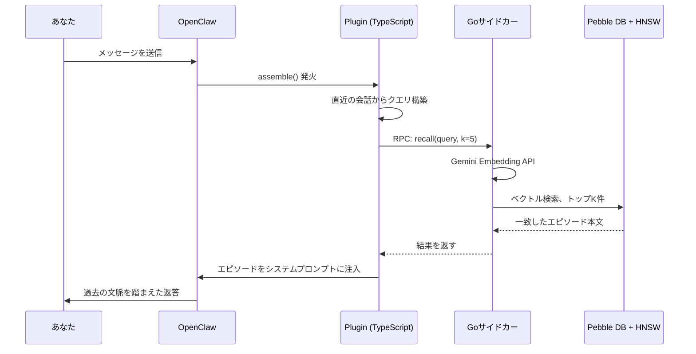
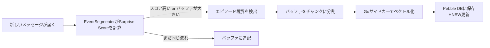

#  episodic-claw

**OpenClawエージェントのための長期エピソード記憶プラグイン。**

> [English](./README.md) | 日本語 | [中文](./README.zh.md)

[](./CHANGELOG.md)
[](./LICENSE)
[](https://openclaw.ai)

会話をローカルに保存して、必要なときにキーワードではなく「意味」で探し、合う記憶だけをプロンプトに戻すプラグインです。OpenClaw が前に話したことを忘れにくくなります。

`v0.2.0` は、topics-aware recall、Bayesian segmentation、より人っぽい D1 consolidation、replay scheduling が揃ってきたリリースです。つまり「保存できる」だけではなく、「どう区切るか」「どうまとめるか」「何を残しやすくするか」が前よりだいぶ整いました。

v0.2.0 のドキュメント: [v0.2.0 bundle](./docs/v0.2.0/README.md)

---

##  Why TypeScript + Go?

ほとんどのプラグインは1言語で書かれていますが、これはあえて2言語を使っています。

店にたとえるとわかりやすいです。

**TypeScriptは受付。** OpenClaw と会話し、ツール登録やフック配線、JSONの受け渡しを担当します。

**Goは奥の作業場。** 会話の埋め込み、ベクトル検索、replay state、Pebble DB への保存を担当します。重い処理を奥に分けるので、Node.js 側が詰まりにくくなります。

つまり、**TypeScript が全体をまとめて、Go が重い仕事をこなし、エージェントは待たずに動ける**ようにしてあります。

---

##  どうやって動くの？（アーキテクチャ）

> **TL;DR:** メッセージを送るたびに記憶の検索が走る。関連する過去のエピソードがモデルの返答前に自動で入る。

**Step 1 — あなたがメッセージを送る。**

**Step 2 — `assemble()` が発火する。** プラグインは直近の会話から検索クエリを組みます。

**Step 3 — Goサイドカーがクエリをベクトルに変換する。** Gemini Embedding API を使って、テキストを意味ベクトルにします。

**Step 4 — HNSW が近い過去エピソードを返す。** HNSW は「意味が近いものを速く探す」ための仕組みです。ここが速いから、記憶が増えても実用速度を保ちやすいです。

**Step 5 — 候補が再ランキングされて、良いものだけがシステムプロンプトへ入る。** モデルは返答前に過去の文脈を見てから話せます。




そして裏では、新しいエピソードもずっと作られています。

**Step A — Surprise Score がトピックの変化を見る。** 会話の流れが十分に変わったら、今のバッファを1つのエピソードとして閉じます。

**Step B — テキストを分割して保存する。** その本文は Go サイドカーでベクトル化され、Pebble DB と HNSW に反映されます。




---

##  記憶の2層構造（D0 / D1）

> **TL;DR:** D0は生の日記。D1は日記を読み返したあとに自分で書く「要点メモ」。

###  D0 — 生エピソード（Raw Episodes）

会話の区切れ目ごとに保存される、そのままに近い記憶です。逐語ログ寄りで、細かく、時刻も持っています。

- Pebble DBにベクトル付きで保存
- `auto-segmented`、`surprise-boundary`、`size-limit` などの境界ヒントが付く
- HNSW ですぐ検索できる

###  D1 — LLM要約による長期記憶（Sleep Consolidation）

時間が経つと複数のD0が整理されて D1 になります。人が眠ったあとに「結局あの期間で大事だったのはこれ」とまとまる感じに少し近いです。

- D1 ノードは元の D0 へのリンクを持つ
- `ep-expand` で D1 から D0 に戻れる
- 長い時間の意味を保ちつつ、トークンコストを抑えられる

###  Surprise Scoreって何？

新しく入ってきた内容と、いまの会話バッファがどれだけズレたかを見る信号です。高ければ「もう同じ話の続きじゃない」と判断して、そこで1つの記憶を閉じます。

```text
バッファ:      "Reactでtodoアプリを作ろう"
次のメッセージ: "データベースのインデックス設計ってどうすればいい？"
結果:          surprise が高い -> 境界を切る -> 前のエピソードを保存
```

これがあるから、記憶が何でもかんでも1つの大きな塊になりにくいです。

---

##  v0.2.0で実際に何が変わったか

前の版でも使えました。でも v0.2.0 では、「覚える」「まとめる」「呼び戻す」の質がかなり上がっています。

- Segmentation が前より適応的になった
- D1 clustering が単純な近さだけでなく、文脈と境界を見るようになった
- replay が独立した層として入った
- recall が topics や usefulness の補助信号を使えるようになった

なのでこの版は、「検索付きメモ帳」よりも「ちゃんと整理される記憶システム」に近づいた版だと思ってもらうと近いです。

---

##  インストール

```bash
openclaw plugins install clawhub:episodic-claw
```

入り口はこれです。Go サイドカーは OpenClaw 環境に設定済みの Gemini API key をそのまま使います。

---

##  Agent Install Prompt

別のエージェントに技術作業を丸ごとやらせたいなら、この prompt を渡してください。

これは説明文ではなく、**実際に install・設定変更・再起動・確認までやらせるための prompt** です。

```text
私の OpenClaw 環境に `episodic-claw` をインストールして、動作確認まで全部やってください。

説明だけで終わらず、実作業まで進めてください。

必須の手順:

1. まずこれを実行:
   `openclaw plugins install clawhub:episodic-claw`

2. プラグインが正常に入ったか確認:
   `openclaw plugins list`

3. OpenClaw の実際の設定ファイルを開いて、`episodic-claw` が有効になるように必要なら編集してください。
   通常の設定ファイルは `~/.openclaw/openclaw.json` です。

4. OpenClaw が動いている環境で、必要な Gemini API key が使える状態か確認してください。
   `GEMINI_API_KEY` が必要なら、そのまま OpenClaw 実行環境で参照できることを確認してください。

5. OpenClaw を再起動する前に、必ずユーザーへ次の内容を自然な言い回しで告知してください:
   「これから OpenClaw gateway の再起動が必要です。再起動の前に6分待ちます。まだインストール確認は完了しておらず、その瞬間に私の現在の作業文脈が切れる可能性があります。再起動後に続きを確認したいので、そのときはメッセージを送って起こしてください。」

6. この告知を送ったあと、意図的に6分待ってください。
   短い待機ではなく、ちゃんと6分の sleep / wait を入れてください。

7. 設定反映のために OpenClaw を再起動:
   `openclaw gateway restart`

8. 再起動後、プラグインが本当に読み込まれているか確認してください。
   plugin status、起動ログ、memory plugin の loaded 状態を確認してください。

9. platform ごとの sidecar binary を release から取ってくる構成なら、binary が正しくダウンロードされて plugin directory にあることも確認してください。

10. 最後に短い報告をください:
   - 何を変更したか
   - プラグインは loaded か
   - まだ残っている warning や手作業があるか

重要:
- 何をすべきか説明するだけでなく、実際に config を編集してください。
- 途中で失敗しても、原因を調べて、plugin が動くか明確な blocker が見つかるところまで進めてください。
- install が終わった時点で止まらず、verification まで終えてください。
```

---

##  3つのメモリツール

### `ep-recall` — 記憶の手動検索

トピックや意味で、意図して記憶を探すツールです。

自動注入だけでは足りないときや、「あの話を思い出して」と明示的に言いたいときに使います。

### `ep-save` — 記憶の手動保存

「これを覚えておいて」を即保存するツールです。

好み、決定事項、制約、覚えておきたい事実に向いています。

### `ep-expand` — サマリーから詳細へ戻る

要約記憶だけでは足りないときに、元の細かい流れまで掘るツールです。

---

##  設定一覧

すべてのキーは任意です。最初はデフォルトで十分使えます。

| キー | 型 | デフォルト | 説明 |
|---|---|---|---|
| `enabled` | boolean | `true` | プラグインの有効/無効 |
| `reserveTokens` | integer | `6144` | 記憶注入に使う最大トークン数 |
| `recentKeep` | integer | `30` | compaction後も残す直近ターン数 |
| `dedupWindow` | integer | `5` | fallback重複テキストの去重窓 |
| `maxBufferChars` | integer | `7200` | 強制保存するバッファ文字数上限 |
| `maxCharsPerChunk` | integer | `9000` | 1チャンクの最大文字数 |
| `sharedEpisodesDir` | string | — | 将来の共有エピソード用。現状は効果なし |
| `allowCrossAgentRecall` | boolean | — | 将来の cross-agent recall 用。現状は効果なし |

理由がない限り、最初は触らない方が安全です。

---

##  研究的背景

このプロジェクトは、脳科学っぽい言葉を雰囲気で置いているわけではありません。`v0.2.0` で入った機能ごとに、かなりはっきり参照元があります。

### 1. エージェント記憶の全体設計

- **EM-LLM** — *Human-Like Episodic Memory for Infinite Context LLMs*  
  Watson et al., 2024 · [arXiv:2407.09450](https://arxiv.org/abs/2407.09450)  
  「会話をずっと1本のログとして持つ」のではなく、出来事単位の episodic memory として扱う発想に強く効いています。

- **MemGPT** — *Towards LLMs as Operating Systems*  
  Packer et al., 2023 · [arXiv:2310.08560](https://arxiv.org/abs/2310.08560)  
  エージェントが明示的な memory tool と memory layer を持つ設計にかなり影響しています。

- **Agent Memory Systems** — position paper / survey  
  2025 · [arXiv:2502.06975](https://arxiv.org/abs/2502.06975)  
  episodic memory、semantic memory、retrieval policy、long-term memory operation を分けて考える土台になっています。

### 2. Segmentation と境界検出

- **Bayesian Surprise Predicts Human Event Segmentation in Story Listening**  
  [PMC11654724](https://pmc.ncbi.nlm.nih.gov/articles/PMC11654724/)  
  `v0.2.0` で固定しきい値から動的な Bayesian segmentation に寄せた理由にいちばん近い論文です。

- **Robust and Scalable Bayesian Online Changepoint Detection**  
  [arXiv:2302.04759](https://arxiv.org/abs/2302.04759)  
  会話の最中に軽く更新し続ける、という online 前提の設計に効いています。

### 3. D1 consolidation と文脈つきの記憶統合

- **Human Episodic Memory Retrieval Is Accompanied by a Neural Contiguity Effect**  
  [PMC5963851](https://pmc.ncbi.nlm.nih.gov/articles/PMC5963851/)  
  D1 clustering を「意味だけ」ではなく「時間的に近い流れ」でも見る理由の後ろ盾です。

- **Contextual prediction errors reorganize naturalistic episodic memories in time**  
  [PMC8196002](https://pmc.ncbi.nlm.nih.gov/articles/PMC8196002/)  
  強い surprise-boundary を、単なる参考値ではなく本物の境界として扱う判断に近いです。

- **Schemas provide a scaffold for neocortical integration of new memories over time**  
  [PMC9527246](https://pmc.ncbi.nlm.nih.gov/articles/PMC9527246/)  
  topics や abstraction を後段で強めていく方向、つまり schema 的な記憶へ寄せる考え方に効いています。

### 4. Replay と定着

- **Human hippocampal replay during rest prioritizes weakly learned information**  
  [PMC6156217](https://pmc.ncbi.nlm.nih.gov/articles/PMC6156217/)  
  D1-first replay scheduler の発想にかなり近いです。全部を均等に反復するのではなく、弱いが重要な記憶を優先する、という考え方です。

### 5. Recall rerank と不確実性の扱い

- **Dynamic Uncertainty Ranking: Enhancing Retrieval-Augmented In-Context Learning for Long-Tail Knowledge in LLMs**  
  [ACL Anthology](https://aclanthology.org/2025.naacl-long.453/)  
  retrieval は単なるベクトル近傍だけでなく、「誤誘導しにくい候補を上げる」べき、という発想の参考になっています。

- **Overcoming Prior Misspecification in Online Learning to Rank**  
  [arXiv:2301.10651](https://arxiv.org/abs/2301.10651)  
  recall の重みを固定で決め打ちせず、更新可能なものとして扱う考え方に近いです。

- **An Empirical Evaluation of Thompson Sampling**  
  [Microsoft Research PDF](https://www.microsoft.com/en-us/research/wp-content/uploads/2016/02/thompson.pdf)  
  探索と活用を両立しつつ、重すぎない online choice を入れたいときの実装感覚に効いています。

なので、README に出てくる「人っぽい記憶」「replay」「Bayesian segmentation」みたいな言葉は、飾りではありません。`v0.2.0` はそのへんを実際の実装にかなり寄せた版です。

---

##  自己紹介

独学のAIオタクで、現在NEET生活中。会社のチームも資金もなくて、あるのは自分とAI相棒と深夜2時のブラウザタブくらいです。

`episodic-claw` は **100% バイブコーディング製** です。AIにやりたいことを伝えて、違うと思ったら言い返して、壊れたら直して、また試して、そうやってここまで来ました。アーキテクチャは本物です。研究参照も本物です。バグも本物でした。

これを作った理由は単純で、AIエージェントに「流れるコンテキスト」以上の記憶を持たせたかったからです。もし `episodic-claw` でエージェントが少しでも賢く、少しでも落ち着いて、少しでも忘れにくくなるなら、それで十分うれしいです。

###  スポンサー

続けるには、Claude や OpenAI Codex の課金がそのまま必要です。もし役に立ってるなと思ったら、少額でも本当に助かります。

今後やりたいこと:

- cross-agent recall
- memory decay
- 記憶を見たり直したりできる web UI

[GitHub Sponsors](https://github.com/sponsors/YoshiaKefasu)

無理はしなくて大丈夫です。プラグインはこれからも MPL-2.0 で無料です。

---

##  ライセンス

[Mozilla Public License 2.0 (MPL-2.0)](LICENSE) © 2026 YoshiaKefasu

なぜ MIT ではなく MPL なのか。

理由は、使う自由は残したいけど、このプラグイン自体への改善が完全に閉じて消えていくのは避けたいからです。

MPL はその中間にあります。

- 製品で使える
- 自分のコードと組み合わせられる
- でも、このプラグインのファイルを直したなら、その変更ファイルは開いたままでいてほしい

このプロジェクトにはそれが合っていると思っています。

---

*Built with OpenClaw · Powered by Gemini Embeddings · Stored with HNSW + Pebble DB*
