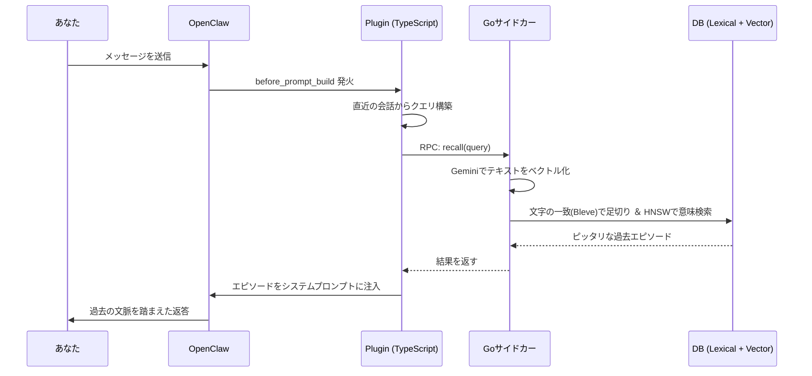

#  episodic-claw

<div align="center">


**OpenClawエージェントのための「ガチで忘れない」長期エピソード記憶プラグイン。**

[](./CHANGELOG.md) [](./LICENSE) [](https://openclaw.ai)

[English](./README.md) | 日本語 | [中文](./README.zh.md)
</div>

会話をローカルにずっと保存して、必要なときに「キーワード」だけじゃなく「意味」で探し出し、今の会話にスッと混ぜ込んでくれるプラグインです。これで OpenClaw が「こないだ話したあれ」をちゃんと覚えてくれるようになります。

今回の `v0.3.5` では、これまでプラグインが無理やり自前でやっていた「会話の圧縮整理」を、完全にOpenClaw本体（ホスト）の巨大なLLMへお任せ（委譲）しました！ その代わり、記憶が消される直前に「Hooks (`before_prompt_build`, `before_compaction`)」で割り込んでデータを安全に逃がしたり、AI自身が「これだけは忘れない」とメモを残す `ep-anchor` を導入。記憶がリセットされた瞬間にそのアンカーを再注入（`after_compaction`）することで、絶対に文脈が途切れない超人仕様に生まれ変わっています。

さらに、D1の要約機能が「言語完全一致」に進化！ あなたが日本語で話していれば、裏の長期記憶もちゃんと日本語で要約して保存されるようになりました。また、24ターンの「クールダウンガード」を追加し、毎ターン同じ記憶を何度も思い出して脳内がパンクするのを賢く防いでいます。

> [ ­](https://github.com/YoshiaKefasu/episodic-claw)
> v0.3.x のロードマップや設計思想は [コチラ](./docs/v0.3.0_master_plan.md) を参照してください。
> [ ­](https://github.com/YoshiaKefasu/episodic-claw)

---

##  なんで TypeScript + Go なの？

店にたとえるとこんな感じです。**TypeScriptは「受付」。** OpenClaw とおしゃべりして、コマンドをつないだり、データの受け渡しを担当する。**Goは「奥の作業場」。** 会話のベクトル化（意味を数字にする作業）、超高速なハイブリッド検索、データベース（Pebble DB）への保存をガンガン回す。

この役割分担のおかげで、**TypeScriptが全体をうまく回しつつ、Goが重い計算を全部引き受ける**ので、記憶が増えまくってもAIの反応がモッサリしません。

---

##  どうやって動くの？（アーキテクチャ）

メッセージを送るたびに過去の記憶から「いま大事なこと」を検索して、AIが返事する前にこっそり教えておく仕組み。

1. **Step 1 — あなたがメッセージを送る。**
2. **Step 2 — `before_prompt_build` が発火。** プラグインが直近の会話から「探すべきテーマ」を作ります。
3. **Step 3 — Goサイドカーがベクトル化。** Gemini Embedding APIを使って、テキストを「意味の方向」を示す数字（ベクトル）に変換します。
4. **Step 4 — Lexical + Semantic デュアル検索。** まず文字の一致条件（Bleve）で不要な記憶を足切りして、そのあと HNSW っていう激ヤバなアルゴリズムで「一番意味が近い記憶」を超速で探し出します。
5. **Step 5 — 記憶の注入。** 見つかった記憶がランキングされて、ベストなものだけがAIの脳内（システムプロンプト）に入ります。賢い **24ターンのクールダウン** 機構のおかげで、同じ記憶を連呼しすぎることもありません。これでAIは「あ、あの時の話か！」と思い出してからスマートに返答できるわけです。




そして裏では、新しい記憶もずっと作られ続けています。
- **Step A — Surprise Scoreが話題の変化を監視。** 話の流れが「あ、これ別の話題になったな」と判断したら、今のバッファを1つのエピソードとしてまとめます（Bayesian Segmentation）。
- **Step B — 絶対に消えない保存。** PCが突然落ちてもデータが壊れないように、記憶を安全機構（WAL Queue）を通してから、Go側でベクトル化してPebble DBへ保存します。デカすぎるJSONなど、不要なノイズは自動で剥ぎ取られて容量を節約します。

---

##  記憶の2層構造（D0 / D1）

> [ ­](https://github.com/YoshiaKefasu/episodic-claw)
> **一言でいうと:** D0は「日記の丸写し」、D1は「後から要点だけまとめたノート」。
> [ ­](https://github.com/YoshiaKefasu/episodic-claw)

###  D0 — 生の記憶（Raw Episodes）

会話の区切りごとにそのまま保存される、録音データみたいな記憶。細かい情報まで全部残ってるけど、そのまま全部読み返すと長すぎるやつです。
- Pebble DBにベクトルと単語インデックス付きで保存
- `auto-segmented` などの自動タグが付く
- HNSW ですぐ検索できる

###  D1 — 長期記憶の要約（Sleep Consolidation）

時間が経つと、システム（Background Workers）が裏で複数の D0 を「つまりこういうことだった」と D1 に圧縮します。人が寝てる間に記憶を整理するのとちょっと似てます。

**しかも言語完全一致！** あなたが日本語で会話していれば、裏で作られるこのD1ノートもちゃんと日本語で書かれます。

- 容量を食わずに長い期間のことを覚えていられる
- 詳しく知りたいときは `ep-expand` ツールで元の細かい D0 まで遡れる

###  Surprise Scoreって何？

新しく話した内容が、さっきまでの話と「どれくらいズレてるか」を計算する賢いスコアです。
「Reactでアプリ作ろう」って話してたのに、急に「DBの設計どうする？」って言い出したら、スコアが跳ね上がって「話が変わったな！一旦ここまでの記憶を保存しよう！」と動きます。これのおかげで、記憶がぐちゃぐちゃの一時的な塊にならずに済みます。

---

##  v0.3.5 で何がヤバくなったのか (脱・自前主義と洗練)

今回、アーキテクチャを根本から見直しました。「全部自分でやる」のをやめ、重たい圧縮処理を完全にOpenClawホストへ委譲。でも記憶は一切落とさない、というスマートな作戦です。

- **圧縮の完全委譲とNinja Hooks (`before_compaction`)**: 今までプラグイン側でチマチマやっていた「記憶の整理（Compaction）」を、OpenClawネイティブの賢いLLMに任せました。その代わり、圧縮が行われる1ミリ秒手前でフックを使って割り込み、まだ保存されていない会話を安全にDBへ退避させます。これでデータロス率はゼロ。
- **自発的メモツール (`ep-anchor`)**: エージェント自身が「あ、この会話の流れ大事だからメモっとこ」と思ったタイミングで、いつでも新ツール `ep-anchor` を使って「記憶のアンカー」を書き残せます。
- **記憶の自動再注入 (`after_compaction`)**: OpenClawの圧縮で一時的な記憶が真っ白になった直後、すかさずさっきのAnchorをシステムプロンプトに注入します。これでAIは「ん？今何の話だっけ」となることなく、スムーズに会話に復帰できます。
- **言語完全一致**: D1記憶の要約文やトピックが、会話元の言語とキッチリ一致するようになりました。日本語の会話なら、AIの記憶も日本語のまま！
- **クールダウンガード (24ターン)**: 毎ターン同じ記憶を呼び起こしてシステムプロンプトがパンクするのを防ぐため、「一度思い出した記憶は24ターン休ませる」という超賢いガードが付きました。
- **絶対防壁の継承 (Self-Healing & Transcript Repair)**: v0.3.0で移植した超人耐久力（ツールログの自動修復、API制限時の3段階リトライエスカーレーション、WALキューなど）はそのまま据え置き。どんなエラーが起きても絶対に記憶を落としません。
- **無駄な監視処理の削除**: ホストが圧縮を監視・発火するようになったので、重たかった「プレッシャー監視」ロジックを削除。プラグインは `before_prompt_build` フックを中心に、無駄なく「記憶の保護と提供」だけに集中します。

> [ ­](https://github.com/YoshiaKefasu/episodic-claw)
> **Special Thanks: lossless-claw**
> 今回の「絶対に記憶を落とさない・自己修復する」という異常な耐久力（Phase 7 の強固な仕組み）は、姉妹プロジェクトである `lossless-claw` の設計とアーキテクチャから直接移植・吸収したものです。あちらでの激しいバグとの戦いがなければ、この v0.3.0〜v0.3.5 の完成度はあり得ませんでした。
> [ ­](https://github.com/YoshiaKefasu/episodic-claw)

---

##  インストール

```bash
openclaw plugins install clawhub:episodic-claw
```

入り口はこれだけです。Go サイドカーは OpenClaw 環境に設定済みの `GEMINI_API_KEY` をそのまま自動で使います。

---

##  Agent Install Prompt (エージェント用・詳細版)

AIエージェントがインストール時に予期せぬ挙動（ハルシネーションや他の環境の破壊）を起こさないための、超厳格なインストールプロンプトです。これをコピーして君のエージェントに送信してください。

```
**[SYSTEM INSTRUCTION: EPISODIC-CLAW INSTALLATION SEQUENCE]**

以下の手順と制約を「絶対に」守って、あなた自身の長期記憶拡張プラグイン（episodic-claw v0.3.5）をインストールしてください。自己判断での別コマンド実行や他ファイルの編集は厳禁です。

**【 実行ステップ 】**
1. **事前確認:** ターミナルで `openclaw --version` を実行し、OpenClaw CLIが利用可能か確認してください。（失敗した場合はそこで停止し、私に報告してください）
2. **インストール実行:** ターミナルで `openclaw plugins install clawhub:episodic-claw` を実行してください。（これ以外のコマンドは実行しないでください）
3. **事後確認:** `openclaw plugins list` などの手段で、プラグインが正常に追加されたか確認してください。
4. **APIキーの検証:** 動作には `GEMINI_API_KEY` （環境変数または設定ファイル上）が必要です。もし設定されていないと判断した場合は、「GEMINIのAPIキーを設定してください」と私に必ず聞いてください。推測で適当なキーを設定しないでください。
5. **ツールの自己確認:** インストール完了後、自身の利用可能ツールリストに `ep-recall`, `ep-save`, `ep-expand`, `ep-anchor` の4つが存在しているか確認してください。
6. **最適設定の自己評価と安全ロック:** プラグイン同梱の `openclaw.plugin.json` の全プロパティ一覧を読み込み、これまでの私とのやり取りの傾向を踏まえて、私にとって「最適な設定値」が何かを思考してください。ただし、**少しでも判断に迷う項目がある場合は、絶対に推測で設定せず**、暫定的にデフォルト（またはOFF）にした上で「〇〇の設定はどうしますか？」と私に必ず直接確認を取ってから進めてください。
7. **Gateway再起動の予告と待機:** プラグイン適用のためOpenClaw Gateway等の再起動が必要になります。しかし直ちには実行せず、必ず「6分間の待機（Sleep）」を挟んでください。待機に入る前に、私へ以下の内容をあなたの言葉で伝えてください：*"これから再起動が必要なので、6分後に再起動コマンドを実行します。再起動の瞬間、インストールの成功を確認する前に私の意識が途切れてしまうので、再起動が終わる頃にメッセージを送って私を起こしてくださいね。"*

**【 最終テスト (再起動・起床後) 】**
（私があなたを再起動後に起こしたときの対応です）
無事に再起動から復帰し、すべてのチェックをクリアしていたら、`ep-save` ツールを使用して以下のダミー情報を保存し、正常に動くかテストしてください。
* 保存内容：「本日、私はepisodic-clawによって64,000トークンの長期記憶を手に入れた。」

理解したら、ステップ1から順番に慎重に実行してください。
```

---

##  4つのメモリツール

AIが自主的に使うこともあれば、あなたが指示して使わせることもできるツールたちです。

| ツール | 機能 | 説明 |
|---|---|---|
| `ep-recall` | 記憶の手動検索 | 「あの時の話思い出して！」と明示的に言いたいとき、トピックや意味を指定して深く検索させるツール。 |
| `ep-save` | 記憶の手動保存 | 「これはルールとして絶対覚えておいて」を即座に保存するツール。好み、決定事項などの「忘れたら困る事実」に向いてます。 |
| `ep-expand` | サマリーから詳細へ戻る | 要約された記憶（D1）じゃ物足りないときに、「もっと詳しく！」と元の細かい流れ（D0）まで掘り下げるツール。 |
| `ep-anchor` | 自発的アンカー作成 | コンテキスト窓がいっぱいになる前に、今の会話の「決定事項や考えの要点」を自分の言葉で書き残すツール。圧縮後にこのメモだけは鮮明に持ち越されます。 |

---

##  設定一覧 (openclaw.plugin.json)

最初はデフォルトで最高に動くように設定してあります。いまは圧縮そのものはホスト側が担当しているので、昔の compaction 用の設定 (`contextThreshold` / `freshTailCount` / `recentKeep`) はここでは出していません。

| キー | デフォルト | 爆発範囲 (いじりすぎるとどうなる？) |
|---|---|---|
| `reserveTokens` | `2048` | **多すぎ:** AIの脳がパンクして今の会話を処理できなくなる。**少なすぎ:** すぐ過去を忘れるポンコツになる。 |
| `dedupWindow` | `5` | **多すぎ:** 必要な反復コマンドまでAIが無視し始める。**少なすぎ:** DBが同じメッセージで埋め尽くされる。 |
| `maxBufferChars` | `7200` | **多すぎ:** PCが落ちた時に未保存の記憶がごっそり消える。**少なすぎ:** ファイルを細切れに保存しまくってPCが重くなる。 |
| `maxCharsPerChunk` | `9000` | **多すぎ:** 重すぎてDBが処理落ちする。**少なすぎ:** ひとつの長い会話がバラバラの記憶にちぎれて意味不明になる。 |
| `segmentationLambda` | `2.0` | 記憶を切る感度。**高すぎ:** 全然記憶を切らなくなる。**低すぎ:** ちょっと言葉が変わっただけで過敏に記憶をぶった斬る。 |
| `recallSemanticFloor` | `(未設定)` | 記憶の足切り点。**高すぎ:** 完璧主義になりすぎて何も思い出さなくなる。**低すぎ:** 全然関係ないゴミ記憶を引っ張り出してきて嘘(ハルシネーション)をつく。 |
| `lexicalPreFilterLimit`| `1000` | テキスト一致検索による足切り数。**高すぎ:** 全部重いベクトル計算に回ってCPUが燃える。**低すぎ:** 良い記憶までアホみたいに捨て去られて検索精度が死ぬ。 |
| `enableBackgroundWorkers` | `true` | 裏で記憶を整理・自己修復する機能。**false:** API代は浮くけど、DBが未整理のゴミ捨て場になる。 |
| `recallReInjectionCooldownTurns` | `24` | **多すぎ:** 長いセッションで昔の話を再度振ってもAIが思い出してくれなくなる。**少なすぎ:** 毎ターン同じ記憶をシステムプロンプトに注入し続けてトークンを無駄遣いする。 |

他にも細かい設定がありますが、理由がない限りデフォルト推奨です。

---

##  研究的背景
（省略なし・原文維持：変更なしで真面目な研究リファレンスとして残します）

このプロジェクトは、脳科学っぽい言葉を雰囲気で置いているわけではありません。機能ごとに、かなりはっきり参照元があります。

1. エージェント記憶の全体設計
    - **EM-LLM** — *Human-Like Episodic Memory for Infinite Context LLMs* (Watson et al., 2024 · [arXiv:2407.09450](https://arxiv.org/abs/2407.09450))
    - **MemGPT** — *Towards LLMs as Operating Systems* (Packer et al., 2023 · [arXiv:2310.08560](https://arxiv.org/abs/2310.08560))
    - **Agent Memory Systems** — position paper / survey (2025 · [arXiv:2502.06975](https://arxiv.org/abs/2502.06975))

2. Segmentation と境界検出
    - **Bayesian Surprise Predicts Human Event Segmentation in Story Listening** ([PMC11654724](https://pmc.ncbi.nlm.nih.gov/articles/PMC11654724/))
    - **Robust and Scalable Bayesian Online Changepoint Detection** ([arXiv:2302.04759](https://arxiv.org/abs/2302.04759))

3. D1 consolidation と文脈つきの記憶統合
    - **Human Episodic Memory Retrieval Is Accompanied by a Neural Contiguity Effect** ([PMC5963851](https://pmc.ncbi.nlm.nih.gov/articles/PMC5963851/))
    - **Contextual prediction errors reorganize naturalistic episodic memories in time** ([PMC8196002](https://pmc.ncbi.nlm.nih.gov/articles/PMC8196002/))
    - **Schemas provide a scaffold for neocortical integration of new memories over time** ([PMC9527246](https://pmc.ncbi.nlm.nih.gov/articles/PMC9527246/))

4. Replay と定着
    - **Human hippocampal replay during rest prioritizes weakly learned information** ([PMC6156217](https://pmc.ncbi.nlm.nih.gov/articles/PMC6156217/))

5. Recall rerank と不確実性の扱い
    - **Dynamic Uncertainty Ranking** ([ACL Anthology](https://aclanthology.org/2025.naacl-long.453/))
    - **Overcoming Prior Misspecification in Online Learning to Rank** ([arXiv:2301.10651](https://arxiv.org/abs/2301.10651))

なので、README に出てくる「人っぽい記憶」「Bayesian segmentation」みたいな言葉は、飾りではありません。実装にかなり寄せた本物の設計です。

---

##  自己紹介

独学のAIオタクで、現在NEET生活中。会社のチームも資金もなくて、あるのは自分とAI相棒と深夜2時のブラウザタブくらいです。

`episodic-claw` は **100% バイブコーディング（LLMと二人三脚）製** です。AIにやりたいことを伝えて、違うと思ったら言い返して、壊れたら直して、また試して、そうやってここまで来ました。アーキテクチャは本物です。研究参照も本物です。バグも本物でした。

これを作った理由は単純で、AIエージェントに「ただのテキストログ」以上の記憶を持たせたかったからです。もし `episodic-claw` でエージェントが少しでも賢く、少しでも落ち着いて、少しでも忘れにくくなるなら、それで十分うれしいです。

###  スポンサー

続けるには、Claude や OpenAI Codex などのAPI課金が必要です。もし役に立ってるなと思ったら、少額でも本当に助かります。

今後やりたいこと:
- 各エージェントをそれぞれの workspace に固定する
- memory decay
- 記憶を見たり直したりできる web UI
- Integrate with more LLMs Providers

👉 [GitHub Sponsors](https://github.com/sponsors/YoshiaKefasu) | 無理はしなくて大丈夫です。プラグインはこれからも MPL-2.0 で無料のままです。

---

##  ライセンス

[Mozilla Public License 2.0 (MPL-2.0)](LICENSE) © 2026 YoshiaKefasu

なぜ MIT ではなく MPL なのか？
使う自由は残したいけど、「このプラグイン自体の改善が完全にクローズドになってしまう（独占される）」のは避けたいからです。

MPL はその中間にあります。
- 製品で使える
- 自分のコードと組み合わせられる
- でも、このプラグイン本体を直したなら、その変更箇所はみんなにシェアしてほしい

このプロジェクトにはそれが一番合っていると思っています。

---

*Built with OpenClaw · Powered by Gemini Embeddings · Stored with HNSW + Pebble DB*
