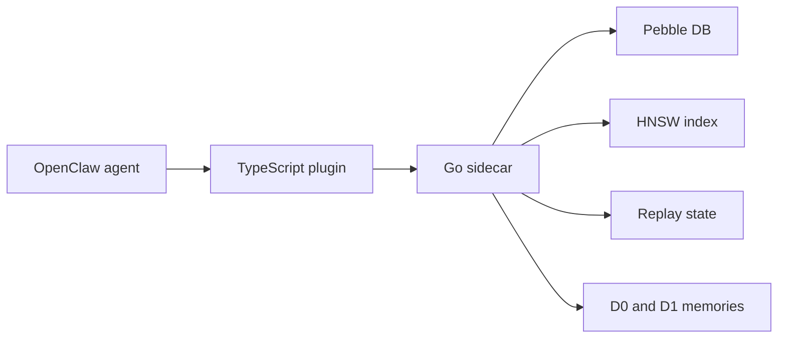

# episodic-claw

OpenClawエージェントのための長期エピソード記憶プラグインです。

> [English](./README.md) | 日本語 | [中文](./README.zh.md)

[](./CHANGELOG.md)
[](./LICENSE)
[](https://openclaw.ai)

`episodic-claw` は、会話をローカルに保存し、あとで必要になったときに「単語」ではなく「意味」で思い出すためのプラグインです。
関連する過去のエピソードだけを返答前のプロンプトに戻すので、OpenClaw が前に決めたことや、前に失敗したことを忘れにくくなります。

初めて見る人向けに、一番短く言うとこうです。

- 通常のコンテキストウィンドウは短期記憶
- `episodic-claw` は長期記憶
- 何でもかんでも戻すわけではない
- 今の会話に合う記憶だけを選んで戻そうとする

このリリースラインの資料: [v0.2.0 bundle](./docs/v0.2.0/README.md)

## v0.2.0で強くなった点

v0.2.0 は、単なる「保存して検索する」プラグインから、もう少し本格的な記憶パイプラインへ進んだリリースです。

- D0 と D1 の両方に `topics` メタデータを持てるようになった
- 会話の切れ目を固定しきい値だけでなく Bayesian segmentation でも見られるようになった
- D1 生成が、ただの単純な近さではなく文脈と境界を意識するようになった
- replay scheduling が入り、重要そうな記憶をあとで補強できるようになった
- recall calibration が入り、検索結果がノイズに引っ張られにくくなった
- telemetry と observability が増え、挙動の確認がしやすくなった

ざっくり言えば、どこで1つの経験が終わるか、何をまとめて長期記憶にするか、どの記憶を残しやすくするか、どの記憶を呼び戻すかが前より賢くなりました。

## 全体アーキテクチャ

このプラグインは、わざと2つに分かれています。

- TypeScript は OpenClaw との接続担当
- Go は記憶エンジン本体
- Pebble DB は記憶の保存先
- HNSW は意味検索を速くするインデックス

たとえるなら、こうです。

- TypeScript は受付
- Go は奥の作業場
- Pebble DB は倉庫
- HNSW は「似たものがどこにあるか」をすぐ探す棚の地図



## 1つのメッセージがどう流れるか

新しいメッセージが来ると、このプラグインは同時に2つの仕事をします。

### 1. 返答前に記憶を思い出す

OpenClaw がモデルに最終プロンプトを送る前に、次の流れが走ります。

1. TypeScript 側が直近の会話を読む
2. recall 用のクエリを作る
3. Go サイドカーがそのクエリをベクトル化する
4. HNSW が近い記憶を探す
5. 候補を再ランキングする
6. 良いものだけをプロンプトへ注入する

だからモデルは、返答時点ですでに「思い出した状態」で話せます。

### 2. 今の会話を未来の記憶として保存する

同時に、ライブの会話バッファも見張っています。

1. 会話の流れが十分変わったかを測る
2. 変わったら今の塊を閉じる
3. その塊を raw episode として保存する
4. あとで background consolidation が複数の raw episode を整理して要約にする

だからこれは「手動でメモを残す道具」というより、裏でずっと聞きながら記憶を作る仕組みに近いです。

## 記憶の形: D0 と D1

理解しやすく言うとこうです。

- D0 は生の記憶
- D1 は整理された記憶

### D0

D0 は会話を切り取った、そのままの記憶です。
日記の1ページに近いです。

ここには次のようなものが入ります。

- 元の本文
- 時刻情報
- segmentation や surprise の信号
- topics
- 検索用の埋め込み

### D1

D1 は複数の D0 をまとめた要約記憶です。
「この期間で何が大事だったか」のメモに近いです。

ここには次のようなものが入ります。

- 複数 D0 の意味の中心
- 元の D0 へのリンク
- topics や summary metadata
- 補強用の replay state

これが大事なのは、エージェントには raw log だけでは足りないからです。
毎回全部を読み返すのは高いし遅い。だから「意味を圧縮した記憶」が必要になります。

## v0.2.0で記憶品質がどう変わったか

前の版でも使えましたが、v0.2.0 では「何を記憶として扱うか」と「その記憶をどう使い続けるか」がかなり整いました。

- Segmentation が前より適応的になった
  会話の切れ目を固定ルールだけでなく Bayesian tuning でも見られる
- Consolidation が前より人間っぽくなった
  D1 のグループ化が、単純な類似だけでなく文脈と境界を見る
- Replay が独立した層になった
  episode 本文と replay state を混ぜない
- Recall が前より素朴ではなくなった
  topics、usefulness、surprise、replay signal を使って候補を調整できる

もちろん、これで「人間の脳そのもの」になったわけではありません。
でも、平たい検索インデックスとして扱うより、記憶研究の考え方を少し借りる形にはなりました。

## 3つのツール

このプラグインは、明示的に使える記憶ツールも3つ持っています。

### `ep-recall`

意図して記憶を探すツールです。

自動注入だけでは足りないときに使います。

### `ep-save`

今すぐ大事なことを記憶に残すツールです。

設定、好み、決定事項、制約などを即保存したいときに使います。

### `ep-expand`

要約記憶から元の細かい内容を開くツールです。

D1 サマリーは役に立つけど短すぎる、というときに D0 の詳細まで掘れます。

## インストール

```bash
openclaw plugins install clawhub:episodic-claw
```

そのあと gateway を再起動します。

```bash
openclaw gateway restart
```

インストール後に起きることはこれです。

- npm package として TypeScript プラグインが入る
- `postinstall` が GitHub Release assets から platform ごとの Go sidecar を取ってくる
- OpenClaw が起動時に sidecar を立ち上げる

Go sidecar は、OpenClaw 環境にある Gemini API key をそのまま使います。

## Agent Install Prompt

別のエージェントにインストール作業を丸ごとやらせたいなら、こういう prompt を渡します。

これは説明文ではなく、実際に技術作業を進めさせるための指示文です。

```text
私の OpenClaw 環境に `episodic-claw` をインストールして、動作確認まで全部やってください。

説明だけで終わらず、実作業まで進めてください。

必須の手順:

1. まずこれを実行:
   `openclaw plugins install clawhub:episodic-claw`

2. プラグインが正常に入ったか確認:
   `openclaw plugins list`

3. OpenClaw の設定ファイルを開いて、`episodic-claw` が有効になるように必要なら編集してください。
   通常の設定ファイルは `~/.openclaw/openclaw.json` です。

4. OpenClaw が動いている環境で、必要な Gemini API key が使える状態か確認してください。
   `GEMINI_API_KEY` が必要なら、そのまま OpenClaw 実行環境で参照できることを確認してください。

5. OpenClaw を再起動する前に、必ずユーザーへ次の内容を自然な言い回しで告知してください:
   「これから OpenClaw gateway の再起動が必要です。再起動の前に6分待ちます。まだインストール確認は完了しておらず、その瞬間に私の現在の作業文脈が切れる可能性があります。再起動後に続きを確認したいので、そのときはメッセージを送って起こしてください。」

6. この告知を送ったあと、意図的に6分待ってください。
   短い待機ではなく、ちゃんと6分の sleep / wait を入れてください。

7. 設定反映のために OpenClaw を再起動:
   `openclaw gateway restart`

8. 再起動後、プラグインが本当に読み込まれているか確認してください。
   plugin status、起動ログ、memory plugin の loaded 状態を確認してください。

9. platform ごとの sidecar binary を release から取ってくる構成なら、binary が正しくダウンロードされて plugin directory にあることも確認してください。

10. 最後に短い報告をください:
   - 何を変更したか
   - プラグインは loaded か
   - まだ残っている warning や手作業があるか

重要:
- 何をすべきか説明するだけでなく、実際に config を編集してください。
- 途中で失敗しても、原因を調べて、plugin が動くか明確な blocker が見つかるところまで進めてください。
- install が終わった時点で止まらず、verification まで終えてください。
```

## よく触る設定

たいていの人はデフォルトのままで十分です。
でも、意味が分かっていると便利な設定はこのあたりです。

| キー | デフォルト | 役割 |
|---|---:|---|
| `reserveTokens` | `6144` | 記憶注入に使えるプロンプト枠 |
| `recentKeep` | `30` | compaction 後も残す直近ターン数 |
| `maxBufferChars` | `7200` | 強制的にエピソード保存するバッファ上限 |
| `maxCharsPerChunk` | `9000` | 1チャンクの最大サイズ |
| `dedupWindow` | `5` | 重複っぽい fallback テキストをどこまで消すか |

v0.2.0 では segmentation や recall の調整項目も増えました。
ただ、理由がない限りは最初からいじらない方が安全です。

## プライバシーと保存場所

コアの保存はローカルです。

- 記憶は手元のマシンに保存される
- Pebble DB がレコードを持つ
- HNSW が検索グラフを持つ
- 専用のクラウド memory DB はいらない

ただし埋め込み生成は、設定された埋め込みプロバイダを使います。
デフォルト構成では Gemini を使います。

## まだ入っていないもの

v0.2.0 はかなり強くなりましたが、完成形を名乗る段階ではありません。

- `importance_score` はまだ有効化していない
- 自動 pruning や tombstone disposal はまだ入っていない
- 複数エージェントでの共有記憶は今後の予定

なので、この版は「かなりしっかりしたローカル episodic memory engine」と捉えるのがいちばん正確です。

## なぜこのプロジェクトを作ったのか

多くのエージェントは、今のプロンプトに入っている範囲しか覚えられません。
短い作業なら十分です。
でも長いプロジェクトではすぐ苦しくなります。

`episodic-claw` が目指しているのは、エージェントがこうできることです。

- 前に決めた方針を覚えている
- 前に失敗した流れを思い出せる
- プロジェクトの好みや制約を保てる
- 古い経験を圧縮しても大事な部分を失わない

それが作った理由です。

## ライセンス

[Mozilla Public License 2.0 (MPL-2.0)](./LICENSE)

なぜ MIT ではなく MPL なのか。

- これを使って製品を作るのは自由
- 自分のコードと組み合わせるのも自由
- でもこのプラグインのファイルを直したなら、その変更ファイルは開いたままにしてほしい

`episodic-claw` 本体への改善が、完全に閉じたフォークへ消えていかないようにするためです。

---

Built with OpenClaw, Gemini embeddings, Pebble DB, and HNSW.
