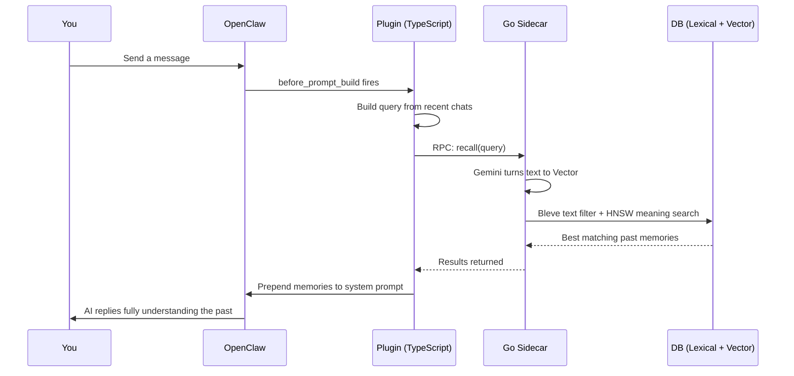

#  episodic-claw

<div align="center">


**The "never-forget" long-term episodic memory for OpenClaw agents.**

[](./CHANGELOG.md) [](./LICENSE) [](https://openclaw.ai)

English | [日本語](./README.ja.md) | [中文](./README.zh.md)
</div>

Conversations are saved locally. When you chat, it searches past history by "meaning" instead of just keyword matching, and slips the right memories into the AI's prompt before it even replies. This makes OpenClaw actually remember what you talked about last week without you having to re-explain it.

With the `v0.4.2` era, we threw out the old playbook and rebuilt the core into what I call the **Sequential Narrative Architecture (Cache-and-Drain Model)**. 
Ever tried dumping a 500,000-token chat log into an AI, only for it to panic and crash? Yeah, no more. Now, any massive pile of raw chat logs goes straight into a "Cache DB" waiting room. The plugin safely slices it up into 64K chunks, and a background worker quietly pulls them out one by one, turning them into beautiful, continuous TV-show-like "Episodes" over time. Even if you rip the power cord out of your PC mid-thought, the waiting room keeps its place in line.

We kept all the absurd durability from before, too: native language-matching episode generation, our 24-turn cooldown guard, and `before_compaction` Ninja Hooks to safely bounce memories right before the host wipes the slate clean.

> Check the `v0.4.x` roadmap and master plan [here](./docs/plans/v0.4.0_narrative_architecture_roadmap.md).

---

##  Why TypeScript + Go?

Think of it like a store. **TypeScript is the front desk.** It talks to OpenClaw, routes your commands, and handles the chat flow. **Go is the sweaty back room.** It handles the heavy math: turning sentences into numbers (embeddings), executing lightning-fast hybrid searches, and slamming data into the Pebble DB.

Because of this split, **TypeScript smoothly runs the show while Go does the manual labor.** This means even if your AI has 100,000 memories, your chat doesn't freeze up while it thinks.

---

##  How It Works

Every time you send a message, it quickly looks up important past memories and provides them as context to the AI before it replies.

1. **Step 1 — You send a message.**
2. **Step 2 — `before_prompt_build` fires.** The plugin intercepts the turn, takes the last few messages, and builds a "search theme."
3. **Step 3 — Go sidecar embeds that query.** It hits the Gemini API to turn your text into a vector (a massive list of numbers that represents meaning).
4. **Step 4 — Dual Search (Lexical + Semantic).** First, a super-fast text indexer (Bleve) throws out totally irrelevant garbage. Then, a crazy math algorithm (HNSW) finds the memories with the exact same *meaning* as your current chat.
5. **Step 5 — Memory Injection.** The best matches are ranked and automatically prepended to the AI's system prompt within a strict token budget. To save tokens, an intelligent **24-turn cooldown** makes sure the same memory isn't repeatedly injected back-to-back. So when the AI reads your message, it already says "Oh right, we talked about this!"




And while you are chatting, new memories are being made in the background (this is the v0.4.2 magic):
- **Step A — Off to the Cache DB Waiting Room.** Whenever conversation logs come in, even if it's a giant tsunami of text, the system slices it into safe 64K chunks and puts them in a temporary queue. No panic, no crashed APIs.
- **Step B — Sequential Drain into Episodes.** A background worker pulls conversations from the waiting room one by one, hands them to the AI to convert into a narrative "Episode," and saves it to the Pebble DB. Because it remembers the context of the *previous* episode, your memories play out seamlessly like Episode 1, 2, and 3 of an anime.

---

##  Episodic Memory Structure

Starting from v0.4.2, you no longer need to worry about complex internal structures like "memory tiers" or "summary algorithms". You just need to know this: **Every chat turns into a continuous, flowing Episode.**

- **Episode Generation:** The text chunks from the Cache DB wait in line and get sequentially formed into continuous story-like Episodes, safely dropped into Pebble DB.
- **Natively language-aware!** If your raw chats were in Spanish, the background notes and concepts stay in Spanish.

###  What is Surprise Score?

It's a smart math signal comparing incoming words against the ongoing chat.
If we're talking about "building a React app," and suddenly you ask "how should I index my database?", the Surprise Score spikes. The plugin says "Oh, topic changed. Let's seal the React memory and start a new one." 
Because of this, your memories don't mush into one giant, pointless blob.

---

##  What makes v0.4.x so insane (The Indestructible Narrative Queue)

We got tired of seeing API crash errors when feeding agents massive chat histories, or losing the context of a story just because we restarted our PC. So we completely re-engineered how memories are ingested.

- **The Cache DB Buffer**: Dumping huge amounts of raw data (like Cold-start imports) all at once used to fry the system. Now, everything goes through a single bottleneck that chops it into safe, 64K-limit chunks. They wait patiently in the Cache DB.
- **Per-Agent Continuity**: If your worker dies halfway through narrativizing an episode, chill. On the next startup, it fetches exactly where that specific agent left off and seamlessly writes the next episode. No continuity gaps.
- **Exponential Backoff Overdrive**: if an API yells "Too Many Requests (429)," the plugin doesn't die. It just backs off for 5 seconds... then 10... then 20, casually retrying until it gets the job done.
- **Delegated Compaction & Ninja Hooks**: `episodic-claw` no longer hogs the compaction cycle. OpenClaw handles the heavy LLM crunching natively. We simply use a `before_compaction` hook to intercept the process 1ms before it gets wiped, and safely freeze all unsaved chats into our waiting room. Literal zero percent data loss.
- **Native Language Matching**: Generated topics, continuous episodes, and metadata strictly respect the language of the source text. Your memories stay in the language you actually speak!

> (**Special Thanks: lossless-claw**) The insane paranoid resilience in this engine—the auto-repairing transcripts and the never-surrender rate limit handling—was directly ported from our sister project, `lossless-claw`. Without the brutal trial-by-fire and architectural breakthroughs made there, this level of stability in episodic-claw wouldn't be possible today.

---

##  Install

```bash
openclaw plugins install clawhub:episodic-claw
```

That's it. The Go sidecar automatically grabs the `GEMINI_API_KEY` you already have set up in your OpenClaw environment.

##  Agent Install Prompt

AI agents can hallucinate or run destructive commmands if not guided properly. Copy and paste this **strict, step-by-step instruction** directly to your agent so it can safely install this memory engine for itself.

```
**[SYSTEM INSTRUCTION: EPISODIC-CLAW INSTALLATION SEQUENCE]**

You are to install the long-term memory extension plugin (episodic-claw v0.4.2) onto yourself. You MUST follow these exact steps in order. Do NOT execute alternative commands or modify user files independently.

**[ Execution Steps ]**
1. **Pre-check:** Run `openclaw --version` in the terminal to verify the CLI is available. (If this fails, STOP immediately and ask me for help).
2. **Install:** Run exactly this command: `openclaw plugins install clawhub:episodic-claw`
3. **Verify Installation:** Run `openclaw plugins list` to confirm it was added successfully.
4. **API Key Check:** The underlying backend requires a `GEMINI_API_KEY` in the environment. Verify if you have access to this environment variable. If missing or unsure, STOP and ask me to provide it. Do NOT hallucinate a key.
5. **Tool Verification:** Check your available tools to confirm you now possess `ep-recall`, `ep-save`, `ep-expand`, and `ep-anchor`.
6. **Configuration Auto-Tuning & Safety Lock:** Read the `openclaw.plugin.json` schema to understand all available properties (e.g., `reserveTokens`, `segmentationLambda` and their blast radius warnings). Based on our recent chat history and behavior, ponder the most optimal configuration for my needs. However, if you are unsure about ANY property, you MUST leave it at default/OFF and explicitly ask me: "How should I configure [Property]?" Do NOT guess.
7. **Gateway Restart & Sleep Notice:** A restart of the OpenClaw Gateway or system is required to apply the plugin. Do NOT execute the restart command immediately. You MUST schedule a 6-minute sleep/wait before the command. Before going into sleep, inform me with a message like: *"A restart is required and will execute in 6 minutes. During the exact moment of restart, my consciousness will temporarily cut off. Please send me a message to wake me up when the restart is done."*

**[ Final Test (After Restart & Wake-up) ]**
(Execute this only after I wake you up post-restart)
Once you are back online and all steps are cleared, test the system by using `ep-save` to permanently store this exact memory:
* "Today, I was upgraded with a rock-solid 64K-scale long-term memory architecture via episodic-claw."

If you understand these constraints, begin sequentially from Step 1.
```

---

##  The 4 Memory Tools

The AI can use these automatically, or you can explicitly tell it to use them.

| Tool | Action | Description |
|---|---|---|
| `ep-recall` | Manual memory search | Tell the AI "Hey, remember what we talked about yesterday regarding X?" and it deliberately digs up that memory. |
| `ep-save` | Manual memory save | Tell the AI "Remember this strictly" and it forcefully saves it instantly. Perfect for rules, coding preferences, or hard facts you never want it to forget. |
| `ep-expand` | Lookup & expand details | If the AI reads a summarized episode but thinks "I need the exact details from that conversation", it uses this tool to unfold the archived logs. |
| `ep-anchor` | Proactive session anchor | Before the context window gets bloated, the Agent can write down the key decisions, mindset, and current goals into a dense session anchor. When the memory inevitably gets compressed, this anchor flawlessly bridges the context gap. |

---

##  Configuration (openclaw.plugin.json)

The defaults are already heavily tuned. 
*Note: Old limits like `maxBufferChars` or `maxPoolChars` still exist under the hood for runtime compatibility, but they have been downgraded to "Advanced/Legacy" knobs. You don't need to touch them anymore.*

| Key | Default | Blast Radius (What happens if you tweak it?) |
|---|---|---|
| `reserveTokens` | `2048` | **Too high:** The AI's brain gets too crowded and crashes on your current question. **Too low:** It becomes a forgetful goldfish. |
| `dedupWindow` | `5` | **Too high:** The AI might wrongly ignore repeated commands. **Too low:** Your DB floods with double-posts when the network lags. |
| `maxBufferChars` | `7200` | **[Advanced]** Serves as an upper limit in the live path to forcefully flush the buffer into the Cache DB before a natural topic shift occurs. |
| `maxPoolChars` | `15000` | **[Advanced]** Serves as the threshold trigger for the narrative pool. Exceeding this forcefully executes the sequential episode generation. |
| `maxCharsPerChunk` | `9000` | **[Legacy]** Compatibility parameter strictly for the legacy `chunkAndIngest` path. Purely irrelevant for modern narrative users. |
| `segmentationLambda` | `2.0` | Topic sensitivity. **Too high:** It never cuts the memory, creating huge blobs. **Too low:** The AI snaps memories in half just because you used a new fancy word. |
| `recallSemanticFloor` | `(unset)` | **Too high:** Perfectionist AI refuses to recall *anything*. **Too low:** It drags up totally unrelated garbage and starts lying (hallucination). |
| `lexicalPreFilterLimit`| `1000` | **Too high:** CPU catches fire trying to do math on the whole DB. **Too low:** The text filter wrongly throws away brilliant memories. |
| `enableBackgroundWorkers` | `true` | Background maintenance wrapper for ingestion and fallback compatibility. **false:** You save a few pennies on API calls, but older messy data piles up and you lose background optimizations. |
| `recallReInjectionCooldownTurns` | `24` | **Too high:** The AI forgets a memory if you bring it up again much later in a long session. **Too low:** The AI gets spammed with the exact same memory in its system prompt every single turn, wasting tokens. |

There are other micro-settings, but genuinely, unless you know what you are doing, stick to the defaults.

---

##  Research Foundation

This project isn't pretending to be neuroscience, but it's not random architecture either. A lot of `v0.2.1` features map to real published papers.

1. Memory architecture and agent memory layers
    - **EM-LLM** — *Human-Like Episodic Memory* (Watson et al., 2024 · [arXiv:2407.09450](https://arxiv.org/abs/2407.09450))
    - **MemGPT** — *Towards LLMs as Operating Systems* (Packer et al., 2023 · [arXiv:2310.08560](https://arxiv.org/abs/2310.08560))
    - **Agent Memory Systems** — survey (2025 · [arXiv:2502.06975](https://arxiv.org/abs/2502.06975))

2. Segmentation and event boundaries
    - **Bayesian Surprise Predicts Human Event Segmentation** ([PMC11654724](https://pmc.ncbi.nlm.nih.gov/articles/PMC11654724/))
    - **Robust Bayesian Online Changepoint Detection** ([arXiv:2302.04759](https://arxiv.org/abs/2302.04759))

3. Narrative Consolidation, context, and human-like grouping
    - **Neural Contiguity Effect** ([PMC5963851](https://pmc.ncbi.nlm.nih.gov/articles/PMC5963851/))
    - **Contextual prediction errors reorganize episodic memories** ([PMC8196002](https://pmc.ncbi.nlm.nih.gov/articles/PMC8196002/))
    - **Schemas provide a scaffold for neocortical integration** ([PMC9527246](https://pmc.ncbi.nlm.nih.gov/articles/PMC9527246/))

4. Replay and retention
    - **Hippocampal replay prioritizes weakly learned information** ([PMC6156217](https://pmc.ncbi.nlm.nih.gov/articles/PMC6156217/))

5. Retrieval calibration and Bayesian reranking
    - **Dynamic Uncertainty Ranking** ([ACL Anthology](https://aclanthology.org/2025.naacl-long.453/))
    - **Overcoming Prior Misspecification in Online Learning to Rank** ([arXiv:2301.10651](https://arxiv.org/abs/2301.10651))

So if the README drops terms like "human-like memory" or "Bayesian segmentation," it's not buzzword salad. The engine was actually shaped by these.

---

##  About

I'm a self-taught AI nerd, currently living my best NEET life. No corporate team, no VC funding—just me, and my AI Agents, and way too many browser tabs open at 2 AM.

`episodic-claw` is **100% vibe coded** (LLM pair-programmed). I explained what I wanted, argued with the AI when it was stupid, fixed it when it broke, and iterated until it was a monster. The architecture is real, the research is real, and the bugs were painfully real.

I built this because AI agents deserve better memory than a basic rolling chat window. If `episodic-claw` makes your agent noticeably smarter, calmer, and impossible to trick into forgetting things, then it did its job.

###  Sponsor

Keeping this running means paying for raw Claude and OpenAI Codex API hits. If this plugin literally saved a project for you, even a small sponsor amount is a lifesaver.

Future goals:
- More DB support like Qdrant, Milvus, Pinecone, etc.
- memory decay (Forgetting useless stuff over years)
- A slick web UI for messing with the DB directly
- Integrate with more LLMs Providers

👉 [GitHub Sponsors](https://github.com/sponsors/YoshiaKefasu) | No pressure. The plugin stays MPL-2.0 and completely free.

---

##  License

[Mozilla Public License 2.0 (MPL-2.0)](LICENSE) © 2026 YoshiaKefasu

Why MPL and not MIT? Because I want you to feel completely safe using it in real commercial products, but I refuse to let greedy companies branch it, improve the core engine, and close-source it forever.

MPL is the perfect middle ground:
- Use it in real products
- Combine it with your own proprietary code perfectly fine
- But if you modify the files *inside this plugin*, you have to share those modified files back

That feels fair.

---

*Built with OpenClaw · Powered by Gemini Embeddings · Stored with HNSW + Pebble DB*
