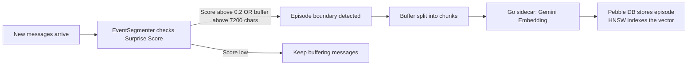

# episodic-claw

**Long-term episodic memory for OpenClaw agents.**

> 🇺🇸 English · [🇯🇵 日本語](./README.ja.md) · [🇨🇳 中文](./README.zh.md)

[](CHANGELOG.md)
[](./LICENSE)
[](https://openclaw.ai)

Automatically saves every conversation to a local vector database. When the agent needs something, it searches by *meaning* — not keywords — and injects the most relevant memories into the system prompt before the model even sees your message. No setup, no prompting, just works.

---

## Why TypeScript + Go?

Most plugins are written in one language. This one uses two — on purpose.

Think of it like a hotel.

**TypeScript is the front desk.** It speaks the OpenClaw plugin API fluently. It handles tool registration, hook wiring, JSON parsing, and all the plumbing that connects episodic-claw to the agent. TypeScript is great at this — flexible, expressive, and the npm ecosystem has everything you need.

**Go is the warehouse in the back.** When a conversation needs to be embedded, indexed, or searched, TypeScript hands the work off to a compiled Go binary (the "sidecar"). Go handles the heavy lifting: it runs embedding requests to the Gemini API concurrently in goroutines, maintains the HNSW vector index on disk, and reads/writes to Pebble DB — fast, memory-safe, and without Node.js's single-threaded event loop becoming a bottleneck.

The split means: **the agent never waits.** Ingest runs fire-and-forget. Recall is a single async round-trip. The Go sidecar can process multiple episodes in parallel — something that would block Node.js entirely.

---

## How It Works

> **TL;DR:** Every message you send triggers a memory check. Relevant past episodes are silently injected into the AI's context before it replies.

**Step 1 — You send a message.**

**Step 2 — `assemble()` fires.** The plugin takes the last 5 messages and builds a search query from them.

**Step 3 — The Go sidecar embeds that query.** It calls the Gemini Embedding API to turn text into a 768-dimensional vector (a list of numbers that captures meaning).

**Step 4 — HNSW finds the top-K most similar past episodes.** HNSW is a fast approximate nearest-neighbor algorithm — think of it as a "find me the most similar thing" engine that works in milliseconds, even over thousands of memories.

**Step 5 — Matching episodes are injected into the system prompt.** The AI sees them before reading your message, so the reply naturally includes historical context.

```mermaid
sequenceDiagram
    participant You
    participant OpenClaw
    participant Plugin (TypeScript)
    participant Go Sidecar
    participant Pebble DB + HNSW

    You->>OpenClaw: Send a message
    OpenClaw->>Plugin (TypeScript): assemble() fires
    Plugin (TypeScript)->>Plugin (TypeScript): Build query from last 5 messages
    Plugin (TypeScript)->>Go Sidecar: RPC: recall(query, k=5)
    Go Sidecar->>Go Sidecar: Gemini Embedding API
    Go Sidecar->>Pebble DB + HNSW: Vector search → top-K episodes
    Pebble DB + HNSW-->>Go Sidecar: Matching episode bodies
    Go Sidecar-->>Plugin (TypeScript): Results
    Plugin (TypeScript)->>OpenClaw: Prepend episodes to system prompt
    OpenClaw->>You: AI replies with full historical context
```

And in the background, new episodes are being saved:

**Step A — Surprise Score detects a topic change.** After each turn, the plugin checks: did the conversation just shift to a new topic? If yes, the current buffer is sealed and saved as an episode.

**Step B — Text chunks → Go sidecar → Gemini Embedding → Pebble DB.** The episode text is embedded and stored with its vector, ready to be retrieved in future conversations.



---

## Memory Hierarchy (D0 / D1)

> **TL;DR:** D0 is a raw diary entry. D1 is the book summary you'd read instead of the whole diary.

### D0 — Raw Episodes

Every time the Surprise Score crosses a threshold, the current conversation buffer is saved as a D0 episode. These are verbatim conversation logs — detailed and timestamped.

- Stored in Pebble DB with a full vector embedding
- Auto-tagged: `auto-segmented`, `surprise-boundary`, or `size-limit`
- Instantly retrievable via HNSW vector search

### D1 — Summarized Long-Term Memory (Sleep Consolidation)

*(Planned — Phase 3)*

Over time, groups of D0 episodes get compressed into D1 summaries by the LLM. Inspired by how human brains consolidate memories during sleep — the gist survives, the noise fades.

- D1 nodes link back to their source D0 episodes
- Use `ep-expand` to drill from a D1 summary back to raw D0 episodes
- Reduces token usage while preserving semantic meaning across long time horizons

### What is Surprise Score?

The plugin computes a **Bayesian Surprise** metric by comparing the embedding of incoming messages against the current buffer. A score above `0.2` means: "this conversation has meaningfully shifted — seal this episode and start a new one."

```
Buffer:   "let's build a todo app in React"
Incoming: "what's the best approach to database indexing?"
→ Surprise: HIGH → episode boundary → save previous episode
```

---

## Install

```bash
openclaw plugins install clawhub:episodic-claw
```

That's it. The plugin auto-wires on startup — no config file to edit, no API keys to set (the Go sidecar uses the Gemini API key already configured in your OpenClaw environment).

---

## Agent Install Prompt

Two prompts below. **First**: give this to an agent (Claude Code, Codex, etc.) to have it install and configure episodic-claw automatically. **Second**: paste into the agent's system prompt so it knows how to use its memory.

### Part 1 — Installation (give this to an agent to run)

```
Please install and configure the episodic-claw memory plugin for my OpenClaw agent.
Follow these steps exactly:

Step 1 — Install the plugin via OpenClaw plugin manager:
  openclaw plugins install clawhub:episodic-claw

Step 2 — Verify the plugin appears in the plugin list:
  openclaw plugins list

Step 3 — If OpenClaw uses a config file (openclaw.config.json or similar),
  make sure episodic-claw is registered. The minimal config entry is:
  {
    "plugins": [
      { "id": "episodic-claw" }
    ]
  }
  If a "plugins" array already exists, just add { "id": "episodic-claw" } to it.

Step 4 — The plugin uses the Gemini API key already set in the OpenClaw environment.
  If GEMINI_API_KEY is not set, set it now:
  export GEMINI_API_KEY="your-key-here"
  (Get a free key at https://aistudio.google.com/app/apikey)

Step 5 — Restart the OpenClaw gateway to apply changes:
  openclaw gateway restart
  (or restart the OpenClaw desktop app if you're using the GUI)

Step 6 — Confirm the plugin is active by checking gateway logs for:
  [Episodic Memory] Plugin registered.
  [Episodic Memory] Gateway started.

The plugin is now running. No further configuration is needed.
```

### Part 2 — System Prompt (paste into the agent's system prompt)

```
You have long-term episodic memory powered by the episodic-claw plugin.

Your memory tools:
- ep-recall <query>   — Search your memory for anything relevant to a topic
- ep-save <content>   — Save something important that you want to remember later
- ep-expand <slug>    — Expand a memory summary to read its full contents

How to use them well:
- Before answering questions that might benefit from past context, run ep-recall first.
- After completing something meaningful (a key decision, a fix, a preference learned),
  run ep-save to make sure it sticks.
- When a recalled memory summary is too brief and you need more detail, run ep-expand.
- You also have automatic memory: relevant past episodes are already injected at the top
  of every system prompt under "--- My Memory ---". Read those first before calling
  ep-recall manually.
- Your memory is stored locally and privately — it never leaves the machine.

The episodic-claw plugin runs silently in the background. You don't need to manage it.
Just use the tools when they make sense.
```

---

## The 3 Memory Tools

### `ep-recall` — Manual memory search

> Ask the AI to dig up a specific memory by topic or keyword.

The AI uses this when auto-retrieval isn't surfacing the right context, or when you explicitly ask it to remember something.

```
You:  "Do you remember the database schema we agreed on last week?"
AI:   [calls ep-recall → query: "database schema decision"]
AI:   "Yes — on [date] we settled on a normalized schema with a users table..."
```

| Parameter | Type | Required | Description |
|---|---|---|---|
| `query` | string | Yes | What to search for |
| `k` | number | No | How many episodes to return (default: 3) |

---

### `ep-save` — Manual memory save

> Tell the AI "remember this" and it saves it immediately.

```
You:  "Remember that we're using PostgreSQL for this project, not SQLite."
AI:   [calls ep-save]
AI:   "Got it — filed that away."
```

| Parameter | Type | Required | Description |
|---|---|---|---|
| `content` | string | Yes | What to save (natural language, up to ~3600 chars) |
| `tags` | string[] | No | Optional tags like `["decision", "database"]` |

---

### `ep-expand` — Expand a summary to raw episodes

> When the AI has a compressed summary but needs full details, this fetches them.

```
You:  "What exactly happened during the auth debugging session?"
AI:   [finds a summary, calls ep-expand to retrieve the full episode]
AI:   "Here's the full breakdown: ..."
```

| Parameter | Type | Required | Description |
|---|---|---|---|
| `slug` | string | Yes | The ID/slug of the summary episode to expand |

---

## Configuration

All keys are optional. Defaults work well for most agents.

| Key | Type | Default | Description |
|---|---|---|---|
| `enabled` | boolean | `true` | Enable or disable the plugin entirely |
| `reserveTokens` | integer | `6144` | Max tokens reserved for injected memories in the system prompt |
| `recentKeep` | integer | `30` | Recent turns to keep during context compaction |
| `dedupWindow` | integer | `5` | Dedup window for fallback-repeated messages. Increase to 10+ in high-fallback environments |
| `maxBufferChars` | integer | `7200` | Character threshold that forces an episode save regardless of Surprise Score |
| `maxCharsPerChunk` | integer | `9000` | Max chars per episode chunk. Setting this below `maxBufferChars` splits one flush into multiple episodes |
| `sharedEpisodesDir` | string | — | *(Planned — Phase 6)* Shared episodes dir across multiple agents. No effect yet |
| `allowCrossAgentRecall` | boolean | — | *(Planned — Phase 6)* Include other agents' episodes in recall. No effect yet |

**Example config:**

```json
{
  "plugins": [
    {
      "id": "episodic-claw",
      "config": {
        "reserveTokens": 4096,
        "recentKeep": 20,
        "maxBufferChars": 5000
      }
    }
  ]
}
```

---

## Research Foundation

This plugin is built on top of real AI memory research. If you want to go deeper:

- **EM-LLM** — Human-Like Episodic Memory for Infinite Context LLMs
  Watson et al., 2024 · [arXiv:2407.09450](https://arxiv.org/abs/2407.09450)
  The inspiration for surprise-based episode segmentation. EM-LLM uses Bayesian surprise and contiguity to form human-like memory boundaries.

- **MemGPT** — Towards LLMs as Operating Systems
  Packer et al., 2023 · [arXiv:2310.08560](https://arxiv.org/abs/2310.08560)
  The idea that an agent should have tiered memory and be able to manage it via explicit function calls. ep-recall, ep-save, ep-expand are this concept implemented as an OpenClaw plugin.

- **Position Paper** — Agent Memory Systems
  2025 · [arXiv:2502.06975](https://arxiv.org/abs/2502.06975)
  A survey of agent memory architectures covering episodic, semantic, and procedural memory. Informed the D0/D1 hierarchy design.

---

## About

I'm a self-taught AI nerd, currently living my best NEET life — no corporate team, no funding, just me, an AI co-pilot, and too many browser tabs open at 2am.

episodic-claw is **100% vibe coded**. I described what I wanted to an AI, argued when it was wrong, and kept iterating until it worked. The architecture is real, the research is real, the bugs were painfully real.

I built this because I think AI agents deserve better memory than a rolling context window. If episodic-claw makes your agent noticeably smarter, that's the whole point.

### Sponsor

Keeping this going requires a Claude or OpenAI Codex subscription — that's what writes the code. If you're finding this useful, even $5/month genuinely helps.

**Planned future updates:**
- **D1 Sleep Consolidation** — nightly LLM summarization pass over old episodes
- **Cross-agent recall** — share memory across multiple agents
- **Memory decay** — low-relevance old episodes fade automatically
- **Web UI** — browse and edit your agent's memory visually

👉 **[GitHub Sponsors](https://github.com/sponsors/YoshiaKefasu)**

No pressure. The plugin will always be MIT licensed and free.

---

## License

[Mozilla Public License 2.0 (MPL-2.0)](LICENSE) © 2026 YoshiaKefasu

**Why MPL 2.0 and not MIT?**

MIT lets anyone take this code, improve it, and never give those improvements back. That's fine for libraries, but for a memory plugin that people will build real workflows on top of, I'd rather forks stay open.

MPL 2.0 is a file-level copyleft: if you modify any `.ts` or `.go` source file in this repo, those modified files must stay open source under MPL. But you can freely combine episodic-claw with your own proprietary code — the copyleft doesn't spread to your codebase. You can build a commercial product using episodic-claw; you just can't silently improve the plugin itself and close the source.

The goal is simple: **improvements to episodic-claw come back to the community.**

---

*Built with OpenClaw · Powered by Gemini Embeddings · Stored with HNSW + Pebble DB*
