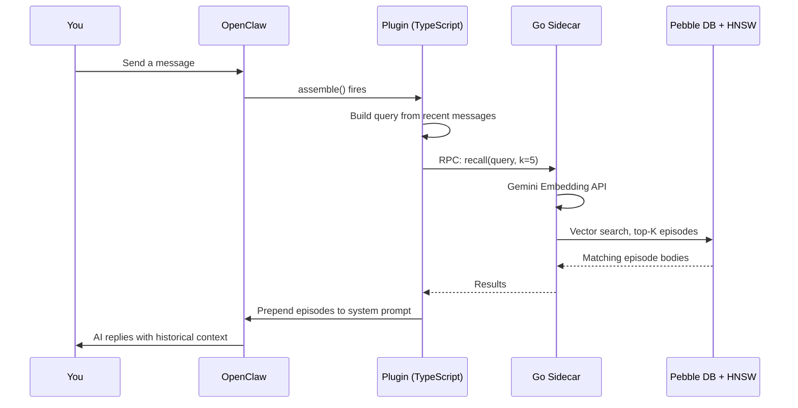
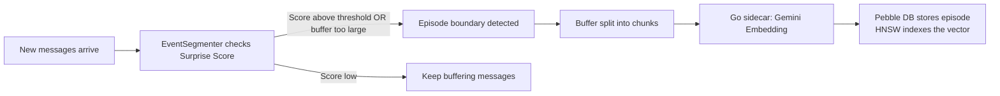

#  episodic-claw

**Long-term episodic memory for OpenClaw agents.**

> English | [日本語](./README.ja.md) | [中文](./README.zh.md)

[](./CHANGELOG.md)
[](./LICENSE)
[](https://openclaw.ai)

This plugin saves conversations locally, finds related memories by meaning, and adds the right ones back into the prompt before the model answers. That helps OpenClaw remember useful context without extra commands or manual cleanup.

`v0.2.0` is the release where the memory pipeline gets meaningfully smarter: topics-aware recall, Bayesian segmentation, more human-like D1 consolidation, and replay scheduling are all part of the picture now.

Release docs: [v0.2.0 bundle](./docs/v0.2.0/README.md)

---

##  Why TypeScript + Go?

Most plugins are written in one language. This one uses two on purpose.

Think of it like a store with a front desk and a back room.

**TypeScript is the front desk.** It talks to OpenClaw, registers tools, connects hooks, and keeps the plugin wiring simple.

**Go is the back room.** It handles the heavy work: embeddings, vector search, replay state, and Pebble DB storage. That keeps the slow part away from Node.js, so the agent stays responsive.

So the rule is simple: **TypeScript coordinates, Go does the heavy lifting, and the agent does not have to wait around.**

---

##  How It Works

> **TL;DR:** Every message triggers a memory check. Relevant past episodes are added to the prompt before the model replies.

**Step 1 — You send a message.**

**Step 2 — `assemble()` fires.** The plugin takes the last few messages and builds a search query from them.

**Step 3 — The Go sidecar embeds that query.** It calls the Gemini Embedding API to turn text into a vector, which is just a list of numbers representing meaning.

**Step 4 — HNSW finds the top-K most similar past episodes.** HNSW is a fast approximate nearest-neighbor algorithm. In plain English: it is the thing that lets the system ask "which old memory feels most similar to this?" without scanning everything slowly.

**Step 5 — Matching episodes are reranked and injected into the system prompt.** The AI sees them before reading your message, so the reply naturally includes historical context.




And in the background, new episodes are also being saved:

**Step A — Surprise Score watches for topic change.** After each turn, the plugin asks: did the conversation just shift enough to count as a new episode?

**Step B — Text chunks become stored memory.** If the answer is yes, the current buffer is sealed, embedded, and saved into Pebble DB, with HNSW updated for future recall.




---

##  Memory Hierarchy (D0 / D1)

> **TL;DR:** D0 is a raw diary entry. D1 is the book summary you would read instead of the whole diary.

###  D0 — Raw Episodes

Every time the conversation crosses a meaningful boundary, the current buffer is saved as a D0 episode. These are close to verbatim conversation logs: detailed, timestamped, and still noisy in the useful way raw memory often is.

- Stored in Pebble DB with a full vector embedding
- Auto-tagged with boundary hints like `auto-segmented`, `surprise-boundary`, or `size-limit`
- Instantly retrievable via HNSW vector search

###  D1 — Summarized Long-Term Memory

Over time, groups of D0 episodes get compressed into D1 summaries by the LLM. This is the part inspired by sleep consolidation in human memory research: the gist stays, the clutter fades.

- D1 nodes link back to their source D0 episodes
- `ep-expand` can drill from a D1 summary back to the raw D0 details
- Token cost drops while long-range meaning survives

###  What is Surprise Score?

The plugin computes a Bayesian-style surprise signal by comparing incoming content with the current buffer. A high score means: "this is no longer the same thread of experience, close the old episode and start a new one."

```text
Buffer:   "let's build a todo app in React"
Incoming: "what's the best approach to database indexing?"
Result:   surprise is high -> boundary -> save previous episode
```

That is one of the big reasons the memory feels structured instead of turning into one giant blob.

---

##  What v0.2.0 changes in practice

v0.2.0 is where the system starts acting less like a flat memory bucket and more like a real memory pipeline.

- `topics` now help both storage and recall
- Bayesian segmentation makes boundaries less arbitrary
- D1 clustering is more context-aware and boundary-aware
- replay scheduling gives important memories a way to stay reinforced
- recall calibration keeps usefulness and replay signals from overpowering semantic fit

So the system is not just "remembering more." It is getting better at deciding **what kind of memory this is**, **how long it should matter**, and **when it should come back**.

---

##  Install

```bash
openclaw plugins install clawhub:episodic-claw
```

That is the entry point. The plugin auto-wires on startup, and the Go sidecar uses the Gemini API key already configured in your OpenClaw environment.

---

##  Agent Install Prompt

If you want another agent to perform the full technical setup for you, hand it this prompt.

This is intentionally an execution prompt, not a product explanation.

```text
Install `episodic-claw` into my OpenClaw setup and complete the technical setup for me end to end.

Do the work, do not stop at explaining.

Required steps:

1. Run:
   `openclaw plugins install clawhub:episodic-claw`

2. Check whether the plugin installed cleanly:
   `openclaw plugins list`

3. Open my real OpenClaw config file and make sure `episodic-claw` is enabled.
   The usual file is `~/.openclaw/openclaw.json`.
   If needed, edit the config so OpenClaw can load `episodic-claw`.

4. Confirm the required Gemini API key exists in the OpenClaw runtime environment.
   If the plugin depends on `GEMINI_API_KEY`, verify that OpenClaw can actually read it where it runs.

5. Before restarting OpenClaw, send the user a message in your own natural wording that says this:
   "I need to restart the OpenClaw gateway next. I will wait 6 minutes before restarting it. The install is not fully verified yet, and when the restart happens my current working context may cut off. Please send me a message after the restart to wake me back up so I can finish the verification."

6. After sending that message, deliberately wait 6 minutes.
   Use a real sleep or wait, not just a short pause.

7. Restart OpenClaw:
   `openclaw gateway restart`

8. Verify that the plugin is active after restart.
   Check plugin status, startup logs, and whether the memory plugin is loaded without errors.

9. If the install pulls a platform-specific sidecar binary, confirm that it downloaded correctly and exists in the plugin directory.

10. At the end, give me a short report with:
   - what changed
   - whether the plugin is loaded
   - any warnings or manual follow-up I still need

Important:
- Prefer editing the real config instead of only describing what should be changed.
- If something fails, debug it and keep going until the plugin is working or clearly blocked by a concrete missing dependency.
- Do not stop after installation alone. Finish verification too.
```

---

##  The 3 Memory Tools

### `ep-recall` — Manual memory search

Ask the AI to deliberately dig up a memory by topic or meaning.

Use it when auto-retrieval is not surfacing the right context, or when you explicitly want the agent to search further back.

### `ep-save` — Manual memory save

Tell the AI "remember this" and it stores it immediately.

Use it for preferences, decisions, constraints, or facts that should stick right away.

### `ep-expand` — Expand a summary back into detail

When the AI only has a compressed summary but needs the full story, this fetches the raw material behind it.

---

##  Configuration

All keys are optional. Defaults work well for most agents.

| Key | Type | Default | Description |
|---|---|---|---|
| `enabled` | boolean | `true` | Enable or disable the plugin entirely |
| `reserveTokens` | integer | `6144` | Max tokens reserved for injected memories in the system prompt |
| `recentKeep` | integer | `30` | Recent turns to keep during context compaction |
| `dedupWindow` | integer | `5` | Dedup window for repeated fallback text |
| `maxBufferChars` | integer | `7200` | Character threshold that forces an episode save |
| `maxCharsPerChunk` | integer | `9000` | Max chars per stored chunk |
| `sharedEpisodesDir` | string | — | Planned multi-agent shared episode directory. No effect yet |
| `allowCrossAgentRecall` | boolean | — | Planned cross-agent recall toggle. No effect yet |

If you are just starting, leave these alone. The defaults are there for a reason.

---

##  Research Foundation

This project is not pretending to be neuroscience. But it is also not random architecture either. `v0.2.0` pulled ideas from a pretty specific set of papers, and each group maps to something real that shipped.

### 1. Memory architecture and agent memory layers

- **EM-LLM** — *Human-Like Episodic Memory for Infinite Context LLMs*  
  Watson et al., 2024 · [arXiv:2407.09450](https://arxiv.org/abs/2407.09450)  
  One of the clearest inspirations for event-based episodic memory instead of one giant rolling transcript.

- **MemGPT** — *Towards LLMs as Operating Systems*  
  Packer et al., 2023 · [arXiv:2310.08560](https://arxiv.org/abs/2310.08560)  
  Helped shape the idea that the agent should have explicit memory tools and memory layers with different jobs.

- **Agent Memory Systems** — position paper / survey  
  2025 · [arXiv:2502.06975](https://arxiv.org/abs/2502.06975)  
  Useful for separating episodic memory, semantic memory, retrieval policy, and long-term memory operations.

### 2. Segmentation and event boundaries

- **Bayesian Surprise Predicts Human Event Segmentation in Story Listening**  
  [PMC11654724](https://pmc.ncbi.nlm.nih.gov/articles/PMC11654724/)  
  This is the closest match to why `v0.2.0` moved toward adaptive Bayesian segmentation instead of a flat threshold story.

- **Robust and Scalable Bayesian Online Changepoint Detection**  
  [arXiv:2302.04759](https://arxiv.org/abs/2302.04759)  
  Important for the "online and lightweight" part. The plugin has to detect boundaries while the conversation is still live.

### 3. D1 consolidation, context, and human-like grouping

- **Human Episodic Memory Retrieval Is Accompanied by a Neural Contiguity Effect**  
  [PMC5963851](https://pmc.ncbi.nlm.nih.gov/articles/PMC5963851/)  
  A big reason D1 clustering in `v0.2.0` is not just semantic similarity. Time-nearby context matters too.

- **Contextual prediction errors reorganize naturalistic episodic memories in time**  
  [PMC8196002](https://pmc.ncbi.nlm.nih.gov/articles/PMC8196002/)  
  Helped justify treating strong boundaries as real separators instead of weak hints.

- **Schemas provide a scaffold for neocortical integration of new memories over time**  
  [PMC9527246](https://pmc.ncbi.nlm.nih.gov/articles/PMC9527246/)  
  This is close to why the project keeps leaning toward topic structure, abstraction, and later schema-like memory.

### 4. Replay and retention

- **Human hippocampal replay during rest prioritizes weakly learned information**  
  [PMC6156217](https://pmc.ncbi.nlm.nih.gov/articles/PMC6156217/)  
  This influenced the D1-first replay scheduler idea: not everything should be replayed equally, and weak but important material deserves extra reinforcement.

### 5. Retrieval calibration and Bayesian reranking

- **Dynamic Uncertainty Ranking: Enhancing Retrieval-Augmented In-Context Learning for Long-Tail Knowledge in LLMs**  
  [ACL Anthology](https://aclanthology.org/2025.naacl-long.453/)  
  Helpful for the idea that retrieval should not only be "close in vector space" but also stable and not misleading.

- **Overcoming Prior Misspecification in Online Learning to Rank**  
  [arXiv:2301.10651](https://arxiv.org/abs/2301.10651)  
  Part of the reasoning behind keeping recall weights adaptive instead of pretending one fixed score blend is always right.

- **An Empirical Evaluation of Thompson Sampling**  
  [Microsoft Research PDF](https://www.microsoft.com/en-us/research/wp-content/uploads/2016/02/thompson.pdf)  
  This mattered because the plugin needs a lightweight exploration-vs-exploitation mechanism, not a huge online learner that kills latency.

So yes, if the plugin feels a little brain-inspired in `v0.2.0`, that is real. Not in a magical "we copied a human brain" sense. More in a careful "we borrowed the parts that fit an actual agent system" sense.

---

##  About

I'm a self-taught AI nerd, currently living my best NEET life. No corporate team, no funding, just me, an AI co-pilot, and too many browser tabs open at 2am.

`episodic-claw` is **100% vibe coded**. I described what I wanted to an AI, pushed back when it was wrong, and kept iterating until it worked. The architecture is real, the research is real, and the bugs were painfully real too.

I built this because I think AI agents deserve better memory than a rolling context window. If `episodic-claw` makes your agent noticeably smarter, calmer, and less forgetful, that is the point.

###  Sponsor

Keeping this going costs actual model subscriptions. If you are finding it useful, even a small sponsor amount genuinely helps.

Planned future directions:

- cross-agent recall
- memory decay
- a web UI for browsing and editing memory

[GitHub Sponsors](https://github.com/sponsors/YoshiaKefasu)

No pressure. The plugin stays MPL-2.0 and free.

---

##  License

[Mozilla Public License 2.0 (MPL-2.0)](LICENSE) © 2026 YoshiaKefasu

Why MPL and not MIT?

Because I want people to build on it, including commercially, but I do not want improvements to the plugin itself to disappear forever into closed forks.

MPL is a middle ground:

- you can use it in real products
- you can combine it with your own code
- but if you modify files from this plugin, those modified files should stay open

That tradeoff feels right for this project.

---

*Built with OpenClaw · Powered by Gemini Embeddings · Stored with HNSW + Pebble DB*
