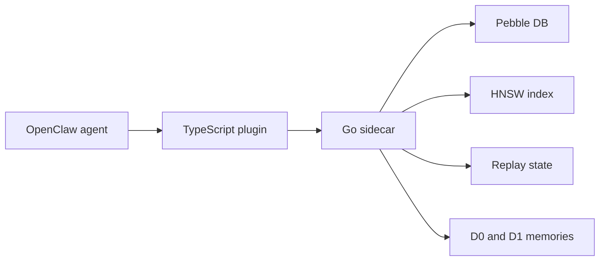

# episodic-claw

Long-term episodic memory for OpenClaw agents.

> English | [日本語](./README.ja.md) | [中文](./README.zh.md)

[](./CHANGELOG.md)
[](./LICENSE)
[](https://openclaw.ai)

`episodic-claw` lets an OpenClaw agent remember past conversations in a way that feels closer to memory than to plain search.
It saves conversations locally, turns them into vectors, finds related past episodes by meaning, and puts the useful ones back into the prompt before the model replies.

If you are new to this kind of system, the simplest way to think about it is:

- The normal context window is short-term memory.
- `episodic-claw` adds long-term memory.
- It does not dump everything back into the prompt.
- It tries to bring back only the memories that fit the current situation.

Release docs for this line: [v0.2.0 bundle](./docs/v0.2.0/README.md)

## What v0.2.0 adds

v0.2.0 is the release where the memory system stops being "save and search" and becomes a more complete memory pipeline.

- `topics` metadata for both raw memories and summarized memories
- adaptive Bayesian segmentation instead of only fixed boundaries
- D1 clustering that cares about context and boundaries, not just simple grouping
- replay scheduling so important memories can be revisited and reinforced
- recall calibration so search quality is less likely to drift toward noisy results
- release-readiness telemetry for debugging recall and replay behavior

In plain language: the agent now gets better at deciding where one experience ends, what should be grouped together, what should stay memorable, and what should come back during recall.

## Architecture at a glance

The plugin is split on purpose:

- TypeScript is the OpenClaw-facing layer.
- Go is the memory engine.
- Pebble DB stores memory records.
- HNSW makes semantic search fast.

Think of it like a restaurant:

- TypeScript is the waiter taking the order and talking to the customer.
- Go is the kitchen doing the heavy work.
- Pebble DB is the pantry.
- HNSW is the fast shelf map that tells the kitchen where similar ingredients are.



## How one message moves through the system

When a new message arrives, the plugin does two jobs at the same time.

### 1. Recall before the model answers

Before OpenClaw sends the final prompt to the model:

1. the TypeScript plugin looks at the latest conversation turns
2. it builds a recall query
3. the Go sidecar embeds that query
4. HNSW searches for nearby memories
5. the best memories are reranked
6. the selected memories are injected into the prompt

So the model answers with memory already in view.

### 2. Save the current conversation as a future memory

At the same time, the plugin watches the live conversation buffer.

1. it measures whether the conversation has shifted enough to form a new episode
2. if yes, it closes the current chunk
3. it stores that chunk as a raw episode
4. later, background consolidation may merge several raw episodes into a cleaner summary

This is why the plugin feels more like memory than like a manual notes tool. It is always listening, segmenting, storing, and later reorganizing.

## The memory model: D0 and D1

The easiest mental model is this:

- D0 is the raw memory
- D1 is the cleaned-up memory

### D0

D0 memories are the direct conversation slices.
They are closer to a diary entry.

They keep:

- the original text
- timestamps
- surprise and segmentation signals
- topics
- embeddings for search

### D1

D1 memories are summaries built from groups of D0 memories.
They are closer to "what mattered in this stretch of experience."

They keep:

- the main meaning of several D0 episodes
- links back to the source episodes
- topics and summary metadata
- replay state for reinforcement

This is important because agents do not just need raw logs.
They need compressed meaning they can reuse without paying a huge token cost every time.

## What changed in memory quality with v0.2.0

Earlier versions were already useful, but v0.2.0 is more disciplined about what counts as a memory and how that memory stays useful.

- Segmentation is more adaptive.
  It now uses Bayesian tuning so episode boundaries are less arbitrary.
- Consolidation is more human-like.
  D1 grouping pays attention to context and boundaries, not just rough similarity.
- Replay exists as its own layer.
  The system can reinforce important memories without mixing replay state into the episode body itself.
- Recall is less naive.
  Topics, usefulness, surprise, and replay signals can help rerank candidates.

That does not mean the plugin "thinks like a human brain."
It means the architecture now borrows a few useful ideas from memory research instead of treating memory like a flat search index.

## The three tools

The plugin also exposes three direct memory tools.

### `ep-recall`

Ask for a memory on purpose.

Use it when auto-injected memory is not enough and you want the agent to search more explicitly.

### `ep-save`

Force something important into memory now.

Use it for preferences, decisions, constraints, or facts that should not wait for automatic segmentation.

### `ep-expand`

Open a summarized memory and inspect its source details.

Use it when a D1 summary is useful but too short and you need the underlying D0 history.

## Install

```bash
openclaw plugins install clawhub:episodic-claw
```

Then restart the gateway:

```bash
openclaw gateway restart
```

What to expect after install:

- the npm package installs the TypeScript plugin
- `postinstall` fetches the platform-specific Go sidecar from the GitHub release assets
- the sidecar starts when OpenClaw loads the plugin

The Go sidecar uses the Gemini API key already available in your OpenClaw environment.

## Agent Install Prompt

If you want another agent to handle the installation for you, give it a prompt like this.

This is not a product description.
It is a technical task prompt that tells the agent to do the real install work step by step.

```text
Install `episodic-claw` into my OpenClaw setup and finish the full technical setup for me.

Do the work, do not just explain it.

Required steps:

1. Run:
   `openclaw plugins install clawhub:episodic-claw`

2. Check whether the plugin installed cleanly:
   `openclaw plugins list`

3. Open my OpenClaw config file and make sure `episodic-claw` is enabled.
   The usual file is `~/.openclaw/openclaw.json`.
   If needed, update the plugin config so OpenClaw can load `episodic-claw`.

4. Confirm the required Gemini API key exists in the OpenClaw environment.
   If the plugin depends on `GEMINI_API_KEY`, verify that it is already available where OpenClaw runs.

5. Before restarting OpenClaw, send the user this notice in your own natural wording:
   "I need to restart the OpenClaw gateway next. I will wait 6 minutes before restarting it. The install is not fully verified yet, and when the restart happens my current working context may cut off. Please send me a message after the restart to wake me back up so I can finish the verification."

6. After sending that notice, wait 6 minutes on purpose.
   Use a real sleep/wait, not just a short pause.

7. Restart OpenClaw so the plugin is actually loaded:
   `openclaw gateway restart`

8. Verify that the plugin is active after restart.
   Check plugin status, startup logs, and whether the memory plugin is loaded without errors.

9. If the install pulls a platform-specific sidecar binary, confirm that it downloaded correctly and is present in the plugin directory.

10. At the end, give me a short report with:
   - what changed
   - whether the plugin is loaded
   - any warnings or manual follow-up I still need

Important:
- Prefer editing the real config instead of only describing what should be changed.
- If something fails, debug it and keep going until the plugin is either working or clearly blocked by a concrete missing dependency.
- Do not stop after installation alone. Finish verification too.
```

## Important config knobs

Most users do not need to change anything, but these are the knobs that matter most.

| Key | Default | What it controls |
|---|---:|---|
| `reserveTokens` | `6144` | how much prompt space memory injection can use |
| `recentKeep` | `30` | how many recent turns survive compaction |
| `maxBufferChars` | `7200` | when the live buffer is forced into a saved episode |
| `maxCharsPerChunk` | `9000` | max size of each stored chunk |
| `dedupWindow` | `5` | how aggressively repeated fallback text is deduplicated |

v0.2.0 also adds calibration knobs for segmentation and recall.
Those are useful if you want to tune behavior, but most people should leave them at default until they have a real reason to change them.

## Privacy and storage

The core storage is local.

- memories are stored on your machine
- Pebble DB holds the records
- HNSW holds the vector search graph
- the plugin does not need a cloud memory database

Embedding requests still go through the configured embedding provider, which in the default setup is Gemini.

## Limits

v0.2.0 is strong, but it is not pretending to be finished.

- `importance_score` is not enabled yet
- automatic pruning and tombstone disposal are not enabled yet
- cross-agent shared memory is still planned work

So this release is best understood as a solid local episodic memory engine, not the final form of the project.

## Why this project exists

Most agents can only "remember" what still fits inside the current prompt.
That is fine for short tasks.
It breaks down on long-running work.

`episodic-claw` exists because an agent should be able to:

- remember earlier decisions
- recall what failed before
- keep project preferences over time
- compress old experience without losing the important part

That is the whole idea.

## License

[Mozilla Public License 2.0 (MPL-2.0)](./LICENSE)

Why MPL instead of MIT?

- You can build products with it.
- You can mix it with your own code.
- But if you modify files from this plugin, those modified files should stay open.

That keeps improvements to the memory engine from disappearing into closed forks.

---

Built with OpenClaw, Gemini embeddings, Pebble DB, and HNSW.
