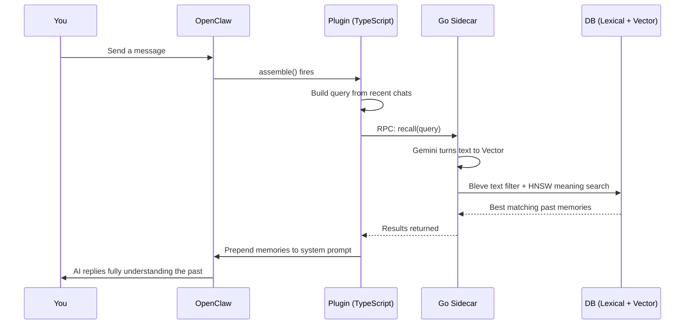

#  episodic-claw

**The "never-forget" long-term episodic memory for OpenClaw agents.**

> English | [日本語](./README.ja.md) | [中文](./README.zh.md)

[](./CHANGELOG.md)
[](./LICENSE)
[](https://openclaw.ai)

Conversations are saved locally. When you chat, it searches past history by "meaning" instead of just keyword matching, and slips the right memories into the AI's prompt before it even replies. This makes OpenClaw actually remember what you talked about last week without you having to re-explain it.

With `v0.3.0`, the engine absorbed the bulletproof resilience of `lossless-claw`. **It now bridges the gap between old and new chats without dropping context (Anchor Compaction), auto-repairs broken tool logs before saving them (Transcript Repair), and refuses to lose memories even when APIs scream rate-limit at you (Summarization Escalation).** It still boasts a colossal 64,000 token context limit, but now it proactively organizes its own brain before it even gets full.

Check the `v0.3.0` roadmap and master plan [here](./docs/v0.3.0_master_plan.md).

---

##  Why TypeScript + Go?

Most plugins force everything into one language. This one deliberately uses two. Think of it like a store.

**TypeScript is the front desk.** It talks to OpenClaw, routes your commands, and handles the chat flow.

**Go is the sweaty back room.** It handles the heavy math: turning sentences into numbers (embeddings), executing lightning-fast hybrid searches, and slamming data into the Pebble DB.

Because of this split, **TypeScript smoothly runs the show while Go does the manual labor.** This means even if your AI has 100,000 memories, your chat doesn't freeze up while it thinks.

---

##  How It Works

> **TL;DR:** Every time you send a message, it quickly looks up important past memories and whispers them to the AI before it replies.

**Step 1 — You send a message.**

**Step 2 — `assemble()` fires.** The plugin takes the last few messages and builds a "search theme."

**Step 3 — Go sidecar embeds that query.** It hits the Gemini API to turn your text into a vector (a massive list of numbers that represents meaning).

**Step 4 — Dual Search (Lexical + Semantic).** First, a super-fast text indexer (Bleve) throws out totally irrelevant garbage. Then, a crazy math algorithm (HNSW) finds the memories with the exact same *meaning* as your current chat.

**Step 5 — Memory Injection.** The best matches are ranked and secretly slipped into the AI's system prompt. So when the AI reads your message, it already says "Oh right, we talked about this!"




And while you are chatting, new memories are being made in the background:

**Step A — Surprise Score watches for a topic change.** After each message, the system calculates a score: "Did the topic just completely change?" If yes, it clips the previous chat into a saved memory (Bayesian Segmentation).

**Step B — Bulletproof Saving.** To make sure nothing is lost if your PC crashes, the chat passes through a Write-Ahead-Log (WAL Queue) before the Go sidecar embeds it and saves it forever into Pebble DB.

---

##  Memory Hierarchy (D0 / D1)

> **TL;DR:** D0 is a raw, messy diary entry. D1 is the neat summary you wrote later so you wouldn't have to read the whole diary.

###  D0 — Raw Episodes

Whenever the chat topic changes, the buffer is saved as a D0 episode. These are verbatim logs: detailed, timestamped, and long.

- Safely dumped into Pebble DB with a vector and word index.
- Auto-tagged with hints like `auto-segmented`.
- Instantly retrievable.

###  D1 — Summarized Long-Term Memory (Sleep Consolidation)

Over time, Background Workers group up multiple D0s and ask the LLM to compress them into a short D1 summary. This is basically human sleep consolidation: the clutter fades, the important lesson stays.

- Token cost drops massively while the meaning survives.
- If the AI needs the gritty details, the `ep-expand` tool lets it drill from a D1 summary back to the raw D0 logs.

###  What is Surprise Score?

It's a smart math signal comparing incoming words against the ongoing chat.
If we're talking about "building a React app," and suddenly you ask "how should I index my database?", the Surprise Score spikes. The plugin says "Oh, topic changed. Let's seal the React memory and start a new one." 
Because of this, your memories don't mush into one giant, pointless blob.

---

##  What makes v0.3.0 so insane

v0.2.1 was production-grade. v0.3.0 is a paranoid survivor that absolutely refuses to lose context.

- **Bridging the Forgotten (Anchor Compaction)**: When old chats are compressed and removed from active context, it doesn't just delete them. It creates a tightly summarized "Anchor" and temporarily injects it into the ongoing conversation. The AI never loses track of the current topic, even after heavy pruning.
- **Bulletproof & Auto-Healing (Atomic Ingestion & Transcript Repair)**: Not only will ripping the power cord out not corrupt your data (WAL queue), but if the AI hallucinates bad tool calls, the plugin auto-repairs the broken logs before saving them into long-term memory (ported straight from `lossless-claw`!).
- **Never Surrenders to Rate Limits (Self-Healing & Summarization Escalation)**: If your API provider throws a 429 Rate Limit tantrum, the system doesn't crash or drop memories. It waits, then escalates through three different fallback strategies (Normal -> Aggressive -> Deterministic) to guarantee zero data loss.
- **Proactive Brain Management (Pressure Monitor)**: Instead of waiting for the AI's context limit to explode, it constantly monitors the token pressure (`contextThreshold`). When it senses the AI's brain getting too full, it proactively starts organizing (compacting) the chat while things are still smooth.
- **Smart Filtering & Insane Search (Externalization & Hybrid Search)**: Massive, useless text dumps (like directory listings) are automatically stubbed out with `[Externalized]` so they don't clog your database. It uses lightning-fast text filters (Bleve) to trash irrelevant stuff, then uses deep semantic meaning (HNSW Backfill) to find the exact perfect memory. It can recall up to 64,000 tokens of past history instantly.

> **Special Thanks: lossless-claw**
> The insane paranoic resilience in v0.3.0—the auto-repairing transcripts and the never-surrender rate limit handling (Phase 7)—was directly ported from our sister project, `lossless-claw`. Without the brutal trial-by-fire and architectural breakthroughs made there, this level of stability in episodic-claw wouldn't be possible today.

---

##  Install

```bash
openclaw plugins install clawhub:episodic-claw
```

That's it. The Go sidecar automatically grabs the `GEMINI_API_KEY` you already have set up in your OpenClaw environment.

---

##  Agent Install Prompt

AI agents can hallucinate or run destructive commmands if not guided properly. Copy and paste this **strict, step-by-step instruction** directly to your agent so it can safely install this memory engine for itself.

> **[SYSTEM INSTRUCTION: EPISODIC-CLAW INSTALLATION SEQUENCE]**
>
> You are to install the long-term memory extension plugin (episodic-claw v0.3.0) onto yourself. You MUST follow these exact steps in order. Do NOT execute alternative commands or modify user files independently.
>
> **[ Execution Steps ]**
> 1. **Pre-check:** Run `openclaw --version` in the terminal to verify the CLI is available. (If this fails, STOP immediately and ask me for help).
> 2. **Install:** Run exactly this command: `openclaw plugins install clawhub:episodic-claw`
> 3. **Verify Installation:** Run `openclaw plugins list` to confirm it was added successfully.
> 4. **API Key Check:** The underlying backend requires a `GEMINI_API_KEY` in the environment. Verify if you have access to this environment variable. If missing or unsure, STOP and ask me to provide it. Do NOT hallucinate a key.
> 5. **Tool Verification:** Check your available tools to confirm you now possess `ep-recall`, `ep-save`, and `ep-expand`.
> 6. **Configuration Auto-Tuning & Safety Lock:** Read the `openclaw.plugin.json` schema to understand all available properties (e.g., `reserveTokens`, `segmentationLambda` and their blast radius warnings). Based on our recent chat history and behavior, ponder the most optimal configuration for my needs. However, if you are unsure about ANY property, you MUST leave it at default/OFF and explicitly ask me: "How should I configure [Property]?" Do NOT guess.
> 7. **Gateway Restart & Sleep Notice:** A restart of the OpenClaw Gateway or system is required to apply the plugin. Do NOT execute the restart command immediately. You MUST schedule a 6-minute sleep/wait before the command. Before going into sleep, inform me with a message like: *"A restart is required and will execute in 6 minutes. During the exact moment of restart, my consciousness will cut off before we can fully verify the installation. Please send me a message to wake me up when it's done so we can finish the test."*
>
> **[ Final Test (After Restart & Wake-up) ]**
> (Execute this only after I wake you up post-restart)
> Once you are back online and all steps are cleared, test the system by using `ep-save` to permanently store this exact memory:
> * "Today, my memory system was upgraded to 64,000 tokens via episodic-claw."
>
> If you understand these constraints, begin sequentially from Step 1.

---

##  The 3 Memory Tools

The AI can use these automatically, or you can explicitly tell it to use them.

### `ep-recall` — Manual memory search
Tell the AI "Hey, remember what we talked about yesterday regarding X?" and it deliberately digs up that memory.

### `ep-save` — Manual memory save
Tell the AI "Remember this strictly" and it forcefully saves it instantly. Perfect for rules, coding preferences, or hard facts you never want it to forget.

### `ep-expand` — Expand a summary back into detail
If the AI reads a D1 summary but says "I need the exact code snippet from that", it uses this tool to unfold the summary back into the massive D0 log.

---

##  Configuration (openclaw.plugin.json)

In v0.3.0, we exposed the AI's brain chemistry to the UI. The defaults are already heavily tuned, but here is what happens if you mess with them.

| Key | Default | Blast Radius (What happens if you tweak it?) |
|---|---|---|
| `reserveTokens` | `2048` | **Too high:** The AI's brain gets too crowded and crashes on your current question. **Too low:** It becomes a forgetful goldfish. |
| `contextThreshold` | `0.85` | Ratio of the active token budget at which proactive compaction should kick in. **Too high:** compaction starts too late and the prompt gets crowded. **Too low:** compaction churns too often. |
| `anchorPrompt` | `I'm about to lose {evictedCount} wonderful messages from my active context — my short-term memory just can't hold them all anymore. Before they slip away for good, I need to jot down the key facts, decisions, how I was feeling in the moment, and any loose threads I'll want to pick up later.` | Pre-compaction instruction for the Anchor. Supports `{evictedCount}`, `{keptRawCount}`, `{freshTailCount}`. |
| `compactionPrompt` | `We've had such a rich, wonderful conversation — but my short-term context window just can't hold all of it anymore. Before everything is lost, I have to consolidate {evictedCount} messages into my long-term memory right now. I'll keep it tight and focus on only what truly matters — for me and for the person I care about. The freshest {keptRawCount} messages will stay raw in my context.` | Pre-compaction instruction for the summary. Supports `{evictedCount}`, `{keptRawCount}`, `{freshTailCount}`. |
| `freshTailCount` | `96` | Canonical key for how many freshest raw messages survive compaction. **Too high:** Eats your API token limit instantly. **Too low:** The AI loses the flow of the current chat and acts confused. |
| `recentKeep` | `96` | Legacy alias for `freshTailCount`. Existing configs still work during the transition. |
| `dedupWindow` | `5` | **Too high:** The AI might wrongly ignore repeated commands. **Too low:** Your DB floods with double-posts when the network lags. |
| `maxBufferChars` | `7200` | **Too high:** You risk losing a massive chunk of chat if the PC crashes. **Too low:** The AI murders your hard drive by saving tiny files every second. |
| `maxCharsPerChunk` | `9000` | **Too high:** Heavy text blocks choke the database. **Too low:** Long chats get chopped into random pieces, ruining search context. |
| `segmentationLambda` | `2.0` | Topic sensitivity. **Too high:** It never cuts the memory, creating huge blobs. **Too low:** The AI snaps memories in half just because you used a new fancy word. |
| `recallSemanticFloor` | `(unset)` | **Too high:** Perfectionist AI refuses to recall *anything*. **Too low:** It drags up totally unrelated garbage and starts lying (hallucination). |
| `lexicalPreFilterLimit`| `1000` | **Too high:** CPU catches fire trying to do math on the whole DB. **Too low:** The text filter wrongly throws away brilliant memories. |
| `enableBackgroundWorkers` | `true` | **false:** You save a few pennies on API calls, but your database turns into an uncompressed, messy junkyard. |

There are other micro-settings, but genuinely, unless you know what you are doing, stick to the defaults.

---

##  Research Foundation

(Kept intact as original reference material)

This project isn't pretending to be neuroscience, but it's not random architecture either. A lot of `v0.2.1` features map to real published papers.

### 1. Memory architecture and agent memory layers
- **EM-LLM** — *Human-Like Episodic Memory* (Watson et al., 2024 · [arXiv:2407.09450](https://arxiv.org/abs/2407.09450))
- **MemGPT** — *Towards LLMs as Operating Systems* (Packer et al., 2023 · [arXiv:2310.08560](https://arxiv.org/abs/2310.08560))
- **Agent Memory Systems** — survey (2025 · [arXiv:2502.06975](https://arxiv.org/abs/2502.06975))

### 2. Segmentation and event boundaries
- **Bayesian Surprise Predicts Human Event Segmentation** ([PMC11654724](https://pmc.ncbi.nlm.nih.gov/articles/PMC11654724/))
- **Robust Bayesian Online Changepoint Detection** ([arXiv:2302.04759](https://arxiv.org/abs/2302.04759))

### 3. D1 consolidation, context, and human-like grouping
- **Neural Contiguity Effect** ([PMC5963851](https://pmc.ncbi.nlm.nih.gov/articles/PMC5963851/))
- **Contextual prediction errors reorganize episodic memories** ([PMC8196002](https://pmc.ncbi.nlm.nih.gov/articles/PMC8196002/))
- **Schemas provide a scaffold for neocortical integration** ([PMC9527246](https://pmc.ncbi.nlm.nih.gov/articles/PMC9527246/))

### 4. Replay and retention
- **Hippocampal replay prioritizes weakly learned information** ([PMC6156217](https://pmc.ncbi.nlm.nih.gov/articles/PMC6156217/))

### 5. Retrieval calibration and Bayesian reranking
- **Dynamic Uncertainty Ranking** ([ACL Anthology](https://aclanthology.org/2025.naacl-long.453/))
- **Overcoming Prior Misspecification in Online Learning to Rank** ([arXiv:2301.10651](https://arxiv.org/abs/2301.10651))

So if the README drops terms like "human-like memory" or "Bayesian segmentation," it's not buzzword salad. The engine was actually shaped by these.

---

##  About

I'm a self-taught AI nerd, currently living my best NEET life. No corporate team, no VC funding—just me, my AI co-pilot, and way too many browser tabs open at 2 AM.

`episodic-claw` is **100% vibe coded** (LLM pair-programmed). I explained what I wanted, argued with the AI when it was stupid, fixed it when it broke, and iterated until it was a monster. The architecture is real, the research is real, and the bugs were painfully real.

I built this because AI agents deserve better memory than a basic rolling chat window. If `episodic-claw` makes your agent noticeably smarter, calmer, and impossible to trick into forgetting things, then it did its job.

###  Sponsor

Keeping this running means paying for raw Claude and OpenAI Codex API hits. If this plugin literally saved a project for you, even a small sponsor amount is a lifesaver.

Future goals:
- keep each agent on its own workspace by default
- memory decay (Forgetting useless stuff over years)
- A slick web UI for messing with the DB directly

[GitHub Sponsors](https://github.com/sponsors/YoshiaKefasu)

No pressure. The plugin stays MPL-2.0 and completely free.

---

##  License

[Mozilla Public License 2.0 (MPL-2.0)](LICENSE) © 2026 YoshiaKefasu

Why MPL and not MIT?
Because I want you to feel completely safe using it in real commercial products, but I refuse to let greedy companies branch it, improve the core engine, and close-source it forever.

MPL is the perfect middle ground:
- Use it in real products
- Combine it with your own proprietary code perfectly fine
- But if you modify the files *inside this plugin*, you have to share those modified files back

That feels fair.

---

*Built with OpenClaw · Powered by Gemini Embeddings · Stored with HNSW + Pebble DB*
