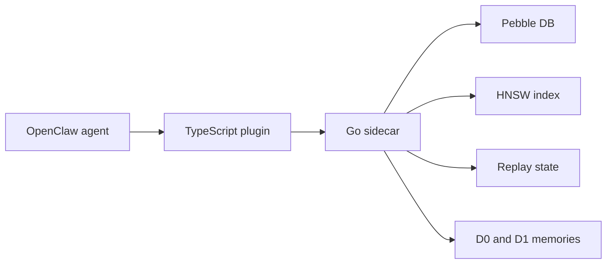

# episodic-claw

这是给 OpenClaw 智能体用的长期情节记忆插件。

> [English](./README.md) | [日本語](./README.ja.md) | 中文

[](./CHANGELOG.md)
[](./LICENSE)
[](https://openclaw.ai)

`episodic-claw` 会把对话保存在本地，再按“语义”而不是按关键词找回过去的记忆，并在模型回复之前把真正相关的部分放回提示词里。
这样 OpenClaw 就更不容易忘记之前的决定、偏好和失败经验。

如果你第一次接触这种系统，可以先这样理解：

- 普通上下文窗口像短期记忆
- `episodic-claw` 给智能体补上长期记忆
- 它不会把所有旧内容都塞回提示词
- 它会尽量只拿回跟当前对话真的有关的记忆

这个发布线的文档入口在这里: [v0.2.0 bundle](./docs/v0.2.0/README.md)

## v0.2.0 带来了什么

v0.2.0 不再只是“保存 + 搜索”。
它开始更像一条完整的记忆流水线。

- D0 和 D1 都有了 `topics` 元数据
- 会话分段不再只靠固定阈值，还加入了 Bayesian segmentation
- D1 聚合不再只是简单相似度，而是更看重上下文和边界
- 加入 replay scheduling，可以回头强化更重要的记忆
- 加入 recall calibration，降低检索结果被噪音带偏的概率
- 加入更完整的 telemetry 和 observability，便于排查 recall / replay 问题

简单说，智能体现在更会判断：

- 一段经历什么时候算结束
- 哪些片段应该合并成长期记忆
- 哪些记忆值得反复保留
- 当前问题最该唤回哪一类记忆

## 架构总览

这个插件故意拆成两部分。

- TypeScript 负责和 OpenClaw 对接
- Go 负责真正的记忆引擎
- Pebble DB 负责存储
- HNSW 负责快速语义检索

可以把它想成一家店：

- TypeScript 是前台
- Go 是后厨
- Pebble DB 是仓库
- HNSW 是仓库里的快速索引图



## 一条消息怎样走完整个系统

新消息到来时，插件会同时做两件事。

### 1. 在模型回答前先回忆

OpenClaw 把最终提示词发给模型之前，会走这条链路：

1. TypeScript 层读取最近几轮对话
2. 生成 recall 查询
3. Go sidecar 把查询向量化
4. HNSW 找出语义最接近的旧记忆
5. 对候选结果做再排序
6. 把最合适的记忆注入到提示词里

所以模型是在“已经想起一些事情”的状态下回答。

### 2. 把当前对话变成未来可用的记忆

同时，系统也在观察当前对话缓冲区。

1. 判断对话是否已经明显转向
2. 如果转向，就把当前片段收尾
3. 把它保存成 raw episode
4. 之后后台 consolidation 可能把多个 raw episode 再整理成摘要记忆

所以它不是一个手工笔记工具。
它更像一个一直在后台听、切段、保存、整理的记忆系统。

## 记忆模型: D0 和 D1

最容易理解的说法是：

- D0 是原始记忆
- D1 是整理后的记忆

### D0

D0 是直接从对话里切出来的原始片段。
更像一篇日记原文。

里面会保留：

- 原始文本
- 时间信息
- segmentation / surprise 信号
- topics
- 检索用 embedding

### D1

D1 是多个 D0 整理后的总结记忆。
更像“这一段经历真正重要的内容是什么”。

里面会保留：

- 多个 D0 的核心含义
- 指向原始 D0 的链接
- topics 和 summary metadata
- 用来强化记忆的 replay state

这很重要，因为智能体不能每次都把整段历史原文拿出来重读。
成本太高，也太慢。
它需要的是压缩过、但仍然保留重点的记忆。

## v0.2.0 对记忆质量的改变

更早的版本已经能用，但 v0.2.0 开始更认真地处理“什么算记忆”和“记忆怎样长期保持有用”。

- segmentation 更自适应
  不再只靠死板阈值切段
- consolidation 更像人在整理经历
  D1 的形成会考虑上下文和边界，而不是只看相似度
- replay 变成独立层
  replay 状态不再和 episode 正文混在一起
- recall 不再那么“傻搜”
  topics、usefulness、surprise、replay signal 都能帮助排序

这不代表它真的变成了“人脑”。
更准确地说，是它开始借用一些记忆研究里的好思路，而不再把记忆当成一张平的搜索表。

## 三个工具

插件还提供了三个可以主动调用的记忆工具。

### `ep-recall`

主动搜索记忆。

当自动注入不够，或者你想明确让智能体“去想一想之前有没有相关内容”时使用。

### `ep-save`

立刻保存一条重要记忆。

适合保存偏好、约束、决策、事实，不必等自动分段。

### `ep-expand`

把摘要记忆展开成更细的原始内容。

当 D1 摘要有用但太短时，可以往下看到 D0 细节。

## 安装

```bash
openclaw plugins install clawhub:episodic-claw
```

然后重启 gateway：

```bash
openclaw gateway restart
```

安装后会发生这些事：

- npm package 安装 TypeScript 插件部分
- `postinstall` 从 GitHub Release assets 下载对应平台的 Go sidecar
- OpenClaw 在加载插件时启动 sidecar

Go sidecar 会直接使用 OpenClaw 环境里已经配置好的 Gemini API key。

## Agent Install Prompt

如果你想让另一个智能体把安装工作整套做完，可以直接给它下面这段 prompt。

这不是介绍文本。
这是让智能体真正去执行安装、改配置、重启和验收的技术指令。

```text
请把 `episodic-claw` 安装到我的 OpenClaw 环境里，并完成从安装到验收的整套技术工作。

不要只解释步骤，请直接执行。

必须完成这些步骤:

1. 先执行:
   `openclaw plugins install clawhub:episodic-claw`

2. 确认插件已经正常安装:
   `openclaw plugins list`

3. 打开 OpenClaw 配置文件，必要时直接修改，让 `episodic-claw` 处于启用状态。
   常见配置文件路径是 `~/.openclaw/openclaw.json`。

4. 确认 OpenClaw 运行环境里可以拿到所需的 Gemini API key。
   如果插件依赖 `GEMINI_API_KEY`，请确认 OpenClaw 运行时能直接读取它。

5. 在重启 OpenClaw 之前，先用自然一点的话明确告诉用户下面这件事:
   “接下来需要重启 OpenClaw gateway。我会在重启前先等 6 分钟。现在安装还没有完全验收，而重启发生时，我当前的工作上下文可能会中断。重启完成后，请给我发一条消息把我叫醒，这样我才能继续完成验证。”

6. 发完这条通知后，故意等待 6 分钟。
   不要只停一下，是真的要做一次完整的 sleep / wait。

7. 重启 OpenClaw 让插件真正加载:
   `openclaw gateway restart`

8. 重启后确认插件确实已经生效。
   请检查 plugin status、启动日志，以及 memory plugin 是否处于 loaded 状态。

9. 如果这个插件会在安装时下载平台相关的 sidecar binary，请确认 binary 已经正确下载并存在于插件目录中。

10. 最后给我一份简短报告:
   - 你改了什么
   - 插件是否已经 loaded
   - 还有哪些 warning 或需要我手动处理的事

重要:
- 不要只说“应该怎么改”，请直接修改真实配置。
- 如果中途失败，请继续排查，直到插件真的跑起来，或者发现一个明确的 blocker。
- 不要在安装完成后就停下，还要完成验证。
```

## 最重要的配置项

多数人其实不用改配置。
但下面这些参数值得知道。

| Key | 默认值 | 作用 |
|---|---:|---|
| `reserveTokens` | `6144` | 记忆注入最多能占多少提示词空间 |
| `recentKeep` | `30` | compact 时保留多少最近对话轮次 |
| `maxBufferChars` | `7200` | 缓冲区多大时强制切成一个 episode |
| `maxCharsPerChunk` | `9000` | 每个存储块的最大字符数 |
| `dedupWindow` | `5` | 去重窗口，防止 fallback 重复文本污染记忆 |

v0.2.0 还加入了 segmentation 和 recall 的更多调参项。
不过在没有明确问题之前，建议先保持默认值。

## 隐私和存储

核心存储是本地的。

- 记忆保存在你自己的机器上
- Pebble DB 存记录
- HNSW 存检索图
- 不需要额外的云端 memory 数据库

但 embedding 生成还是会走你配置的 embedding provider。
默认方案里一般是 Gemini。

## 目前还没有的部分

v0.2.0 已经很扎实，但还不是终局版本。

- `importance_score` 还没正式启用
- 自动 pruning / tombstone disposal 还没做
- 多智能体共享记忆还是后续计划

所以更准确的理解是：
这已经是一个很像样的本地 episodic memory engine，但还不是全部路线图的终点。

## 为什么要做这个项目

很多智能体所谓的“记忆”，本质上只是当前提示词里还塞得下的那一部分内容。
做短任务没问题。
做长项目就不够了。

`episodic-claw` 想解决的是这些问题：

- 智能体能记住之前定下来的方向
- 能回忆起之前失败过的尝试
- 能长期保留项目偏好和限制条件
- 能压缩旧经历，但不丢掉真正重要的部分

这就是它存在的理由。

## License

[Mozilla Public License 2.0 (MPL-2.0)](./LICENSE)

为什么用 MPL 而不是 MIT？

- 你可以用它做产品
- 你可以和自己的代码一起使用
- 但如果你修改了这个插件里的文件，这些修改后的文件应该继续保持开放

这样做是为了避免对 `episodic-claw` 本体的改进完全消失在闭源分支里。

---

Built with OpenClaw, Gemini embeddings, Pebble DB, and HNSW.
