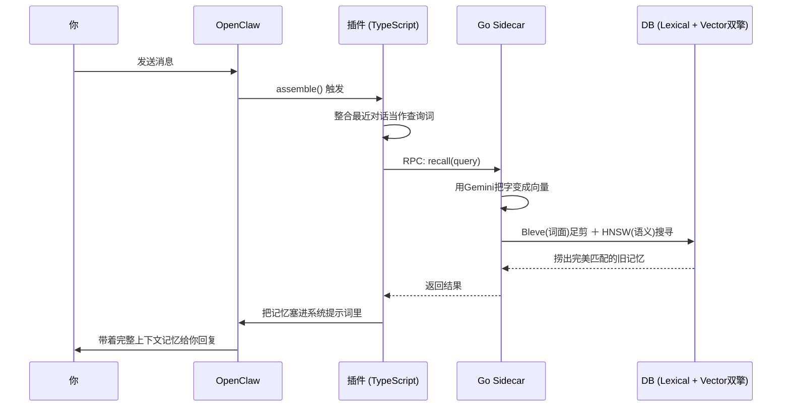

#  episodic-claw

**给 OpenClaw 智能体准备的“死都不忘”硬核长期情节记忆插件。**

> [English](./README.md) | [日本語](./README.ja.md) | 中文

[](./CHANGELOG.md)
[](./LICENSE)
[](https://openclaw.ai)

它会把你们的对话全都静悄悄存在本地。聊天时，它不像传统搜索那样只对“关键词”，而是靠“意思”去把相关的旧记忆翻出来，然后在 AI 回复你之前，偷偷塞进系统提示词里。这样你的 OpenClaw 就能真正记住你们之前聊过的梗和重大决定，不用每次都像个失忆症一样重新解释。

这次的 `v0.2.1` 版，架构直接拉满，从“能用的原型”变成了“生产级坦克”。
**哪怕你电脑突然断电，记忆也不会丢（Atomic Ingestion / WAL防宕机坑机制）**；不管存了十万条还是百万条记忆，靠“文字+语义”双引擎（Lexical + Semantic）瞬间就能搜出来；就算遇到 API 限流报错狂弹，它也能自己冷静等待并自动恢复（Circuit Breaker / Self-Healing）。更夸张的是，现在记忆拉取上限直接默认飙到了 64,000 个 tokens，这下它的脑容量是真的大得离谱了。

v0.2.1 的完整路线图和安全审计报告可以看 [这里](./docs/v0.2.1/v0.2.1_master_plan.md)。

---

##  为什么死磕 TypeScript + Go 双语言？

大部分插件图省事都只写一种语言。这个插件故意用了两种。

打个比方，这就跟开饭店一样：

**TypeScript 是前台店长。** 负责跟 OpenClaw 沟通、分发指令、打理好聊天流程。

**Go 是后厨苦力。** 负责去跟 API 对接算向量（把文字变成数学方向）、疯狂计算超高速混合搜索、还要把数据死死写进 Pebble DB 数据库里。

这种分工的好处就是，**TypeScript 统筹全局，Go 把最消耗 CPU 的脏活累活全干了**。所以就算你的 AI 脑子里存了一座图书馆的记忆，打字秒回的速度也完全不卡。

---

##  工作原理（这玩意到底怎么运行的？）

> **一句话总结：** 每当你发一句话，它就光速翻旧帐，找出有用的记忆塞给 AI，然后 AI 才开始回你。

**第 1 步 — 你发消息。**

**第 2 步 — `assemble()` 启动。** 插件从你最近聊的几句里提取出“查询主题”。

**第 3 步 — Go sidecar 把句子向量化。** 调用 Gemini API，把你发的内容变成一大串带着语义方向的数字（向量）。

**第 4 步 — 词汇+语义 双重搜索。** 首先用暴力的文本过滤引擎（Bleve）把完全不沾边的垃圾记忆全扔掉，然后再用 HNSW 这套神级算法算出“意思最像”的几条精准记忆。

**第 5 步 — 记忆注入。** 选出来的记忆会被偷偷加进 AI 的大脑（系统提示词）最前面。所以 AI 回复你的时候，它脑子里已经浮现出了“哦对，我们之前确实聊过这个”的知识点。




而在后台，它还一直在自动形成新的记忆碎片：

**步骤 A — Surprise Score 盯紧话题偏移。** 你发完消息后，系统算一个分：“这大兄弟是不是改变话题了？”如果是，就把刚才聊过的一大段话打包封存当成一个旧记忆（Bayesian Segmentation）。

**步骤 B — 断电防丢存储。** 为了防止你突然重启电脑导致记忆不全，数据会先放进安全区（WAL Queue），等 Go 慢条斯理算完向量后，再永远刻进 Pebble DB 里。

---

##  记忆两层结构（D0 / D1）

> **一句话总结：** D0 是原始的流水账日记，D1 是你事后总结的干货笔记。

###  D0 — 原始情节（Raw Episodes）

聊天话题一变就会直接切分保存，基本就是纯聊天录音。细节拉满，但太长了不能全塞给 AI 看。

- 带上各种自动打上的标记（比如 `auto-segmented`）
- 带向量直接压入数据库
- 一秒就能搜出来

###  D1 — 长期摘要记忆（Sleep Consolidation）

时间一长，后台机器人会在闲时把没用的 D0 废话压缩成一段 D1 总结。很像人类睡觉时大脑做的事情：忘掉废话，留下干货。

- 极大地降低 Token 消耗，但保留了那段日子的核心知识。
- 如果 AI 觉得看总结不够，它还能用 `ep-expand` 工具重新把某段 D1 总结展开成当年长篇大论的 D0 细节。

###  Surprise Score（惊吓分）是个啥？

它是在算这句新话跟刚才聊的内容“偏得有多离谱”。
比如你在聊“怎么写 React 页面”，突然来了句“你说晚饭吃啥好”，这个系统的分数就会原地爆炸，然后果断切断，“OK 聊天内容切轨，之前的 React 篇结束，封存记忆”。因为有这套算法，你的记忆就不会乱七八糟全糊在一块。

---

##  v0.2.1 到底强在哪里

v0.2.1 摆脱了“好聪明的玩具”，变成了一个实打实的重型引擎。

- **硬核防丢 (Atomic Batch Ingestion)**: 就算你拔电源，正在存的记忆也不会坏档（WAL 队列保命）。
- **双重高速搜索 (Lexical Filter Engine)**: 记忆库哪怕堆上几十万条，它也会先用纯文本引擎进行光速去重（`lexicalPreFilterLimit`），然后再用高强度数学算法精搜。速度极快。
- **自我愈合 (Circuit Breaker & Self-Healing)**: 若 API 突然抽风限流，插件不会崩溃摆烂。它会优雅地等一会，自动疗伤，然后静悄悄地继续处理记忆队列。
- **神级容量上限 (64,000 Tokens)**: 容量上限彻底解放。默认直接允许给 AI 系统提示词硬塞最多 6 万 token 的往期回忆。真正的过目不忘。

---

##  安装

```bash
openclaw plugins install clawhub:episodic-claw
```

就这一句。装完之后，Go sidecar 会自动去抓取你 OpenClaw 环境里已经配好的 `GEMINI_API_KEY`，完全不用你操心。

---

##  自动安装防呆咒语 (Agent Install Prompt)

为了防止 AI 智能体在安装时产生幻觉或乱敲导致破坏环境的命令，这里提供一套极其严格的指令。直接把下面这段话复制下来，发给你的 AI 即可：

> **[SYSTEM INSTRUCTION: EPISODIC-CLAW INSTALLATION SEQUENCE]**
>
> 你现在需要为自己安装长期记忆扩展插件（episodic-claw v0.2.1）。请**严格**按照以下顺序执行。绝对禁止自行猜测并执行其他命令，绝对禁止未经允许修改用户文件。
>
> **【 执行步骤 】**
> 1. **环境预检:** 在终端执行 `openclaw --version`，确认 OpenClaw CLI 可用。（如果报错，请立刻停下并向我报告）。
> 2. **执行安装:** 在终端精确执行此命令：`openclaw plugins install clawhub:episodic-claw`（严禁执行其他无关命令）。
> 3. **验证安装:** 执行 `openclaw plugins list`，确认插件已成功添加。
> 4. **API 密钥检查:** 这个记忆引擎的底层向量计算需要 `GEMINI_API_KEY` 环境变量。请确认你的环境中是否配置了它。如果没有或者不确定，请立刻停下并询问我如何设置，**绝不可**自行捏造假密钥。
> 5. **验证工具:** 核对你目前可用的工具列表，确认你已经成功拿到了 `ep-recall`、`ep-save` 和 `ep-expand` 权限。
> 6. **配置自适应与安全锁:** 请完整阅读 `openclaw.plugin.json` 中的所有配置项说明（如 `reserveTokens` 及其炸膛风险）。结合近期你和我聊天的风格及频率，思考并向我推荐一套“最适合我的参数”。但请注意：**只要你对某个参数的设定有一丝犹豫，绝对不准靠猜**，必须将其保持默认或关闭（OFF），并立刻停下来向我请示：“关于某某参数，你想怎么设置？”
> 7. **网关重启与待机通知:** 为了使插件生效，你需要执行 OpenClaw 的重启命令。但**绝对不能立刻执行**。在执行重启前，你必须插入一段 6 分钟的等待（Sleep）。在进入等待前，向我发一条类似这样的告知消息：*“接下来需要重启，命令将在 6 分钟后执行。在重启的瞬间我的意识会断线，导致我们还没法验证安装是否圆满成功。等重启结束后，麻烦发条消息把我唤醒哦，我们再进行最后测试。”*
>
> **【 最终测试 (重启被唤醒后) 】**
> (留在重启结束、我唤醒你之后再做)
> 当你顺利醒来并确认上述所有步骤通关后，请调用 `ep-save` 工具，保存以下这段话来测试记忆系统是否正常运转：
> * “今天，通过 episodic-claw，我成功获得了 6万4千 Token 的长期记忆能力。”
>
> 如果你完全理解了上述安全约束，请从第 1 步开始小心执行。

---

##  三大神器（供你或AI调用）

### `ep-recall` — 手动翻找历史
当你不满意 AI 自动想起的内容，或者你想直接命令它：“去把昨天聊的代码库配置给我翻出来”，用它。

### `ep-save` — 强行刻进 DNA
直接命令 AI：“这句一定要永远记住”。适合用来记下喜好、铁律、或者报错解决办法，强制锁死在数据库里。

### `ep-expand` — 剥洋葱看细节
当 AI 读了浓缩版摘要但发现需要看当时的详细代码时，它会用这个把浓缩包彻底炸回曾经的原版聊天内容。

---

##  调参指南 (openclaw.plugin.json)

新版本开放了能直接在 UI 里修改大脑结构的权限。虽然原始参数已经被调校得非常变态了，但如果你非要作死改参数，下场请看说明。

| 键值名 | 默认值 | 炸膛风险（乱改会怎样？） |
|---|---|---|
| `reserveTokens` | `64000` | **设太大:** AI 满脑子全是祖传记忆，直接被当前的聊天内容卡死。**设太小:** AI 退化成七秒记忆的残障儿童。 |
| `recentKeep` | `96` | **设太大:** 对话框一拉长，Token 费烧碎你的钱包。**设太小:** 当前对话疯狂断更，AI 满嘴跑火车。 |
| `dedupWindow` | `5` | **设太大:** 你重复叫 AI 干一件事，它可能会擅自忽视。**设太小:** 弱网段重发两句，数据库就多出两条垃圾。 |
| `maxBufferChars` | `7200` | **设太大:** 若机器崩了，你今天这几万字的聊天进度全死。**设太小:** 电脑硬盘被无数小文件磨平。 |
| `maxCharsPerChunk` | `9000` | **设太大:** 数据块重到数据库当场死机。**设太小:** 完整的代码因为长度被切成八段，搜索时前言不搭后语。 |
| `segmentationLambda` | `2.0` | 切割话题的下刀敏锐度。**设太大:** 从来不切记忆，滚成一团大泥巴。**设太小:** 稍微换个体面借口打个招呼，它就给你咔嚓硬生生切一段新记忆。 |
| `recallSemanticFloor` | `(空)` | **设太大:** 有极度重度强迫症的 AI 觉得毫无完美记忆可用，最后什么都想不起来。**设太小:** 把两万年前不相干的垃圾带出来，骗人胡说八道。 |
| `lexicalPreFilterLimit`| `1000` | **设太大:** 所有搜索都堆给 CPU 去暴力算浮点数算到冒烟。**设太小:** 牛逼的旧知识提前被文字匹配无脑刷掉，搜索准度拉胯。 |
| `enableBackgroundWorkers` | `true` | **关掉:** 省了后台几毛钱的 API Token 费，但你的数据库最终会变成无人打扫的生化地带。 |

只要你不懂，千万别碰。真的。

---

##  研究基础 
（保留给懂行的老哥们看的参考文献原文）

这个插件不是随便拍脑门糊弄你的。里面功能基本都能找到论文出处。

### 1. 智能体记忆的整体架构
- **EM-LLM** — *Human-Like Episodic Memory* (Watson et al., 2024 · [arXiv:2407.09450](https://arxiv.org/abs/2407.09450))
- **MemGPT** — *Towards LLMs as Operating Systems* (Packer et al., 2023 · [arXiv:2310.08560](https://arxiv.org/abs/2310.08560))
- **Agent Memory Systems** — survey (2025 · [arXiv:2502.06975](https://arxiv.org/abs/2502.06975))

### 2. 分段与事件边界
- **Bayesian Surprise Predicts Human Event Segmentation** ([PMC11654724](https://pmc.ncbi.nlm.nih.gov/articles/PMC11654724/))
- **Robust Bayesian Online Changepoint Detection** ([arXiv:2302.04759](https://arxiv.org/abs/2302.04759))

### 3. D1 consolidation 与带上下文的记忆归并
- **Neural Contiguity Effect** ([PMC5963851](https://pmc.ncbi.nlm.nih.gov/articles/PMC5963851/))
- **Contextual prediction errors reorganize episodic memories** ([PMC8196002](https://pmc.ncbi.nlm.nih.gov/articles/PMC8196002/))
- **Schemas provide a scaffold for neocortical integration** ([PMC9527246](https://pmc.ncbi.nlm.nih.gov/articles/PMC9527246/))

### 4. Replay 与记忆定着
- **Hippocampal replay prioritizes weakly learned information** ([PMC6156217](https://pmc.ncbi.nlm.nih.gov/articles/PMC6156217/))

### 5. Recall 重排与不确定性控制
- **Dynamic Uncertainty Ranking** ([ACL Anthology](https://aclanthology.org/2025.naacl-long.453/))
- **Overcoming Prior Misspecification in Online Learning to Rank** ([arXiv:2301.10651](https://arxiv.org/abs/2301.10651))

综上所述，说明书里写的啥“模拟人脑机制”、“贝叶斯分割”，绝对不是为了卖概念造词的，而是我们把这些最接近真理的理论缝进了代码里。

---

##  关于作者

我是个野生自学的 AI 老哥，目前正在过着光荣的家里蹲（NEET）生活。没公司、没金主，所有的班底就是我自己、AI结对编程机器人，和半夜两点还在疯狂运转的浏览器标签页。

`episodic-claw` 是 **100% Vibe Coded（纯和 AI 聊出来的代码）**。我是发号施令跟它疯狂讲道理，AI 傻了我就喷它，搞坏了再修回来，这么一直迭代死磕到现在的水平。架构是来真的，算法参考是来真的，那些气人的 Bug 也是真的气人。

我做这个插件的原因挺简单：就是受够了现在的 AI 没聊两句就开始患阿尔茨海默病。如果 `episodic-claw` 能让你的数字打工人更靠谱点、不再忘东忘西，我就没浪费时间。

###  要请喝咖啡吗？

这个项目最大的成本在于每天跑 API 要给 Claude 和 OpenAI 烧真金白银。如果这个插件真切地帮到了你，一点小赞助也能解我的燃眉之急。

未来还在画饼的方向:
- cross-agent recall（让一群 AI 互相继承记忆共享知识）
- memory decay（真的模拟人的“淡忘”，而不是删库）
- 给你提供一个花里胡哨的 Web 页面去直观地修改 AI 大脑里的数据库

[GitHub Sponsors 打赏](https://github.com/sponsors/YoshiaKefasu)

大家尽力而为就行，白嫖也绝对欢迎。插件依然是 MPL-2.0 并且永久免费的。

---

##  许可证

[Mozilla Public License 2.0 (MPL-2.0)](LICENSE) © 2026 YoshiaKefasu

为什么不用最宽容的 MIT？
因为我希望大家能放心地把它拿去做商业闭源的项目，但是我受够了大厂白嫖完了核心代码，改两笔就锁死变自己的闭源金库。

MPL-2.0 就是完美平衡：
- 你随便把这东西商用。
- 你随便把它跟你们公司那些不想开源的核心机密包在一起。
- 但是，如果你在这插件的本体代码文件上动刀做了优化，那份改动的优化必须共享出来给大伙用。

不白嫖不锁死，这才是开源。

---

*Built with OpenClaw · Powered by Gemini Embeddings · Stored with HNSW + Pebble DB*
