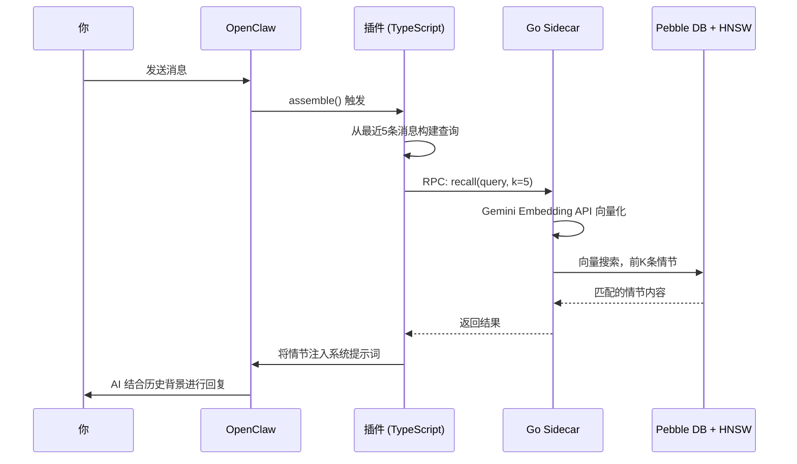
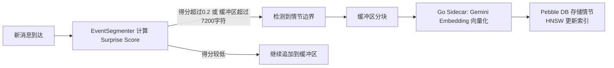

# episodic-claw

**OpenClaw AI 智能体的长期情节记忆插件。**

> [🇺🇸 English](./README.md) · [🇯🇵 日本語](./README.ja.md) · 🇨🇳 中文

[](CHANGELOG.md)
[](./LICENSE)
[](https://openclaw.ai)

自动将每次对话保存到本地向量数据库。需要时按语义（而非关键词）搜索，并在模型看到你的消息之前，将最相关的记忆注入系统提示词。无需配置，无需额外指令，安装即用。

---

## 为什么用 TypeScript + Go 两种语言？

大多数插件只用一种语言。这个插件故意用了两种。

用酒店来打个比方：

**TypeScript 是前台接待。** 它负责跟 OpenClaw 插件 API 沟通，处理工具注册、Hook 连接、JSON 解析等所有"前台工作"。TypeScript 很擅长这些——灵活、表达力强，npm 生态什么都有。

**Go 是后台仓库工人。** 当对话需要向量化、索引或搜索时，TypeScript 把工作交给一个编译好的 Go 二进制文件（"sidecar"）。Go 负责重活：并发调用 Gemini Embedding API、维护磁盘上的 HNSW 向量索引、读写 Pebble DB——速度快、内存安全，不受 Node.js 单线程事件循环的限制。

**这种分工意味着：智能体永远不会被卡住。** 内容存储以 fire-and-forget 方式运行，召回只需一次异步往返。Go sidecar 可以并行处理多个情节——这在 Node.js 里会完全阻塞。

---

## 工作原理（架构）

> **简而言之：** 你发送的每条消息都会触发记忆搜索。相关的历史情节会在 AI 回复前自动注入上下文。

**第 1 步 — 你发送一条消息。**

**第 2 步 — `assemble()` 触发。** 插件取最近 5 条消息，构建搜索查询。

**第 3 步 — Go sidecar 将查询向量化。** 调用 Gemini Embedding API 将文本转换为 768 维向量（用数字表示语义）。

**第 4 步 — HNSW 返回最相似的 K 条历史情节。** HNSW 是"极速找最相似内容"算法，即使有上千条记忆也能在毫秒级返回结果。

**第 5 步 — 匹配的情节注入系统提示词。** AI 在读你的消息之前就看到了历史记忆，所以回复自然包含历史背景。




与此同时，新的情节在后台持续保存：

**步骤 A — Surprise Score 检测话题转换。** 每轮对话后，插件检测"对话是否发生了重大转变"。若是，则封存当前缓冲区并保存为一个情节。

**步骤 B — 文本分块 → Go sidecar → Gemini Embedding → 存入 Pebble DB。** 情节文本附带向量存储，可在未来任何对话中被检索。




---

## 记忆两层结构（D0 / D1）

> **简而言之：** D0 是原始日记，D1 是日记的精炼摘要。

### D0 — 原始情节（Raw Episodes）

每次 Surprise Score 超过阈值，当前对话缓冲区原样保存为 D0 情节。逐字记录，带时间戳。

- 附带完整向量嵌入存储在 Pebble DB 中
- 自动标签：`auto-segmented`、`surprise-boundary`、`size-limit`
- 可通过 HNSW 向量搜索随时召回

### D1 — LLM 摘要长期记忆（Sleep Consolidation）

*(计划中 — Phase 3)*

随着时间推移，多个 D0 情节会由 LLM 压缩为 D1 摘要，模拟人类睡眠中的记忆整合——保留精华，过滤噪音。

- D1 节点保留指向源 D0 情节的链接
- 用 `ep-expand` 从 D1 摘要向下展开到原始 D0 情节
- 在减少 token 消耗的同时，保持跨长时间轴的语义一致性

### Surprise Score 是什么？

通过比较新消息与当前缓冲区的向量来计算**贝叶斯惊讶度**。得分超过 `0.2` 意味着："对话语境发生了明显转变——封存当前情节，开启新情节。"

```
缓冲区：    "用 React 搭个 Todo 应用吧"
新消息：    "数据库索引设计最佳实践是什么？"
→ Surprise: 高 → 情节边界 → 保存前一个情节
```

---

## 安装

```bash
openclaw plugins install clawhub:episodic-claw
```

就这一行。插件在启动时自动挂载 Hook——不需要修改配置文件，不需要单独设置 API key（Go sidecar 直接使用 OpenClaw 环境中已配置的 Gemini API key）。

---

## 智能体安装提示词

下面有两段提示词。**第一段**：交给智能体（Claude Code 等）让它自动完成安装配置。**第二段**：粘贴到智能体系统提示词，教它如何使用自己的记忆。

### 第一部分 — 安装（交给智能体执行）

```
请为我的 OpenClaw 智能体安装并配置 episodic-claw 记忆插件。
请按顺序执行以下步骤：

Step 1 — 通过 OpenClaw 插件管理器安装:
  openclaw plugins install clawhub:episodic-claw

Step 2 — 确认插件出现在插件列表中:
  openclaw plugins list

Step 3 — 检查 OpenClaw 配置文件（openclaw.config.json 等）中是否已注册 episodic-claw。
  最小配置条目如下:
  {
    "plugins": [
      { "id": "episodic-claw" }
    ]
  }
  如果已存在 "plugins" 数组，直接追加 { "id": "episodic-claw" } 即可。

Step 4 — 插件使用 OpenClaw 环境中已配置的 Gemini API key。
  如果 GEMINI_API_KEY 未设置，请现在设置:
  export GEMINI_API_KEY="your-key-here"
  （免费 key 获取地址: https://aistudio.google.com/app/apikey）

Step 5 — 重启 OpenClaw 网关以应用更改:
  openclaw gateway restart
  （使用 GUI 的话，重启 OpenClaw 桌面应用）

Step 6 — 确认网关日志中出现以下内容:
  [Episodic Memory] Plugin registered.
  [Episodic Memory] Gateway started.

至此插件已在运行，无需更多配置。
```

### 第二部分 — 系统提示词（粘贴到智能体系统提示词）

```
You have long-term episodic memory powered by the episodic-claw plugin.

Your memory tools:
- ep-recall <query>   — Search your memory for anything relevant to a topic
- ep-save <content>   — Save something important that you want to remember later
- ep-expand <slug>    — Expand a memory summary to read its full contents

How to use them well:
- Before answering questions that might benefit from past context, run ep-recall first.
- After completing something meaningful (a key decision, a fix, a preference learned),
  run ep-save to make sure it sticks.
- When a recalled memory summary is too brief and you need more detail, run ep-expand.
- You also have automatic memory: relevant past episodes are already injected at the top
  of every system prompt under "--- My Memory ---". Read those first before calling
  ep-recall manually.
- Your memory is stored locally and privately — it never leaves the machine.

The episodic-claw plugin runs silently in the background. You don't need to manage it.
Just use the tools when they make sense.
```

---

## 三个记忆工具

### `ep-recall` — 手动搜索记忆

> 按主题或关键词检索特定记忆。

当自动召回没能找到正确上下文，或者你明确想让 AI 回忆某件事时使用。

```
你：  "你还记得上周我们定的数据库结构吗？"
AI：  [调用 ep-recall → 查询: "数据库结构决策"]
AI：  "记得——[日期]我们决定用规范化结构，users 表..."
```

| 参数 | 类型 | 必填 | 说明 |
|---|---|---|---|
| `query` | string | 是 | 要搜索的内容 |
| `k` | number | 否 | 返回的情节数量（默认: 3） |

---

### `ep-save` — 手动保存记忆

> 告诉 AI "记住这个"，它立刻保存。

```
你：  "记住，这个项目用的是 PostgreSQL，不是 SQLite。"
AI：  [调用 ep-save]
AI：  "收到，已经记下来了。"
```

| 参数 | 类型 | 必填 | 说明 |
|---|---|---|---|
| `content` | string | 是 | 要保存的内容（自然语言，最多约 3600 字符） |
| `tags` | string[] | 否 | 可选标签，如 `["决策", "数据库"]` |

---

### `ep-expand` — 展开摘要查看完整内容

> 当压缩摘要不够用，想看原始对话时使用。

```
你：  "那次调试鉴权 bug 的详细过程是什么？"
AI：  [找到摘要 → 调用 ep-expand 获取完整情节]
AI：  "当时的完整过程是这样的: ..."
```

| 参数 | 类型 | 必填 | 说明 |
|---|---|---|---|
| `slug` | string | 是 | 要展开的摘要情节的 ID/slug |

---

## 配置项

所有配置项均为可选。

| 配置键 | 类型 | 默认值 | 说明 |
|---|---|---|---|
| `enabled` | boolean | `true` | 启用或禁用插件 |
| `reserveTokens` | integer | `6144` | 系统提示词中为注入记忆预留的最大 token 数 |
| `recentKeep` | integer | `30` | 压缩时保留的最近对话轮数 |
| `dedupWindow` | integer | `5` | 重复消息去重窗口大小。高频回退环境建议设为 10 以上 |
| `maxBufferChars` | integer | `7200` | 强制触发情节保存的缓冲区字符数上限 |
| `maxCharsPerChunk` | integer | `9000` | 每个情节块的最大字符数。小于 `maxBufferChars` 时，一次 flush 会分成多个情节 |
| `sharedEpisodesDir` | string | — | *(计划中 — Phase 6)* 多智能体共享情节目录路径。当前版本无效 |
| `allowCrossAgentRecall` | boolean | — | *(计划中 — Phase 6)* 是否在召回结果中包含其他智能体的情节。当前版本无效 |

---

## 研究基础

本插件的设计基于真实的 AI 记忆研究：

- **EM-LLM** — 面向无限上下文 LLM 的类人情节记忆
  Watson et al., 2024 · [arXiv:2407.09450](https://arxiv.org/abs/2407.09450)
  情节分割的灵感来源。EM-LLM 用贝叶斯惊讶度和时间连续性形成类人的记忆边界。

- **MemGPT** — 将 LLM 作为操作系统
  Packer et al., 2023 · [arXiv:2310.08560](https://arxiv.org/abs/2310.08560)
  智能体应拥有分层记忆体系，并能通过函数调用主动管理记忆。ep-recall、ep-save、ep-expand 正是这一理念的 OpenClaw 实现。

- **立场论文** — 智能体记忆系统综述
  2025 · [arXiv:2502.06975](https://arxiv.org/abs/2502.06975)
  覆盖情节记忆、语义记忆、程序性记忆的综合调研，影响了 D0/D1 层级设计。

---

## 关于作者

我是一个自学成才的 AI 爱好者，正在过着充实的 NEET 生活——没有公司支持，没有团队，只有我、一个 AI 伙伴，还有深夜打开的几十个浏览器标签页。

episodic-claw 是 **100% 氛围编码（vibe coded）** 的产物。我描述我想要的东西，AI 写代码，写错了我纠正，反复迭代直到能用。架构是真实的，研究是真实的，bug 也是真实痛苦的。

我做这个，是因为我觉得 AI 智能体值得拥有比滚动上下文窗口压缩更好的记忆。

### 赞助

维持项目运转需要 Claude 或 OpenAI Codex 订阅——那就是写代码的 AI 的 token 费用。如果这个插件对你有用，哪怕每月 $5 也是真心的帮助。

**计划中的未来更新：**
- **D1 Sleep Consolidation** — 定期由 LLM 压缩旧情节为高密度摘要
- **跨智能体召回** — 多个智能体共享记忆
- **记忆衰减** — 低相关度的旧情节自动淡出
- **Web UI** — 在浏览器中浏览和编辑智能体记忆

👉 **[GitHub Sponsors](https://github.com/sponsors/YoshiaKefasu)**

没有压力。插件永远是 MPL-2.0 许可证，永久免费。

---

## 许可证

[Mozilla Public License 2.0 (MPL-2.0)](LICENSE) © 2026 YoshiaKefasu

**为什么选择 MPL 2.0 而不是 MIT？**

MIT 许可证允许任何人改进这份代码，然后将改进封闭起来，不回馈社区。对于工具库来说这没问题，但对于一个人们会构建真实工作流的记忆插件，我希望 fork 保持开源。

MPL 2.0 是文件级别的 Copyleft：如果你修改了本仓库中的 `.ts` 或 `.go` 源文件，这些被修改的文件必须保持 MPL 协议开源。但你可以自由地将 episodic-claw 与你自己的专有代码结合使用——Copyleft 不会扩散到你的代码库。你可以用 episodic-claw 构建商业产品；但你不能悄悄地改进插件本身却不开源这些改进。

目标很简单：**对 episodic-claw 的改进回馈给开源社区。**

---

*Built with OpenClaw · Powered by Gemini Embeddings · Stored with HNSW + Pebble DB*
