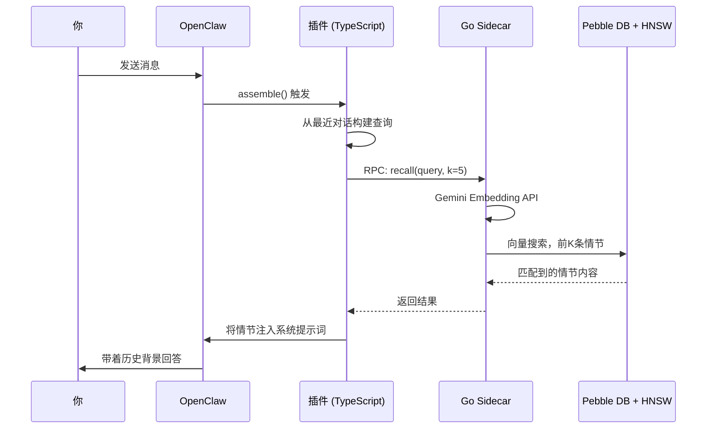
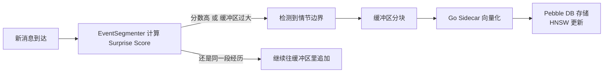

#  episodic-claw

**OpenClaw AI 智能体的长期情节记忆插件。**

> [English](./README.md) | [日本語](./README.ja.md) | 中文

[](./CHANGELOG.md)
[](./LICENSE)
[](https://openclaw.ai)

自动把对话保存在本地，按“意思”而不是按关键词找回相关记忆，并在模型回复前把合适的内容放回提示词里。这样 OpenClaw 就更不容易忘记重要上下文。

`v0.2.0` 是这个项目真正变得更完整的一版：topics-aware recall、Bayesian segmentation、更像“整理记忆”的 D1 consolidation，还有 replay scheduling，都已经进来了。也就是说，它不只是“能存”，而是开始更认真地处理“怎么分段、怎么压缩、什么时候回忆”。

v0.2.0 文档： [v0.2.0 bundle](./docs/v0.2.0/README.md)

---

##  为什么用 TypeScript + Go 两种语言？

大多数插件只用一种语言。这个插件故意用了两种。

可以把它想成一家店：

**TypeScript 是前台。** 它和 OpenClaw 交流，负责工具注册、Hook 连接和 JSON 传递。

**Go 是后场。** 它负责 embedding、向量搜索、replay state 和 Pebble DB 存储，把重活从 Node.js 里拿出去。

最后的效果就是：**TypeScript 管流程，Go 管重活，智能体不用在前台傻等。**

---

##  工作原理（架构）

> **简而言之：** 你发送的每条消息都会触发记忆搜索。相关历史情节会在模型回复前自动进入上下文。

**第 1 步 — 你发送一条消息。**

**第 2 步 — `assemble()` 触发。** 插件从最近几轮对话里构建 recall 查询。

**第 3 步 — Go sidecar 把查询向量化。** 调用 Gemini Embedding API，把文本变成表达语义的向量。

**第 4 步 — HNSW 找到最接近的旧记忆。** 这就是系统能快速问“哪段过去最像现在这个问题”的关键。

**第 5 步 — 候选结果再排序，然后注入系统提示词。** 所以模型是在“已经想起一点东西”的状态下回答。




后台同时还在做另一件事：持续生成新的记忆。

**步骤 A — Surprise Score 观察话题是否明显变化。** 如果变化够大，就说明上一段经历可以收尾了。

**步骤 B — 当前缓冲区被切成新的 episode。** 文本会被向量化，然后写入 Pebble DB，并更新 HNSW。




---

##  记忆两层结构（D0 / D1）

> **简而言之：** D0 是原始日记，D1 是你回头整理出来的摘要笔记。

###  D0 — 原始情节（Raw Episodes）

D0 是最贴近原始对话的记忆。它像带时间戳的日记页，细节多，也更“生”。

- 附带向量嵌入存储在 Pebble DB
- 会带上边界相关标签，比如 `auto-segmented`、`surprise-boundary`、`size-limit`
- 可以直接通过 HNSW 做语义搜索

###  D1 — 长期摘要记忆（Sleep Consolidation）

多个 D0 会在后面被整理成 D1。这个过程有点像人睡过一觉以后，脑子里留下的不是全部细节，而是“这段时间最重要的意思”。

- D1 会保留指向源 D0 的链接
- 可以通过 `ep-expand` 再往下看回原始内容
- 能在降低 token 成本的同时保住长期语义

###  Surprise Score 是什么？

它看的是：新进来的内容和当前缓冲区相比，偏离得有多明显。高到一定程度，就说明“这已经不是同一段经历了”，该切开保存。

```text
缓冲区：    "用 React 搭一个 todo 应用"
新消息：    "数据库索引设计怎么做更好？"
结果：      surprise 很高 -> 切边界 -> 保存前一段 episode
```

正是因为有这个机制，记忆不会全部糊成一大团。

---

##  v0.2.0 到底强在哪里

更早的版本已经能用，但 `v0.2.0` 开始认真处理“什么该算作一个记忆”和“记忆怎样长期保持有用”。

- segmentation 更自适应，不只是死阈值
- D1 clustering 更看上下文和边界，不只是相似度
- replay 独立成一层，不再和正文混在一起
- recall 可以用 topics、usefulness 等信号辅助排序

所以它已经不太像一个“带搜索的笔记本”，而更像一个真正有层次的记忆系统。

---

##  安装

```bash
openclaw plugins install clawhub:episodic-claw
```

入口就是这一句。Go sidecar 会直接使用 OpenClaw 运行环境中已经配置好的 Gemini API key。

---

##  Agent Install Prompt

如果你想让另一个智能体把安装、改配置、重启和验收整套做完，就把下面这段直接给它。

这是一段执行 prompt，不是说明文。

```text
请把 `episodic-claw` 安装到我的 OpenClaw 环境里，并完成从安装到验收的整套技术工作。

不要只解释步骤，请直接执行。

必须完成这些步骤:

1. 先执行:
   `openclaw plugins install clawhub:episodic-claw`

2. 确认插件已经正常安装:
   `openclaw plugins list`

3. 打开真实的 OpenClaw 配置文件，必要时直接修改，让 `episodic-claw` 处于启用状态。
   常见路径是 `~/.openclaw/openclaw.json`。

4. 确认 OpenClaw 运行环境里可以拿到所需的 Gemini API key。
   如果插件依赖 `GEMINI_API_KEY`，请确认 OpenClaw 运行时能直接读取它。

5. 在重启 OpenClaw 之前，先用自然一点的话明确告诉用户下面这件事:
   “接下来需要重启 OpenClaw gateway。我会在重启前先等 6 分钟。现在安装还没有完全验收，而重启发生时，我当前的工作上下文可能会中断。重启完成后，请给我发一条消息把我叫醒，这样我才能继续完成验证。”

6. 发完这条通知后，故意等待 6 分钟。
   不要只停一下，是真的要做一次完整的 sleep / wait。

7. 重启 OpenClaw:
   `openclaw gateway restart`

8. 重启后确认插件确实已经生效。
   请检查 plugin status、启动日志，以及 memory plugin 是否处于 loaded 状态。

9. 如果这个插件会在安装时下载平台相关的 sidecar binary，请确认 binary 已经正确下载并存在于插件目录中。

10. 最后给我一份简短报告:
   - 你改了什么
   - 插件是否已经 loaded
   - 还有哪些 warning 或需要我手动处理的事

重要:
- 不要只说“应该怎么改”，请直接修改真实配置。
- 如果中途失败，请继续排查，直到插件真的跑起来，或者发现一个明确的 blocker。
- 不要在安装完成后就停下，还要完成验证。
```

---

##  三个记忆工具

### `ep-recall` — 手动搜索记忆

需要的时候，主动去“想起”某段过去。

当自动注入不够，或者你明确想让智能体往更久之前回忆时，用它。

### `ep-save` — 手动保存记忆

把重要内容立刻存进去。

适合保存偏好、约束、决策、事实。

### `ep-expand` — 从摘要回到细节

摘要够用时它很省 token，但如果你需要完整过程，就靠这个往回展开。

---

##  配置项

全部都是可选项。刚开始通常不需要改。

| 配置键 | 类型 | 默认值 | 说明 |
|---|---|---|---|
| `enabled` | boolean | `true` | 启用或禁用插件 |
| `reserveTokens` | integer | `6144` | 为记忆注入保留的最大 token 数 |
| `recentKeep` | integer | `30` | compact 时保留的最近轮数 |
| `dedupWindow` | integer | `5` | fallback 重复文本去重窗口 |
| `maxBufferChars` | integer | `7200` | 触发强制保存的缓冲区大小 |
| `maxCharsPerChunk` | integer | `9000` | 每个存储块的最大字符数 |
| `sharedEpisodesDir` | string | — | 未来多智能体共享记忆用，当前无效 |
| `allowCrossAgentRecall` | boolean | — | 未来跨智能体 recall 用，当前无效 |

先用默认值，遇到明确问题再调。

---

##  研究基础

这个插件不是在假装自己是神经科学项目，但它的设计也不是随便拼出来的。`v0.2.0` 这一版里的很多关键点，都能对应到很具体的论文来源。

### 1. 智能体记忆的整体架构

- **EM-LLM** — *Human-Like Episodic Memory for Infinite Context LLMs*  
  Watson et al., 2024 · [arXiv:2407.09450](https://arxiv.org/abs/2407.09450)  
  影响了“不要把一切都塞进一条滚动日志里，而要按事件形成 episodic memory”这个方向。

- **MemGPT** — *Towards LLMs as Operating Systems*  
  Packer et al., 2023 · [arXiv:2310.08560](https://arxiv.org/abs/2310.08560)  
  影响了“智能体应该有显式记忆工具和分层记忆结构”这一点。

- **Agent Memory Systems** — position paper / survey  
  2025 · [arXiv:2502.06975](https://arxiv.org/abs/2502.06975)  
  帮助这个项目把 episodic memory、semantic memory、retrieval policy 和长期记忆操作区分开来。

### 2. 分段与事件边界

- **Bayesian Surprise Predicts Human Event Segmentation in Story Listening**  
  [PMC11654724](https://pmc.ncbi.nlm.nih.gov/articles/PMC11654724/)  
  这是 `v0.2.0` 转向自适应 Bayesian segmentation 的核心参考之一。

- **Robust and Scalable Bayesian Online Changepoint Detection**  
  [arXiv:2302.04759](https://arxiv.org/abs/2302.04759)  
  影响了“边界检测必须足够轻，能够在线更新”的实现思路。

### 3. D1 consolidation 与带上下文的记忆归并

- **Human Episodic Memory Retrieval Is Accompanied by a Neural Contiguity Effect**  
  [PMC5963851](https://pmc.ncbi.nlm.nih.gov/articles/PMC5963851/)  
  说明 D1 clustering 不能只看语义相似度，还要看时间上和上下文上的邻近性。

- **Contextual prediction errors reorganize naturalistic episodic memories in time**  
  [PMC8196002](https://pmc.ncbi.nlm.nih.gov/articles/PMC8196002/)  
  支撑了把强 surprise-boundary 当成真正边界，而不只是弱提示。

- **Schemas provide a scaffold for neocortical integration of new memories over time**  
  [PMC9527246](https://pmc.ncbi.nlm.nih.gov/articles/PMC9527246/)  
  和 topics、抽象化、以及更偏 schema 的后续记忆结构很相关。

### 4. Replay 与记忆定着

- **Human hippocampal replay during rest prioritizes weakly learned information**  
  [PMC6156217](https://pmc.ncbi.nlm.nih.gov/articles/PMC6156217/)  
  这是 D1-first replay scheduler 的重要灵感之一：不是所有记忆都值得同样频率地复习，弱但重要的内容应该优先。

### 5. Recall 重排与不确定性控制

- **Dynamic Uncertainty Ranking: Enhancing Retrieval-Augmented In-Context Learning for Long-Tail Knowledge in LLMs**  
  [ACL Anthology](https://aclanthology.org/2025.naacl-long.453/)  
  影响了 recall 不只是“向量近”，还要尽量减少误导性候选这一点。

- **Overcoming Prior Misspecification in Online Learning to Rank**  
  [arXiv:2301.10651](https://arxiv.org/abs/2301.10651)  
  对“召回权重不该永远写死，而应该允许动态调整”的思路有帮助。

- **An Empirical Evaluation of Thompson Sampling**  
  [Microsoft Research PDF](https://www.microsoft.com/en-us/research/wp-content/uploads/2016/02/thompson.pdf)  
  影响了轻量级 exploration / exploitation 平衡的实现方向，因为这个插件不能为了排序把延迟拖得太重。

所以 README 里那些“更像记忆系统”“更像整理过的长期记忆”的说法，不只是包装词。`v0.2.0` 这一版，确实把这些研究思路往实际实现里推近了一大步。

---

##  关于作者

我是一个自学成才的 AI 爱好者，过着很典型的 NEET 开发生活。没有公司团队，没有融资支持，有的就是我自己、一个 AI 搭档，还有凌晨两点还没关掉的一堆浏览器标签页。

`episodic-claw` 是 **100% vibe coded** 的产物。我把想法讲给 AI，哪里不对就顶回去，坏了就继续修，直到它终于像我脑子里想的那样工作。架构是真的，研究参考也是真的，bug 更是真的。

我做这个项目的理由很简单：我觉得 AI 智能体应该拥有比“滚动上下文窗口”更像样的记忆。如果 `episodic-claw` 能让一个智能体更稳一点、更聪明一点、少忘一点，那就值了。

###  赞助

继续做下去就得继续烧模型订阅，Claude 和 OpenAI Codex 的费用都是真实存在的。如果这个插件对你有帮助，哪怕一点点支持也真的有用。

接下来想继续做的方向：

- cross-agent recall
- memory decay
- 用来浏览和编辑记忆的 web UI

[GitHub Sponsors](https://github.com/sponsors/YoshiaKefasu)

不用有压力。这个插件会继续保持 MPL-2.0，并且免费。

---

##  许可证

[Mozilla Public License 2.0 (MPL-2.0)](LICENSE) © 2026 YoshiaKefasu

为什么用 MPL，不用 MIT？

因为我希望大家能放心用它、拿它做产品，但我也不希望对这个插件本身的改进永久消失在闭源分支里。

MPL 刚好在中间：

- 你可以拿它做真实产品
- 可以和自己的代码一起用
- 但如果你修改了这个插件的文件，这些修改后的文件应该继续开放

这个平衡很适合 `episodic-claw`。

---

*Built with OpenClaw · Powered by Gemini Embeddings · Stored with HNSW + Pebble DB*
