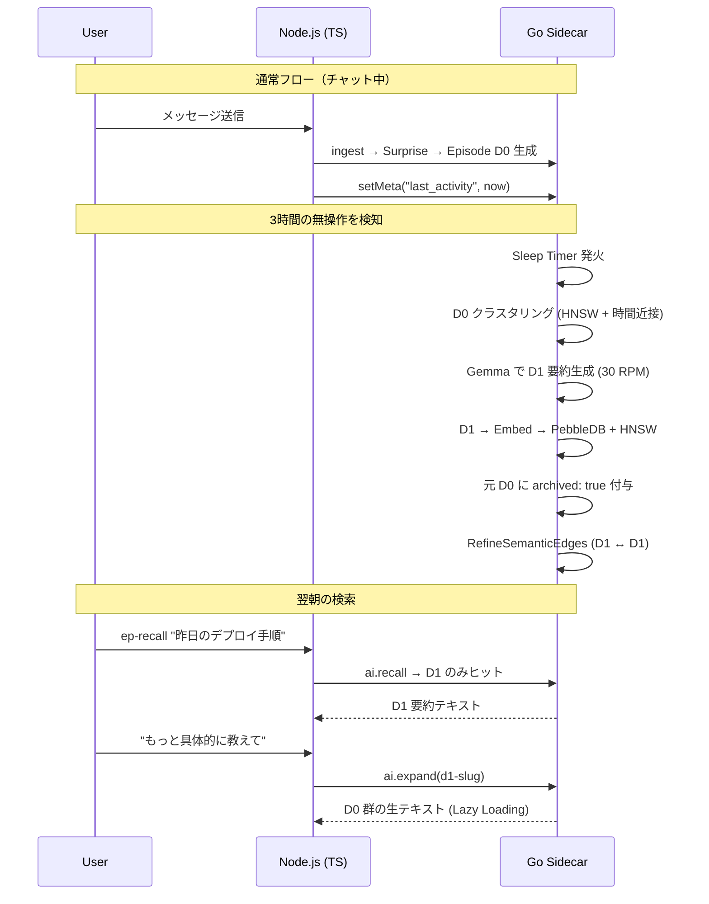

# Phase 4.2: DAG 階層圧縮 — Hippocampal Sleep Consolidation

BMAM (Brain-inspired Multi-Agent Memory) の「海馬 ↔ 大脳新皮質の機能的分離」を、OpenClaw 無料枠で安定稼働するシングルエージェント向け「Sleep Consolidation」アーキテクチャとして実装する。

> [!IMPORTANT]
> **コアコンセプト:** ユーザーの最終メッセージから **3時間の無操作** を検知すると、Go サイドカーが自律的に Sleep Consolidation Job を発火し、D0（海馬の生エピソード）を D1（大脳新皮質の抽象要約）へ固定化する。

---

## 脳科学モデルと実装の対応表

| 脳の機能 | Synapse グラフ要素 | episodic-claw の実装 |
|---|---|---|
| 海馬（短期記憶） | Episodic Nodes (V_E) | **D0** — `episodes/**/*.md` 生エピソード |
| 大脳新皮質（長期知識） | Semantic Nodes (V_S) | **D1** — Consolidation で生成される要約ノード |
| 時系列の連鎖 | Temporal Edges (E_T) | `dateSeq` / `created` frontmatter |
| 具体→抽象リンク | Abstraction Edges (E_A) | D0 frontmatter の `parent: <D1 slug>` + `archived: true` |
| 概念間の連想 | Association Edges (E_Assoc) | `indexer.refine` RPC による HNSW semantic edge |

---

## Proposed Changes

### Go サイドカー (episodic-core)

---

#### [NEW] [consolidation.go](file:///d:/GitHub/OpenClaw%20Related%20Repos/episodic-claw/go/internal/vector/consolidation.go)

Sleep Consolidation のコアロジック。

**責務:**
1. **`RunConsolidation(agentWs, apiKey, vstore)`** — メインエントリ
   - PebbleDB から `archived: false`（or `archived` タグが無い）の D0 レコードを全走査
   - 時間的近接度（`Timestamp`）+ HNSW コサイン類似度で D0 群を **クラスタリング**（貪欲法: 閾値 < 0.20、最大 10 ノード/クラスタ）
   - 各クラスタの Body テキストを結合し、Gemma 3 27B に「この一連の出来事から抽出できるルール・パターン・要約を生成せよ」とプロンプト投入
   - 返されたテキストを **D1 [.md](file:///C:/Users/yosia/.gemini/GEMINI.md)** として `episodes/YYYY/MM/DD/{d1-slug}.md` に書き出し
   - D1 の frontmatter: `{ depth: 1, children: [d0-slug-1, d0-slug-2, ...] }`
   - 元 D0 の frontmatter に `archived: true` と `parent: d1-slug` を追記（ファイル書き換え）
   - D1 を Gemini Embedding 2 で Embed → PebbleDB + HNSW に Upsert
   - 元 D0 を HNSW インデックスから **除外**（Recall で archived を filter する方式 or 物理削除）

2. **`RefineSemanticEdges(agentWs, vstore)`**
   - 全 D1 ノード同士を HNSW KNN で近傍検索
   - Cosine Distance < 0.15 のペアについて `semantic` エッジを D1 の frontmatter `edges` に追記
   - この関連リンクにより、`ep-recall` 実行時に直接ヒットしなかった概念が「連想」経由で浮上できる

**Rate Limit:** [background.go](file:///d:/GitHub/OpenClaw%20Related%20Repos/episodic-claw/go/internal/vector/background.go) と同様に `golang.org/x/time/rate` で Gemma 30 RPM / Embedding 100 RPM を厳守

---

#### [MODIFY] [main.go](file:///d:/GitHub/OpenClaw%20Related%20Repos/episodic-claw/go/main.go)

- **Sleep Timer goroutine** を追加
  - `meta:last_activity` キー（PebbleDB）に最終メッセージ日時を記録
  - Go側で `time.Ticker` (1分間隔) を回し、`now - last_activity > 3h` を検知したら `RunConsolidation` + `RefineSemanticEdges` を Fire-and-Forget で発火
  - 発火後は `meta:last_consolidation` に日時を記録し、次の 3h 無操作まで再発火しない
- **`ai.consolidate` RPC** を追加（TS 側からの手動トリガー用、テスト用途）
- **`ai.expand` RPC** を追加
  - D1 slug を受け取り → frontmatter の `children` から D0 の slug リストを取得 → 各 D0 の Body を結合して返却

---

#### [MODIFY] [store.go](file:///d:/GitHub/OpenClaw%20Related%20Repos/episodic-claw/go/internal/vector/store.go)

- **`ListByTag(tag string)`** を追加 — `archived: false` の D0 だけを列挙するためのイテレータ
- **`UpdateRecord(id string, mutator func(*EpisodeRecord))`** を追加 — D0 の `archived` フラグや `parent` エッジを書き換えるための安全な update メソッド
- **[Recall](file:///d:/GitHub/OpenClaw%20Related%20Repos/episodic-claw/go/internal/vector/store.go#290-360) の archived filter** — `rec.Tags` に `"archived"` が含まれる場合はスキップする条件を追加（D0 が通常検索にヒットしなくなる）

---

#### [MODIFY] [background.go](file:///d:/GitHub/OpenClaw%20Related%20Repos/episodic-claw/go/internal/vector/background.go)

- 変更なし（Phase 4.1 のまま）。ただし [ProcessBackgroundIndexing](file:///d:/GitHub/OpenClaw%20Related%20Repos/episodic-claw/go/internal/vector/background.go#26-37) で生成された D0 が Consolidation の対象に入ることを確認。

---

### TypeScript プラグイン (episodic-claw)

---

#### [MODIFY] [rpc-client.ts](file:///d:/GitHub/OpenClaw%20Related%20Repos/episodic-claw/src/rpc-client.ts)

```typescript
// 新規 RPC メソッド追加
async triggerConsolidation(agentWs: string): Promise<string> {
  return this.request<string>("ai.consolidate", { agentWs });
}

async expandEpisode(slug: string, agentWs: string): Promise<{ children: string[], body: string }> {
  return this.request<{ children: string[], body: string }>("ai.expand", { slug, agentWs });
}
```

---

#### [MODIFY] [index.ts](file:///d:/GitHub/OpenClaw%20Related%20Repos/episodic-claw/src/index.ts)

- [ingest()](file:///d:/GitHub/OpenClaw%20Related%20Repos/episodic-claw/src/index.ts#66-81) 内で `meta:last_activity` を更新するため、各 ingest 後に `rpcClient.setMeta("last_activity", Date.now())` を追加
- `ep-expand` ツールを `api.registerTool` で登録:
  - 入力: `{ slug: string }` — D1 の slug
  - 処理: `rpcClient.expandEpisode(slug, agentWs)`
  - 出力: D0 群の結合テキスト（Lazy Loading）

---

#### [MODIFY] [compactor.ts](file:///d:/GitHub/OpenClaw%20Related%20Repos/episodic-claw/src/compactor.ts)

- 変更なし。Compactor は Phase 4.0/4.1 のロスレス圧縮＋Genesis Gap に専念。
- Consolidation（D0→D1昇格）は Go 側の Sleep Timer が自律的に実行するため、TS 側のオーケストレーションは不要。

---

## データフロー図



---

## Verification Plan

### Automated Tests

1. **単体テスト: `consolidation_test.go`**
   - D0 × 10 を PebbleDB に手動挿入 → `RunConsolidation` → D1 が 1〜3 個生成されること
   - 元の D0 に `archived: true` が付与されていること
   - D1 の frontmatter に `children` リストが正しいこと

2. **結合テスト: Sleep Timer**
   - `meta:last_activity` を 4 時間前にセット → Timer 発火を確認（ログ出力）
   - 発火後に `meta:last_consolidation` が更新されること
   - 再度即座には発火しないこと（デバウンス確認）

3. **結合テスト: ep-expand**
   - D1 slug を指定 → `ai.expand` RPC → D0 群の Body テキストが結合されて返却
   - archived な D0 が通常の `ai.recall` ではヒットしないことを確認

4. **結合テスト: Semantic Edge Refinement**
   - 類似する D1 × 3 を投入 → `RefineSemanticEdges` → Cosine < 0.15 のペアにエッジが追加
   - `ep-recall` 時に直接ヒットしなかった D1 がエッジ経由で返ることを確認（将来的な Graph Walk）

### Manual Verification
- OpenClaw で実際にエージェントと会話 → 3時間放置 → Go ログで Consolidation 完了を確認
- 翌日 `ep-recall` で D1 がヒットし、`ep-expand` で D0 が展開されることを確認
