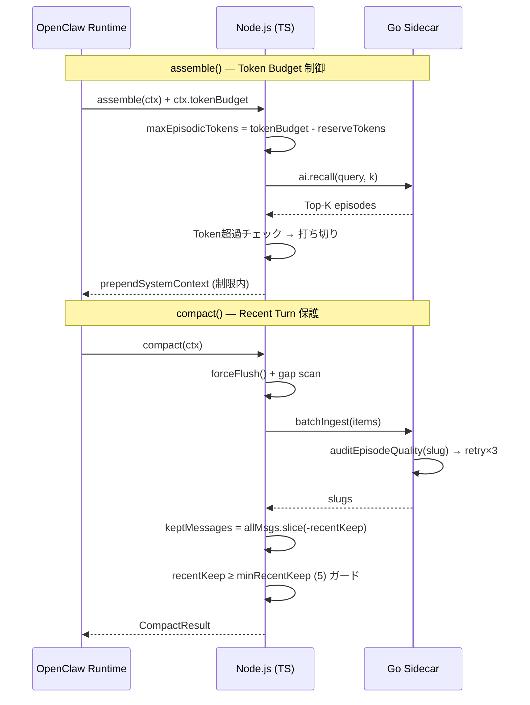

# Phase 4.5: OpenClaw Compaction 互換レイヤー — Quality Guard + Token Budget

Phase 4.0〜4.2 で完成した「ロスレス圧縮 + Sleep Consolidation」パイプラインを、OpenClaw ランタイムの **制約**（トークンバジェット、直近ターン保護）と互換させ、かつ Episode の品質を自動監査する防御層を追加する。

---

## 脳科学モデル対応

| 機能 | 脳の機能 | 目的 |
|---|---|---|
| Quality Guard | 前頭前皮質の品質フィルタ | 雑な記憶（ゴミslug、空タグ）を防ぎ、検索精度を維持 |
| Reserve Tokens | ワーキングメモリの容量制限 | 想起したエピソードがプロンプトを圧迫しない |
| Preserve Recent | 短期記憶の保護 | 直近の会話ターンを消さない安全弁 |

---

## Proposed Changes

### Go サイドカー (episodic-core)

---

#### [MODIFY] [main.go](file:///d:/GitHub/OpenClaw%20Related%20Repos/episodic-claw/go/main.go)

**Quality Guard を [handleBatchIngest](file:///d:/GitHub/OpenClaw%20Related%20Repos/episodic-claw/go/main.go#441-530) と [handleIngest](file:///d:/GitHub/OpenClaw%20Related%20Repos/episodic-claw/go/main.go#344-434) に追加:**

[handleBatchIngest](file:///d:/GitHub/OpenClaw%20Related%20Repos/episodic-claw/go/main.go#441-530) (L441) と [handleIngest](file:///d:/GitHub/OpenClaw%20Related%20Repos/episodic-claw/go/main.go#344-434) (L385) 内で Gemma が生成した slug を受け取った後、以下の監査関数を挟む:

```go
func auditEpisodeQuality(slug string, tags []string) error {
    // 1. Slug 長チェック: 3〜60文字 (kebab-case)
    if len(slug) < 3 || len(slug) > 60 {
        return fmt.Errorf("slug length out of range: %d", len(slug))
    }
    // 2. 禁止パターン: "here-are", "sure-i-can" 等の英語AI語調に加え、CJK（日中韓）のLLM汚染も排除
    banned := []string{
        // 英語
        "here-are", "sure-i-can", "as-an-ai", "i-d-be-happy", "certainly", "of-course",
        // 日本語
        "承知", "了解", "わかりました", "はい", "aiとして", "回答",
        // 中国語
        "好的", "没问题", "当然", "作为一个", "答案",
        // 韓国語
        "알겠습니다", "네", "당연하죠", "ai로서", "대답",
    }
    for _, b := range banned {
        if strings.Contains(strings.ToLower(slug), b) {
            return fmt.Errorf("slug contains banned pattern: %s", b)
        }
    }
    // 3. ケバブケース検証
    if slug != strings.ToLower(slug) || strings.Contains(slug, " ") {
        return fmt.Errorf("slug is not valid kebab-case: %s", slug)
    }
    return nil
}
```

**リトライロジック（上限3回）:**
```go
var slug string
var auditErr error
for attempt := 0; attempt < 3; attempt++ {
    slug, _ = provider.GenerateText(ctx, prompt)
    slug = sanitizeSlug(slug)
    auditErr = auditEpisodeQuality(slug, item.Tags)
    if auditErr == nil {
        break
    }
    EmitLog("Quality Guard: attempt %d failed: %v", attempt+1, auditErr)
}
if auditErr != nil {
    // 3回失敗 → content-addressable フォールバック
    slug = fmt.Sprintf("episode-%x", md5.Sum([]byte(item.Summary)))[:16]
}
```

---

### TypeScript プラグイン (episodic-claw)

---

#### [MODIFY] [retriever.ts](file:///d:/GitHub/OpenClaw%20Related%20Repos/episodic-claw/src/retriever.ts)

**Reserve Tokens の導入:**

[retrieveRelevantContext()](file:///d:/GitHub/OpenClaw%20Related%20Repos/episodic-claw/src/retriever.ts#7-54) のシグネチャに `maxTokens` を追加し、エピソード結合時にトークン推定値が `maxTokens` を超えたら打ち切る:

```typescript
async retrieveRelevantContext(
  currentMessages: Message[], 
  agentWs: string, 
  k: number = 5,
  maxTokens: number = 4096  // ★ 新パラメータ
): Promise<string> {
  // ... recall ...
  let assembled = "=== RETRIEVED EPISODIC MEMORY ===\n...";
  let tokenCount = 0;

  for (const res of results) {
    const bodyText = res.Body?.trim() || "(No content available)";
    const entryTokens = Math.ceil(bodyText.length / 4); // CJK補正は将来対応
    
    if (tokenCount + entryTokens > maxTokens) {
      const remainingIds = results.slice(results.indexOf(res)).map(r => r.Record?.id).filter(Boolean);
      assembled += `\n(... ${remainingIds.length} more episodes matched but were truncated due to token budget.)\n`;
      assembled += `To read these truncated episodes, use the \`ep-recall\` tool with their exact ID/Slug:\n`;
      assembled += remainingIds.map(id => `- ${id}`).join("\n") + "\n";
      break;
    }
    // ... 既存の結合ロジック ...
    tokenCount += entryTokens;
  }
  // ...
}
```

---

#### [MODIFY] [index.ts](file:///d:/GitHub/OpenClaw%20Related%20Repos/episodic-claw/src/index.ts)

**[assemble()](file:///d:/GitHub/OpenClaw%20Related%20Repos/openclaw-v2026.3.12/src/context-engine/types.ts#125-135) で Token Budget を計算して Retriever に渡す:**

```typescript
async assemble(ctx: any) {
  const msgs = (ctx.messages || []) as Message[];
  
  // ★ Token Budget 計算: OpenClaw が ctx.tokenBudget を渡してくる想定
  // 渡されない場合は安全なデフォルト (8192)
  const totalBudget = ctx.tokenBudget || 8192;
  const reserveTokens = cfg.reserveTokens || 6144; // プラグイン設定から (default: 6144)
  const maxEpisodicTokens = Math.max(0, totalBudget - reserveTokens);

  const episodicContext = await retriever.retrieveRelevantContext(
    msgs, resolvedAgentWs, 5, maxEpisodicTokens
  );
  
  return {
    messages: msgs,
    prependSystemContext: episodicContext,
    estimatedTokens: Math.ceil(episodicContext.length / 4),
  };
},
```

---

#### [MODIFY] [compactor.ts](file:///d:/GitHub/OpenClaw%20Related%20Repos/episodic-claw/src/compactor.ts)

**直近 N ターン保護のガードレール強化:**

現在 `RECENT_KEEP = 10` がハードコーディングだが、プラグイン設定から読み取り可能にし、最低保持数の下限ガード（5ターン）を追加:

```typescript
export class Compactor {
  private isCompacting = false;
  private minRecentKeep = 15;  // ★ 安全弁: これ以下にはさせない

  constructor(
    private rpcClient: EpisodicCoreClient,
    private segmenter: EventSegmenter,
    private recentKeep: number = 30  // ★ 設定注入可能 (default: 30)
  ) {
    // 下限ガード
    this.recentKeep = Math.max(recentKeep, this.minRecentKeep);
  }
  // ...
  // Step 5: Session Modification
  const keptMessages = allMsgs.slice(-this.recentKeep);
  // ...
}
```

---

#### [MODIFY] [config.ts](file:///d:/GitHub/OpenClaw%20Related%20Repos/episodic-claw/src/config.ts)

**新しい設定項目の追加:**

```typescript
export interface EpisodicPluginConfig {
  // 既存...
  reserveTokens?: number;   // assemble() 時のエピソード注入上限 (default: 6144)
  recentKeep?: number;      // compact() 時に保持する直近メッセージ数 (default: 30, min: 15)
}
```

---

## データフロー図



---

## Verification Plan

### Automated Tests

1. **Quality Guard テスト: `test_quality_guard.ts`**
   - Gemma に意図的にゴミslug（`"here-are-a-few-options-for..."` 等）を返させるモック → `auditEpisodeQuality` が reject → リトライ → 3回失敗時にフォールバック slug が生成されることを確認
   - 正常な slug (`"deploy-workflow-fix"`) が audit を通過することを確認

2. **Reserve Tokens テスト:**
   - 大量エピソード（10件 × 2000トークン）を recall → `maxTokens = 4096` で呼び出し → 結合テキストが 4096 トークン以下になることを確認
   - 打ち切り時に、残りのエピソードの取得先（Slugリストと `ep-recall` への誘導）が明記されることを確認

3. **Recent Keep ガードレール テスト:**
   - `recentKeep = 10`（下限 15 未満）を設定 → 実質 15 に矯正されることを確認
   - compact() 後のセッションファイルに indexMessage + 直近15件 = 16件のメッセージが残ることを確認

### Manual Verification
- OpenClaw で実際に長い会話を行い、compact() 発火後に直近ターンが保持されていることを目視確認
- `ep-recall` で多数ヒットした際にプロンプトがオーバーフローしないことを確認
