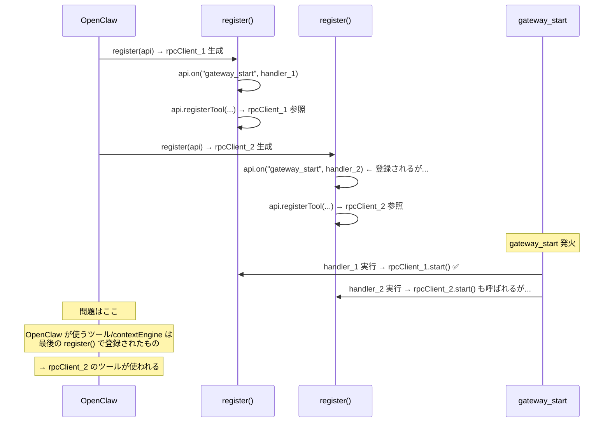

# Phase 5.5 根本原因精査 & シングルトン修正プラン

> **作成日**: 2026-03-21
> **調査ツール**: GitNexus MCP (episodic-claw + openclaw 両リポジトリ)
> **対象**: [src/index.ts](file:///d:/GitHub/OpenClaw%20Related%20Repos/episodic-claw/src/index.ts) の [register()](file:///d:/GitHub/OpenClaw%20Related%20Repos/episodic-claw/src/index.ts#47-217) 多重呼び出しバグ

---

## 1. 問題の全体像（Round 3 テスト結果より）

### 観測された障害
```
[Episodic Memory DEBUG] Starting register()...  (1回目)
[Episodic Memory DEBUG] Starting register()...  (2回目)
[Episodic Memory] Starting Go sidecar...        (gateway_start は1回だけ発火)
...
[Episodic Memory] Error processing ingest: Error: Go sidecar socket not connected
```

### Go 側ログ（`/tmp/episodic-core.log`）
- Go サイドカーは正常に起動、`watcher.start` を受信
- **ソケット切断のログは一切なし**
- 問題は **100% TS 側（rpc-client.ts / index.ts）** に起因

---

## 2. GitNexus による根本原因の確定

### 2.1 OpenClaw 側のプラグインライフサイクル

GitNexus で `openclaw` リポジトリの `createPluginRegistry` (`src/plugins/registry.ts`) を精査した結果：

```
createPluginRegistry()
  → 各プラグインの plugin.register(api) を呼び出し
  → api.on("gateway_start", handler) でフックを登録
  → registryビルド完了
```

**registry ビルドは複数の文脈で発生する：**

| 呼び出し元 | タイミング |
|---|---|
| Gateway 起動 (`gateway run`) | メインのプラグインロード |
| CLI routing (`ensurePluginRegistryLoaded`) | CLIコマンド実行時 |
| hooks-cli (`buildHooksReport`) | フック一覧表示時 |

→ **[register()](file:///d:/GitHub/OpenClaw%20Related%20Repos/episodic-claw/src/index.ts#47-217) はレジストリ構築毎に呼ばれる = 複数回呼ばれうる**

### 2.2 episodic-claw 側の設計バグ

現在の [src/index.ts](file:///d:/GitHub/OpenClaw%20Related%20Repos/episodic-claw/src/index.ts) L39-42:
```typescript
register(api: OpenClawPluginApi) {
    const rpcClient = new EpisodicCoreClient();  // ← 毎回新規生成
    const segmenter = new EventSegmenter(rpcClient);
    const retriever = new EpisodicRetriever(rpcClient);
```

**障害メカニズム：**



> [!CAUTION]
> 深掘りで判明した追加リスク：**Gateway 起動前に CLI から registry がビルドされた場合**、[register()](file:///d:/GitHub/OpenClaw%20Related%20Repos/episodic-claw/src/index.ts#47-217) が呼ばれるが `gateway_start` は一切発火しない。この場合 `rpcClient.start()` は永遠に呼ばれない。

> [!IMPORTANT]
> `gateway_start` の handler は **全ての登録済みハンドラ** に対して並列実行される（`runVoidHook` の `Promise.all`）。つまり handler_1 と handler_2 の両方が実行される。しかし **context engine やツールは後勝ち** のため、OpenClaw が使うのは rpcClient_2 のクロージャ。rpcClient_1 のソケットは正常でも、rpcClient_2 が使われるため全て失敗する。

---

## 3. ✅ 実装済み修正（`npm run build:ts` 通過確認済み）

> [!IMPORTANT]
> 修正対象ファイル: [src/index.ts](file:///d:/GitHub/OpenClaw%20Related%20Repos/episodic-claw/src/index.ts), [src/rpc-client.ts](file:///d:/GitHub/OpenClaw%20Related%20Repos/episodic-claw/src/rpc-client.ts), [src/compactor.ts](file:///d:/GitHub/OpenClaw%20Related%20Repos/episodic-claw/src/compactor.ts)

### P1: `resolvedAgentWs` + 全シングルトン変数のモジュールスコープ化

**修正ファイル**: [src/index.ts](file:///d:/GitHub/OpenClaw%20Related%20Repos/episodic-claw/src/index.ts)

`rpcClient`, `segmenter`, `retriever`, `compactor`, `resolvedAgentWs`, `sidecarStarted` を [register()](file:///d:/GitHub/OpenClaw%20Related%20Repos/episodic-claw/src/index.ts#47-217) 外のモジュールスコープに移動した。

```typescript
// ─── Module Scope Singletons ───
let rpcClientSingleton: EpisodicCoreClient | null = null;
let segmenterSingleton: EventSegmenter | null = null;
let retrieverSingleton: EpisodicRetriever | null = null;
let compactorSingleton: Compactor | null = null;
let sidecarStarted = false;
let resolvedAgentWs = "";  // ← P1: モジュールスコープに移動
```

`gateway_start` ハンドラに冪等ガードを追加:
```typescript
api.on("gateway_start", async (event?: any, _ctx?: any) => {
  if (sidecarStarted) {
    console.log("[Episodic Memory] Sidecar already started, skipping duplicate gateway_start");
    return;
  }
  sidecarStarted = true;
  ...
});
```

`gateway_stop` で `sidecarStarted` をリセット（P3と合わせて実装）:
```typescript
api.on("gateway_stop", async (...) => {
  await rpcClient.stop();  // P3: プロセス終了待機
  sidecarStarted = false;
});
```

### P2: `cfg.recentKeep` の更新追従

**修正ファイル**: [src/compactor.ts](file:///d:/GitHub/OpenClaw%20Related%20Repos/episodic-claw/src/compactor.ts), [src/index.ts](file:///d:/GitHub/OpenClaw%20Related%20Repos/episodic-claw/src/index.ts)

[Compactor](file:///d:/GitHub/OpenClaw%20Related%20Repos/episodic-claw/src/compactor.ts#16-203) に [setRecentKeep()](file:///d:/GitHub/OpenClaw%20Related%20Repos/episodic-claw/src/compactor.ts#28-31) メソッドを追加し、[register()](file:///d:/GitHub/OpenClaw%20Related%20Repos/episodic-claw/src/index.ts#47-217) が再呼び出しされた際に最新の設定値を反映させる:

```typescript
// compactor.ts
setRecentKeep(val: number) {
  this.recentKeep = Math.max(val, this.minRecentKeep);
}
```

```typescript
// index.ts
if (!compactorSingleton) {
  compactorSingleton = new Compactor(..., cfg.recentKeep ?? 30);
} else {
  compactorSingleton.setRecentKeep(cfg.recentKeep ?? 30);  // ← 最新cfg反映
}
```

### P3: [stop()](file:///d:/GitHub/OpenClaw%20Related%20Repos/episodic-claw/src/rpc-client.ts#206-237) の async 化とプロセス終了待機

**修正ファイル**: [src/rpc-client.ts](file:///d:/GitHub/OpenClaw%20Related%20Repos/episodic-claw/src/rpc-client.ts)

[stop()](file:///d:/GitHub/OpenClaw%20Related%20Repos/episodic-claw/src/rpc-client.ts#206-237) を `async` メソッドに変更し、`kill()` 後に `exit`/`close` イベントを待機する (最大 2秒タイムアウト付き):

```typescript
async stop(): Promise<void> {
  this.connectOpts = undefined;
  this.reconnectPromise = undefined;
  if (this.socket) { this.socket.destroy(); this.socket = undefined; }
  if (this.child) {
    const p = this.child;
    this.child = undefined;  // ← 早期クリア（再入防止）
    await new Promise<void>((resolve) => {
      let isResolved = false;
      const done = () => { if (!isResolved) { isResolved = true; resolve(); } };
      p.once("exit", done);
      p.once("close", done);
      p.kill();
      setTimeout(done, 2000);  // 念のため 2秒 timeout
    });
  }
}
```

---

## 4. 修正サマリー

| # | 問題 | 深刻度 | 修正ファイル | 状態 |
|---|---|---|---|---|
| **P1** | `resolvedAgentWs` 等がシングルトン化されず空文字列のまま | 🔴 Critical | [index.ts](file:///d:/GitHub/OpenClaw%20Related%20Repos/episodic-claw/index.ts) | ✅ 実装済み |
| **P2** | `compactor` が初回 `cfg.recentKeep` でロックされ設定変更不可 | 🟠 Medium | [compactor.ts](file:///d:/GitHub/OpenClaw%20Related%20Repos/episodic-claw/src/compactor.ts), [index.ts](file:///d:/GitHub/OpenClaw%20Related%20Repos/episodic-claw/index.ts) | ✅ 実装済み |
| **P3** | `gateway_stop` → `gateway_start` 連続でゾンビプロセスリスク | 🟡 Low | [rpc-client.ts](file:///d:/GitHub/OpenClaw%20Related%20Repos/episodic-claw/src/rpc-client.ts) | ✅ 実装済み |

---

## 5. 検証計画

### 自動検証
```bash
# ① TSビルド
npm run build:ts
# → エラーゼロ

# ② WSLへコピー & テスト
# ファイルコピー後、openclaw gateway run --verbose
# 期待: [Episodic Memory DEBUG] Starting register()... が2回出ても
#       [Episodic Memory] Starting Go sidecar... は1回だけ
#       ingest/recall が成功
```

### 確認ポイント
1. [register()](file:///d:/GitHub/OpenClaw%20Related%20Repos/episodic-claw/src/index.ts#47-217) ログが2回出ても `Starting Go sidecar` は1回だけ
2. [ingest](file:///d:/GitHub/OpenClaw%20Related%20Repos/episodic-claw/src/index.ts#115-125) 処理が成功（`Go sidecar socket not connected` エラーが消滅）
3. `episodes/` ディレクトリにファイルが生成される
4. Keruvim が正常にエピソード保存メッセージを返す
