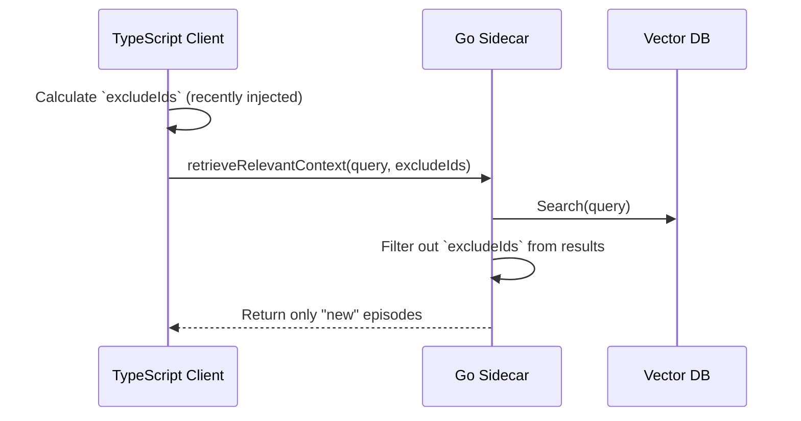

# Future Consideration Plan: Server-Side Exclusion Filtering (Option D)

**Date:** 2026-04-06
**Target Version:** Future (Post-v0.3.5.x)
**Status:** Deferred / Architectural Goal

## 1. Concept
Implement **Exclusion-based Recall** at the Go sidecar level. Instead of the TypeScript client filtering out already-injected episodes *after* receiving them, the client passes a list of `excludeIds` (recently injected episode IDs) to the Go sidecar, which then excludes them from the search results *before* returning.

## 2. Architecture

## 3. Pros
- **Efficiency:** Reduces payload size of RPC responses.
- **Relevance:** Allows the retrieval system to "dig deeper" and return the *next best* matches that haven't been seen recently, rather than just returning the same top-K results.
- **Cleanliness:** Keeps the "injection state" logic closer to the retrieval engine.

## 4. Cons (Why it was deferred for v0.3.5.1)
- **High Risk:** Requires changes to the RPC interface (`main.go`), the retrieval logic (`retriever.go`), and the client (`index.ts`).
- **Complexity:** Introduces a new dependency between client state and server logic.
- **Over-engineering:** For the current issue (token waste/LLM confusion), client-side skipping (Option A) is sufficient and safer.

## 5. Implementation Checklist
- [ ] Add `excludeIds []string` to `BatchIngestItem` / Recall RPC params in `go/main.go`.
- [ ] Update `RetrieveRelevantContext` in `go/internal/vector/retriever.go` to accept and apply exclusion filter.
- [ ] Update TypeScript client to track and send `excludeIds`.
- [ ] Handle edge cases where exclusion results in 0 matches (fallback behavior).
