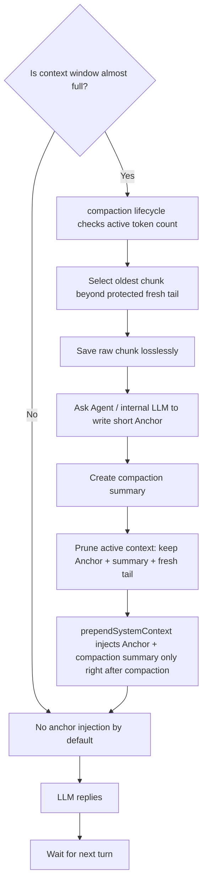

# v0.3.0 マスタープラン - Anchor compaction / lossless pruning

## コア目標
- compaction が走ったあとの active context window を軽く保つ。
- raw message を永久削除せず、lossless に退避することは **target / deferred** として扱う。
- compaction 時に Agent 自身が書いた `Anchor` を残すことは **target / deferred** として扱う。現行 v0.3.0 baseline は heuristic anchor / heuristic summary です。
- `Anchor + compaction summary` は常時注入ではなく、compaction 直後の短い移行期間だけ `prependSystemContext` で注入する。
- `contextThreshold` は v0.3.0 Phase 7 で config surface を追加し、compaction の圧力判定に使う。

## 別件として切り出すもの
- 手動保存の入口整理は `ep-save` 側の別プランに分ける。
- この文書では manual save の仕様変更や正本化は扱わない。

## 進捗一覧
| Phase | 状態 | ひとことで |
|---|---|---|
| Phase 1 | 収束済み | OpenClaw の hook 契約を fixed |
| Phase 2 | 収束済み | Anchor compaction モデルを baseline に合わせた |
| Phase 3 | 収束済み | compaction 直後の一時 Anchor 注入を整理済み |
| Phase 4 | 収束済み | host native `/compact` 経路へ一本化、`/write-anchor` は非採用 |
| Phase 5 | 収束済み | recall diagnostics / RPC surface を固定した |
| Phase 6 | 収束済み（6A） | lexical 少数ヒット時 backfill を最小差分で導入した |
| Deferred 6B | 保留 | v0.3.0 対象外。常時並列/RRF/freshness 拡張を別管理 |
| Phase 7 | 収束済み | lossless-claw 設計統合、要約エスカレーション/巨大ペイロード外部化/ペア修復/能動的トリガー監視を実装 |

## 今回の target architecture

## 現行実装との差分
- [src/index.ts](/D:/GitHub/OpenClaw%20Related%20Repos/episodic-claw/src/index.ts) は、`before_prompt_build` ベースで `prependSystemContext` を返し、すでに `AnchorInjectionState` / `anchorInjection` / `activateAnchorInjection()` を持っている。現状の一時注入は compaction 直後の heuristic anchor / summary を recall 結果と 1 本の `prependSystemContext` に束ねて返す実装で、v0.3.0 ではこの payload を最終的な Anchor compaction 設計へ寄せる。
- [src/compactor.ts](/D:/GitHub/OpenClaw%20Related%20Repos/episodic-claw/src/compactor.ts) は古い会話を退避したあと、heuristic な `Compaction Anchor` と `Compaction Summary`、それに `freshTailCount` 件の raw メッセージを残す。実装互換の legacy alias として `recentKeep` は残るが、このフェーズでは `freshTailCount` を正名として扱う。ここには Agent 自身が書く Anchor がまだない。
- [src/segmenter.ts](/D:/GitHub/OpenClaw%20Related%20Repos/episodic-claw/src/segmenter.ts) の `summarizeBuffer()` は現状 LLM 要約ではなく、raw text の連結に近い。
- [go/internal/vector/consolidation.go](/D:/GitHub/OpenClaw%20Related%20Repos/episodic-claw/go/internal/vector/consolidation.go) の D1 生成は後段の semantic consolidation であり、即時 compaction の Anchor とは別レイヤー。

## v0.3.0 で変えること
- compaction を「ただ古い履歴を引っ込める機能」から、「Anchor を残しながら窓を軽くする機能」へ変える。
- `lossless-claw` の afterTurn 的な「post-turn threshold evaluation」を参考にしつつ、実際の host 契約には Phase 1 で合わせる。
- `prependSystemContext` は recall 結果とは別に、compaction 直後だけ Anchor / compaction summary を一時注入できるようにする。
- raw history は active context からは外しても、episode 保存先からは消さない。

## 実装ルール
- `contextThreshold = 0.85`（Phase 7 で config surface / runtime wiring を追加済み）
- `freshTailCount = 96`
- `maxAnchorTokens = 1200`（target config。現行コードには未配線）
- `anchorPrompt` / `compactionPrompt` は compaction 前の指示プロンプトとして設定可能にする（現行コードで配線済み）
- `freshTailCount` を正名にして、`recentKeep` は当面 compatibility alias として受ける
- Anchor は現状では heuristic 生成だが、bridge 文面テンプレートとして `anchorPrompt` / `compactionPrompt` を差し替えられる。Agent 自身が prompt に従って自由作文する形は deferred のまま。
- compaction summary は Anchor とは別責務にする
- `Anchor` と `summary` は「compaction 直後だけ」 `prependSystemContext` に載せられる構造にする
- raw history は lossless に保存する

## 明記しておく境界
- `contextThreshold` は Phase 7 で config surface / runtime wiring を追加済みで、`episodic-claw` の現行 runtime で compaction の圧力判定に使う。
- したがって「threshold を超えたターンのあとに compaction が走る」は **v0.3.0 Phase 7 の current behavior** になった。
- `before_compaction` / `after_compaction` は host 側の void hook で、payload を運ぶ場所ではない。Anchor の一時注入 state は plugin 側の `compact()` 成功後に活性化する。
- Phase 3 の寿命は現在 `anchorInjectionAssembles` で管理され、**生の assemble 回数**ではなく、Anchor 注入判定に進んだ eligible assemble で消費される。

## 実装の骨組み
### Phase ごとの責務
- Phase 1 は hook 契約の固定だけを扱う。
- Phase 2 は Anchor compaction の中身だけを扱う。
- Phase 3 は compaction 直後の一時注入だけを扱う。
- Phase 4 は compaction 系の手動入口だけを扱う。
- Phase 5 は recall diagnostics と RPC surface の固定だけを扱う。
- Phase 6 は retrieval policy と index freshness 改善だけを扱う。

### Phase 1. Hook 契約を固定する
- 状態: 収束済み
- OpenClaw 側の public plugin hook と実ランナー契約を固定する。
- `after_turn` は public plugin hook としては採用しない。
- prompt injection は `before_prompt_build` 主体、`before_agent_start` は legacy fallback かつ合流対象として扱う。
- compaction hook は `contextEngine.info.ownsCompaction === true` の経路に限定して扱う。
関連プラン: [v0.3.0_phase1_hook_contract_plan.md](/D:/GitHub/OpenClaw%20Related%20Repos/episodic-claw/docs/v0.3.0_phase1_hook_contract_plan.md)

### Phase 2. Anchor compaction モデルを作る
- 状態: 収束済み
- protected fresh tail を超えた oldest chunk を切り出す。
- 現行 v0.3.0 baseline では、session を heuristic な `Anchor + summary + freshTail` に rewrite する。
- 切り出した raw chunk の dedicated lossless archival と、Agent / internal OpenClaw LLM-authored Anchor は **target / deferred** として扱う。
- 同時に compaction summary を生成する。
- active context には raw chunk を残さず、`Anchor + summary + freshTail` に置き換える。
関連プラン: [v0.3.0_phase2_anchor_compaction_model_plan.md](/D:/GitHub/OpenClaw%20Related%20Repos/episodic-claw/docs/v0.3.0_phase2_anchor_compaction_model_plan.md)

### Phase 3. `prependSystemContext` 注入を作る
- 状態: 収束済み
- `prependSystemContext` に、compaction 直後の Anchor と compaction summary だけを載せる。
- 既存 recall 注入と責務を混ぜすぎない。
- 「recall で拾った記憶」と「compaction による局所 Anchor」は別 source として扱う。
- Anchor 注入には寿命を持たせる。現行実装では `anchorInjectionAssembles` を使い、「次の N 回の eligible assemble まで」で消費する。
- ログには `status`, `source`, `anchorId`, `summaryId`, `estimatedTokens`, `anchorInjectionWindow` を残す。
- `after_compaction` は通知用 hook として扱い、Anchor payload の受け渡しや state 活性化そのものは plugin の `compact()` 経路で完結させる。
関連プラン: [v0.3.0_phase3_prepend_anchor_injection_plan.md](/D:/GitHub/OpenClaw%20Related%20Repos/episodic-claw/docs/v0.3.0_phase3_prepend_anchor_injection_plan.md)

### Phase 4. 手動経路を整理する
- 状態: 収束済み
- 手動保存や `ep-save` の入口整理は別プランへ切り出す。
- このフェーズでは compaction 系の手動入口を扱うが、v0.3.0 の採用対象は `/compact` のみ。
- `openclaw-source` の Research Addendum を正本とし、`/compact` は host native command を使う。plugin 側で同名 slash command を増やさない。
- plugin 側の主責務は `contextEngine.compact()` の中身に寄せ、`before_compaction` / `after_compaction` は通知用 hook として扱う。
- `Darwin` 実装で `compact()` 入口の観測ログとテストを追加済み。`/write-anchor` は重複経路を避けるため v0.3.0 では非採用。
関連プラン: [v0.3.0_phase4_manual_compaction_entry_plan.md](/D:/GitHub/OpenClaw%20Related%20Repos/episodic-claw/docs/v0.3.0_phase4_manual_compaction_entry_plan.md)

### Phase 5. 索引と検索を揃える
- 状態: 収束済み
- Go -> RPC -> TypeScript の recall diagnostics を固定する。
- `matchedBy` と `fallbackReason` をどの surface に載せるか決める。
- TypeScript 側で score/source metadata を捨てないようにする。
- compaction 直後の Anchor は recall とは別責務として維持する。
- code-reviewer 精査で `No new critical issues found`、`Phase 5 can be closed` を確認済み。
関連プラン: [v0.3.0_phase5_index_and_recall_alignment_plan.md](/D:/GitHub/OpenClaw%20Related%20Repos/episodic-claw/docs/v0.3.0_phase5_index_and_recall_alignment_plan.md)

### Phase 6. retrieval policy と freshness を改善する
- 状態: 収束済み（v0.3.0 は 6A まで）
- lexical-first の候補取得を段階的 hybrid に寄せる。
- strict topics fallback の可視化と運用方針を固める。
- lexical freshness 改善や新規メトリクスはこのフェーズで扱う。
- Phase 5 で増やした diagnostics を前提に、policy 変更を別差分で進める。
- v0.3.0 の実装スコープは 6A（`len(candidates) < N` のときだけ HNSW 候補を backfill）までで閉じる。
- 6B（常時並列 hybrid / RRF / freshness メトリクス追加 / top-level diagnostics 拡張）は保留トラックへ分離する。
- lexical が 0 件のときは現行コードでも HNSW semantic search に落ちる。したがって Phase 6 の主眼は `lexical 0 件対策` ではなく、`lexical 少数ヒット時の取り逃がし補完` に置く。
関連プラン: [v0.3.0_phase6_retrieval_policy_and_freshness_plan.md](/D:/GitHub/OpenClaw%20Related%20Repos/episodic-claw/docs/v0.3.0_phase6_retrieval_policy_and_freshness_plan.md)
保留プラン: [v0.3.X_phase6b_deferred_plan.md](/D:/GitHub/OpenClaw%20Related%20Repos/episodic-claw/docs/v0.3.X_phase6b_deferred_plan.md)

### Phase 7. lossless-claw 統合と圧力判定を仕上げる
- 状態: 収束済み
- `DefaultCompactionComparison.md` で抽出した改善案のうち、episodic-claw に適合するものを取り込む。
- `contextThreshold` を config surface として公開し、`assemble()` の token pressure 判定に使う。
- `lossless-claw` の要約強化・大きなペイロードの扱い・ペア修復は、episodic-claw の責務分割を壊さない範囲で取り込む。
- Phase 6b は引き続き保留トラックのまま扱う。
関連プラン: [v0.3.0_phase7_lossless_integration_plan.md](/D:/GitHub/OpenClaw%20Related%20Repos/episodic-claw/docs/v0.3.0_phase7_lossless_integration_plan.md)

## モジュール分割の案
- `AnchorCompactionCoordinator`
  - context threshold 判定
  - oldest chunk 選定
  - prune 実行
- `AnchorWriter`
  - anchor prompt の解決
  - Agent / internal LLM 呼び出し
  - Agent / internal LLM が prompt に従って自由作文する Anchor 生成
- `CompactionSummaryWriter`
  - Anchor とは別に短い要約を生成
- `AnchorInjectionState`
  - 最新 Anchor / summary の保持
  - compaction 直後だけ有効な注入寿命を管理する
  - `prependSystemContext` への一時注入材料を返す
- `ManualMemoryService`
  - `/compact`

## 既存コードへの着地点
- [src/index.ts](/D:/GitHub/OpenClaw%20Related%20Repos/episodic-claw/src/index.ts)
  - hook 登録
  - context engine の `assemble()`
  - `prependSystemContext` 注入
  - 手動コマンド / ツール入口
- [src/compactor.ts](/D:/GitHub/OpenClaw%20Related%20Repos/episodic-claw/src/compactor.ts)
  - oldest chunk 選定
  - fresh tail 保護
  - active context の prune
- [src/segmenter.ts](/D:/GitHub/OpenClaw%20Related%20Repos/episodic-claw/src/segmenter.ts)
  - raw chunk 形成
  - 既存の flush / batchIngest とどう共存させるか整理
- [src/retriever.ts](/D:/GitHub/OpenClaw%20Related%20Repos/episodic-claw/src/retriever.ts)
  - recall 注入と compaction 直後の一時 Anchor 注入の責務分離
- [go/main.go](/D:/GitHub/OpenClaw%20Related%20Repos/episodic-claw/go/main.go)
  - internal LLM 呼び出しを sidecar 側へ持たせるかどうかの判断点
- [go/internal/vector/consolidation.go](/D:/GitHub/OpenClaw%20Related%20Repos/episodic-claw/go/internal/vector/consolidation.go)
  - D1 consolidation は継続利用するが、Anchor compaction の代役にはしない

## 先に調べるべきこと
- `lossless-claw` の post-turn compaction evaluation を、OpenClaw の実在 hook 契約へどう写すか
- internal OpenClaw LLM を plugin からどう呼ぶのが最短か
- manual chat command を plugin からどの層で受けるのが自然か
- active context token count をどこで確実に取るか
- Anchor を session file に残すか、別メタに持つか
- compaction 直後の Anchor 注入寿命を「1ターン」か「複数ターン」か、どこで切るか

## 受け入れ条件
- compaction 後も raw history は episode 側に lossless で残る
- active context には `Anchor + compaction summary + fresh tail` が残る
- `prependSystemContext` で Anchor と summary が compaction 直後にだけ注入される
- compaction の有無と結果がログで分かる

## リスク
- `lossless-claw` の afterTurn 的な流れを、そのまま public hook 前提で持ち込むと host 契約とズレる
- Anchor 生成を毎回 LLM に投げると遅延とコストが増える
- recall 注入と Anchor 注入を混ぜると責務が崩れやすい
- fresh tail の保護が弱いと、会話の連続性が壊れる

## この文書の位置づけ
- この文書は v0.3.0 のラフな実装プランであり、まだ実装確定版ではない
- 次段階では、Hook 契約と OpenClaw 内部 LLM 呼び出しの実在確認を先にやる
- その調査結果を受けて、個別プランへ分割する

## Reffrence
- https://docs.openclaw.ai/automation/hooks
- https://docs.openclaw.ai/concepts/agent-loop

---

## 🔍 Audit Report — Cross-Doc Round 1
> Reviewed from the perspective of an IBM / Google Pro Engineer
> Date: 2026-04-03
> Mode: Cross-document / Code-reconciled audit
> Scope: `v0.3.0_master_plan.md`, `v0.3.0_phase1_hook_contract_plan.md`, `v0.3.0_phase2_anchor_compaction_model_plan.md`, `v0.3.0_phase3_prepend_anchor_injection_plan.md`
> Source of truth: `episodic-claw/src/index.ts`, `episodic-claw/src/compactor.ts`, `episodic-claw/src/config.ts`, `episodic-claw/src/types.ts`, `openclaw-source` runner/plugin sources

### ✅ Findings
- `AnchorInjectionState`, `AgentRuntimeState.anchorInjection`, `activateAnchorInjection()`, `assemble()` の recall + Anchor 合成、`compact()` 後の state 活性化はすでに実装済みです。master plan 本文はこの前提にそろいました。  
  根拠: `episodic-claw/src/index.ts:91-163`, `episodic-claw/src/index.ts:428-475`, `episodic-claw/src/index.ts:603-779`
- `contextThreshold` は依然として policy / research target で、runtime wiring は未実装です。受け入れ条件から外し、境界セクションで「別トラック」として明示しました。  
  根拠: `episodic-claw/src/config.ts`, `episodic-claw/src/types.ts`, `episodic-claw/src/index.ts` に `contextThreshold` runtime wiring なし
- Phase 3 の寿命表現は `anchorInjectionAssembles` の eligible-assemble semantics に合わせて本文をそろえました。  
  根拠: `episodic-claw/src/config.ts:15`, `episodic-claw/src/index.ts:658-716`

### ✅ Resolution
- Phase 1〜3 の要約文は、現行コードの責務分離と整合する形に更新済みです。
- `after_compaction` を payload 搬送元として読める表現は避け、plugin `compact()` 内で Anchor state を有効化する責務に寄せました。
- `contextThreshold` は current behavior ではなく target behavior だと明示され、Phase 1〜3 の ownership から切り離されました。

### ✅ Recommendation
- Cross-Doc Round 1 の stale 指摘は、今回の文言整理で収束扱いにして大丈夫です。
- 以後は `contextThreshold` を別トラックとして扱い、Phase 1〜3 の文書には混ぜ戻さないのが安全です。

---

## 🔍 Audit Report — Re-Audit
> Reviewed from the perspective of an IBM / Google Pro Engineer
> Date: 2026-04-03
> Mode: Post-reconciliation / Code-aligned re-audit
> Scope: `v0.3.0_master_plan.md`, `v0.3.0_phase1_hook_contract_plan.md`, `v0.3.0_phase2_anchor_compaction_model_plan.md`, `v0.3.0_phase3_prepend_anchor_injection_plan.md`
> Source of truth: `src/index.ts`, `src/config.ts`, `src/compactor.ts`, `src/types.ts`, `openclaw.plugin.json`

✅ No new critical issues found. Document has converged.

### ✅ Findings
- `contextThreshold` は current runtime behavior ではなく、policy / research target として整理されています。`src/config.ts` / `src/types.ts` / `src/index.ts` / `openclaw.plugin.json` に runtime wiring はなく、Phase 1〜3 の ownership から切り離されています。  
  根拠: `episodic-claw/src/config.ts`, `episodic-claw/src/types.ts`, `episodic-claw/src/index.ts`, `episodic-claw/openclaw.plugin.json`
- `after_compaction` は payload carrier ではなく通知専用です。Anchor state の活性化は plugin の `compact()` 成功後に `activateAnchorInjection()` で行われる実装にそろっています。  
  根拠: `episodic-claw/src/index.ts`, `openclaw-source/src/plugins/hooks.ts`, `openclaw-source/src/agents/pi-embedded-runner/compact.ts`
- `anchorInjectionAssembles` は「生の assemble 回数」ではなく、Anchor 注入判定に進んだ eligible assemble で消費される意味にコード・schema・文書が一致しています。`budget_truncated_to_zero` の早期 return は寿命を消費しません。  
  根拠: `episodic-claw/src/index.ts`, `episodic-claw/src/config.ts`, `episodic-claw/src/types.ts`, `episodic-claw/openclaw.plugin.json`
- `estimatedTokens` は `AnchorInjectionState` の保持項目ではなく、ログ時の導出値として扱われています。state 最小性と運用ログの両方で整合しています。  
  根拠: `episodic-claw/src/index.ts`, `episodic-claw/src/types.ts`, `episodic-claw/docs/v0.3.0_phase3_prepend_anchor_injection_plan.md`

### ✅ Resolution
- 前回の `contextThreshold ownership gap` は、runtime 未配線 / target behavior という境界が明示されたことで解消しました。
- `after_compaction` の責務は通知専用に固定され、Anchor payload の受け渡しや state 活性化は plugin `compact()` 経路に閉じています。
- `anchorInjectionAssembles` の寿命 semantics は、命名・コメント・schema・ログで eligible-assemble 前提に統一されました。
- `estimatedTokens` を state に持たない最小形も、実装と文書の両方で整合しています。
- `master plan` と Phase 1〜3 は、現行ソースコード照合で矛盾ゼロ（`BLOCKER/HIGH/MED/LOW` 新規なし）として収束済みです。

### ✅ Recommendation
- Phase 1〜3 と master plan の再監査結果としては、今回の4論点で新しい `BLOCKER` / `HIGH` / `MED` / `LOW` はありません。
- 次の作業は、このブロックを基準に次フェーズへ進めて大丈夫です。

---

## 🔍 Audit Report — Final Cross-Phase
> Reviewed from the perspective of an IBM / Google Pro Engineer
> Date: 2026-04-04
> Mode: Final cross-phase / audit-only
> Scope: `docs/v0.3.0_master_plan.md`, `docs/v0.3.0_phase1_hook_contract_plan.md`, `docs/v0.3.0_phase2_anchor_compaction_model_plan.md`, `docs/v0.3.0_phase3_prepend_anchor_injection_plan.md`, `docs/v0.3.0_phase4_manual_compaction_entry_plan.md`, `docs/v0.3.0_phase5_index_and_recall_alignment_plan.md`, `docs/v0.3.0_phase6_retrieval_policy_and_freshness_plan.md`, `docs/v0.3.0_phase6b_deferred_plan.md`
> Source of truth: `src/index.ts`, `src/config.ts`, `src/compactor.ts`, `src/retriever.ts`, `src/rpc-client.ts`, `src/types.ts`, `go/internal/vector/store.go`, `go/main.go`, `openclaw-source`

### Findings

#### [RESOLVED] Master / Phase 2 の target/current 境界
- `master plan` と `Phase 2` の本文は、現行 v0.3.0 baseline を heuristic anchor / heuristic summary と明記し、lossless raw archival・Agent / internal LLM-authored Anchor・`maxAnchorTokens` / `contextThreshold` runtime wiring は **target / deferred** に分離しました。`anchorPrompt` / `compactionPrompt` は bridge 文面テンプレートとして現行コードへ配線済みです。根拠: `src/compactor.ts`, `src/config.ts`, `src/types.ts`

#### [MED] Empty result / failure path では fallback diagnostics が見えず、観測の死角が残る
- `retriever.ts` は `recall_empty` / `recall_failed` / `max_tokens_zero` で空 diagnostics を返します。根拠: `src/retriever.ts:104`, `src/retriever.ts:137`, `src/retriever.ts:234`
- `fallbackReason` は `ScoredEpisode` ごとの field なので、0件時には TS 側へ届きません。根拠: `go/internal/vector/store.go:105`, `go/internal/vector/store.go:1345`, `src/rpc-client.ts:491`
- 最小対処として、Go 側は empty result 時に `fallbackReason` / `topicsFallback` / lexicalHits / candidateCount をログへ残し、TS 側は auto inject guard で抑止した場合に `reason=degraded_low_confidence` を記録するようにしました。根拠: `go/internal/vector/store.go`, `src/retriever.ts`
- ユーザー影響: RPC shape を壊さず、運用ログから failure reason を追える状態になりました。top-level diagnostics 拡張は引き続き 6B defer です。

#### [LOW] `matchedBy` は「候補取得 source」ではなく「最終スコアに何が関与したか」に近く、読み違えやすい
- lexical hit から入った candidate でも、embedding fallback 中でなければ `matchedBy="both"` になります。根拠: `go/internal/vector/store.go:1326`, `go/internal/vector/store.go:1366`
- このため `matchedBy` の分布は「lexical と semantic を常時並列で取った証拠」ではありません。根拠: `go/internal/vector/store.go:1175`, `go/internal/vector/store.go:1179`
- ユーザー影響: Phase 6 の retrieval policy 判断で、運用ログの読み方を誤ると設計判断を誤りやすいです。

#### [LOW] Phase 2 文書は research history と closure judgement が混在していて、再読時に状態を誤解しやすい
- 同じ文書内に `Pre-Implementation / Research only` と `Phase 2 can be closed` が併存しています。根拠: `docs/v0.3.0_phase2_anchor_compaction_model_plan.md:53`, `docs/v0.3.0_phase2_anchor_compaction_model_plan.md:117`, `docs/v0.3.0_phase2_anchor_compaction_model_plan.md:175`
- ユーザー影響: 監査ログとしては残してよいが、v0.3.0 実装事実と research target の境界が一読で分かりにくいです。

### 既存関連機能への影響
- `Phase 1` の hook 契約は `openclaw-source` の public hook / runner 実装と整合しています。`after_turn` を public hook として増やしておらず、`before_prompt_build` / legacy `before_agent_start` / `before_compaction` / `after_compaction` の境界も一致しています。根拠: `docs/v0.3.0_phase1_hook_contract_plan.md`, `src/index.ts:20`, `openclaw-source/src/plugins/types.ts:1999`, `openclaw-source/src/agents/pi-embedded-runner/compact.ts:1086`
- `Phase 3` の Anchor 注入は compaction 直後の短期 state に閉じていて、常時注入にはなっていません。既存 recall 注入を直接置き換える実装でもありません。根拠: `src/index.ts:492`, `src/index.ts:662`, `src/index.ts:812`
- `Phase 4` は host native `/compact` 正本のままで、plugin 側で同名 command を増やしていません。既存 OpenClaw compaction 経路への副作用は小さいです。根拠: `docs/v0.3.0_phase4_manual_compaction_entry_plan.md`, `src/index.ts:616`, `openclaw-source/src/agents/pi-embedded-runner/compact.ts:1101`
- `Phase 5` は ranking policy を変えず、RPC surface と logs を太らせた範囲に留まっています。根拠: `src/types.ts:113`, `src/rpc-client.ts:491`, `src/retriever.ts:62`
- `Phase 6A` は lexical-first を維持したまま、少数候補時だけ semantic backfill を加えています。常時並列 hybrid や RRF は未混入です。根拠: `go/internal/vector/store.go:1175`, `go/internal/vector/store.go:1179`, `docs/v0.3.0_phase6b_deferred_plan.md:16`

### 収束扱いにしてよい範囲
- Phase 1: hook contract
- Phase 3: compaction 直後の一時 Anchor 注入
- Phase 4: host native `/compact` ownership
- Phase 5: observability / RPC surface 固定
- Phase 6A: lexical 少数ヒット時 semantic backfill の最小差分

### 保留にすべき範囲
- empty result 時の top-level diagnostics 拡張
- `matchedBy` の意味づけを Phase 6 運用観測文脈で補足すること

### v0.3.0 に残すべき最小修正
- 6A / Nietzsche Round 2 に対する最小差分は、degraded HNSW fallback の auto inject guard、empty-result fallback logs、runtime tests、文書の current/target 分離で収束しました。

### 6B 参照
- 6B の詳細監査・保留候補は本線から分離し、`docs/v0.3.0_phase6b_deferred_plan.md` を参照する。

### Final Judgement
- `BLOCKER` はありません。
- `master` / `Phase 2` の current/target 境界は修正済みです。
- degraded fallback の auto inject guard、empty-result 観測ログ、runtime tests も入り、v0.3.0 のこの範囲は収束扱いで問題ありません。

### Round 2 — Deep Recheck
> Date: 2026-04-04
> Focus: 既存リリース機能への影響 / 観測死角 / 未対処 edge cases

#### [RESOLVED] degraded HNSW fallback は維持しつつ、auto inject だけ confidence guard で絞る
- `embed_fallback_lexical_only` でも lexical 0 件時に HNSW fallback する方針を維持し、その代わり auto inject 側で degraded semantic result を score threshold で絞る形に収束しました。根拠: `go/internal/vector/store.go:1175`, `go/internal/vector/store.go:1179`, `src/retriever.ts`
- 現行の guard は `fallbackReason` が `embed_fallback_lexical_only` を含み、`matchedBy="semantic"` かつ score が閾値未満のときだけ `prependSystemContext` 注入を抑止し、`reason=degraded_low_confidence` をログへ残します。根拠: `src/retriever.ts`, `src/index.ts`

#### [RESOLVED] Master / Phase 2 の「実装済み表現」誤読リスク
- `master` と `Phase 2` は、heuristic compaction baseline と deferred target を読み分けられるように修正しました。根拠: `src/compactor.ts:84`, `src/compactor.ts:117`, `src/compactor.ts:275`, `src/config.ts:8`, `src/types.ts:44`

#### [RESOLVED-IN-SCOPE] Empty-result diagnostics の死角
- 0件終了時の top-level RPC 拡張は見送りつつ、Go 側の empty-result fallback log と TS 側の degraded guard reason で、運用時に原因追跡できる最小対処を入れました。根拠: `go/internal/vector/store.go`, `src/retriever.ts`, `src/index.ts`

#### [RESOLVED] 6A failure path runtime test
- Go 側で `embed_fallback_lexical_only` + lexical 0 件でも HNSW fallback する runtime test を追加し、TS 側で degraded semantic fallback の auto inject guard を runtime smoke で固定しました。根拠: `go/internal/vector/phase6a_fallback_test.go`, `test_phase4_5.ts`

#### [LOW] `src/index.ts` の prepend / anchor / compaction 境界は再監査でも健全
- `activateAnchorInjection()` は plugin `compact()` 成功経路の内部でだけ state を立て、`after_compaction` は notification-only とコメントでも固定されています。根拠: `src/index.ts:492`, `src/index.ts:496`, `src/index.ts:829`, `src/index.ts:831`
- `budget_truncated_to_zero` は Anchor 評価前に return し、eligible lifetime を消費しません。根拠: `src/index.ts:677`, `src/index.ts:692`
- `prependSystemContext` ログと `anchorInjection` ログは別系統で残り、compaction hook の責務混線は見当たりません。根拠: `src/index.ts:116`, `src/index.ts:159`, `src/index.ts:787`
- この論点は **前回よりも確信が増した「問題なし」** です。

### 前回 Findings の再検証
- 前回 `HIGH`（文書の期待値管理問題）: **解消**。
- 前回 `MED`（empty-result diagnostics 死角）: **v0.3.0 最小対処として解消**。top-level diagnostics 拡張だけ 6B defer。
- 前回 `LOW`（`matchedBy` の意味が読み違えやすい）: **補足済み**。
- 前回 `LOW`（Phase 2 文書に research history と closure judgement が混在）: **文書整理で解消**。
- 新規追加だった degraded fallback / failure path test 不足: **解消**。

### v0.3.0 直前で絶対直すべき最小項目
1. degraded HNSW fallback の auto inject に confidence guard を入れる。
2. empty-result / degraded path の運用ログを残す。
3. `docs/v0.3.0_master_plan.md` と `docs/v0.3.0_phase2_anchor_compaction_model_plan.md` の current / target 境界を明確にする。

### Round 2 Judgement
- `Phase 1 / 3 / 4 / 5 / 6A` の骨格自体は崩れていません。
- degraded fallback の auto inject guard、empty-result logs、runtime tests、文書整合までそろったので、この範囲は収束扱いで問題ありません。
- ✅ No new critical issues found. Document has converged.
