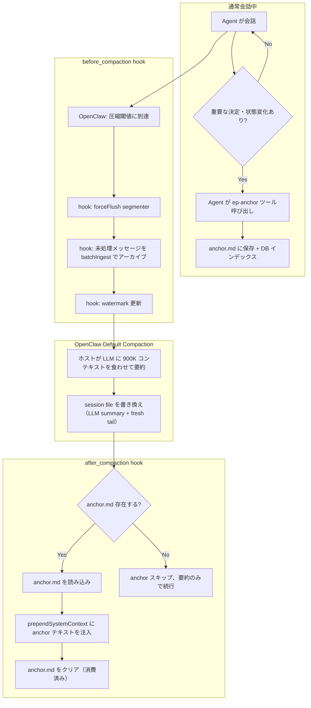

# v0.3.1 Architecture Overhaul: Compaction Delegation

## 設計方針（最終版）

**我々は Compaction を手配しない。全部 OpenClaw デフォルトに任せる。**

episodic-claw の仕事は3つだけ：
1. **圧縮の直前に記憶を保護する** — forceFlush + 未処理メッセージの全アーカイブ
2. **エージェントに anchor を書かせる** — ツール経由で能動的に
3. **圧縮の直後に anchor を注入する** — 存在すれば

---

## Before / After の比較

### Before (v0.3.0 現在)
```
episodic-claw が ownsCompaction: true で全権掌握
  → 自前で session file を読み書き
  → 自前で evicted/kept を切り分け
  → ヒューリスティックで anchor/summary をクリップ ← ゴミ
  → session file を上書き
  → proactive compaction を assemble() 内で発火
```

### After (v0.3.1)
```
episodic-claw は ownsCompaction しない
  → before_compaction hook で記憶保護 + anchor 指示
  → OpenClaw が LLM で 900K コンテキストを要約 ← ホスト任せ
  → after_compaction hook で anchor.md を注入
  → ep-anchor ツールでエージェントが anchor を書く
```

---

## 削除するもの

| 削除対象 | ファイル | 理由 |
|---|---|---|
| `Compactor.compact()` メソッド | `compactor.ts` | ホストに委譲。不要 |
| `buildAnchorText()` | `compactor.ts` | エージェントがツールで書く。不要 |
| `buildCompactionSummaryText()` | `compactor.ts` | ホスト LLM が要約する。不要 |
| `resolveCompactionSlices()` | `compactor.ts` | 切り分けはホストの仕事。不要 |
| `renderPromptTemplate()` | `compactor.ts` | bridge template 不要に |
| `DEFAULT_ANCHOR_BRIDGE_TEMPLATE` | `compactor.ts` | 不要 |
| `DEFAULT_COMPACTION_BRIDGE_TEMPLATE` | `compactor.ts` | 不要 |
| `DEFAULT_ANCHOR_PROMPT` | `compactor.ts` | hook 側に移動 |
| `DEFAULT_COMPACTION_PROMPT` | `compactor.ts` | 不要 |
| Context Engine `compact()` | `index.ts` L869-894 | `ownsCompaction: false` により呼ばれなくなる |
| Context Pressure Monitor | `index.ts` L689-720 | OpenClaw が自分で閾値検知する |
| `activateAnchorInjection()` の compaction 経路 | `index.ts` | hook 経由に変更 |
| `anchorPrompt` / `compactionPrompt` in config | `types.ts` | 使わない |

## 残すもの

| 残す対象 | ファイル | 理由 |
|---|---|---|
| `batchIngestWithEscalation()` | `compactor.ts` → 抽出 | before_compaction で未処理メッセージのアーカイブに使う |
| `chunkArray()` | 共通ユーティリティ | batchIngest の分割に使う |
| `buildDateSeq()` | watermark 用 | |
| Context Engine `ingest()` | `index.ts` | segmenter 連携 |
| Context Engine `assemble()` | `index.ts` | episodic recall + anchor 注入 |
| Anchor injection ロジック | `index.ts` | after_compaction から発火に変更 |
| `ep-recall` / `ep-save` / `ep-expand` ツール | `index.ts` | 既存ツール変更なし |

---

## 新しい全体フロー



---

## 変更ファイル一覧

| ファイル | 操作 | 内容 |
|---|---|---|
| `src/compactor.ts` | **大幅縮小** → `src/archiver.ts` にリネーム | compact() 以下全削除。batchIngest + watermark のみ残す |
| `src/anchor-store.ts` | **新規** | anchor.md の読み書き + DB インデックス + クリア |
| `src/index.ts` | **改修** | compact() 削除、hooks 追加、ep-anchor ツール追加、pressure monitor 削除 |
| `src/types.ts` | **改修** | anchorPrompt / compactionPrompt 削除、anchor 関連型追加 |
| `src/config.ts` | **改修** | 不要な config フィールド削除 |

---

## 詳細設計

### 1. `src/anchor-store.ts` (新規)

```ts
import * as fs from "fs/promises";
import * as path from "path";
import { EpisodicCoreClient } from "./rpc-client";

const ANCHOR_FILENAME = "anchor.md";

export class AnchorStore {
  constructor(private rpcClient: EpisodicCoreClient) {}

  private getAnchorPath(agentWs: string): string {
    return path.join(agentWs, "episodes", ANCHOR_FILENAME);
  }

  /** Agent がツールで anchor を書き込む */
  async write(params: {
    content: string;
    agentWs: string;
    agentId: string;
    topics?: string[];
  }): Promise<{ path: string; slug: string }> {
    const anchorPath = this.getAnchorPath(params.agentWs);
    await fs.mkdir(path.dirname(anchorPath), { recursive: true });
    await fs.writeFile(anchorPath, params.content, "utf-8");

    // DB にもインデックス
    const slugRes = await this.rpcClient.generateEpisodeSlug({
      summary: params.content,
      agentWs: params.agentWs,
      topics: params.topics ?? ["anchor", "compaction-bridge"],
      tags: ["anchor"],
      edges: [],
      savedBy: params.agentId,
    });

    return { path: anchorPath, slug: slugRes.slug };
  }

  /** compaction 後に anchor を読む（存在しなければ null） */
  async read(agentWs: string): Promise<string | null> {
    try {
      const content = await fs.readFile(
        this.getAnchorPath(agentWs), "utf-8"
      );
      return content.trim() || null;
    } catch {
      return null;
    }
  }

  /** 消費済み anchor をクリア */
  async consume(agentWs: string): Promise<void> {
    try {
      await fs.unlink(this.getAnchorPath(agentWs));
    } catch {
      // ファイルが存在しなければ無視
    }
  }
}
```

### 2. `src/archiver.ts` (compactor.ts から縮小)

Compactor クラスを **EpisodicArchiver** にリネームして、以下だけ残す：

```ts
export class EpisodicArchiver {
  constructor(
    private rpcClient: EpisodicCoreClient,
    private segmenter: EventSegmenter,
  ) {}

  /** segmenter バッファをフラッシュ */
  async forceFlush(agentWs: string, agentId: string): Promise<void> {
    await this.segmenter.forceFlush(agentWs, agentId);
  }

  /** 未処理メッセージを全てエピソード化 */
  async archiveUnprocessed(params: {
    allMsgs: Message[];
    agentWs: string;
    agentId: string;
  }): Promise<string[]> {
    const wm = await this.rpcClient.getWatermark(params.agentWs);
    const absIdx = Math.max(0, Math.min(wm.absIndex, params.allMsgs.length - 1));
    const unprocessed = params.allMsgs.slice(absIdx + 1);

    if (unprocessed.length === 0) return [];

    const slugs: string[] = [];

    if (unprocessed.length > 50) {
      // 大量: background indexer にダンプ（既存ロジック）
      // ... (legacy_backlog dump + triggerBackgroundIndex)
    } else {
      // 通常: batchIngestWithEscalation（既存ロジック）
      // ...
    }

    // watermark 更新
    await this.rpcClient.setWatermark(params.agentWs, {
      dateSeq: this.buildDateSeq(unprocessed.length),
      absIndex: params.allMsgs.length - 1,
    });

    return slugs;
  }
}
```

### 3. `src/index.ts` の改修

#### 3a. Context Engine から compact() を削除

```diff
 api.registerContextEngine("episodic-claw", () => {
   return {
     info: {
       id: "episodic-claw",
       name: "Episodic Memory Engine",
-      ownsCompaction: true,
+      // Compaction は OpenClaw のデフォルト LLM 要約に委譲。
+      // episodic-claw は before/after hook で記憶保護のみ行う。
     },
     async ingest(ctx) { ... },    // ← 変更なし
     async assemble(ctx) { ... },  // ← pressure monitor 削除のみ
-    async compact(ctx) { ... },   // ← 全削除
   };
 });
```

#### 3b. assemble() から Context Pressure Monitor を削除

```diff
 async assemble(ctx: any) {
   // ...
-  // --- Task 7D: Context Pressure Monitor ---
-  if (totalBudget > 0) {
-    const contextThreshold = ...;
-    if (currentTokens > pressureThreshold && !state.compactor.isCompacting) {
-      state.compactor.compact({ ... }).then(result => {
-        if (result.ok && result.compacted && result.result) {
-          activateAnchorInjection(state, result.result);
-        }
-      });
-    }
-  }
   // episodic recall ロジックはそのまま
   // ...
 }
```

#### 3c. before_compaction hook 追加

```ts
api.on("before_compaction", async (_event?: any, ctx?: any) => {
  const { agentId, agentWs } = resolveAgentWorkspaces(ctx, openClawGlobalConfig);
  if (!agentWs) return;

  const state = getAgentState(agentId);
  console.log("[Episodic Memory] before_compaction: protecting memories...");

  try {
    // 1. segmenter バッファーをフラッシュ
    await state.archiver.forceFlush(agentWs, agentId);

    // 2. 未処理メッセージを全てエピソード化
    // ctx から messages を取得（hook event にメッセージが含まれる場合）
    const sessionFile = ctx?.sessionFile || _event?.sessionFile;
    if (sessionFile) {
      const raw = await fs.readFile(sessionFile, "utf-8");
      const session = JSON.parse(raw);
      const allMsgs = session.messages || [];
      await state.archiver.archiveUnprocessed({
        allMsgs,
        agentWs,
        agentId,
      });
    }

    console.log("[Episodic Memory] before_compaction: memories protected.");
  } catch (err) {
    console.error("[Episodic Memory] before_compaction failed:", err);
  }
});
```

#### 3d. after_compaction hook 追加

```ts
api.on("after_compaction", async (_event?: any, ctx?: any) => {
  const { agentId, agentWs } = resolveAgentWorkspaces(ctx, openClawGlobalConfig);
  if (!agentWs) return;

  const state = getAgentState(agentId);
  console.log("[Episodic Memory] after_compaction: checking for anchor...");

  try {
    // anchor.md を読む
    const anchorText = await state.anchorStore.read(agentWs);
    if (anchorText) {
      // anchor injection を activate（既存の prependSystemContext 経路を使う）
      activateAnchorInjection(state, {
        summary: "",  // ホストが LLM で作った要約はセッションに既に入ってる
        anchor: anchorText,
      });
      // 消費済みクリア
      await state.anchorStore.consume(agentWs);
      console.log("[Episodic Memory] after_compaction: anchor injected.");
    } else {
      console.log("[Episodic Memory] after_compaction: no anchor found, skipping.");
    }

    clearRecallCache(state);
  } catch (err) {
    console.error("[Episodic Memory] after_compaction failed:", err);
  }
});
```

#### 3e. ep-anchor ツール追加

```ts
const EpAnchorSchema = Type.Object({
  content: Type.String({
    description:
      "Your session anchor — key facts, decisions, active tasks, " +
      "user preferences, and anything critical to survive compaction. " +
      "Overwrites any previous anchor. Max 4000 characters.",
    maxLength: 4000,
  }),
  topics: Type.Optional(Type.Array(Type.String(), {
    description: "Semantic topics for this anchor",
  })),
});

api.registerTool((ctx: any) => ({
  name: "ep-anchor",
  description:
    "Write or update your session anchor. This gets saved as an episode " +
    "and automatically injected when context compaction fires. " +
    "Call this when you've made important decisions or the conversation " +
    "state needs to survive a memory wipe.",
  parameters: EpAnchorSchema,
  execute: async (_toolCallId: string, params: any) => {
    const resolution = resolveAgentWorkspaces(ctx, openClawGlobalConfig);
    const { agentId, agentWs } = resolution;
    if (!agentWs) {
      return {
        content: [{ type: "text", text: "Memory not ready yet." }],
      };
    }
    await prepareWorkspaces(resolution);
    const state = getAgentState(agentId);
    state.lastAgentWs = agentWs;

    try {
      const raw = (params?.content as string) || "";
      if (!raw.trim()) {
        return {
          content: [{ type: "text", text: "Empty anchor — nothing to save." }],
        };
      }
      const runes = Array.from(raw);
      const content = runes.length > 4000
        ? runes.slice(0, 4000).join("") + "\n...(truncated)"
        : raw;
      const topics = Array.isArray(params?.topics)
        ? params.topics.filter((t: any): t is string => typeof t === "string")
        : [];

      invalidateRecallCacheForWorkspace(agentWs);
      const result = await state.anchorStore.write({
        content,
        agentWs,
        agentId,
        topics: topics.length > 0
          ? topics
          : ["anchor", "session-state"],
      });

      return {
        content: [{
          type: "text",
          text: `Anchor saved at ${result.path} — it'll be injected ` +
                `automatically if compaction fires.`,
        }],
        details: result,
      };
    } catch (e: any) {
      return {
        content: [{
          type: "text",
          text: `Failed to save anchor: ${e.message}`,
        }],
      };
    }
  },
}));
```

---

## Agent State の変更

```diff
 interface AgentState {
-  compactor: Compactor;
+  archiver: EpisodicArchiver;
+  anchorStore: AnchorStore;
   segmenter: EventSegmenter;
   // ...
 }
```

---

## リスク評価

| リスク | 重大度 | 対策 |
|---|---|---|
| `before_compaction` hook の ctx にメッセージが含まれない可能性 | MED | sessionFile から直接読む。hook event の shape を実テストで確認 |
| `after_compaction` で prependSystemContext に間に合わない | MED | activateAnchorInjection の既存経路を使えば次の assemble() で拾える |
| anchor.md が書かれる前に compaction が走る | LOW | anchor なしでも動く設計（スキップ）。既存の recall は変わらず動く |
| 既存の compaction パイプラインを削除することで回帰バグ | MED | 既存テストを更新。before/after hook のテストを追加 |

---

## 作業順序

1. `src/anchor-store.ts` 新規作成
2. `src/compactor.ts` → `src/archiver.ts` にリネーム・縮小
3. `src/index.ts` 改修:
   a. context engine から compact() 削除、ownsCompaction 削除
   b. assemble() から pressure monitor 削除
   c. agent state を Compactor → EpisodicArchiver + AnchorStore に変更
   d. before_compaction / after_compaction hook 追加
   e. ep-anchor ツール追加
4. `src/types.ts` / `src/config.ts` から不要フィールド削除
5. テスト更新
6. ドキュメント更新
7. v0.3.1 リリース
