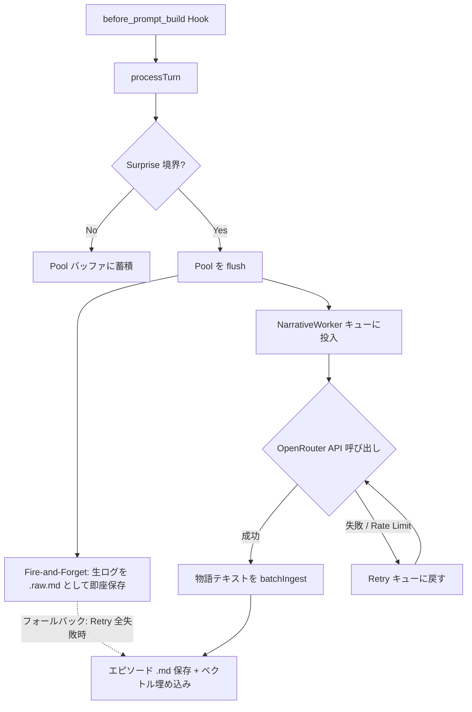

# v0.4.0 Roadmap: Narrative Architecture (物語化アーキテクチャ)

**Date:** 2026-04-09
**Current Version:** v0.3.8
**Target Version:** v0.4.0
**Status:** Phase 1-3 完了 / Phase 4 進行中

---

## 1. 背景と動機

### 現状の問題

v0.3.x は「生ログ保存 + 後から要約」というアーキテクチャだが、以下の根本的な問題を抱えている:

1. **ノイズ汚染**: Gemini の thinking タグ (`&#94;>thought`)、ツール JSON、system プロンプトの断片が生ログに混入。v0.3.8 で 3 層のフィルタを追加したが、真の根本原因は Layer 3 でようやく対処（Post-Mortem 参照）。**フィルタを積み重ねるアプローチには限界がある。**
2. **細切れチャンク**: Dynamic Surprise 閾値で切断するため、話の途中でエピソードが分割される。文脈が断片化し、recall の精度が下がる。
3. **D0/D1 二段構造の複雑さ**: D0（生ログ）→ D1（要約）のパイプラインが未完成。D1 の consolidation が動作しない問題が v0.3.7.1 で報告済み。
4. **意味の希薄化**: 生ログは冗長。ベクトル検索で「何を話したか」を探すのに、ツール呼び出しの JSON やフォールバックの重複メッセージがノイズになる。

### 解決策: 物語化 (Narrativization)

**生の会話ログをそのまま保存するのではなく、LLM に物語として書き直させる。**

- ノイズ（thinking タグ、ツール JSON、system プロンプト）は LLM が自然に無視する
- 意味が凝縮された物語テキストからベクトル検索すれば、ヒット精度が上がる
- OpenRouter の無料モデル（Qwen 等、200k コンテキスト）を使えば API コストゼロ
- Embedding は引き続き Google API（高品質）

### 設計方針

```
v0.3.x (現在)                  v0.4.0 (目標)
─────────────                  ─────────────
messsage → Surprise判定         message → Surprise判定（改善版）
  → 即座にチャンク分割             → Pool バッファに蓄積
  → 生ログをGo sidecarへ送信       → 話の区切りで Pool を flush
  → batchIngest(生テキスト)        → OpenRouter 無料モデルに送信
  → D0 エピソード保存               → 物語化されたテキストを受信
  → (D1 consolidation 未実装)      → batchIngest(物語テキスト)
                                   → 単一 Depth エピソード保存
```

---

## 2. アーキテクチャ設計

### 2.1 全体フロー



### 2.2 新規コンポーネント

| コンポーネント | ファイル | 役割 |
|---|---|---|
| `NarrativeWorker` | `src/narrative-worker.ts` (新規) | プールされた会話を OpenRouter に送って物語化する非同期ワーカー |
| `OpenRouterClient` | `src/openrouter-client.ts` (新規) | OpenRouter API クライアント（無料モデル対応） |
| `NarrativePool` | `src/narrative-pool.ts` (新規) | メッセージのプーリングと flush 管理 |

### 2.3 既存コンポーネントの変更

| ファイル | 変更内容 |
|---|---|
| `src/segmenter.ts` | `chunkAndIngest` を `poolAndQueue` に置き換え。Surprise 判定ロジックは維持・改善 |
| `src/summary-escalation.ts` | 物語化失敗時のフォールバック用に残す。通常フローからは使われなくなる |
| `src/config.ts` | OpenRouter 設定、物語化プロンプト、プールサイズ設定を追加 |
| `src/types.ts` | `NarrativeEpisode` 型、`PoolFlushItem` 型を追加 |
| `src/index.ts` | `NarrativeWorker` のライフサイクル管理を追加 |

### 2.4 削除・廃止するコンポーネント

| 対象 | 理由 |
|---|---|
| D0/D1 二段構造 | 物語化で一段に統合。`Depth` フィールドは残すが、D1 consolidation パイプラインは廃止 |
| `summary-escalation.ts` の `buildNormalSummary` / `buildAggressiveSummary` | 物語化が代替。フォールバック用に `buildFallbackSummary` のみ残す |

---

## 3. 詳細設計

### 3.1 NarrativePool (`src/narrative-pool.ts`)

```typescript
interface PoolFlushItem {
  messages: Message[];       // プールされた生メッセージ
  rawText: string;           // 抽出済みテキスト
  surprise: number;          // flush 時の Surprise スコア
  reason: string;            // "surprise-boundary" | "size-limit" | "force-flush"
  agentWs: string;
  agentId: string;
  // 文脈接続は NarrativeWorker.lastFullEpisode (内部ステート) で管理
}
```

**プール → flush の条件:**
1. Surprise 境界を超えた時（既存ロジック改善版）
2. バッファサイズが `maxPoolChars` を超えた時（設定可能、デフォルト 15000）
3. `forceFlush()` が呼ばれた時（compaction 前、session_end 等）

**文脈接続の仕組み:**
- `narrativePreviousEpisodeRef: true` (デフォルト) の場合、前回のエピソード全体 (~800文字) を LLM に渡す
- NarrativeWorker 内部で `lastFullEpisode` フィールドとして保持
- 最初の flush には `lastFullEpisode` は空（新しい章の始まり）

### 3.2 NarrativeWorker (`src/narrative-worker.ts`)

```typescript
class NarrativeWorker {
  private queue: PoolFlushItem[] = [];
  private isProcessing = false;
  private lastFullEpisode = "";  // 前回のエピソード全体 (文脈接続用)

  async enqueue(item: PoolFlushItem): Promise<void>;
  private async processNext(): Promise<void>;
  private async narrativize(item: PoolFlushItem): Promise<string>;
  private async saveRawFallback(item: PoolFlushItem): Promise<void>;
  async drain(): Promise<void>;  // graceful shutdown 用
}
```

**Retry 戦略:**
- 最大 5 回リトライ、指数バックオフ（1s, 2s, 4s, 8s, 16s）
- Rate Limit (429) → リトライキューに戻す
- 5 回全失敗 → `saveRawFallback()` で生ログを既存の `buildFallbackSummary` で保存（データロスト防止）

**並行制御:**
- 同時に 1 リクエストのみ（無料モデルの rate limit 対策）
- キューは FIFO、リトライアイテムは通常キューの後に挿入

### 3.3 OpenRouterClient (`src/openrouter-client.ts`)

```typescript
interface OpenRouterConfig {
  apiKey?: string;           // 無料モデルでも API キーは必要
  model: string;             // デフォルト: "openrouter/free"
  maxTokens?: number;        // 省略推奨 (OpenRouter 任せ)。指定時のみキャップ
  temperature: number;       // デフォルト: 0.4
  baseUrl: string;           // デフォルト: "https://openrouter.ai/api/v1"
}

class OpenRouterClient {
  async chatCompletion(params: {
    systemPrompt: string;
    userMessage: string;
  }): Promise<string>;
}
```

**モデル選定基準:**
- OpenRouter の `openrouter/free` ルーティング（利用可能な最適無料モデルに自動ルーティング）
- 個別指定も可能: `qwen/qwen3-235b-a22b:free`, `deepseek/deepseek-chat-v3-0324:free`, `google/gemma-3-27b-it:free` など

### 3.4 物語化プロンプト（カスタマイズ可能）

```typescript
// config の新フィールド
interface EpisodicPluginConfig {
  // ... 既存フィールド ...

  /** OpenRouter API Key. ENV OPENROUTER_API_KEY にフォールバック */
  openrouterApiKey?: string;
  /** OpenRouter model ID */
  openrouterModel?: string;  // default: "openrouter/free"
  /** 物語化のシステムプロンプト（インラインテキスト or .md/.txt ファイルパス） */
  narrativeSystemPrompt?: string;
  /** 物語化のユーザープロンプトテンプレート（インラインテキスト or .md/.txt ファイルパス） */
  narrativeUserPromptTemplate?: string;
  /** Pool バッファの最大文字数 */
  maxPoolChars?: number;     // default: 15000
  /** 前回のエピソード全体を LLM に渡して文脈接続する */
  narrativePreviousEpisodeRef?: boolean; // default: true
}
```

**デフォルトのシステムプロンプト:**
```
あなたは会話の記録係です。以下の会話ログを読んで、何が話し合われ、何が決定され、
何が作業されたかを短い物語として書いてください。

ルール:
- 技術的な詳細（ファイル名、コマンド、エラーメッセージ）は正確に保存する
- ツール呼び出しの JSON は無視し、「何のツールで何をしたか」だけ記述する
- 思考タグ、システム指示、メタデータは完全に無視する
- 会話の感情的なトーンや文脈も適度に含める
- 800文字以内に収める
```

**デフォルトのユーザープロンプトテンプレート:**
```
${previousEpisode ? `前回のエピソード:\n${previousEpisode}\n---\n` : ""}
以下の会話を物語化してください:

${conversationText}
```

### 3.5 Surprise 閾値の改善

現状の問題点:
- `segmentationLambda` (デフォルト 2.0) は静的な倍率で、会話の性質によって感度が変わりすぎる
- ウォームアップ期間（20 ターン）が長すぎて、短い会話では固定閾値にフォールバックする

改善案:
1. **適応型 Lambda**: 短い会話では lambda を下げる（1.5）、長い会話では上げる（2.5）
2. **時間ギャップ検出**: ユーザーメッセージ間の時間差が 15 分以上なら自動的に境界とする
3. **ウォームアップ短縮**: 10 ターンに短縮、初期 mean/std を事前計算値で seed する

```typescript
// config 追加
segmentationTimeGapMinutes?: number;  // default: 15
```

---

## 4. 実装フェーズ

### Phase 1: 基盤 (v0.4.0-alpha.1) — **完了済み**
**目標:** OpenRouter クライアントと NarrativeWorker の骨格

- [x] `src/openrouter-client.ts` 新規作成
  - OpenRouter Chat Completion API クライアント
  - Rate Limit ハンドリング（429 → リトライ）
  - タイムアウト設定（30秒）
- [x] `src/narrative-worker.ts` 新規作成
  - キュー管理（enqueue, processNext）
  - リトライロジック（指数バックオフ、最大5回）
  - 生ログフォールバック保存
- [x] `src/config.ts` に新フィールド追加
  - `openrouterApiKey` (ENV `OPENROUTER_API_KEY` フォールバック), `openrouterModel`
  - `narrativeSystemPrompt`, `narrativeUserPromptTemplate` (inline text or .md/.txt file path)
  - `maxPoolChars`, `narrativePreviousEpisodeRef`
- [x] `src/types.ts` に `PoolFlushItem`, `NarrativeResult` 型追加
- [x] **Recall クエリの根本修正: user-only include list に切り替え**
  - `src/retriever.ts` L222-225: `.filter(m => m.role === "user")` に変更
  - v0.3.8 の 3層フィルタ (Layer 1/2/3) は全て no-op だったことが判明済み（Post-Mortem 参照）
  - ブラックリスト方式（assistant の汚染を除去する）→ ホワイトリスト方式（user のみを採用する）に転換
  - `RECALL_EXCLUDED_ROLES` 定数を削除
  - recall クエリでの `stripReasoningTagsFromText` 呼び出しは不要になる（user メッセージに thinking タグは入らない）
- [x] v0.3.8 Layer 1/2 の撤去
  - `src/retriever.ts`: `RECALL_EXCLUDED_ROLES` 定数の削除（user-only フィルタで不要）
  - `src/large-payload.ts`: `extractPlainText()` の thinking/reasoning 除外は segmenter 安全網として残す
  - `src/reasoning-tags.ts`: segmenter/summary-escalation 用の安全網として残す（recall では不使用に）

> Post-Implementation Review: F1 (Retry-After), F3 (resolvePrompt), F5 (lastFullEpisode) の 3 件の修正を実施済み。詳細は [Phase 1 プラン](plans/v0.4.x/v0.4.0_phase1_recall_cleanup_openrouter_foundation.md) 参照。

**推定工数:** 3-4 時間

### Phase 2: プール統合 (v0.4.0-alpha.2) — **完了済み**
**目標:** 既存の Segmenter をプールモードに切り替え

- [x] `src/narrative-pool.ts` 新規作成
  - メッセージプーリング
  - 文脈接続は NarrativeWorker 内部 `lastFullEpisode` で管理
- [x] `src/segmenter.ts` 改修
  - `chunkAndIngest` → `poolAndQueue` への切り替え
  - Fire-and-Forget の生ログ保存（`.raw.md`）
  - `NarrativeWorker.enqueue()` 呼び出し
- [x] `src/index.ts` 改修
  - `NarrativeWorker` のライフサイクル管理（start/stop）
  - `gateway_stop` / `session_end` で graceful flush
- [x] 物語化プロンプトのデフォルト値調整・テスト

> Post-Implementation Review: P2-F1 (pool.clear 無条件実行) と P2-F2 (forceFlush buffer 未転送) の 2 件のデータロストバグを修正済み。
> P2-F3 (Pool 蓄積未使用) は Phase 4 で検証、P2-F4 (.raw.md watcher) は Phase 3 Step 5d で対処。
> 詳細は [Phase 2 プラン](plans/v0.4.x/v0.4.0_phase2_pool_integration_segmenter.md) 参照。

**推定工数:** 4-5 時間

### Phase 3: Surprise 改善 + 統合テスト (v0.4.0-beta) — **完了済み**
**目標:** Surprise の精度改善 + エンドツーエンド動作確認

- [x] `src/segmenter.ts` -- 時間ギャップ検出の追加
- [x] `src/segmenter.ts` -- 簡易適応型 Lambda (`segCount < 10 ? 1.5 : lambda`)
- [x] `src/segmenter.ts` -- ウォームアップ短縮（20 → 10）
- [x] `src/config.ts` — `segmentationTimeGapMinutes` 追加 (デフォルト 15 分)
- [x] Go sidecar: Invisible Footer パーサー + `.raw.md` watcher 除外フィルタ (P2-F4 対処)
- [x] 物語化プロンプトのチューニング（実際の会話ログで検証）
- [x] D0/D1 consolidation パイプラインの廃止（Legacy パスは維持）
- [x] CHANGELOG.md 更新

> Post-Implementation Review: P3-F1 (timeGapMinutes 未渡し) と P3-F3 (isTimeGapBoundary の比較対象誤り) の 2 件を修正済み。
> 詳細は [Phase 3 プラン](plans/v0.4.x/v0.4.0_phase3_surprise_footer_legacy_cleanup.md) 参照。

**推定工数:** 3-4 時間

### Phase 4: 安定化 (v0.4.0) -- **進行中**
**目標:** 本番デプロイ可能な状態

- [ ] **Step 0:** デフォルトモデルを `openrouter/free` に統一 (worker / client のハードコード値)
- [ ] **Step 0b:** `openclaw.plugin.json` 経由 `openrouterConfig` ネスト構造でユーザーカスタマイズ可能化 (`model`, `maxTokens`, `temperature`)
  - `maxTokens` はデフォルト省略 (OpenRouter 任せ)。ユーザーが必要時のみ設定
- [ ] 24 時間の本番運用テスト
- [ ] エピソードの品質レビュー（物語が文脈接続されているか）
- [ ] Pool 蓄積効果の検証 (P2-F3 フォローアップ)
- [ ] Recall 精度の比較（v0.3.x 生ログ vs v0.4.0 物語）
- [ ] ドキュメント更新（README、設定ガイド）
- [ ] ClawHub パブリッシュ準備

> 詳細は [Phase 4 プラン](plans/v0.4.x/v0.4.0_phase4_stabilization_release.md) 参照。

**推定工数:** 2-3 時間

---

## 5. 設定スキーマ変更（openclaw.plugin.json）

```json
{
  "openrouterApiKey": {
    "type": "string",
    "description": "OpenRouter API key. Falls back to OPENROUTER_API_KEY env var if empty.",
    "secret": true
  },
  "openrouterConfig": {
    "type": "object",
    "description": "Configuration for the OpenRouter narrative generation model.",
    "additionalProperties": false,
    "properties": {
      "model": {
        "type": "string",
        "default": "openrouter/free",
        "description": "OpenRouter model ID. Default: 'openrouter/free' (auto-routes to best available free model)."
      },
      "maxTokens": {
        "type": "integer",
        "minimum": 256,
        "maximum": 32768,
        "description": "Optional. Max tokens cap for the narrative summary. Omit to let OpenRouter decide (recommended)."
      },
      "temperature": {
        "type": "number",
        "minimum": 0,
        "maximum": 1,
        "default": 0.4,
        "description": "Sampling temperature. Default: 0.4 (factual). Increase toward 1.0 for creative summaries."
      }
    }
  },
  "narrativeSystemPrompt": {
    "type": "string",
    "description": "Custom system prompt for narrative generation. Inline text or path to .md/.txt file. Leave empty for default."
  },
  "narrativeUserPromptTemplate": {
    "type": "string",
    "description": "Custom user prompt template. Inline text or path to .md/.txt file. Variables: {previousEpisode}, {conversationText}"
  },
  "maxPoolChars": {
    "type": "integer",
    "minimum": 1000,
    "default": 15000,
    "description": "Maximum characters to pool before forcing a flush"
  },
  "narrativePreviousEpisodeRef": {
    "type": "boolean",
    "default": true,
    "description": "Pass the full previous episode to the LLM for context continuity. Disable for independent episodes."
  },
  "segmentationTimeGapMinutes": {
    "type": "number",
    "minimum": 1,
    "default": 15,
    "description": "Force segment boundary when user message gap exceeds this (minutes)"
  }
}
```

### 設定の解決順序

**`openrouterApiKey`:**
```
1. openclaw.plugin.json の openrouterApiKey (明示設定)
2. process.env.OPENROUTER_API_KEY (ENV フォールバック)
3. 空文字 → 物語化無効、Legacy モードにフォールバック
```

**`narrativeSystemPrompt` / `narrativeUserPromptTemplate`:**
```typescript
// 値が .md / .txt で終わるならファイルパスとして読み込み、それ以外ならインラインテキスト
function resolvePrompt(value: string | undefined): string {
  if (!value) return "";
  if (value.endsWith(".md") || value.endsWith(".txt")) {
    try { return fs.readFileSync(path.resolve(value), "utf8").trim(); }
    catch { console.warn(`[Episodic Memory] Failed to read prompt file: ${value}`); return ""; }
  }
  return value;
}
```

**`narrativePreviousEpisodeRef` (旧 `narrativeTailChars` を置き換え):**
前回のエピソード .md をそのまま LLM のコンテキストとして渡す。300 文字の tail 切り出しではなく、前回の物語全体（〜800 文字）を渡すことで文脈接続の品質を保証する。無料モデルの 200k コンテキスト窓に対して 800 文字は 0.4% なので問題にならない。

---

## 6. リスクと対策

| リスク | 影響度 | 対策 |
|---|---|---|
| OpenRouter 無料モデルがダウン | 高 | Fire-and-Forget 生ログ保存 + Retry 5回 + フォールバックで `buildFallbackSummary` 使用 |
| 無料モデルの出力品質が低い | 中 | model フィールドを設定可能にし、有料モデルへの切り替えも可能。プロンプトもカスタマイズ可能 |
| Rate Limit が厳しすぎる | 中 | 同時リクエスト 1 に制限 + 指数バックオフ。キューが溜まっても生ログは既に保存済みなのでデータロストなし |
| 物語化で技術的詳細が失われる | 中 | デフォルトプロンプトで「ファイル名、コマンド、エラーメッセージは正確に保存」と指示。カスタムプロンプトで調整可能 |
| 前回の物語との文脈断裂 | 低 | `narrativePreviousEpisodeRef: true` で前回エピソード全体 (~800 chars) を LLM に渡す。session_end で lastFullEpisode をリセット |

---

## 7. マイグレーション戦略

### 既存エピソードとの互換性
- v0.3.x で生成された D0 エピソードはそのまま利用可能（ベクトル DB に既に登録済み）
- v0.4.0 の物語化エピソードと v0.3.x の生ログエピソードは同じベクトル空間で共存する
- `Tag` フィールドに `narrative` タグを追加して区別可能にする

### ロールバック
- `openrouterApiKey` が未設定の場合、v0.3.x の生ログモード（`buildFallbackSummary`）にフォールバック
- 完全なロールバックは `openrouterApiKey` を削除するだけ

---

## 8. Frontmatter 改革: Invisible Footer Metadata 形式

### 現状の問題

現在のエピソード `.md` ファイルの構造:
```yaml
id: eju-training-recall
title: eju-training-recall
created: 2026-04-09T04:39:42.656289123+07:00
tags:
    - auto-segmented
    - size-limit
saved_by: main
surprise: 0
tokens: 3016
---
assistant: **Fulfilling the User's Request** ...
```

物語化アーキテクチャでは `.md` ファイルを開いた瞬間に物語が読めるべき。先頭の YAML が邪魔。

### しかし: Markdown-First 耐性を壊してはならない

episodic-claw のアーキテクチャの最大の強みは **Markdown がソース・オブ・トゥルース** であること。DB (PebbleDB) が壊れても、`.md` ファイルから全再構築できる:

```
DB 破損 → .md ファイルをスキャン
         → frontmatter からメタデータ復元 (tags, topics, surprise, tokens...)
         → 本文を Google API で再エンベッド → ベクトル復元
         → HNSW 自動再構築
```

メタデータを DB にしか持たない設計にすると、DB 破損 = メタデータ全ロストになる。これは受け入れられない。

### 設計: Invisible Footer Metadata

**解決策: メタデータを `.md` ファイルの末尾に HTML コメントとして埋め込む。**

先頭は純粋な物語テキスト。メタデータは末尾の HTML コメントに格納。Markdown レンダラーでは非表示。テキストエディタでもスクロールしないと見えない。

```markdown
ヨシアはEJU訓練のことを思い出そうとした。
Episodic-Claw のノイズ問題を調査し、Gemini の thinking タグが
type: "text" ブロック内に変則形式で埋め込まれていることを突き止めた。
OpenClaw の stripReasoningTagsFromText をコピーする方針で合意。

<!-- episodic-meta
{"id":"abc123","title":"EJU訓練の記憶を探す","tags":["narrative","auto-segmented"],"topics":["episodic-claw","debugging"],"surprise":0.42,"tokens":812,"created":"2026-04-09T04:39:42+07:00","saved_by":"main"}
-->
```

### Before / After 比較

```
v0.3.x (YAML 先頭)                    v0.4.0 (Invisible Footer)
─────────────────                      ──────────────────────────
episode-abc123.md                      episode-abc123.md
┌─ YAML frontmatter (10-15行) ─┐      ┌───────────────────────────┐
│ id: ...                       │      │ ヨシアはEJU訓練のことを     │
│ title: ...                    │      │ 思い出そうとした...         │
│ tags: [...]                   │      │ (純粋な物語テキスト)        │
│ surprise: 0.12                │      │ ...                        │
│ ---                           │      ├─ (末尾、スクロール先) ─────┤
├─ 生ログ本文 ─────────────────┤      │ <!-- episodic-meta         │
│ assistant: xxxxxxx            │      │ {"id":"abc123",...}         │
│ user: yyyyyy                  │      │ -->                        │
└───────────────────────────────┘      └───────────────────────────┘
```

### 耐障害性の維持

| シナリオ | v0.3.x (YAML) | v0.4.0 (Invisible Footer) |
|---|---|---|
| DB 破損 → 全再構築 | frontmatter から復元 | footer コメントから復元 |
| .md ファイル手動追加 | frontmatter を parse | footer があれば parse、なければファイル名から ID 生成 + re-embed |
| .md ファイル手動編集 | frontmatter を壊すリスク | 物語テキストだけ編集、footer は末尾で目に入りにくい |
| テキストエディタで閲覧 | 先頭が YAML メタデータ | 先頭が物語テキスト |
| Obsidian で閲覧 | YAML が properties パネルに表示 | HTML コメントは非表示 |
| replay state 等の揮発メタデータ | frontmatter には不含（DB のみ） | footer にも不含（DB のみ）— 同じ |

### フォーマット仕様

**マーカー**: `<!-- episodic-meta` で開始、`-->` で終了
**ペイロード**: 1行の JSON（改行なし、minified）
**位置**: ファイル末尾（本文の後に空行1つ + コメント）
**エンコーディング**: UTF-8

```
{本文テキスト}\n\n<!-- episodic-meta\n{JSON}\n-->
```

**JSON に含めるフィールド（DB 復元に必要な最小セット）:**

```typescript
interface FooterMetadata {
  id: string;           // エピソード ID
  title?: string;       // タイトル（省略時は ID と同じ）
  tags: string[];       // タグ
  topics?: string[];    // トピック
  surprise?: number;    // Surprise スコア
  tokens?: number;      // トークン数
  created: string;      // ISO 8601 タイムスタンプ
  saved_by?: string;    // 保存元エージェント ID
  depth?: number;       // Depth（物語化では常に 0）
}
```

**含めないフィールド（揮発的、DB 破損時にリセットして問題ないもの）:**
- `retrievals`, `hits`, `alpha`, `beta` (replay state)
- `recall_shown_count`, `expand_count` (usage stats)
- `importance_score`, `noise_score` (computed scores)
- `vector` (再エンベッドで復元)

### 影響範囲

| コンポーネント | 変更 |
|---|---|
| **Go: `frontmatter/` パッケージ** | 書き出し: YAML 先頭 → invisible footer 形式に変更。読み取り: YAML 先頭 / invisible footer / メタデータなしの 3パターンに対応（後方互換） |
| **Go: `store.go` rebuild** | DB 再構築時に `.md` をスキャンする際、footer コメントからメタデータを復元。footer がなければファイル名から ID 生成 + デフォルトメタデータ |
| **Go: `store.go` Upsert** | エピソード保存時に footer 付きで `.md` を書き出す |
| **Go: watcher 経由のファイル追加** | 手動で `.md` を置いた場合、footer があれば parse。なければ re-embed のみ |
| **TS: `batchIngest` パラメータ** | 変更なし |

### 後方互換性
- **読み取り**: 3パターンに対応
  1. YAML frontmatter あり → parse して使う（v0.3.x エピソード）
  2. Invisible footer あり → parse して使う（v0.4.0+ エピソード）
  3. どちらもなし → ファイル名から ID 生成、本文全体を物語として扱う
- **書き出し**: v0.4.0 以降は invisible footer 形式のみ
- マイグレーションスクリプト不要（既存ファイルはそのまま読める）

---

## 9. ストレージ移行: PebbleDB + go-hnsw + Bleve → Comet DB

### 現状のストレージ構成 (v0.3.x)

```
Go Sidecar — 3つの独立したストレージが協調動作
├── PebbleDB (vector.db)
│   ├── ep:     → EpisodeRecord (msgpack) — メタデータ + ベクトル
│   ├── s2i:    → slug → HNSW internal ID
│   ├── i2s:    → HNSW internal ID → slug
│   ├── p2i:    → file path → UUID
│   ├── meta:   → maxid, watermark
│   └── sys_lexq: → Lexical queue
├── go-hnsw (インメモリ)
│   └── HNSW グラフ (M=32, efConstruction=200, dim=3072)
│   └── 起動時に PebbleDB から全ベクトルをロードして再構築 ← ボトルネック
└── Bleve (lexical.bleve/)
    └── BM25 全文検索インデックス ← 別途メンテナンス、HealingWorker 必要
```

**問題:**
- 3つのストレージを同期させるコードが `store.go` (1862行) の大部分を占める
- HNSW は起動のたびに PebbleDB から全ベクトルを読んで再構築（エピソード増加で起動が遅くなる）
- PebbleDB のプロセスロックで複数インスタンス不可
- Bleve インデックスが壊れたときの HealingWorker が複雑

### Comet DB とは

**[github.com/wizenheimer/comet](https://github.com/wizenheimer/comet)** — Pure Go のベクトルストア。

```
go get github.com/wizenheimer/comet
```

ワンライナーで Go バイナリに埋め込み可能。外部サーバー不要。CGO 不要。

### 機能マッピング

| 現状 (3層) | Comet DB (1層) | 備考 |
|---|---|---|
| PebbleDB `ep:` (メタデータ) | Comet **Metadata Index** (Roaring Bitmap + BSI) | tags, topics, timestamp をフィルタ可能。数値レンジクエリ対応 |
| PebbleDB `ep:` (ベクトル) + go-hnsw | Comet **HNSW Index** (内蔵、永続化対応) | Serialize/Deserialize で永続化。起動時に再構築不要 |
| Bleve (BM25 全文検索) | Comet **BM25 Index** (内蔵、Roaring Bitmap 転置インデックス) | Unicode tokenization + BM25 スコアリング。Bleve 互換の結果品質 |
| PebbleDB `s2i:` / `i2s:` | Comet Node ID で自動管理 | 手動マッピング不要 |
| 手動 Hybrid Search (store.go 内) | Comet **HybridSearchIndex** (内蔵 RRF) | Vector + BM25 + Metadata → Reciprocal Rank Fusion を 1 メソッドで |

### Comet の核心的な利点

```
現在の episodic-claw Go sidecar:        Comet 移行後:
──────────────────────────              ────────────
import (                                import (
    "github.com/Bithack/go-hnsw"            "github.com/wizenheimer/comet"
    "github.com/blevesearch/bleve/v2"   )
    "github.com/cockroachdb/pebble"
    "github.com/vmihailenco/msgpack/v5"
)
                                        // ← 4つの依存が 1つに

store.go: 1862行                        store.go: ~400行 (推定)
├── PebbleDB CRUD                       ├── Comet HNSW Add/Remove
├── HNSW graph 管理                     ├── Comet BM25 Add/Remove
├── s2i/i2s マッピング                  ├── Comet Metadata Add/Remove
├── Bleve 全文検索                      ├── HybridSearch (1メソッド)
├── hybrid search 手動融合              └── Serialize/Deserialize
├── loadIndexFromPebble (起動時再構築)
└── HealingWorker (Bleve 修復)
```

**1. 外部依存ゼロ** — Qdrant と違い、別途サーバーを起動する必要がない。Go バイナリに含まれる
**2. 起動速度** — Serialize/Deserialize で HNSW を永続化。起動のたびに再構築しない
**3. コードベース縮小** — store.go が推定 1/4 以下に。3層同期コードが全部消える
**4. Hybrid Search 内蔵** — RRF (Reciprocal Rank Fusion) が Comet のネイティブ機能。現在 store.go で手動実装しているロジックが不要に
**5. Metadata Filtering** — Roaring Bitmap + BSI で tags, topics, timestamp フィルタが高速に動く
**6. Product Quantization** — 3072 次元ベクトルに PQ を適用すれば、メモリ/ディスクを 100x 以上削減可能

### トレードオフ分析

**リスク:**

| リスク | 影響度 | 対策 |
|---|---|---|
| Comet はまだ若い (112 stars, 48 commits) | 中 | Pure Go & MIT なので、フォークして自前で修正可能。コードベースが小さく読み切れる |
| PebbleDB の KV としての汎用性が失われる | 低 | watermark 等のメタ情報は別途 JSON ファイルで管理（3行で済む） |
| BM25 の互換性 | 低 | Comet の BM25 は標準的な実装。Bleve との結果の差は recall チューニングで吸収可能 |
| 永続化の信頼性 | 中 | Serialize/Deserialize は Comet のテスト済み機能。加えて Markdown-First 耐性（invisible footer）があるので、最悪ケースでも .md から全再構築可能 |

### 実装ロードマップ

```
Phase A (v0.4.0): 物語化 + Invisible Footer
  └── ストレージは PebbleDB + go-hnsw + Bleve のまま
  └── store.go に StoreBackend インターフェースを導出（準備）
  └── 安定動作を最優先

Phase B (v0.5.0): Comet 統合
  └── StoreBackend インターフェースを正式導入
  └── CometStore を実装（HNSW + BM25 + Metadata）
  └── PebbleStore は互換性のため残す
  └── 設定で切り替え: storageBackend: "pebble" | "comet"
  └── マイグレーションツール: PebbleDB → Comet エクスポート

Phase C (v0.6.0): Comet デフォルト化
  └── PebbleDB バックエンドを deprecated
  └── go-hnsw, bleve, pebble の依存を削除
  └── Go バイナリサイズ縮小
```

### StoreBackend インターフェース（v0.4.0 で導出、v0.5.0 で正式化）

```go
type StoreBackend interface {
    Upsert(ctx context.Context, record EpisodeRecord, body string) error
    Get(ctx context.Context, id string) (*EpisodeRecord, string, error)
    Delete(ctx context.Context, id string) error
    Search(ctx context.Context, vector []float32, k int, filter *SearchFilter) ([]ScoredEpisode, error)
    SearchLexical(ctx context.Context, query string, k int) ([]ScoredEpisode, error)
    SearchHybrid(ctx context.Context, vector []float32, query string, k int, filter *SearchFilter) ([]ScoredEpisode, error)
    GetWatermark(ctx context.Context) (Watermark, error)
    SetWatermark(ctx context.Context, wm Watermark) error
    Serialize(w io.Writer) error
    Deserialize(r io.Reader) error
    Close() error
}
```

### CometStore 概念実装

```go
type CometStore struct {
    vectorIdx  *comet.HNSWIndex        // ベクトル検索
    bm25Idx    *comet.BM25Index         // 全文検索
    metaIdx    *comet.MetadataIndex     // メタデータフィルタ
    hybridIdx  *comet.HybridSearchIndex // 統合ハイブリッド検索
    records    map[string]EpisodeRecord // ID → メタデータ (インメモリ)
    dataDir    string                   // Serialize 先
    mu         sync.RWMutex
}

func (s *CometStore) Search(ctx context.Context, vec []float32, k int, filter *SearchFilter) ([]ScoredEpisode, error) {
    // Comet の HybridSearchIndex が RRF で自動融合
    results, err := s.hybridIdx.NewSearch().
        WithVector(vec).
        WithK(k).
        WithMetadataFilter(buildCometFilter(filter)).
        Execute()
    // ...
}
```

### なぜ Qdrant ではなく Comet か

| 観点 | Qdrant | Comet |
|---|---|---|
| **デプロイ** | 外部サーバー（Docker / バイナリ）が必要 | `go get` で Go バイナリに埋め込み |
| **外部依存** | Qdrant サーバープロセス管理が必要 | ゼロ (Pure Go) |
| **HNSW** | 内蔵、高性能 | 内蔵 (Serialize 対応) |
| **BM25** | full-text index (payload ベース) | 内蔵 BM25 (Roaring Bitmap 転置インデックス) |
| **Metadata Filter** | 内蔵 (高機能) | Roaring Bitmap + BSI |
| **Hybrid Search + RRF** | 内蔵 | 内蔵 |
| **Go 統合** | gRPC/REST クライアント | ネイティブ Go API |
| **episodic-claw の設計思想** | 外部依存を増やす | 外部依存を減らす (現状維持) |

episodic-claw は OpenClaw プラグインとして単一バイナリで動くことが前提。外部サーバーへの依存は避けるべき。Comet ならその原則を崩さずに 3層 → 1層の統合ができる。

---

## 10. 成功指標

1. **ノイズ混入率**: recall クエリに thinking/system 内容が混入する頻度が 0% になること
2. **Recall 精度**: 同一クエリに対する recall 結果の関連性が v0.3.x 比で主観的に改善すること
3. **API コスト**: 物語化の API コストがゼロ（無料モデル使用）であること
4. **データ安全性**: Retry 全失敗時でも生ログフォールバックでデータロストがゼロであること
5. **文脈接続**: 連続する物語エピソード間で話の流れが途切れないこと
6. **可読性**: エピソード `.md` ファイルを開いた瞬間に、YAML なしで物語が読めること

