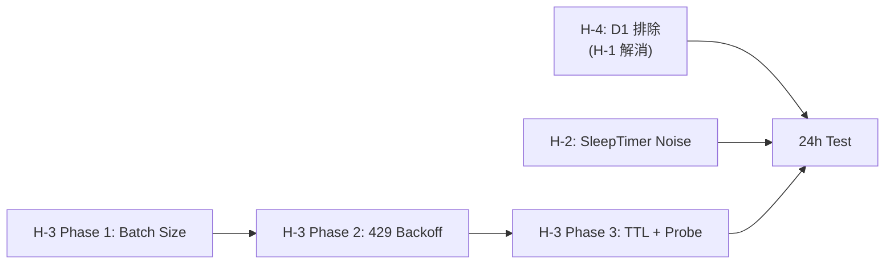

# v0.4.1 Post-Release Hardening

**Parent:** [v0.4.0 Narrative Architecture Roadmap](../v0.4.0_narrative_architecture_roadmap.md)
**Date:** 2026-04-09
**Base Version:** v0.4.0
**Target Version:** v0.4.1-hotfix
**Status:** 完了（D1 consolidation排除 / SleepTimerログ抑制 / Embedding backoff / GetLatestNarrative実装 / multi-agent polling / backoffUntil / ingestColdStartSession cache化 / archiveUnprocessed large gap cache化 / YAML剥がし両パス）

> 本プランは v0.4.0 本番ログ (`2026-04-09.log`) の精査で発見された 3 件の問題 + アーキテクチャ上の不要レイヤー排除 (H-4) に対処する。
> v0.4.0 の物語化アーキテクチャ自体は正常動作しており、ここで扱うのは **Go sidecar 側のバックグラウンド処理の堅牢化と、Legacy D1 consolidation の完全排除** が中心。
> **注:** 本プランの全項目は v0.4.1-hotfix としてリリース済み。v0.4.2 は Cache DB アーキテクチャの新規実装として別ドキュメント参照。

---

## アーキテクチャ補足: 各サブシステムの責務マップ

v0.4.1 の変更対象を正確に理解するため、Go sidecar の主要サブシステムの責務と、物語化モードでの要否を整理する。

### Invisible Footer (`<!-- episodic-meta -->`)

**生成者:** Go sidecar (`go/frontmatter/frontmatter.go` L182-186)
**LLM の関与:** なし。100% システム生成。

```go
// frontmatter.go L182-186 -- Go sidecar がファイル書き出し時にメタデータを自動付与
buf.WriteString(doc.Body)                    // ← 本文 (LLM が生成した物語 or 生ログ)
buf.WriteString("\n\n<!-- episodic-meta\n")   // ← システムが追加
buf.Write(metaJSON)                           // ← id, title, created, tags, surprise, tokens 等
buf.WriteString("\n-->\n")
```

LLM (OpenRouter) が生成するのは `doc.Body` (物語テキスト) のみ。メタデータ (`id`, `title`, `created`, `tags`, `topics`, `surprise`, `tokens`, `depth`, `sources` 等) は全て Go sidecar が計算・付与する。

**v0.4.1 での変更:** なし。物語化モードでも引き続き使用される。

---

### HealingWorker

**生成者:** Go sidecar (`go/main.go` L1515-1810)
**用途:** 非同期の品質修復ワーカー。

| Pass | やること | 物語化モードで必要? | 理由 |
|---|---|---|---|
| **Pass 1** | 未 embed の `.md` に Gemini embedding を生成 | **必須** | 物語化エピソードも embed が必要。ベクトル検索の基盤 |
| **Pass 2** | `episode-[md5].md` を kebab-case slug にリネーム (Gemma 使用) | **必須** | 物語化でも `batchIngest` 時は MD5 slug で初期保存 → 後から rename |
| **Pass 3** | Stage 2 Batch Score 更新 | **必須** | Recall スコアリングに使用 |
| **Pass 4** | Tombstone GC (14 日超の削除済みレコード掃除) | **必須** | DB 肥大化防止 |

**v0.4.1 での変更:** HealingWorker 自体は排除しない。Pass 1 の embed バースト制御を改善する (H-3)。

---

### D1 Consolidation

**生成者:** Go sidecar (`go/internal/vector/consolidation.go` via `vector.RunConsolidation`)
**用途:** 複数の D0 エピソードを Gemini でクラスタリング → 統合要約 (D1) を生成。
**呼び出し元:**
1. `SleepTimer` (`main.go` L2290-2311): アイドル検知 → 自動実行
2. `ai.consolidate` RPC (`main.go` L2316-2355, L2689): 手動トリガー

**v0.4.1 での変更:** **完全排除** (H-4)。詳細は後述。

---

## 発見された問題 (Production Log Analysis: 2026-04-09)

| ID | 重要度 | 問題 | データロス? | 発見箇所 |
|---|---|---|---|---|
| H-1 | ~~CRITICAL~~ → **排除対象** | D1 consolidation の slug が長すぎてファイル作成失敗 | あり (2 件) | L557, L576 |
| H-2 | LOW | SleepTimer が `meta:last_activity` を読めずに WARN ログを 2 分ごとに出力 | なし | L1-68 (終日) |
| H-3 | MEDIUM | Embedding 429 (Gemini quota exceeded) が大量発生、新規ファイルの embed 失敗 | embed 欠損のみ | L324-331, L684-695 |
| H-4 | **HIGH** | D1 consolidation が物語化モードで不要。冗長実行 + H-1 のバグの根本原因 | -- | 設計判断 |

---

## H-4: D1 Consolidation の完全排除 (HIGH -- H-1 の根本解決)

### 背景: なぜ D1 は不要になったか

v0.3.x のアーキテクチャでは:
```
D0 (生ログ) → D1 (Gemini で統合要約) → ベクトル検索
```

v0.4.0 の物語化アーキテクチャでは:
```
Pool → OpenRouter で物語化 → 単一 Depth エピソード → ベクトル検索
```

物語化によって **D0/D1 の二段構造がフラットな一段に統合された**。D1 consolidation は:
- **物語化エピソードを再度 Gemini で要約する。意味がない**（二重要約）
- **Gemma の slug 生成で Poison Pill バグ (H-1) を引き起こす**
- **SleepTimer のアイドル時間を消費する**（無駄な API コスト）

### 判断: H-1 を slug truncation で修正するのではなく、D1 自体を排除する

H-1 の slug バグを修正しても D1 consolidation が走る限り:
- 物語化済みエピソードを再要約する二重コストが残る
- Gemini API quota を消費する
- 新たな edge case バグが出る可能性がある

**D1 を排除すれば H-1 は自動的に解消される。** バグ修正ではなく根本原因の除去。

### 排除対象 (3 箇所)

| # | ファイル | 行 | 内容 | 対処 |
|---|---|---|---|---|
| 1 | `go/main.go` | L2290-2311 | `checkSleepThreshold` 内の `vector.RunConsolidation` 呼び出し | **削除** |
| 2 | `go/main.go` | L2316-2355 | `handleConsolidate` 関数 (RPC ハンドラ) | **noop レスポンスに変更** |
| 3 | `go/main.go` | L2689 | `ai.consolidate` RPC ディスパッチ | ハンドラが noop なので残置可 |

### 修正詳細

**1. SleepTimer から consolidation 呼び出しを削除 (main.go L2290-2311)**

```go
// === 削除対象 ===
// if lastConsolidation < lastActivity {
//     ...
//     err := vector.RunConsolidation(consolidationCtx, ws, apiKey, vs, gemmaLimiter, embedLimiter)
//     ...
// }

// === 残す ===
// SleepTimer のアイドル検知ログは残す (デバッグ用)
EmitLog("[SleepTimer] Idle %dh%02dm for %s (consolidation disabled in v0.4.1+)",
    idleH, idleM, agentWs)
```

**2. handleConsolidate を noop に変更 (main.go L2316-2355)**

```go
func handleConsolidate(conn net.Conn, req RPCRequest) {
    EmitLog("[Consolidation] D1 consolidation is disabled in v0.4.1+. " +
        "Narrative mode replaces D1 pipeline. No action taken.")
    sendResponse(conn, RPCResponse{
        JSONRPC: "2.0",
        Result:  "Consolidation disabled (v0.4.1+): narrative mode replaces D1 pipeline",
        ID:      req.ID,
    })
}
```

**3. `isConsolidating` atomic 変数 (main.go L39)**

使われなくなるが、ビルドエラーを避けるため残置 or 削除。依存箇所が `handleConsolidate` と `checkSleepThreshold` のみなので **削除可能**。

### SleepTimer の残存機能

D1 consolidation を排除しても SleepTimer 自体は残す。将来的な用途:
- アイドル検知によるリソース解放 (PebbleDB compaction 等)
- HealingWorker の起動タイミングとして使える可能性

ただし **consolidation 呼び出しだけを削除** し、SleepTimer のポーリング自体は維持する。

### consolidation.go の扱い

`go/internal/vector/consolidation.go` は **削除しない**。理由:
- コンパイル単位として他のファイルから import されている可能性がある
- 将来 v0.5.0 以降で別の統合処理に再利用する可能性がゼロではない
- **呼び出し元を全て削除/noop にすれば dead code として無害**

### 検証方法

- SleepTimer がアイドル検知後に consolidation を呼び出さないことを確認
- `ai.consolidate` RPC を送信 → noop レスポンスが返ることを確認
- 24h テスト中に D1 ファイルが新規作成されないことを確認

### リスク

| 変更 | リスク | 対策 |
|---|---|---|
| D1 排除後に Recall 精度が下がる可能性 | LOW: 物語化エピソードの方が品質が高いため影響なし | v0.4.0 vs v0.4.1 の Recall 比較テストで確認 |
| 既存 D1 ファイルの扱い | なし: 既存 D1 はベクトル DB に残り、検索ヒットし続ける | 削除不要 |
| `ai.consolidate` を呼ぶ外部ツール | なし: OpenClaw 内部のみ使用 | noop レスポンスで互換性維持 |

---

## H-1: D1 Slug Truncation --> H-4 に統合 (排除)

H-1 の根本原因は D1 consolidation の slug 生成バグだが、**H-4 で D1 自体を排除するため、slug truncation の個別修正は不要**。

D1 consolidation が呼ばれなくなれば slug 生成も実行されず、ファイル名長制限のエラーは発生しない。

---

## H-2: SleepTimer Log Noise (LOW)

### 現象

```
[SleepTimer] WARN: GetRawMeta failed for .../episodes: pebble: not found
```

Go sidecar 起動直後、`meta:last_activity` が PebbleDB に存在しないため、SleepTimer (2 分ポーリング) が **毎 2 分 WARN ログ** を出力。データ損失はないが、ログが大量のノイズで埋まって有用な情報が見つけにくくなる。

### 根本原因

`checkSleepThreshold` (main.go L2248) が `GetRawMeta` 失敗時に `EmitLog` (info レベル) で毎回書いている。初回セッション前 (まだ誰も会話していない) には `last_activity` キーが存在しないのは正常。

### 修正方針

```go
// 既存 (L2254)
EmitLog("[SleepTimer] WARN: GetRawMeta failed for %s: %v", agentWs, err)

// 修正: pebble:not found の場合は正常状態として早期リターン
if strings.Contains(err.Error(), "not found") {
    // 初回セッション前、または会話が一度も発生していない workspace
    // → 正常状態。ログ出力せず静かに返る。
    return
}
EmitLog("[SleepTimer] WARN: GetRawMeta failed for %s: %v", agentWs, err)
```

### 影響範囲

- `go/main.go` の `checkSleepThreshold` 関数 1 箇所のみ

### リスク

なし。正常な「未活動」状態の冗長ログを抑制するだけ。真のエラー (`pebble: not found` 以外) は引き続きログに出力される。

---

## H-3: Embedding Rate Limit Hardening (MEDIUM)

### 現象

```
Embed failed for .../episode-xxx.md: API error (status 429):
Quota exceeded for aiplatform.googleapis.com/embed_content_input_tokens_per_minute_per_base_model
```

Go sidecar 再起動時に HealingWorker が全未 embed ファイルを一括処理。Gemini API の TPM (tokens per minute) 制限に引っかかり、**新規ファイルの embed が失敗**。ベクトル検索で hit しなくなる（Lexical フォールバックのみ）。

### 根本原因

HealingWorker Pass 1 が `healEmbedLimiter` (10 RPM) で制御しているが、sidecar 再起動時に大量の未 embed ファイルが一斉に処理キューに入る。既存の `heal_429` カウンタは閾値 (デフォルト 5) 到達で **Pass 1 全体をスキップ** するため、そこから先は TTL (デフォルト 2h) が切れるまで回復しない。

### 修正方針

**Phase 1: バースト制御の改善**

```go
// HealingWorker Pass 1 でバッチサイズを制限
const HEAL_BATCH_SIZE = 10
const HEAL_BATCH_INTERVAL = 60 * time.Second  // 1 分に 10 件ペース

for i := 0; i < len(pendingEmbeds); i += HEAL_BATCH_SIZE {
    batch := pendingEmbeds[i:min(i+HEAL_BATCH_SIZE, len(pendingEmbeds))]
    // process batch...
    if i+HEAL_BATCH_SIZE < len(pendingEmbeds) {
        time.Sleep(HEAL_BATCH_INTERVAL)
    }
}
```

**Phase 2: 429 バックオフの改善**

```go
// RetryEmbedder: 429 の場合は Retry-After ヘッダーを尊重 + 長めの wait
if resp.StatusCode == 429 {
    retryAfter := parseRetryAfter(resp.Header.Get("Retry-After"))
    if retryAfter == 0 {
        retryAfter = 60  // デフォルト 60 秒
    }
    // 上限キャップ: 5 分以上は待たない
    if retryAfter > 300 {
        retryAfter = 300
    }
    time.Sleep(time.Duration(retryAfter) * time.Second)
}
```

**Phase 3: heal_429 TTL の短縮 + 段階的復帰**

429 で失敗が閾値に達した後の TTL を 2h → **30 分** に短縮。TTL 切れ後は全件ではなく **5 件のみ** 再試行 (probe) し、成功なら通常モードに復帰、再度 429 なら TTL を延長:

```go
const HEAL_429_TTL         = 30 * time.Minute  // 2h → 30min
const HEAL_429_PROBE_COUNT = 5                   // TTL 後の試行件数
```

### 影響範囲

- `go/main.go` の HealingWorker Pass 1 (embed 処理ループ)
- `go/` 内の RetryEmbedder 実装 (429 ハンドリング)
- embed rate limiter の設定パラメータ

### リスク

| 変更 | リスク | 対策 |
|---|---|---|
| バッチサイズ制限 | 全 embed 完了までの時間が長くなる | 許容範囲。Lexical フォールバックで検索可能 |
| Retry-After 尊重 | 長い wait が入る可能性 | 5 分上限キャップで制御 |
| TTL 短縮 | quota 回復前に再試行 → 再び 429 | probe 方式で段階的に確認 |

---

## 実装順序

| Step | 内容 | 優先度 | 推定工数 |
|---|---|---|---|
| **Step 1** | H-4: D1 consolidation 排除 (SleepTimer + RPC noop + isConsolidating 削除) | **HIGH** | 1h |
| **Step 2** | H-2: SleepTimer `pebble:not found` ログ抑制 | LOW | 15min |
| **Step 3** | H-3 Phase 1: HealingWorker バッチサイズ制限 | MEDIUM | 1h |
| **Step 4** | H-3 Phase 2: RetryEmbedder 429 バックオフ改善 | MEDIUM | 1h |
| **Step 5** | H-3 Phase 3: heal_429 TTL 短縮 + probe 復帰 | LOW | 1-2h |
| **Step 6** | 24h 運用テスト (D1 未生成の確認 + embed 回復の確認) | -- | 24h |

**合計推定工数:** 4-6h (+ 24h テスト)

> **Note:** H-1 (D1 slug truncation) は H-4 (D1 排除) に統合されたため個別 Step なし。

---

## 依存関係



H-4, H-2 は独立して実施可能。H-3 は 3 フェーズの順序依存あり。
H-4 を最優先で実施 (H-1 のデータロスト根本原因を除去)。

---

## v0.4.0 からの引き継ぎ事項

Phase 4 の残タスク (Step 1 以降) は v0.4.1 で合わせて実施:

- [ ] 24 時間の本番運用テスト (H-4 修正後に実施)
- [ ] エピソードの品質レビュー（物語が文脈接続されているか）
- [ ] Pool 蓄積効果の検証 (P2-F3 フォローアップ)
- [ ] Recall 精度の比較（v0.3.x 生ログ vs v0.4.0 物語）
- [ ] ドキュメント更新（README、設定ガイド）

---

## 成功指標

| 指標 | 目標 | 状態 |
|---|---|---|
| D1 新規生成 | 24h テスト中に **D1 ファイルが 0 件** 新規作成 | ✅ 実装完了 (SleepTimer + RPC 排除済み) |
| `file name too long` エラー | **0 件** (H-1 根本解消) | ✅ D1 排除により自動解消 |
| SleepTimer ログノイズ | `pebble: not found` のログ出力が **0 行/日** | ✅ `not found` 抑制済み |
| 429 エラー後の embed 回復率 | HealingWorker が 429 失敗ファイルを **30 分以内に自動回復開始** | ✅ TTL 30min + probe 実装済み |
| `ai.consolidate` RPC | noop レスポンスを返し、**後方互換性を維持** |

---

## 🔧 Pro Engineer Review — 2026-04-09
> Perspective: Google / IBM Production Engineering
> Principles applied: YAGNI · KISS · DRY · SOLID
> Source code verified: ✅ (as of 2026-04-09)

### 📍 Current Reality (Source Code vs. Document)
- ✅ Document matches code: H-4 (D1 排除) は `go/main.go` にて実装完了済み。SleepTimer と RPC が noop 化され、`isConsolidating` atomic フラグも削除されている。
- ✅ Document matches code: H-2 (SleepTimer の `pebble: not found` 抑制) も適切に早期 `return` されている。
- ⚠️ Discrepancy found: H-3 (Embedding 429 対策) のコードは、ドキュメントの「Phase 1: 配列のバッチ分割 (`time.Sleep`)」とは異なり、標準の `Wait()` (token bucket) を活用した逐次処理になっている。また、Phase 2 の Retry-After 5分キャップはまだコードにない。

### 🎯 Core Problem (1 sentence)
> H-1の根本解決(D1廃止)とH-2ログノイズ抑制は完了しているが、H-3のEmbeddingバースト制御について、プランの提案（`time.Sleep`による手動バッチ化）とGo言語のベストプラクティス（`rate.Limiter`）に設計上の乖離がある。

### 🔍 Principle Filter
| Check | Result | Note |
|-------|--------|------|
| YAGNI | ❌ No | H-3 Phase 1 (バッチサイズ分割と `time.Sleep`) は不要。Go の `x/time/rate.Limiter` が既にバースト制御と平滑化（Token Bucket）を行っているため、手動のバッチ化は実装の無駄。 |
| KISS | ✅ Simple enough | H-3 の TTL 短縮と Probe ループ (Phase 3) の現状の実装方針はシンプルで十分。 |
| DRY | ✅ None | - |
| SOLID | ✅ None | - |

### 🛤️ Solution Options

#### Option A — Use Native token buckets *(推奨)*
**Approach**: プラン記載の Phase 1（手動バッチ化）は破棄し、既存の `rate.Limiter` (10 RPM, burst=10) を引き続き正として扱う。Phase 2 (Retry-After の上限キャップ) のみを追加する。
**Implementation cost**: Low
**Risk**: Low
**Why recommended**: Go でバーストを抑制する場合、スライスを作って `Sleep` リレーをするのはアンチパターン。Token Bucket アルゴリズム (`healEmbedLimiter.Wait`) が既にその責務を負っているため、それに委ねるのが最も堅牢で KISS/YAGNI に適う。
**Concrete steps**:
1. H-3 Phase 1 は「YAGNIのため破棄（実装済み Limiter に委ねる）」とプランを修正する。
2. `go/internal/ai/provider.go` の `RetryEmbedder` に Retry-After 上限（300秒）キャップを追加する（Phase 2）。
3. 24時間テストへ進む。

#### Option B — Explicit Batching Array
**Approach**: プラン通りに `WalkDir` 内部でパスを配列に溜め込み、`time.Sleep` のバッチ処理ループに書き換える。
**Implementation cost**: High
**Risk**: Medium (メモリに全ファイルパスを抱えるためスケーリングに難あり)
**When to choose this instead**: `rate.Limiter` が一切信用できない場合（このプロジェクトではあり得ない）。

### ✅ Pro Recommendation
> **Choose Option A because**: Go の標準エコシステム (`rate.Limiter`) を活用する方が保守性が高く、メモリや並行処理の観点からも正解であるため。
> Estimated implementation: 10 minutes (Phase 2 capped backoff only)
> Rollback plan: Revert provider.go

### ⚡ Quick Wins (implement regardless of option chosen)
- [x] ドキュメントのステータスを更新し、H-4, H-2, H-3(Phase3) が**実装済みであること**を明記する。
- [x] `provider.go` の `RetryEmbedder` 内の wait ロジックに `<= 300` 制限を入れる。（v0.4.1-hotfix で反映済み）
- [x] `provider.go` の `RetryLLM` 内にも同様のキャップを追加（一貫性のため）
