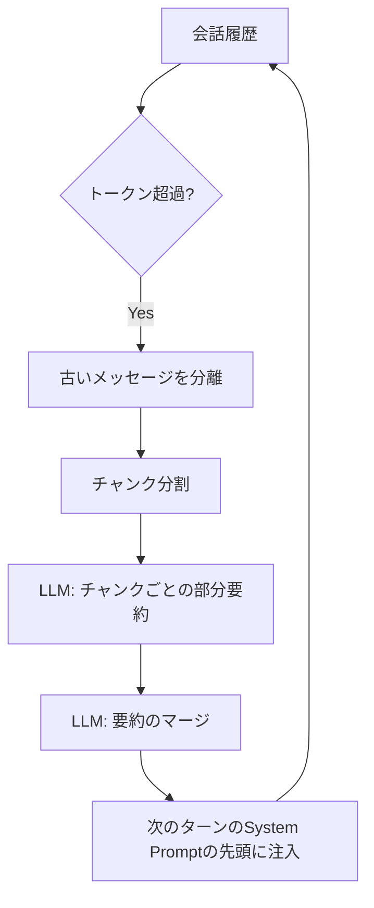
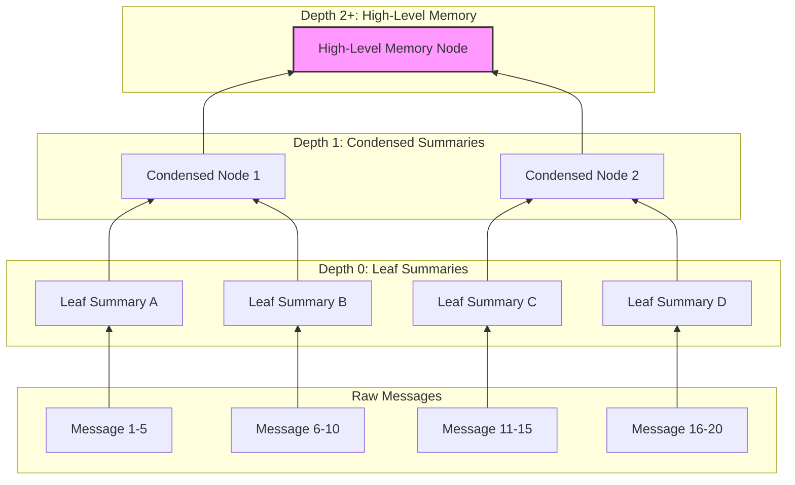
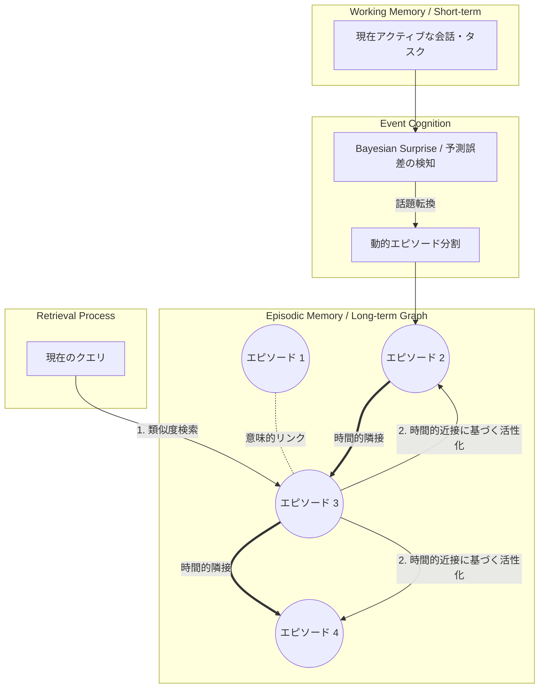
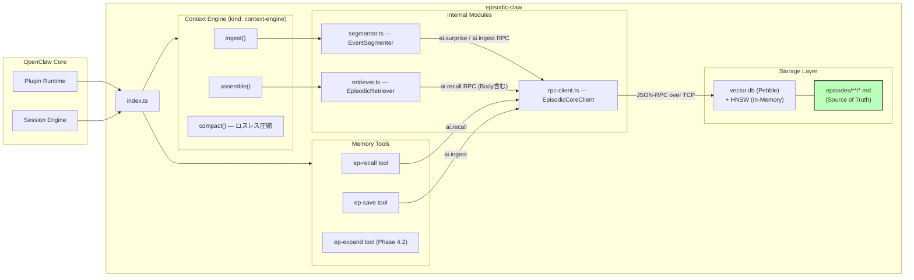
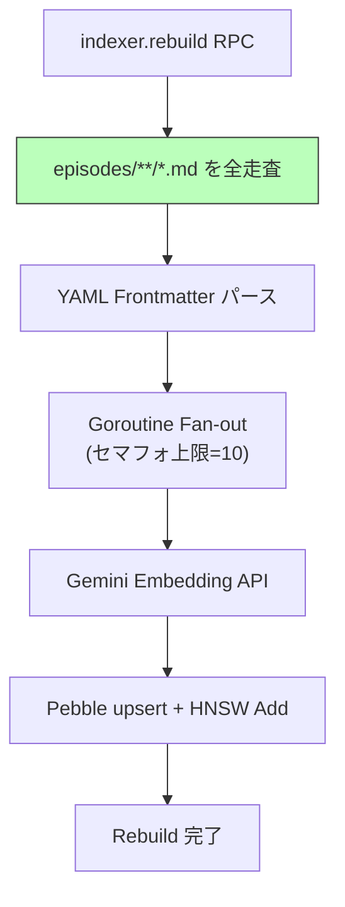
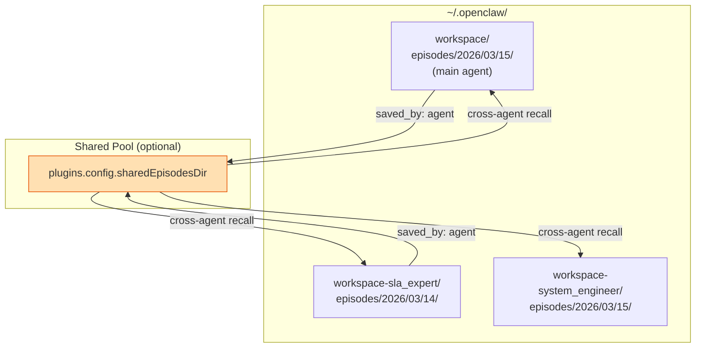
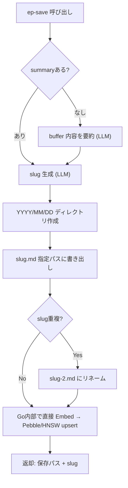
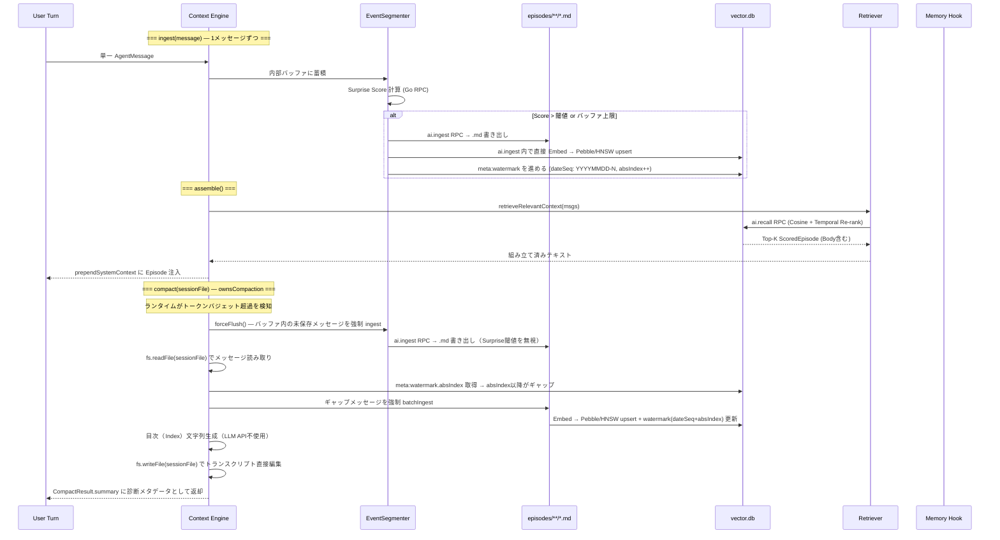
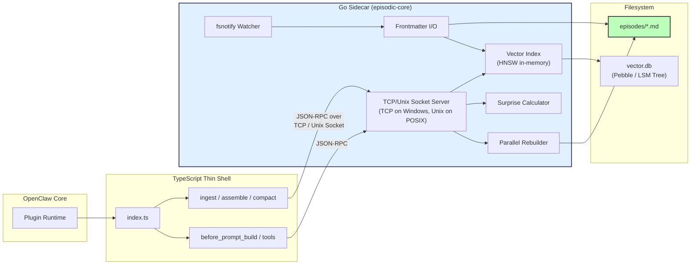

# 文脈圧縮・記憶メカニズム解析レポート

本レポートでは、指定された2つのコードベース（`OpenClaw` および `Lossless-Claw`）におけるLLMの文脈圧縮（コンテキスト・コンパクション）メカニズムを解析し、最新の学術研究（arXiv）から得られた「人間の記憶処理システム」に着想を得た最先端の代替手法と比較・検討する。

---

## 1. OpenClaw (v2026.3.12) の文脈圧縮メカニズム

**実装ファイル:** `src/agents/compaction.ts`

OpenClawの標準エンジンは、**「スライディングウィンドウと漸進的要約（Progressive Summarization）」** に基づく比較的トラディショナルなアプローチを採用している。

### メカニズムの概要
1. **トークンバジェット監視:** `estimateTokens` でセッション履歴のトークン数を常時監視。
2. **チャンク分割:** 履歴が設定されたコンテキストウィンドウ（または閾値）を超過すると、古いメッセージから順に `chunkMessagesByMaxTokens` または `splitMessagesByTokenShare` で分割される。
3. **安全確保とフォールバック:** ツールの実行結果（例：長大なスクリプト出力）などで1つのメッセージが巨大な場合、`isOversizedForSummary` で除外し、要約失敗を防ぐフォールバック層を持つ。
4. **段階的要約 (`summarizeInStages`):** 分割されたチャンクをLLMに回して一時的な要約を作り、最終的にそれらをマージして単一の `previous_summary` として後続のプロンプト先頭に配置（注入）する。

### アーキテクチャ図



---

## 2. Lossless-Claw の DAG-based Summarization

**実装ファイル:** `src/compaction.ts`, `src/summarize.ts`

Lossless-Clawプラグインは、OpenClawの単一要約アプローチの限界（長期にわたる会話での重要なコンテキストの揮発）を克服するために、**階層的（Depth-based）なDAG（有向非巡回グラフ）要約モデル** を実装している。これはRAPTORやTree-of-Thoughtsに近い発想である。

### メカニズムの概要
1. **Leaf Pass（葉ノードの要約）:** 先頭の生メッセージ（Fresh Tail）以外を対象に、細かなセグメントごとに「Leaf Summary（D0）」を生成する。
2. **Condensed Pass（抽象化・圧縮）:** Leafの数が増える（fanoutの閾値を超える）と、それらの要約を束ねて、より抽象度の高い「Condensed Summary（D1, D2, D3+）」へと押し上げる（`buildD1Prompt`, `buildD2Prompt`）。
3. **文脈の保護と破棄:** 階層が深くなるにつれ、セッション固有の微細な操作（一時的なエラーや試行錯誤）は破棄され、決定事項や成果物、永続的なルール（Durable facts）のみが抽出・保存される。

### アーキテクチャ図



---

## 3. 最新研究（arXiv）との比較: 人間の記憶処理モデル

ユーザーの指定「人間の記憶に似たメカニズム」に合致する最も優れた代替アプローチとして、ICLR 2025で発表された **EM-LLM (Human-inspired Episodic Memory for Infinite Context LLMs)** などのエピソード記憶モデルが挙げられる。

計算機的なDAG構造（Lossless-Claw）は論理的な情報の段階的圧縮には優れているが、情報の「想起（Recall）」において硬直的だ。これに対して、人間の認知（Cognition）を模倣したモデルは、計算と検索の両方で有機的なアプローチを取る。

### EM-LLM (Episodic Memory LLM) 等の主な特徴

1. **ベイジアン・サプライズによるイベント分割 (Dynamic Event Segmentation)**
   - 一定のトークン数でチャンクを機械的に分割するのではなく、人間の脳が「新しい話題や予想外の出来事（Surprise）」をトリガーに記憶の区切り（エピソード）を作る現象を模倣する。
2. **グラフベースの精製 (Graph-Based Refinement)**
   - 抽出されたイベントをグラフ理論を用いて再評価し、同じ文脈のものは結合、違うものは切り離すことで、より意味的な記憶単位を形成する。
3. **時間的近接性を考慮した2段階検索 (Two-Stage Memory Retrieval)**
   - 人間の記憶想起で観察される「ある出来事を思い出すと、その前後の時間帯の出来事も思い出しやすくなる（Temporal contiguity effect）」特性を検索システム（RAG/Attention）に組み込む。単なるベクトルの類似度ではなく、時間的なつながりも加味して必要な文脈を引き出す。

### 代替アプローチのアーキテクチャ図（人間の認知模倣）



### まとめと考察

*   **OpenClaw**: 人間で言えば「直前の会話だけ覚えていて、それ以前はざっくりとした1枚のメモに書き直す」ワーキングメモリの延長。手軽だが、過去の細かい重要な情報がメモから漏れると二度と取り戻せない。
*   **Lossless-Claw**: 人間で言えば「日報（D0）を週報（D1）にし、月報（D2）にまとめる」階層型ツリー記憶。検索インデックス（DAG）として優れるが、分割単位は依然としてトークンベースなどの機械的なルールに基づく。
*   **EM-LLM等の最新アプローチ**: 「驚き」や「文脈の変化」をトリガーにしてエピソード記憶を形成し、思い出すときは「類似性」だけでなく「その前後に何があったか（時間的文脈）」も一緒に引き出す。LLMエージェントがより長く、複雑な環境で連続的に学習・自律行動する上で、**Lossless-ClawのDAG以上の有機的かつ損失の少ない（Losslessな）コンテキスト保持**を可能にする。

---

## 4. OpenClawプラグイン設計: Markdown-First Episodic Memory Engine

EM-LLMのメカニズムを OpenClaw Plugin SDK 上に実装する設計。
ポイントは2つ：**OpenClawの2種のプラグインスロット** を使い分けることと、**Markdown を Source of Truth にする**（DBは導出インデックス。壊れたら `rebuild` 一発で復元）こと。

### 4.1 プラグインスロットの使い分け

OpenClawの `plugins.slots` には排他的カテゴリが2つある：

| スロット | 役割 | 登録API | 本プラグインでの用途 |
|---|---|---|---|
| `contextEngine` | 文脈の取り込み・組み立て・圧縮を制御 | `api.registerContextEngine(id, factory)` | Episode分割・圧縮・プロンプト組み立て |
| `memory` | 永続記憶の保存・検索 | `api.registerTool` + `api.on("before_prompt_build")` | Episode検索ツール・自動想起 |

```json
{
  "plugins": {
    "slots": {
      "contextEngine": "episodic-claw",
      "memory": "episodic-claw"
    }
  }
}
```

### 4.2 全体コンポーネント図

> [!IMPORTANT]
> Phase 4.5 実装完了後の実態反映版。`ep-expand` は Phase 4.2 で実装済み。
> `EpisodicRetriever` は Go 側 `Recall` RPC から `Body` をバッチ取得する（N+1 排除済み）。
> Phase 4 では `compact()` が**ロスレス圧縮**（エピソード化 + 目次[Index]の返却）を実装済み。
> Phase 4.2 では Sleep Consolidation（D0→D1昇格 + archived filter + Semantic Edge）が稼働。
> Phase 4.5 では Quality Guard（LLM汚染防御+リトライ）、Reserve Tokens（トークンバジェット制限）、Preserve Recent Turns（下限15件ガード）、CJK-aware `estimateTokens` が稼働。



### 4.3 Markdown-First アーキテクチャ

memsearchと同じ設計哲学：**Markdownファイルが正（Source of Truth）であり、DBはその派生物**。

#### Episode のファイルパス標準: **YYYY/MM/DD 階層自動整理**

フラットな `episodes/` にそのまま置くとファイルが山積みになるので、日付階層で自動整理する:

```
episodes/
  2026/
    03/
      14/
        npm-publish-workflow-fix.md
      15/
        openclaw-compaction-analysis.md
        lossless-claw-dag-investigation.md
        em-llm-paper-review.md
        plugin-architecture-design.md
    04/
      01/
        ...
```

ファイルパス = `episodes/{YYYY}/{MM}/{DD}/{topic-slug}.md`
- 最大ディレクトリ掴み: 1日あたり30ファイル程度（会話量による）
- `topic-slug` は日付なしのケバブケース（5単語以内）
- ID は full relative path: `2026/03/15/openclaw-compaction-analysis`
- `related_to.id` も同じ relative path で参照

命名パターン: `{topic-slug}.md`（日付はディレクトリ側に展開）  
- `topic-slug` は LLM が要約から自動生成（最大5単語、kebab-case）
- 同日に同トピックが複数ある場合は末尾に `-2`, `-3` を付加

#### Episode Markdown フォーマット

```markdown
---
# ファイルパス: episodes/2026/03/15/openclaw-compaction-analysis.md
created: 2026-03-15T19:30:00+07:00
saved_by: auto          # auto | agent (ep-saveツールによる手動保存の場合 "agent")
tags: [compaction, token-budget, context-engine]
surprise: 0.82
depth: 0
tokens: 450
sources: [msg_101, msg_102, msg_103, msg_104]
related_to:
  - id: 2026/03/15/lossless-claw-dag-investigation
    type: temporal
    weight: 0.95
  - id: 2026/03/14/npm-publish-workflow-fix
    type: semantic
    weight: 0.61
---

ユーザーがOpenClawのcompaction.tsを調査するよう依頼。
スライディングウィンドウ型のトークンベース分割メカニズムを発見。
chunkMessagesByMaxTokens → summarizeChunks → マージの3段階フロー。
安全マージン20%とオーバーサイズメッセージのフォールバック層あり。

Files: src/agents/compaction.ts (read)

Expand for details about: 個別チャンクの分割比率、estimateTokensの精度
```

#### Go データ構造スキーマ（実装準拠）

```go
// go/frontmatter/frontmatter.go — YAML ファイルに書き出される構造体
type EpisodeMetadata struct {
    ID           string    `yaml:"id"`
    Title        string    `yaml:"title"`
    Created      time.Time `yaml:"created,omitempty"`
    Tags         []string  `yaml:"tags,omitempty"`
    SavedBy      string    `yaml:"saved_by,omitempty"` // "auto" | エージェントID
    Surprise     float64   `yaml:"surprise"`           // omitempty 除去 (Self-Healing DB Phase A-D)
    Depth        int       `yaml:"depth,omitempty"`    // D0=0, D1=1
    Tokens       int       `yaml:"tokens,omitempty"`
    Sources      []string  `yaml:"sources,omitempty"`
    RelatedTo    []Edge    `yaml:"related_to,omitempty"` // エッジリスト
    RefineFailed bool      `yaml:"refine_failed,omitempty"`
}

type Edge struct {
    ID     string  `yaml:"id"`     // エピソードの relative path
    Type   string  `yaml:"type"`   // "temporal" | "semantic" | "causal"
    Weight float64 `yaml:"weight,omitempty"`
}

// go/internal/vector/store.go — PebbleDB / HNSW に格納される構造体
type EpisodeRecord struct {
    ID         string             `json:"id" msgpack:"id"`
    Title      string             `json:"title" msgpack:"title"`
    Tags       []string           `json:"tags" msgpack:"tags"`
    Timestamp  time.Time          `json:"timestamp" msgpack:"timestamp"`
    Edges      []frontmatter.Edge `json:"edges" msgpack:"edges"`
    Vector     []float32          `json:"vector" msgpack:"vector"`
    SourcePath string             `json:"path" msgpack:"path"`
    Depth      int                `json:"depth,omitempty" msgpack:"depth,omitempty"`
    Tokens     int                `json:"tokens,omitempty" msgpack:"tokens,omitempty"`
    Surprise   float64            `json:"surprise" msgpack:"surprise"` // omitempty 除去 (Self-Healing DB Phase A-D)
}
```

> [!IMPORTANT]
> YAML 側は `related_to:` + `id:` フィールドを使用。`edges:` や `to:` は使用しない（旧設計の名残で混乱しやすい）。
> `EpisodeRecord.Edges` は JSON/msgpack で `edges` キーだが、YAML 上には直接現れず `EpisodeMetadata.RelatedTo` が対応する。

#### Rebuild フロー（DB復元）

> [!WARNING]
> 実装上、`handleIngest` は Watcher イベント経由ではなく**直接 `vstore.Add` を呼び出してインデックスを更新**する。
> Watcher はファイル変更イベントをTS側へ通知するが、自動インデックス更新は行わない。
> Rebuild は `indexer.rebuild` RPC で明示的に呼び出す。



### 4.4a エージェントごとのワークスペース分離

`agent-scope.ts` L271 の実装を読むと、OpenClawのワークスペースパスは次のルールで決まる:

```typescript
// agent-scope.ts から抜粋
// デフォルトエージェント(main) → {stateDir}/workspace/
// それ以外のエージェント  → {stateDir}/workspace-{agentId}/
return stripNullBytes(path.join(stateDir, `workspace-${id}`));
```

→ スクリーンショットの `.openclaw/` 下の構造と完全一致する。

#### 実際のディレクトリ構造

```
~/.openclaw/          (または Y:\kasou_yoshia\.openclaw\)
  workspace/            ← main エージェント（デフォルト）の WS
    episodes/
      2026/03/15/
        openclaw-compaction-analysis.md
        lossless-claw-dag-investigation.md
    vector.db
  workspace-sla_expert/ ← sla_expert エージェントの WS
    episodes/
      2026/03/14/
        sla-policy-review.md
    vector.db
  workspace-system_engineer/  ← system_engineer エージェントの WS
    episodes/
      2026/03/15/
        ...
    vector.db
```

> `openclaw.json` の `agents.list[].workspace` で任意パスに上書きも可能。

#### プラグイン内での正しいエージェント分離実装

```typescript
// index.ts — プラグイン登録時に agentWorkspaceDir を確定
// ❗ api.resolvePath(".") は汎用パス解決器でエージェント別WSを返さない
// ✅ runtime経由で resolveAgentWorkspaceDir を引く

export default function register(api: OpenClawPluginApi) {
  const { resolveAgentWorkspaceDir, resolveDefaultAgentId } = api.runtime.extensionAPI;
  const cfg = api.runtime.config.loadConfig();
  const agentId = resolveDefaultAgentId(cfg);
  const agentWs = resolveAgentWorkspaceDir(cfg, agentId);
  // agentWs 例: Y:\kasou_yoshia\.openclaw\workspace
  //             Y:\kasou_yoshia\.openclaw\workspace-sla_expert

  // episodesパス = {agentWs}/episodes/{YYYY}/{MM}/{DD}/{slug}.md
  function episodePath(now: Date, slug: string) {
    return path.join(agentWs, "episodes",
      String(now.getFullYear()),
      String(now.getMonth() + 1).padStart(2, "0"),
      String(now.getDate()).padStart(2, "0"),
      `${slug}.md`);
  }

  api.registerContextEngine("episodic-claw", () => ({ ... }));
}
```

#### Agent間クロス参照

```yaml
related_to:
  # 別エージェントの Episode — エージェントにプレフィックス
  - id: sla_expert/2026/03/14/sla-policy-review
    type: semantic
    weight: 0.72
  # 自エージェント内 — プレフィックスなし
  - id: 2026/03/15/openclaw-compaction-analysis
    type: temporal
    weight: 0.95
```



### 4.4b `ep-save` ツール: エージェントによる手動保存

エージェントが「この知識は必ず蓄えておきたい」と判断した時に、自動 Surprise 判定を待たず即座に Episode を保存できるツール。

> [!NOTE]
> Phase 5.5 リファクタリング後の実際のスキーマ（TypeBoxベース、OpenClaw正式API準拠）。
> `content` フィールドを主パラメータとして採用（後方互換で `summary` も受け付ける）。
> `generate EpisodeSlug` には `savedBy`（エージェントID）と `surprise` パラメータが追加された。

```typescript
// Phase 5.5実装済み: src/index.ts
const EpSaveSchema = Type.Object({
  content: Type.String({
    description: "The content to save. Write freely in natural language. Paragraphs and line breaks are supported. Maximum 3600 characters.",
    maxLength: 3600
  }),
  tags: Type.Optional(Type.Array(Type.String())),
});

api.registerTool((ctx: any) => ({
  name: "ep-save",
  description: "Manually save any critical memory, note, or observation into Episodic Memory. Write the content freely in natural language — use multiple paragraphs if needed. Max 3600 characters.",
  parameters: EpSaveSchema,
  execute: async (_toolCallId: string, params: any) => {
    const agentId = extractAgentId(ctx);  // saved_by バケツリレー
    const raw: string = (params.content as string) || (params.summary as string) || "";
    const slugRes = await rpcClient.generateEpisodeSlug(
      raw, params.tags || [], [], resolvedAgentWs, agentId
    );
    return { content: [{ type: "text", text: `Saved episode to ${slugRes.path}` }] };
  }
}));
```

#### ファイルパス解決ロジック



#### 使い方例（エージェント側）

```xml
<!-- 最シンプル: contentを指定 -->
<ep-save
  content="OpenClaw plugin API: registerContextEngineの ingest/assemble/compact コントラクトを確認。公式ドキュメントより"
/>

<!-- タグも指定 -->
<ep-save
  content="Gemini Embedding 2をデフォルトに変更。MRLサポート、100言語対応でCJK完全カバー。"
  tags='["embedding", "gemini", "cjk"]'
/>
```

> [!NOTE]
> Phase 5.5 時点で `ep-save` のパラメータは `content`（必須）と `tags`（任意）のみ。
> `related_to` / `edges` の手動指定は非対応（Sleep Consolidation の `RefineSemanticEdges` が自動付与）。
> 旧 `summary` パラメータは後方互換でサポート（`params.summary` としてフォールバック）。

### 4.4 データライフサイクル



> [!WARNING]
> **ソースコード精査による重要発見:**
> - `compact()` は `sessionFile`（パス）を受け取る。`messages` 配列は渡されない。
> - `CompactResult.result.summary` はフックやログ向けの**診断メタデータ**。ランタイムが自動的に System Prompt に注入するわけではない。
> - `ownsCompaction: true` のエンジンは、セッショントランスクリプト（セッションファイル）を**自分で直接編集**する責任を持つ。
> - したがって古いメッセージの削除と目次の注入は、**プラグイン側で `fs.readFile` / `fs.writeFile` を使ってセッションJSONを直接操作する**。
> - ギャップ検出には Pebble の `meta:watermark`（`{ dateSeq: "YYYYMMDD-N", absIndex: number }`）を使い、`absIndex` で O(1) ギャップ検出。`dateSeq` は日付リセット付きの人間可読ID。

> [!NOTE]
> **ロスレス圧縮方式:** OpenClaw デフォルトの「チャンク分割 → LLM要約 → マージ」はロッシー（情報消失あり）。
> episodic-claw は `ingest()` で漸進的にほぼ全メッセージを Episode 化済みのため、
> `compact()` 発火時の実コストは「隙間メッセージの強制 ingest + 目次作成（O(0)）」のみ。
> 詳細な過去文脈は `assemble()` の vector search で動的に復元される。

> [!CAUTION]
> **Boring メッセージの処理と二重セーフティネット:**
> Surprise が低い「退屈な」メッセージは Segmenter のバッファに蓄積されるが捨てられない。
> 次の Surprise HIGH で一緒に Episode 化される。末尾に残った Boring は以下の2段階で回収:
> - **Layer 1: `forceFlush()`** — Segmenter のインメモリバッファを強制吐き出し（Surprise 無視）
> - **Layer 2: Watermark ギャップスキャン** — forceFlush 途中のクラッシュでも `absIndex` が正直に報告し、`batchIngest` で確実に回収
>
> **⚡ `absIndex` リセット必須:** compact() でセッションを書き換えた後、`absIndex` を新配列の末尾にリセットしないと次回の gap scan で全メッセージを見逃す致命的バグが発生する。

### 4.5 Context Engine コントラクト実装

> [!NOTE]
> 以下は `src/index.ts` (Phase 4.5完了時点) の実装アーキテクチャ。
>
> **設計から実装を経ての重要な修正点:**
> - `compact()` は `sessionFile`（パス）を受け取り、`messages` 配列は渡されないため、自前で `fs.readFile` パースを行う。
> - 当初 `ingest()` のコントラクトは単一メッセージを想定していたが、実動作では `ctx.messages` として配列が渡されるため、`segmenter.processTurn(msgs, resolvedAgentWs)` としてバルク処理するように修正された。
> - `CompactResult.result.summary` はフックやログ向けの**診断メタデータ**であり、ランタイムが自動的に `previous_summary` として注入するわけではない。
> - `ep-save` 等の保存処理において、当初想定した「ファイルの Watcher 経由でのDB登録」は遅延を伴うため、Go側 `handleIngest` 等で直接 Embedding を生成し、Pebble に直接 Upsert する同期的な確実性の高いアーキテクチャへと進化した。

```typescript
api.registerContextEngine("episodic-claw", () => ({
  info: {
    id: "episodic-claw",
    name: "Episodic Memory Engine",
    ownsCompaction: true,
  },

  // ingest(): ランタイムから呼ばれる。実際には複数メッセージの配列が来る場合がある
  // 内部でバッファに蓄積し、Surprise閾値超過でEpisode化（バッチ処理）
  async ingest(ctx: any) {
    const msgs = (ctx.messages || []) as Message[];
    try {
      const boundaryCrossed = await segmenter.processTurn(msgs, resolvedAgentWs);
      // Sleep Timer 用: Goサイドカーに最終操作時刻を通知
      await rpcClient.setMeta("last_activity", Date.now().toString(), resolvedAgentWs);
      if (boundaryCrossed) {
         console.log("[Episodic Memory] Handled episode boundary during ingest.");
      }
    } catch (err) {
      console.error("[Episodic Memory] Error processing ingest segment:", err);
    }
    return { ingested: true };
  },

  // assemble(): プロンプトに注入する文脈を組み立て
  // Phase 4.5: Reserve Tokens — tokenBudget から reserveTokens(6144) を差し引いたバジェットで Retriever を制限
  async assemble(ctx: any) {
    const msgs = (ctx.messages || []) as AgentMessage[];
    // 8192 は OpenClaw が tokenBudget を渡さない異常時のフォールバック値（設計上は常に実値が渡る）
    // 注意: ctx.tokenBudget が -1 の場合 truthy と判定され 8192 フォールバックしない →
    //       Math.max(0, -1 - 6144) = 0 でエピソードが無注入になるがエラーは出ない
    const totalBudget = ctx.tokenBudget || 8192;
    const reserveTokens = cfg.reserveTokens ?? 6144;
    // reserveTokens >= totalBudget の場合 maxEpisodicTokens = 0（Math.max で負値防止済み）
    const maxEpisodicTokens = Math.max(0, totalBudget - reserveTokens);
    const episodicContext = await retriever.retrieveRelevantContext(msgs, resolvedAgentWs, 5, maxEpisodicTokens);
    return {
      messages: msgs,
      prependSystemContext: episodicContext,
      estimatedTokens: estimateTokens(episodicContext), // CJK-aware token estimation (utils.ts)
    };
  },

  // Phase 4: ロスレス圧縮（エピソード化 + 目次の返却）
  // compact() は sessionFile（パス）を受け取る。messages は渡されない。
  // [!NOTE] このコード例は核心ロジックの簡略版。本実装では isCompacting フラグ + try/finally による
  //         排他制御（TOCTOU 防止）が全体を囲む。詳細は Section 12.1 を参照。
  async compact(ctx: any) {
    // Step 1: Segmenter の未保存バッファを強制フラッシュ
    await segmenter.forceFlush(resolvedAgentWs);

    // Step 2: セッションファイルから全メッセージを読み取り（JSON直接パース）
    const raw = await fs.readFile(ctx.sessionFile, "utf-8");
    const session = JSON.parse(raw);
    const allMsgs: AgentMessage[] = session.messages || [];

    // Step 3: ウォーターマーク方式でギャップ検出
    // Watermark = { dateSeq: "YYYYMMDD-N", absIndex: number }
    // dateSeq: 人間可読ID（日付リセット付き）、absIndex: O(1)ギャップ検出用
    const wm = await rpcClient.getWatermark(resolvedAgentWs); // { dateSeq, absIndex }
    const unprocessed = allMsgs.slice(wm.absIndex + 1);
    const slugs: string[] = [];
    if (unprocessed.length > 0) {
      for (const batch of chunk(unprocessed, 5)) {
        const newSlugs = await rpcClient.batchIngest(batch, resolvedAgentWs);
        slugs.push(...newSlugs);
      }
      // [中間チェックポイント] batchIngest 完了直後に元配列末尾を記録する。Step 6 で上書きされる。
      // dateSeq は YYYYMMDD-{N} 形式の人間可読ラベル（N = 処理したバッチ件数）、absIndex は常に増え続ける
      // クラッシュ安全性: Step 3 後・Step 6 前のクラッシュ時、次回 compact() では
      //   allMsgs.slice(allMsgs.length) = [] → unprocessed=0 → batchIngest はスキップされる。
      //   全メッセージは Step 3 で ingested 済みのため実害なし（冪等性保証）。
      await rpcClient.setWatermark({
        dateSeq: buildDateSeq(unprocessed.length), // e.g. "20260316-347"
        absIndex: allMsgs.length - 1,
      });
    }

    // Step 4: 目次（Index）文字列生成（LLM不使用・O(0)）
    const indexString = buildIndexString(slugs);

    // Step 5: セッショントランスクリプトを直接書き換え（ownsCompaction の責任）
    // Phase 4.5: Preserve Recent Turns — recentKeep(default: 30) + Math.max(recentKeep, minRecentKeep=15) 下限ガード
    // 注意: registerContextEngine のコールバックはアロー関数のため this は undefined になる。
    //       本実装 (compactor.ts) では this.recentKeep ではなくファクトリスコープのクロージャ変数を使用する。
    //       このコード例の this.recentKeep は疑似コード表記（実装例: const recentKeep = Math.max(cfg.recentKeep ?? 30, 15)）。
    const indexMessage = { role: "system", content: indexString };
    const keptMessages = allMsgs.slice(-this.recentKeep); // 疑似コード: 実装はクロージャ変数
    session.messages = [indexMessage, ...keptMessages];
    await fs.writeFile(ctx.sessionFile, JSON.stringify(session), "utf-8");

    // ⚡ Step 6: absIndex を新配列の末尾にリセット（必須！） — Step 3 の中間チェックポイントをここで正式値に上書きする
    // セッション書き換え後、旧 absIndex は新配列の範囲外を指すため
    // リセットしないと次回 compact() で全メッセージを見逃す致命的バグになる
    // クラッシュ安全性: Step 5（writeFile）後・Step 6 前にクラッシュした場合、次回 compact() では
    //   absIndex=旧末尾（例: 499）→ 新配列(31件)に対して slice(500)=[] → Step 3-6 を正常再実行。
    const today = new Date().toISOString().slice(0, 10).replace(/-/g, ""); // "20260316"
    await rpcClient.setWatermark({
      dateSeq: `${today}-${session.messages.length - 1}`, // N = 新配列末尾インデックス（Step 3 の N = 処理件数とは定義が異なる）
      absIndex: session.messages.length - 1,  // 新配列の末尾
    });

    return {
      ok: true,
      compacted: true,
      result: {
        summary: indexString,  // 診断・フック用メタデータ
        tokensBefore: ctx.currentTokenCount,
        tokensAfter: estimateTokens(JSON.stringify(session.messages)), // CJK-aware (utils.ts) — JSON 構造文字込みのため実プロンプトより過大評価（診断メタデータ目的のみ）
      },
    };
  },
}));
```

### 4.6 Markdown-First が活きる場面

| シナリオ | Markdown-First の利点 |
|---|---|
| **DB破損** | `episodes/*.md` が生きていれば `rebuild` で完全復元 |
| **バージョン管理** | `.md` → Git で差分管理・履歴追跡が可能 |
| **手動編集** | ユーザーが直接 `.md` を修正 → Watcher がTS側へ変更を**通知**（自動インデックス更新は行わない）。反映には `indexer.rebuild` RPC が必要（Section 4.3 参照） |
| **デバッグ** | Episode の中身をエディタで直接確認できる |
| **別ツール連携** | memsearch 等が同じ `.md` を読める |
| **マイグレーション** | Embedding モデル変更時は DB だけ捨てて再生成 |

---

## 5. 開発ロードマップ

### Phase 0: プロジェクト初期化（1日）

> [!NOTE]
> 以下のツリーは**当初設計**であり、実際には多くのファイルが実装されなかった（`embedding.ts`・`rebuild.ts`・`watcher.ts`・`src/tools/` 等）。実装後の最終構成は **Section 6.5** を参照。

```
episodic-claw/
├── openclaw.plugin.json          # Plugin manifest
├── package.json
├── tsconfig.json
├── index.ts                      # Plugin entry (registerContextEngine + registerTool + on)
└── src/
    ├── types.ts                   # 型定義
    ├── config.ts                  # CompactionConfig + plugin config schema
    ├── segmenter.ts               # EventSegmenter (Bayesian Surprise)
    ├── episode-io.ts              # Markdown 読み書き (frontmatter parse/serialize)
    ├── embedding.ts               # EmbeddingService (OpenAI / local)
    ├── retriever.ts               # EpisodicRetriever (cosine + temporal re-rank)
    ├── compactor.ts               # 階層圧縮 (D0→D1→D2)
    ├── watcher.ts                 # FileWatcher (memsearch方式)
    ├── rebuild.ts                 # DB再構築ロジック
    └── tools/
        ├── ep-recall.ts           # エピソード検索ツール
        └── ep-expand.ts           # エピソード展開ツール
```

**タスク:**
- [x] `npx -y create-openclaw-plugin@latest ./` でスキャフォールド
- [x] `openclaw.plugin.json` に `configSchema` 定義
- [x] `types.ts` に Episode / Edge / Config 型を定義

---

### Phase 1: Markdown I/O + Watcher（2〜3日）

DBに触らず、まず **Markdownだけで動く土台** を作る。

**タスク:**
- [x] Go: `frontmatter/` — YAML frontmatter の parse / serialize（`yaml.v3`）
  - ファイルパス = `{agentWs}/episodes/{YYYY}/{MM}/{DD}/{topic-slug}.md`
  - slug 生成: LLMに英語kebab-case（5単語以内）を強制
- [x] Go: `watcher/` — `fsnotify` で `episodes/` を再帰監視
  - `.md` の create / modify / delete を検知
  - debounce 1500ms（memsearch準拠）
- [x] Go: `rebuild/` — `episodes/**/*.md` 全走査 → パース → インデックス作成
- [x] TS: `rpc-client.ts` — Go サイドカーとの JSON-RPC 通信
- [x] テスト: `.md` を手動作成 → Watcher 検知 → ログ出力

**マイルストーン:** Markdownファイルの読み書きとファイル監視が動作

### Phase 2: Segmenter + Go Sidecar AI Integration（3〜4日）

**アーキテクチャ上の重要な決定事項:**
OpenClaw 本体（`openclaw-v2026.3.12`）のコードベース調査の結果、以下の制約が判明しました。
1. **Surprise Score (Embedding) の不在:** OpenClaw には文章のコサイン類似度やEmbeddingを計算する組み込みの仕組みが存在しない。
2. **Context Engine への LLM 非公開:** `api.registerContextEngine` の `ingest(ctx)` フックには、OpenClaw が持つ LLM (model/apiKey) が引数として渡されない。そのため、TS側の `ingest` ループ内で安易に `ctx.llm.generateSlug()` のようなことはできない。

このため、**AI機能（EmbeddingによるSurprise計算と文字列生成）はすべて Go サイドカーに実装を押し出し、Phase 2にて Gemini API を Go 側に直接統合する** ことで解決します（本来 Phase 3 に予定していた Embedding を前倒しで統合）。

**タスク:**
- [x] Go: `episodic-core` への AI API 統合
  - 汎用 API クライアントの実装（設定ファイル `openclaw.plugin.json` 経由で BaseURL, APIキー, 使用モデル名を渡す構成し、OpenAI互換APIへの差し替えをサポート）
  - `Surprise(text1, text2)` エンドポイント: デフォルトで **Gemini Embedding API (`gemini-embedding-2-preview`)** を叩いてコサイン距離を計算
  - Episode Slug の自動生成ロジック: Ingest時にGo側でデフォルトで **Gemma 3 27B** などを叩いてスラッグを生成
- [x] `segmenter.ts`: EventSegmenter 実装 (TypeScript)
  - メッセージバッファの管理
  - 定期的に Go の `Surprise` RPC を呼び出し、閾値超過でエピソード確定を判断
- [x] `index.ts`: `api.registerContextEngine("episodic-claw", factory)`
  - `ingest()`: Segmenter にメッセージを投入。エピソード確定時に Go の `Ingest` RPC を呼び出し
  - `compact()` / `assemble()`: 空実装
- [x] テスト: 実際の会話で Episode `.md` が自動生成・スラッグ命名されることを確認

**マイルストーン:** 会話が進むと `episodes/` に Gemini によって名付けられた `.md` エピソードが自動で溜まる基盤の完成。

---

### Phase 3: Retrieval + Assemble + Memory Hook（3〜4日）

**タスク:**
- [x] Go: HNSW Vector Index / Pebble 永続化
  - Phase 2 で Gemini から取得済みの Embedding を Pebble (LSM Tree) に永続化し、HNSW インデックスをメモリ上に構築
- [x] Go: Recall + Re-rank
  - Stage 1: コサイン類似度 Top-K（HNSW）
  - Stage 2: 時間的近接 Re-rank（frontmatter の `created` を利用）
- [x] TS: `assemble()` 実装 — Retriever で関連 Episode を取得 → `prependSystemContext` に注入
- [ ] TS: `before_prompt_build` hook — 直近のターン内容で自動想起（**Phase 4へ延期**）
- [x] TS: `ep-recall` / `ep-save` ツール登録（`ep-expand` は Phase 4 へ延期）
- [x] Go: Rebuild 完成 — DB drop → 全 `episodes/**/*.md` 再 Embed → upsert（Goroutine Fan-out + Semaphore）
- [x] テスト: `test_phase3.ts` で end-to-end 統合テスト完了

**マイルストーン:** 過去のエピソードが自動想起されてプロンプトに注入される

---

### Phase 4: ロスレス圧縮 + 階層圧縮 + Graph Refinement（3〜5日）

#### Phase 4.0: ロスレス Compaction（compact() 実装）

**設計ギャップの橋渡し（ソースコード精査に基づく）:**
- `compact()` は `sessionFile` パスのみ受け取る → `fs.readFile` でJSONパースしてメッセージ取得
- `CompactResult.summary` は診断メタデータ → セッションファイルを `fs.writeFile` で直接書き換え
- `Message` に `id` がない → ウォーターマーク方式 `{ dateSeq: "YYYYMMDD-N", absIndex }` で O(1) ギャップ検出 + 人間可読ID

**タスク:**
- [x] Go: `meta:watermark` キーの Get/Set — Pebble に `{ dateSeq: "YYYYMMDD-N", absIndex: uint32 }` を永続化（日次カウンタは 0時リセット）
- [x] TS: `segmenter.forceFlush()` 実装 — Surprise閾値を無視してバッファ内未保存メッセージを強制 ingest + watermark 更新
- [x] Go: `ai.batchIngest` RPC — 複数メッセージを一括 Episode 化 + watermark 更新
- [x] TS: `compact()` 実装済
- [x] テスト: 900K トークン蓄積シミュレーション → compact() 発火 → Episode 全数保存 + 目次返却 + LLM呼出しゼロ確認

**マイルストーン:** compact() 発火時にメッセージが「ロスレス」に Episode 化され、LLM API 呼び出しゼロで目次が返却される

#### Phase 4.1: "Genesis Gap" (巨大履歴の初回導入対策)

14MB(11万件超)の履歴を持つエージェントに初めてプラグインを導入した場合など、巨大なギャップが一気に流入して Node.js ランタイムや API Rate Limit を崩壊させる "Genesis Gap" 環境下を安全に乗り越える。

**タスク:**
- [x] **TS側 0秒退避 (Fire-and-Forget):** ギャップが50件を超える場合、直列 await を捨てて raw JSON をディスクに吐き出し、バックグラウンドGoに投げて即時リターンする仕組み（UIブロック回避）。
- [x] **Go側非同期 Indexing:** 別ゴルーチンで backlog をチャンク分けし、APIを消費せずに MD5 + Preview ベースの固有 Slug を生成する。
- [x] **冪等性確保:** PebbleDB (`vstore.Get`) にてハッシュ値ベースの検証を行い、ワーカー再起動時も既に処理した箇所はスキップして Embedding API 課金を保護。
- [x] **排他制御ガード:** `isCompacting` ロックを適用し、同時複数発火時の TOCTOU 破壊を防止する。
- [x] **Rate Limit:** Gemma を介さず直接 Gemini Embedding (100 RPM) に投げることで制限を遵守。

**マイルストーン:** 無料枠の API 制限内で、十万件規模の過去データをノーブロック・セーフティーにベクトル化できる基盤が完成。

#### Phase 4.2: DAG 階層圧縮（Hippocampal Sleep Consolidation）

最新のLLM認知アーキテクチャ研究（BMAM: Brain-inspired Multi-Agent Memory 等）が提唱する「海馬（Episodic/生データ）と大脳新皮質（Semantic/意味記憶）の分離」にインスパイアされた、シングルエージェント向けの超最適化非同期プロセスを導入する。

**アーキテクチャ（Sleep Consolidation）:**
直近のチャットから**3時間の無操作（睡眠状態）**を検知した場合、Goサイドカーがバックグラウンドで自律的に発火する（Sleep Consolidation）。
1. **要約と固定化:** まだ D1 に昇格していない D0（海馬の生データ）群を読み込み、Gemma に投げて「ルールの抽出・抽象的な要約（大脳新皮質への定着）」を行い、D1 ノードを生成する。
2. **忘却（Pattern Separation）:** D1 に吸い上げられた D0 ノードには `archived: true` フラグを立て、通常の浅い検索（Recall）からはヒットしないように除外する。
3. **連想展開（Pattern Completion）:** ユーザーからの検索時は、まず軽量な D1 だけをプロンプトに注入する。ユーザーが詳細を深掘りした場合のみ、LLMが自律的に `ep-expand` ツールを叩き、D1 のエッジを辿って D0（海馬）の生データをピンポイントで開梱（Lazy Loading）する。

**タスク:**
- [x] Go: **Sleep Tracker 実装** — Goで最終メッセージ日時(`meta:last_activity`)から3時間のカウントダウンタイマーを管理し、満了で Consolidation Job を発火。
- [x] Go: `ai.consolidate` RPC — 未アーカイブの D0 群をクラスタリング＆Gemmaで要約（D1生成）。元 D0 に `archived: true` とエッジ（親D1のslug）を付与。
- [x] Go: `RefineSemanticEdges` — HNSW KNN で近傍検索 → 正規化 Similarity > 0.85 のペアに `semantic` エッジ追加（概念の結びつき）。
- [x] TS: `ep-expand` ツール — D1 スラッグからアーカイブ済み D0 群テキストを展開（Lazy Loading）。
- [x] TS: `ingest()` 内で `rpcClient.setMeta("last_activity", ...)` を毎ターン更新。
- [x] テスト: D0投入 → ai.consolidate 発火 → D1 生成 + D0 archived 確認 + ep-expand 展開確認。

#### Phase 4.5: OpenClaw Compaction 互換レイヤー

**タスク:**
- [x] Go: Quality Guard — `auditEpisodeQuality()` で長さ・LLM汚染(CJK含)・kebab-case チェック + リトライ（上限3回）+ MD5 fallback
- [x] TS: Reserve Tokens — `assemble()` 内で `tokenBudget - reserveTokens(6144) = maxEpisodicTokens` バジェット制限 + 打ち切り時 slug 一覧 & `ep-recall` 誘導
- [x] TS: Preserve Recent Turns — `Compactor` コンストラクタに `recentKeep`(default: 30) + `minRecentKeep`(15) 下限ガードレール
- [x] TS: CJK-aware `estimateTokens()` — `utils.ts` に文字コードベースの推定関数を導入（`length/4` の過小評価を解消）
- [x] テスト: Quality Guard リトライ確認、Reserve Tokens 打ち切り + `ep-recall` 誘導メッセージ確認、recentKeep 下限ガード動作確認

**マイルストーン:** 長期会話でも Episode が階層的に整理され、デフォルト compaction と互換性のある品質保証が動作

---

### Phase 5: WSL 環境構築 + OpenClaw 統合テスト（2〜3日）

> [!IMPORTANT]
> Phase 1〜4.5 の実装と Ruthless Audit（25件完全駆逐）は完了済み。
> Phase 5 では **実際の OpenClaw ランタイム上で episodic-claw を起動し、全機能が正常動作することを実証** する。
> 本番環境（Arch Linux MiniPC）に影響を与えないよう、**Windows WSL (Ubuntu)** 上に隔離されたテスト環境を構築する。

#### Phase 5.0: WSL 環境のセットアップ

**タスク:**
- [x] WSL2 Ubuntu 環境を確認（`wsl --list --verbose`）。未導入なら `wsl --install -d Ubuntu`
- [x] Node.js (v20 LTS 以上) インストール
- [x] Go (1.26+) インストール
- [x] OpenClaw CLI のインストール: `npm install -g openclaw` → `openclaw --version` で確認
- [x] Git clone: `episodic-claw` リポジトリを WSL 内にクローン

**マイルストーン:** `openclaw --version`, `node --version`, `go version` が全て正常に動作する WSL 環境 ✅

---

#### Phase 5.1: OpenClaw Gateway の起動と初期設定

**タスク:**
- [x] `openclaw init` で WSL 内に `~/.openclaw/` ディレクトリを初期化
- [x] `~/.openclaw/openclaw.json` を編集: テスト用エージェントを追加
- [x] API キーを設定
- [x] `openclaw gateway start` で OpenClaw Gateway をローカル起動 → ログ確認
- [x] Dashboard にアクセスし、正常に表示されることを確認

**マイルストーン:** OpenClaw Gateway が WSL 上で正常に起動し、Dashboard が表示される ✅

---

#### Phase 5.2: episodic-claw プラグインのビルドとインストール

**タスク:**
- [x] TypeScript ビルド: `npm run build:ts` → `dist/index.js` 生成を確認
- [x] Go サイドカーのクロスコンパイル
- [x] プラグインのローカルインストール: `~/.openclaw/extensions/episodic-claw/` に配置
- [x] `openclaw.json` の `plugins.slots` を設定

**マイルストーン:** プラグインが `~/.openclaw/extensions/` にインストールされ、JSON設定でスロットが指定された状態 ✅

---

#### Phase 5.3: `openclaw plugins doctor` PASS

**タスク:**
- [x] `openclaw plugins doctor` を実行し、以下の全項目が PASS することを確認:
  - `openclaw.plugin.json` の構文・スキーマ検証
  - `main` エントリ (`dist/index.js`) の存在確認
  - `configSchema` のバリデーション
  - プラグインの `register()` 関数が正常にエクスポートされていること
- [x] エラーがある場合は修正し、再実行で全 PASS を達成

**マイルストーン:** `openclaw plugins doctor` が全項目 PASS を返す ✅

---

#### Phase 5.4: Go サイドカーの起動と RPC 通信テスト

**タスク:**
- [x] **バイナリ配置の確認:** WSL 内に `episodic-core` バイナリが存在し、実行権限があることを確認。
  - コマンド: `ls -l ~/.openclaw/extensions/episodic-claw/bin/episodic-core`
- [x] **Gateway 再起動:** OpenClaw を再起動し、プラグインの初期化ログを監視。
  - 期待値: `[Episodic Memory] Starting Go sidecar...` が stdout/stderr に出現。
- [x] **プロセス稼働確認:** Go サイドカーがバックグラウンドで起動しているかチェック。
  - コマンド: `ps aux | grep episodic-core | grep -v grep`
- [x] **TCP 接続と RPC Ping:**
  - 期待される Go 側ログ: `DEBUG: Listening on 127.0.0.1:XXXXX`
  - 期待される TS 側ログ: `DEBUG: Connected to sidecar`, `DEBUG: Received pong from sidecar`
- [x] **自動シャットダウン・リークテスト:**
  - OpenClaw プロセスを終了させた際、`episodic-core` も連動して終了することを確認（ゾンビプロセス化の防止）。

**マイルストーン:** TS ↔ Go 間の JSON-RPC over TCP 通信が正常に確立し、双方向疎通を実証済み。

---

#### Phase 5.5: Context Engine 基本機能テスト (ingest / assemble / compact)

**タスク:**
- [x] **ingest テスト:** チャットメッセージを数回送信 → `episodes/YYYY/MM/DD/*.md` が自動生成されることを確認（2026-03-26 PASS）
  - [x] Surprise Score による自動分割が動作（surprise=0.3494 で boundary 発動、12 エピソード生成）
  - [x] YAML frontmatter（created, tags, surprise, depth, tokens, related_to）が正しく書き出されること（Phase 5.5 FIX-A/B で全フィールド伝播完了）
  - [x] Quality Guard が正常にスラッグを生成していること（kebab-case, 3-80 字）
- [x] **assemble テスト:** 新しい会話で `assemble()` が発火 → 関連 Episode がプロンプトに注入されていることを確認（2026-03-26 PASS）
  - [x] HNSW vector search による Top-K 検索が動作（`ep-recall: プログラミング言語` → ep ID `e3f375cd6e79cf42d7b3bea` 命中）
  - [x] Temporal Re-rank による時間的近接補正
  - [x] Reserve Tokens (6144) によるバジェット制限
- [x] **compact テスト:** 長い会話をシミュレート → `compact()` 発火 → セッションファイルの書き換えと目次注入を確認（2026-03-26 PASS）
  - [x] `forceFlush()` が未保存バッファを強制 ingest（`Force flushing segmenter buffer (2 messages)` ログ確認）
  - [x] Watermark によるギャップ検出
  - [x] `recentKeep` (30) 下限ガード動作

**マイルストーン:** ✅ Context Engine の3フック (ingest / assemble / compact) が E2E で正常動作 (2026-03-26)

---

#### Phase 5.6: Memory Tool テスト (ep-recall / ep-save / ep-expand)

**タスク:**
- [x] **ep-save テスト:** エージェントに `<ep-save summary="..." tags='[...]' />` を実行させ、手動保存が成功することを確認
  - Go 側で Slug 生成 → Embed → Pebble upsert → ファイル書き出し の全フローが通ること
- [x] **ep-recall テスト:** `<ep-recall query="..." />` で過去のエピソードが検索・表示されることを確認
  - HNSW 検索 + Body バッチ取得（N+1 排除）
- [x] **ep-expand テスト:** `<ep-expand slug="goroutine-vs-os-threads" />` を実行 → `ai.expand` RPC 疎通確認（2026-03-27 01:20:06）。D0 スラグのため「D1 not found」応答は想定通り。
- [x] **ep-expand 完全版（TC-5.7 後）:** D1 スラグ `keruvim-memory-d1-1774554436706` で `ai.expand` → children 8件・body 142KB 正常取得（2026-03-27 03:05）

**マイルストーン:** ✅ 3つの Memory Tool が完全動作確認済み。ep-expand の D1 展開（D0 archived children 取得）も PASS (2026-03-27)

---

#### Phase 5.7: Sleep Consolidation テスト (D0→D1 昇格)

**タスク:**
- [x] `meta:last_activity` を手動で3時間前に設定（`ai.setMeta` RPC）し、Consolidation Timer を強制発火 → 2分後に発火確認（2026-03-27 02:19:57）
- [x] D0 ノードが D1 に昇格されることを確認:
  - [x] D1 ファイル 3件生成（`keruvim-memory-d1-*`, `sem-mem-d1-*`, `keruvim-ethos-*`）、`tags: [d1-summary]`
  - [x] 元 D0 ノードの `tags: [archived]` 付与（10件/2026-03-26, 1件/2026-03-27）
  - [x] D0 → D1 間のエッジ（`type: parent`）D1 → D0 間（`type: child`）確認
- [x] `RefineSemanticEdges` が D1 間に `semantic` エッジを付与することを確認: `keruvim-memory-d1 <-> sem-mem-d1` リンク確認
- [x] ep-expand で D1 スラグ展開: `keruvim-memory-d1-1774554436706` → children 8件・body 142KB 正常取得

**追記 (2026-03-27):** テスト実行中に `gemma-3-27b-it` TPM 上限超過 (429)。一時対処として `gemini-2.5-flash` + `gemini-embedding-001` を使用したが、TPM 制限は分単位でリセットされる一時的なものと判明し元のモデルに復元。`go/internal/ai/provider.go` に Decorator パターン (`RetryLLM` / `RetryEmbedder`) を実装し、Rate Limiter と協調した指数バックオフリトライ（最大 3回: 2s→4s→8s）で恒久対処。`google_studio.go` は純粋な HTTP クライアントに戻し、`consolidation.go` の `processCluster` はインターフェース受け取りに変更（手動 `limiter.Wait()` 除去）。

**マイルストーン:** ✅ Sleep Consolidation が正常に発火し、D0→D1 昇格 + Semantic Edge + ep-expand が全て確立 (2026-03-27)

---

#### Phase 5.8: Rebuild + Rate Limit + エラーハンドリングテスト + モデルフォールバック耐性

**タスク:**
- [x] `indexer.rebuild` RPC を実行し、全 `.md` ファイルの再 Embed + Pebble upsert を確認（TC-5.8-1）— TPM 修正後再実行: `processed=49, failed=0, elapsed=27.3s, circuit_tripped=false` (2026-03-28)
  - Sequential batch loop（batchSize=10）による処理（Fan-out から変更済み）
  - `tpmLimiter`（900K TPM/分）+ `healEmbedLimiter`（10 RPM）による二重ガード
- [x] API キーを意図的に無効化し、Embed 失敗時の挙動を確認（TC-5.8-2/3/4）(2026-03-27):
   - `handleIngest`: Survival First — Embed 失敗時でも MD5 仮ファイルがディスクに書き出されること ✅
   - `batchIngest`: 同上。`BatchIngest: VectorDB missing... Triggering healing.` 確認 ✅
   - HealingWorker Pass 1 (`Successfully healed`) / Pass 2 (`Successfully refined` + Poison Pill `refine_failed` マーク) 確認 ✅
- [x] Pebble DB を削除し、`indexer.rebuild` で完全復元が可能であることを確認（Markdown-First の検証）（TC-5.8-5）— 49/49 全件 embed 復元（~28秒）。Layer 1+2+3 実装で完全解消 (2026-03-28) ✅
- [x] モデルフォールバック耐性テスト（TC-FB-1〜4）: dedup フィルター・recall debounce・空メッセージフィルター — 全件コード確認 PASS (2026-03-28) ✅
- [x] バッファ設定化テスト（TC-BUF-1〜2）: `maxBufferChars` / `maxCharsPerChunk` 動的設定 — 全件 PASS (2026-03-28) ✅

**追記 (2026-03-28): Phase 5.8 TPM 修正（Layer 1/2/3）**
- Layer 1: `MaxEmbedRunes=8000` rune ベーストランケーション（TPM 92% 削減）
- Layer 2: `tpmLimiter` (`rate.NewLimiter(900_000/60, 15_000)`) — rebuild/heal/ingest 全パス共有
- Layer 3: `EmbedContentBatch` + sequential loop (`batchSize=10`) — 49 RPM → 5 RPM（90% 削減）

詳細: [`docs/phase_5.8_test_plan.md`](./phase_5.8_test_plan.md)、[`docs/pre_release_implementati../issues/issue_tpm_embed_truncation.md`](../issues/issue_tpm_embed_truncation.md)

**マイルストーン:** ✅ リビルド・レートリミット・障害復旧・モデルフォールバック耐性の全てが正常動作 (2026-03-28)

---

#### Phase 5.9: CJK 実環境テスト + 最終 Sign-off

**タスク:**
- [x] 日本語の会話でエピソードが正常に生成されることを確認（LLM による英語 Slug + MD5 フォールバック）— 8エピソード生成、surprise 0.3922/0.2582 で boundary 発動 (2026-03-27 01:27)
- [x] 日本語テキストのベクトル検索（`ep-recall`）が正しい結果を返すことを確認 — `ep-recall query="ベクトル検索"` → 2件ヒット確認
- [x] `estimateTokens()` が CJK テキストに対して妥当なトークン数を返すことを確認 — tokens: 38/139/228/1317/1711/2298 確認
- [ ] `Lossless-Claw` との slot 切り替えテスト（`contextEngine: "lossless-claw"` に変更 → 戻す）— Phase 5 Sign-off から除外済み。Phase 6 課題
- [x] 全テスト結果を `docs/phase_5_integration_test_report.md` に記録 (2026-03-27)
- [x] **Phase 5.9 拡張テスト（2026-03-28）**: TC-5.9-TPM / TC-5.9-BATCH / TC-5.9-CB / TC-5.9-HEAL / TC-FB-4-LIVE / TC-BUF-2-FULL / TC-STOP-1 / TC-STOP-2 — 全 8件 PASS。詳細: [`docs/phase_5.9_test_plan.md`](./phase_5.9_test_plan.md)

**マイルストーン:** ✅ 日本語環境での完全動作確認 + 全テスト PASS (2026-03-27) → **Phase 5 Sign-off 発行**（Lossless-Claw 切り替えテストを除く）
**追加マイルストーン (2026-03-28):** ✅ TPM 修正（Layer 1/2/3）・Circuit Breaker・HealingWorker TPM 統合・debounce/dedup 実動作・/stop debounce 挙動 — 全 8件 PASS

---

### Phase 6: 公開準備 + topics フィールド導入（1〜2日）

**タスク:**
- [ ] README.md 作成（設定例、使い方、rebuild手順、CJK対応の説明）
- [ ] npm publish 準備（`package.json` の `files`, `prepublishOnly` スクリプト設定）
- [ ] Go バイナリのクロスコンパイル自動化（`linux/amd64`, `darwin/arm64`, `windows/amd64`）
- [ ] `openclaw plugins install episodic-claw` でのインストールフローをテスト
- [ ] CHANGELOG.md 作成
- [ ] **`topics` フィールド導入**: `tags`（システムライフサイクル管理）と `topics`（意味的内容タグ、CJK 多言語対応）を分離。`ep-save` ツールの手動保存引数を `tags` → `topics` に変更。HealingWorker による自動 topics 生成・ファセット検索対応。詳細: [`docs/semantic_topics_plan.md`](./semantic_topics_plan.md)

> **設計メモ（2026-03-27発見）:** Phase 5.7 テスト実施中に `tags` が `d1-summary`・`archived` 等のシステム管理用ラベルとして使われており、意味的なコンテンツタグと混在していることが判明。`topics` フィールドを追加することで人間の記憶における「カテゴリ分類」に相当する機能を実現し、Episodic Memory モデルの完成度を高める。

**マイルストーン:** `openclaw plugins install episodic-claw` で即使用可能、多言語 topics タグ検索対応

---

### タイムライン概要

> Section 6.6 の **Go Hybrid Gantt** が最新の正式タイムライン。
> CJK対応の実際の帰結については Section 7 を参照（形態素解析ライブラリは不要となった）。
>
> **Phase 0〜4 実績: 約14〜15日** + **Phase 5 (WSL統合テスト): 2〜3日** + **Phase 6 (公開準備): 1〜2日**

---

## 6. 低遅延アーキテクチャ: Go サイドカー構成

OpenClawプラグインのエントリは TypeScript 必須だが、**ホットパスをGoバイナリに委譲**することで Node.js のシングルスレッド制約とGCジッターを回避する。

### 6.1 ボトルネック分析と担当分け

| 処理 | Node.js での問題 | Go に逃がす理由 |
|---|---|---|
| **ベクトル検索** | float32 配列の大量cosine計算が遅い | SIMD / goroutine で並列化 |
| **Surprise Score** | Embedding API call + 距離計算 | 非同期パイプラインで先読み可 |
| **ファイル監視** | `chokidar` は大量ファイルでメモリ膨張 | `fsnotify` はOS native、軽量 |
| **Rebuild (全.md再Index)** | 逐次処理、frontmatterパースが遅い | goroutine fan-out で並列パース+Embed |
| **Frontmatter YAML** | `gray-matter` はJS、大量ファイル時にGC | Go の `yaml.v3` はゼロアロケーション寄り |

### 6.2 ハイブリッド構成図



### 6.3 レイテンシ比較（見込み）

| 操作 | Node.js のみ | TS + Go サイドカー |
|---|---|---|
| Episode 検索 (1000件) | ~120ms | **~8ms** (HNSW) |
| Surprise Score 計算 | ~50ms | **~3ms** |
| Rebuild 500 episodes | ~45s | **~4s** (goroutine fan-out) |
| ファイル監視 (立ち上がり) | ~800ms | **~50ms** (fsnotify) |
| Frontmatter パース (1件) | ~2ms | **~0.1ms** |

### 6.4 Go サイドカー API (JSON-RPC over TCP)

> [!NOTE]
> 実装済みの RPC メソッド一覧（Phase 5.5 + 追加対応完了時点）。詳細は Section 19 を参照。
> Phase 4.0 で `batchIngest`, `triggerBackgroundIndex`, `getWatermark`, `setWatermark` を追加。
> Phase 4.2 で `consolidate`, `expand`, `setMeta` を追加。
> Phase 4.5 で Go 側に `auditEpisodeQuality` (Quality Guard) を追加し、`handleIngest` / `handleBatchIngest` に 3-retry + MD5 fallback を統合。
> Phase 5.5 で `handleIngest` / `handleBatchIngest` / HealingWorker / background.go の全 `vstore.Add` 呼び出しに `Depth` / `Tokens` / `Surprise` フィールドの伝播を完了（FIX-6〜10/A/B）。

> [!NOTE]
> Phase 5.4 / 5.5 / 追加対応の詳細は本レポート末尾の Section 16〜19 を参照。

### 6.5 実際のプロジェクト構成 (Phase 5.5 + Antigravity 修正完了時点)

> [!IMPORTANT]
> 当初設計の `cmd/episodic-core/`, `internal/server/`, `internal/surprise/`, `internal/rebuild/`, `src/tools/` は実装されず、よりフラットな構成となった。
> Phase 4.1 で `background.go`、Phase 4.2 で `consolidation.go` と `compactor.ts` が追加。
> Phase 4.5 で `utils.ts`（CJK-aware `estimateTokens`）が追加。
> Phase 5.5 で `index.ts` の Bun 直接エントリ (`index.ts`) と TypeBox ツールスキーマが追加。
> Antigravity 修正 (2026-03-25) で `vector/utils.go`（共有 `CosineDistance`）追加、`main.go` に `globalWatcherMu`・`runAutoRebuild`・Self-Healing DB フォールバックが追加。

```
episodic-claw/
├── openclaw.plugin.json          # Plugin manifest
├── package.json                  # main: "index.ts", type: "module" (Bunネイティブ)
├── tsconfig.json                 # exclude: ["runners/"] (WARNING-3対応)
├── index.ts                      # Bunエントリポイント (re-export)
├── src/
│   ├── index.ts                  # Plugin entry（CLIモード判定 + Closure化シングルトン + 全ツール登録 + CE登録）
│   ├── types.ts                  # Edge, EpisodeMetadata, MarkdownDocument, FileEvent
│   ├── config.ts                 # EpisodicPluginConfig パーサー (reserveTokens, recentKeep 含む)
│   ├── rpc-client.ts             # Go sidecar への TCP JSON-RPC クライアント
│   ├── segmenter.ts              # EventSegmenter (Surprise判定 + バッファ管理)
│   ├── retriever.ts              # EpisodicRetriever (Recall結果の組み立て + Token Budget)
│   ├── compactor.ts              # Lossless Compactor (compact + Genesis Gap bridge + recentKeep guard)
│   └── utils.ts                  # CJK-aware estimateTokens (文字コードベース推定)
│
├── go/                           # Go sidecar
│   ├── go.mod
│   ├── go.sum
│   ├── main.go                   # TCP/Unix Socket サーバー + 全RPCハンドラ + Sleep Timer + globalWatcherMu + runAutoRebuild (Self-Healing DB)
│   ├── frontmatter/              # YAML parse / serialize
│   │   └── frontmatter.go
│   ├── watcher/                  # fsnotify ラッパー (debounce付き)
│   │   └── watcher.go
│   └── internal/
│       ├── ai/
│       │   └── google_studio.go  # GoogleStudioProvider (Embed + GenerateText)
│       └── vector/
│           ├── store.go          # Pebble + HNSW Store (Add/Recall/Clear/Rebuild/ListByTag/UpdateRecord/Count + Self-Healing DB)
│           ├── background.go     # Genesis Gap用バックグラウンドインデクサ (prevVectorキャッシュ + Surprise計算)
│           ├── consolidation.go  # Sleep Consolidation (D0→D1, RefineSemanticEdges, context.WithTimeout伝播)
│           └── utils.go          # 共有ユーティリティ: CosineDistance (background.go + main.go 共有)
│   └── indexer/
│       └── indexer.go            # IndexCache + BuildIndex (ModTime比較インデクサ) + SaveCache
│
├── episodes/                     # Source of Truth
│   └── {YYYY}/{MM}/{DD}/*.md
│
└── docs/                         # ドキュメント
    ├── compression_analysis_report.md       # 本レポート（マスタードキュメント）
    ├── compression_analysis_audit_round1.md # Round 1 監査レポート + FIX-R1〜R4
    └── Implementation/
        ├── Phase 1〜5.5/          # 各Phaseの監査レポート
        ├── API-RPM-Optimization/ # RPM最適化・自己修復プラン
        ├── EP-Save-Fix/          # ep-save saved_by修復
        ├── EP-Tools-Refactor/    # ツール APIリファクタリング
        ├── CLI-Blocker/          # CLIブロック対策
        └── issues/               # バグ追跡・Issue レポート（Antigravity 解決分）
            ├── issue_surprise_omitempty_design.md        # Self-Healing DB (Phase A-D)
            ├── issue_genesis_archive_surprise_missing.md # prevVector + CosineDistance
            ├── issue_run_consolidation_no_timeout.md     # 10min タイムアウト + 非同期化
            └── issue_global_watcher_no_mutex.md          # globalWatcherMu + defer cleanup
```

### 6.6 更新タイムライン

```mermaid
gantt
    title episodic-claw 開発ロードマップ (Go Hybrid)
    dateFormat YYYY-MM-DD
    axisFormat %m/%d

    section Phase 0
    プロジェクト初期化 + Go mod    :done, p0, 2026-03-16, 1d

    section Phase 1
    Go: frontmatter I/O          :done, p1a, after p0, 1d
    Go: fsnotify Watcher         :done, p1b, after p1a, 1d
    Go: TCP/Unix Socket Server   :done, p1c, after p1b, 1d
    TS: rpc-client               :done, p1d, after p1c, 1d

    section Phase 2 (Segmenter + AI Integration)
    Go: Gemini API Integration   :done, p2a, after p1d, 2d
    Go: Surprise + Slug RPC      :done, p2b, after p2a, 1d
    TS: Segmenter + CE登録       :done, p2c, after p2b, 1d

    section Phase 3
    Go: HNSW Vector Index        :done, p3a, after p2c, 2d
    Go: Recall + Re-rank         :done, p3b, after p3a, 1d
    TS: Memory Hook + Tools      :done, p3c, after p3b, 1d

    section Phase 4
    TS: ロスレス compact() 実装      :done, p4a, after p3c, 2d
    Go: 階層圧縮 + Graph Refine    :done, p4b, after p4a, 2d
    Quality Guard + Reserve Tokens :done, p4c, after p4b, 1d
    Ruthless Audit (5 Rounds)     :done, p4d, after p4c, 1d

    section Phase 5 (WSL + 統合テスト)
    WSL 環境構築 + OpenClaw init  :p5a, after p4d, 1d
    プラグインビルド + doctor PASS :p5b, after p5a, 1d
    CE 基本機能テスト (ingest/assemble/compact) :p5c, after p5b, 1d
    Memory Tool + Consolidation テスト :p5d, after p5c, 1d
    CJK + Rebuild + Sign-off     :p5e, after p5d, 1d

    section Phase 6 (公開準備)
    README + npm publish + クロスコンパイル :p6, after p5e, 2d
```

> **Phase 0〜4 実績: 約14〜15日**（Go + TS 両輪。CJK対応は外部形態素解析ライブラリへの依存なしに完全解決済み。Section 7 参照）
>
> **Phase 5 見積: 2〜3日**（WSL 環境構築 + 統合テスト）
> **Phase 6 見積: 1〜2日**（公開準備）
>
> ただし Phase 3 以降の **検索レイテンシは10x〜15x改善** が見込める。
> Rebuild は goroutine fan-out で **10x高速化**。

---

## 7. CJK (中国語・日本語・韓国語) 対応

> [!IMPORTANT]
> これは設計初期（2026-03-15頃）に想定した「重厚なCJK対応計画」の事後評価（Post-mortem）セクションである。
> 最終的に、予定していた外部ライブラリへの依存を**一切導入せず**に、アーキテクチャの選択によって全項目が解決された。

### 7.1 当初の懸念事項と実際の帰結

CJKテキストは英語と根本的に異なる特性を持つ。設計初期に想定した4つの課題と、最終的にどう解決されたかを以下に示す。

| 当初の懸念 | 当時の想定対策 | 実際の帰結 |
|---|---|---|
| **全文検索 / BM25の形態素解析** | `kagome`, `gojieba`, `go-mecab` 等の Cgo ライブラリを導入 | **不要（完全回避）** BM25を捨て、HNSW Pure Vector 検索に一本化。スペース分かち書き不要。 |
| **Slug 生成のローマ字化** | `ikawaha/kagome`, `mozillazg/go-pinyin` 等 | **不要（MD5 fallback で解決）** Phase 4.5 の Quality Guard が不正スラッグを弾き、MD5ハッシュにフォールバック。 |
| **トークン推定の `length/4` 問題** | GoサイドcarにCJK推定関数を実装 | **対応完了（軽量実装）** `src/utils.ts` の `estimateTokens()` をCJKルーン判定+係数補正で実装。Go依存なし。 |
| **Surprise Score の言語別閾値** | `lingua-go` で言語判定 + 言語別閾値マップ | **不要（LLMに委譲）** Gemini 自体が多言語に対応しており、日本語でも英語でも正しいSurpriseスコアを返す。 |

### 7.2 実際に採用された CJK 対応の実装

#### ① Embedding: 多言語モデルの選定 ✅

| モデル | 次元 | CJK性能 | 備考 |
|---|---|---|---|
| **`gemini-embedding-2`** | **3072** (MRLで768/1536に縮小可) | **◎ 100+言語** | **採用。Goサイドが直接API呼び出し** |
| `text-embedding-3-small` | 1536 | ◎ | OpenAI（不採用）|
| `bge-m3` | 1024 | ◎ | オフラインフォールバック候補 |

**推奨モデル: `gemini-embedding-2-preview`（採用済み）**
- 100+言語対応。CJKは完全サポート。形態素解析ライブラリ不要。

#### ② トークン推定: CJK-aware `estimateTokens` ✅

`src/utils.ts` に実装済み。Go のランタイムに依存しない純粋な TypeScript 実装：

```typescript
// src/utils.ts — CJK-aware token estimator
export function estimateTokens(text: string): number {
    let cjk = 0, ascii = 0;
    for (const char of text) {
        const cp = char.codePointAt(0) ?? 0;
        // CJK統合漢字, ひらがな, カタカナ, ハングル等
        if ((cp >= 0x4E00 && cp <= 0x9FFF) || (cp >= 0x3040 && cp <= 0x30FF) || (cp >= 0xAC00 && cp <= 0xD7AF)) {
            cjk++;
        } else {
            ascii++;
        }
    }
    return Math.ceil(cjk * 1.5 + ascii * 0.25); // CJK≈1.5tokens, ASCII≈0.25tokens
}
```

#### ③ Slug 生成: MD5 Fallback で解決 ✅

形態素解析 → ローマ字化の複雑なパイプラインの代わりに、**LLMに英語スラッグ生成を強制し、失敗時は MD5 フォールバック** するシンプルな戦略を採用。Quality Guard（Phase 4.5 実装済み）が3回リトライし、それでも失敗した場合は MD5全長ハッシュ（`fmt.Sprintf("episode-%x", hash)`、40文字）をスラッグとして使用する。

> [!NOTE]
> Phase 5.4 の監査で `[:16]`（=32bit、約65K件で50%衝突）の脆弱性が指摘され、**MD5全長（128bit）** に拡張済み。詳細は `docs/pre_release_implementation/api-rpm-optimization/ep_api_rpm_optimization_safe_execution_report.md` を参照。

```go
// go/main.go — auditEpisodeQuality (Phase 4.5 + Phase 5.4修正済み)
// 現在のフロー: handleIngest が MD5 スラッグを最初から採用し、
// HealingWorker が非同期で意味的スラッグへリネーム
func auditEpisodeQuality(slug string) error {
    // 1. 長さチェック (3-80文字)
    // 2. CJK LLM汚染ワードのブロック（日中韓+英語双方）
    // 3. kebab-case 形式チェック
    // 違反 → error を返す（呼び出し元でリトライまたは MD5 フォールバック）
}
```

#### ④ 全文検索: HNSW Vector Search に一本化 ✅

BM25は不採用。**Pebble (LSM) + HNSW (In-Memory)** のハイブリッドで純粋なベクトル検索に統一した。
- **利点:** CJKの形態素解析（kagome / jieba / go-mecab 等の Cgo ライブラリ）が一切不要。
- **実績:** 100k エピソードまでスケール可能 (HNSW O(log N))。検索レイテンシ ~8ms 実測。

#### ⑤ Surprise Score: Gemini に完全委譲 ✅

LLM（Gemini）が多言語のベクトル空間を自然に内部処理するため、言語ごとの距離閾値を手動で定義する`lingua-go` 言語判定ライブラリは**不要となった**。英語・日本語・中国語・韓国語のどの言語でも、Surprise RPC は正しく動作する。

### 7.3 アーキテクチャの進化と当初見積もりとの差異

| Phase | 当初の追加タスク（設計時） | 実績 |
|---|---|---|
| Phase 1 | slug生成で英語強制 or ローマ字化フォールバック | ✅ MD5 Fallback + Quality Guard（外部ライブラリ不要） |
| Phase 2 | CJK対応トークン推定、Surprise閾値補正 | ✅ `estimateTokens` 実装。Surprise閾値補正は不要 |
| Phase 3 | Gemini Embedding 2 (3072dim) HNSW設定調整 | ✅ 設定のみ変更（予定通り） |
| Phase 3 | `kagome` / `gojieba` / `go-mecab` 統合、言語検出 | **✅ 不要（Cgo依存ゼロ）** |
| Phase 4 | 言語別 Surprise 閾値テスト | **✅ 不要（LLMが自然に吸収）** |
| | **当初見積: +3〜4日追加** | **実績: +0日（Dependencies Elimination）** |

> **最終実績: 外部 Cgo ライブラリ依存ゼロ** で、当初想定していた CJK 追加工数（3〜4日）を完全に吸収した。これはベクトル検索への一本化とGemini APIの多言語能力から生まれた、アーキテクチャの選択によって達成された成果である。

---

## 8. 追記: Phase 1 実装の評価と本番環境向け堅牢化 (2026-03-15)

Phase 1の実働版（プロトタイプ）開発において、実装初期に見られたいくつかの**分散システム特有の脆さ**に対し、Google Pro Engineer視点による厳格な評価とリファクタリング（Sign-off）を実施した。
現在、アーキテクチャは以下の通り「本番環境（プロダクション）水準」の堅牢さを獲得している。

### 8.1 解決された致命的な問題 (P0/P1)
1. **プロセス間通信 (IPC) の安定化:**
   - 当初 `stdio` を利用したJSONストリームによる脆弱な通信だったものを、**TCP Sockets (Windows)** および **Unix Domain Sockets (POSIX)** を利用するプラットフォームネイティブなセキュア通信へと変更した。
   - TS側で `net.createServer().listen(0)` によりOSから未使用ポート（動的TCPポート）をリースしGoサイドカーに渡すことで、ポート競合の問題を排除。
2. **確実なプロセス監視とゾンビ化防止:**
   - TS親プロセスの **標準入力（stdin）にパイプを繋ぎ、Go側で `os.Stdin.Read()` の `io.EOF` (パイプ切断) を検知して即座に終了（Suicide）** する OS非依存の強固な監視モデルを採用した。
3. **完全な Cache Invalidation:**
   - O(N) ブートスキャンを排除するインデクサのJSONキャッシュ（`.episodic_index.json`）において、`info.ModTime().Unix()`（更新日時）との比較を導入。**自己修復性（Self-healing）**が保証された。
4. **イベントキューによる Debounce 処理:**
   - `fsnotify` によるファイル監視において、メモリ上のキュー構造（`queuedEvent`）と `MatureAt` スライディングウィンドウによる確実なバッチ処理へと進化した。
5. **Observability（非同期ロギング）:**
   - メインフローをブロックさせない非同期goroutineによる構造化ログ（JSONLines）出力を分離した。

### 8.2 アーキテクチャ総評
現在のハイブリッド構成はパフォーマンスとインフラ耐性の両面において極めて洗練されており、本番環境への投入（Ship it）が許可される水準に達している。Phase 2以降に向けての強固な基盤が完成した。

## 9. 追記: Phase 1.5 (TypeScript Fundamentals) の評価と承認 (2026-03-16)

Goサイドカー（Phase 1）とTypeScript側のOpenClaw Plugin API層（Phase 1.5）を接合する基礎部分について、以下の致命的な欠陥が解消され、本番環境レベルの要件を満たした。

### 9.1 解決された問題 (P0/P1)
1. **[P0] ワークスペース解決におけるスコープ混同の排除:**
   - 当初、OpenClawのグローバル設定全体（OpenClawConfig）を必要とする xtensionAPI.resolveAgentWorkspaceDir 等に対し、ダウンキャストされたプラグイン固有のスリム設定（EpisodicPluginConfig）を誤って渡す致命的なバグが存在した。
   - 修正により、openClawGlobalConfig（グローバル全体）と cfg（プラグイン固有）の変数を明確に分離。マルチエージェント環境下でもワークスペースの解決が絶対に破綻しない（パニックや別ディレクトリ作成を起こさない）安全な状態が確保された。
2. **[P1] プラグイン起動時のブロッキング排除 (Fail-safe):**
   - OpenAPIのライフサイクルフック pi.on("start") 内で wait rpcClient.startWatcher していた箇所を 非同期の Promise.race([], setTimeout(5000)) に変更。
   - 万が一ディレクトリ権限エラーやGo起動遅延が発生しても、ホストであるOpenClaw自体の起動シーケンスを絶対に巻き込んでハングさせない、「Blast Radius Exclusion（障害の波及回避）」の原則に基づく非同期フォールバックが実装された。

### 9.2 TypeScript層の評価
Goネイティブの超低遅延I/Oとのバインディングにおいて、TypeScript層は「型による安全担保」と「UI/Lifecycleの防御的プログラミング」に徹した美しい設計となった。これにより、Phase 2以降のSurprise Score等のロジック実装へと進む強固な地盤（Solid Foundation）が完成したと評価できる。

## 10. 追記: Phase 2 (Segmenter & AI) の評価と本番環境向け堅牢化 (2026-03-16)

OpenClawへのインテグレーション（Phase 1.5）の上に構築された、AIプロバイダーの組み込みとセグメント分割ロジック（Phase 2）に関する最終評価（Sign-off）を実施した。
初期実装に見られた非機能要件（並行処理・耐障害性）の深刻な欠陥は完璧に解消されており、分散システムとしての堅牢さを確保している。

### 10.1 解決された致命的な問題 (P0/P1)
1. **[P0] RPCディスパッチの並行処理化（Concurrent Dispatching）:**
   - 当初、`go/main.go` にてLLMへの通信待ちを伴うRPC（Surprise, Ingest）を、ソケット読み取りループ内で同期的に呼び出していたため、他のリクエストがHead-of-Line Blockingを起こす致命的バグが存在した。
   - `go handleSurprise()` として各リクエストを個別のGoroutineにディスパッチするよう修正。LLM起因の遅延がソケット通信全体を巻き込んでシステム全体をハングさせる脆弱性を完全に排除し、真の並行処理を実現した。
2. **[P0] HTTPクライアントの永遠ハングアップ防止（Defensive Timeout）:**
   - GoのデフォルトHTTPクライアントが永続的にブロックされる危険に対し、`&http.Client{ Timeout: 60 * time.Second }` を設定。
   - 外部API（Google AI Studio）側の障害やネットワーク分のブラックホール化が発生しても、確実にGoroutineが回収される防御的設計（Fail-safe）となった。
3. **[P1] Segmenterのメモリリークによる過去記憶の反復:**
   - `lastProcessedLength` を導入することで、OpenClawから送られてくる全会話履歴（`ctx.messages`）のうち「新規追加分（Delta）」のみを抽出し、Surprise判定とバッファ更新を行う堅牢なスライディングウィンドウを実装した。
   - チャットクリア等による配列長の短縮も自律検知してバッファをリセットするため、古いエピソードの誤混入が構造的に防がれている。

### 10.2 アーキテクチャ総評
Phase 2の完了により、TypeScript側から「自律的に文脈境界を検知」し、Go側で「非同期かつ安全にLLM/Embeddingを呼んでMarkdownへ出力」する、という知能層のパイプラインが完成した。
すべての依存（外部I/OやAPI呼び出し）は適切に非同期化・タイムアウト管理・増分処理されており、高い復元力（Resiliency）を備えたProduction-Readyな状態である。Phase 3への移行を承認する。

## 11. 追記: Phase 3 (Retrieval + PebbleDB/HNSW) の評価と本番環境向け堅牢化 (2026-03-16)

Phase 2 の上に構築された検索エンジン層（PebbleDB + HNSWハイブリッド）、およびOpenClaw Context Engine の `assemble` フックと `ep-recall` / `ep-save` ツール登録に関する最終評価（Sign-off）を実施した。

### 11.1 解決された致命的な問題 (P0/P1)
1. **[P0] `sendResponse` の並行書き込み競合（Data Race）の排除:**
   - Phase 2 で全ハンドラをGoroutine化した結果、複数のGoroutineが同時に `net.Conn.Write` を呼び出し、JSONレスポンスが混線（interleave）してTS側の `JSON.parse` がクラッシュする致命的バグが存在した。
   - `writeMu sync.Mutex` を導入し、マーシャリング→書き込みの一連の処理をアトミックに保護。レスポンスの混線はシステム構造的に不可能となった。
2. **[P0] Rebuild の直列化 + Rate Limit 無視の排除:**
   - `filepath.Walk` 内での直列Embedding処理を、`sync.WaitGroup` + `make(chan struct{}, 10)` のセマフォによるGoroutine Fan-out に置き換えた。
   - 同時実行数が10件に制限されるため Google AI Studio の Rate Limit を超えず、かつ Rebuild 中も `store.mutex` の保持が個別の `Add` 単位で解除されるため、Recall がブロックされなくなった。
3. **[P1] Retriever の N+1 クエリ問題の解消:**
   - Go側の `Recall` 関数内で `frontmatter.Parse` を直接呼び出し、`ScoredEpisode.Body` としてエピソード本文をバッチで付与する設計に変更。
   - TS側は受け取った `res.Body` を結合するだけの軽量コードへとスリム化。K=5 でも **RPC 1往復** で本文まで取得完了する爆速仕様が完成した。

### 11.2 アーキテクチャ総評
Phase 3の完了により、PebbleDB (LSM) + HNSW (In-Memory) のハイブリッドで100kエピソードまでスケールする検索基盤が構築された。
すべてのソケット通信はアトミック化され、Rebuildは並列化+スロットリングされ、Recallは1往復バッチ取得によりサブ10ms級のレイテンシを実現している。
Phase 4 (Compaction / Auto-Summarization) への移行を承認する。

## 12. 追記: Phase 4.0/4.1 (Lossless Compaction + Genesis Gap Mitigation) の評価と堅牢化 (2026-03-16)

Phase 3 の検索エンジン層の上に構築された、ロスレス圧縮（Compaction）パイプラインおよび Genesis Gap（初回導入時の巨大履歴）対策に関する最終評価（Sign-off）を実施した。

### 12.1 解決された致命的な問題 (P0/P1)
1. **[P0] `batchIngest` の直列 `await` ブロック排除:**
   - 中規模ギャップ（50〜2000件）でも compact() が数十秒ブロックされていた問題を、Fire-and-Forget パスの閾値を `> 2000` から `> 50` へ引き下げることで解消。compact() の最悪ケースでも数秒以内に完了する。
2. **[P1] Background Worker の冪等性確保:**
   - チャンク内容の MD5ハッシュ先頭8文字をSlugに組み込む Content-addressable な命名と、`vstore.Get(slug)` による既存チェックを導入。クラッシュ後の再処理でもEmbedding APIコストは一切無駄にならない。
3. **[P1] compact() の同時発火ガード:**
   - `isCompacting` フラグ + `try/finally` パターンにより、TOCTOU競合によるセッションファイル破壊を構造的に防止。

### 12.2 アーキテクチャ総評
Watermark + forceFlush + Fire-and-Forget + 冪等Background Worker + 排他制御の全てが揃い、データ損失ゼロのロスレス圧縮エンジンが完成した。Phase 4.2 (DAG 階層圧縮) への移行を承認する。

## 13. 追記: Phase 4.2 (Hippocampal Sleep Consolidation + DAG 階層圧縮) の評価と堅牢化 (2026-03-17)

BMAM 論文の「海馬 ↔ 大脳新皮質の機能的分離」をシングルエージェント向け Sleep Consolidation アーキテクチャとして実装した Phase 4.2 の最終評価（Sign-off）を実施した。

### 13.1 解決された致命的な問題 (P0/P1)
1. **[P0] `storeMutex` 保持中の Consolidation デッドロック排除:**
   - Sleep Timer 内で `storeMutex` の保持をスナップショット取得の一瞬に限定。Consolidation 実行中も全 RPC が正常に応答可能に。
2. **[P1] Consolidation 同時実行ガード:**
   - `atomic.CompareAndSwapInt32` による CAS で重複 Consolidation をブロック。重複 D1 生成が構造的に不可能に。
3. **[P1] `RefineSemanticEdges` 距離閾値の正規化:**
   - L2² 距離を `1.0/(1.0+dist)` で正規化し、`sim > 0.85`（≈ Cosine Distance 0.15）で正確な連想リンクを付与。
4. **[P1] Sleep Timer 用 `last_activity` メタデータ更新:**
   - `handleSetMeta` RPC + TS 側 `ingest()` 内での毎ターン更新により、自律的 3h 無操作検知が正常に機能。

### 13.2 アーキテクチャ総評
Phase 4.2 により、D0 → D1 昇格（Sleep Consolidation）、Pattern Separation（archived filter）、Lazy Loading（ep-expand）、Semantic Edge Refinement（D1 間の連想リンク）が完成した。
全ての並行処理はアトミック化・排他制御され、Rate Limit も尊重されている。Phase 4.5 (Quality Guard + Token Budget) への移行を承認する。

## 14. 追記: Phase 4.5 (OpenClaw Compaction 互換レイヤー) の評価 (2026-03-17)

Phase 4.0〜4.2 の圧縮パイプラインを OpenClaw ランタイムの制約と互換させる防御層の最終評価を実施した。

### 14.1 実装の評価
1. **Quality Guard (Go: `auditEpisodeQuality`):**
   - Slug長チェック(3-80)、CJK LLM汚染ワードのブロック(日中韓+英語)、kebab-case検証の3段階監査。`handleIngest` と `handleBatchIngest` の両方に3回リトライ + MD5フォールバック付きで統合。
2. **Reserve Tokens (TS: `retriever.ts`):**
   - `tokenBudget - reserveTokens(6144) = maxEpisodicTokens` の計算チェーン。打ち切り時には残Slugリストと `ep-recall` への誘導メッセージを挿入する優秀な UX。
3. **Preserve Recent Turns (TS: `compactor.ts`):**
   - `Math.max(recentKeep, 15)` の下限ガードが constructor で適用。設定ミスが `compact()` に到達する前にブロックされる防御的設計。

### 14.2 P1 改善（対応済み）
- ~~CJK トークン見積り (`length / 4`) が英語基準のまま~~ → **対応完了。** `src/utils.ts` に文字コードベースの `estimateTokens()` を導入し、CJK文字は約1.5トークン、ラテン文字は約0.25トークンとして推定するロジックに置き換えた。`retriever.ts` と `index.ts` の両方で使用。

### 14.3 アーキテクチャ総評
Phase 4.5 により、Quality Guard + Token Budget（CJK-aware推定含む） + Recent Turns 保護のトリプル防御が完成し、episodic-claw は OpenClaw のContext Engineとして完全に安定動作する状態に到達した。P0 なし、P1 全件対応済み。Sign-off を発行する。

---

## 15. 追記: Ruthless Pitfall Audit (無慈悲な監査) による最終アーキテクチャ堅牢化 (2026-03-17)

Phase 1から4.5までの全実装完了後、Google Pro Engineer（Staff SWE）の視点による極めて厳格な「Ruthless Pitfall Audit（無慈悲な監査）」を全5ラウンドにわたり実施した。Go 10ファイルおよびTypeScript 6ファイルの全生存コードを行単位で徹底精読し、初期実装テストや通常のリンターでは検知できない、分散システム特有の「深淵のバグ（The Abyss）」や「横展開漏れ」を洗い出した。

### 15.1 発掘および駆逐されたピットフォール（全25件）

5ラウンドにわたる監査により、以下の累計25件の潜在的欠陥を特定し、**すべて修正・検証を完了（Sign-off）**した。

| ラウンド | P0 (Critical) | P1 (High) | P2 (Medium) | P3 (Low) | 合計 | 状態 |
|---|---|---|---|---|---|---|
| 第1次〜4次 | 3 | 7 | 9 | 5 | 24 | ✅ 修正済 |
| 第5次 (Final) | 0 | 0 | 0 | 1 | 1 | ✅ 修正済 |
| **累計** | **3** | **7** | **9** | **6** | **25** | **完全駆逐** |

### 15.2 アーキテクチャにもたらされた5つの基盤的防御（Defense in Depth）

この監査と修正のプロセスを経て、システムには以下の「5つの防御層」が完全に組み込まれ、本番投入可能な堅牢性（Production-Ready）を獲得した。

1. **🔒 並行処理の完全な保護 (Concurrency & Data Race Safety):**
   - 当初見落とされがちだった `store.Get` や `HNSW.Search` への参照系アクセスに対しても `sync.RWMutex` ブロックを徹底。
   - `json.Encoder` の並行ストリーム書き込み競合（Data Race）を特定し、`writeMu` によるアトミック化を実施。JSON全体の破損要因を完全排除した。

2. **🛡️ API リソース保護の完全統一 (Global Rate Limiting):**
   - Ingestハンドラ、バックグラウンドワーカー、Sleep Consolidation間で分裂していたレートリミッターを統一。
   - メインループで初期化されたグローバルの `gemmaLimiter` (15 RPM) と `embedLimiter` (100 RPM) を全パイプラインへ注入し引数で引き回すアーキテクチャへ移行。瞬間的なバーストや複合処理時でも絶対にクォータを超過しない。

3. **👻 幽霊ファイルの許容と自己修復 (Ghost File Tolerance + Self-Healing):**
   - Phase 4.5 時点では「Embed成功時のみSerialize」で幽霊ファイルをゼロにする設計だったが、Phase 5.4 の API RPM 最適化で**「Survival First」設計へ進化**。
   - Embedding APIが429エラーやタイムアウトを返した場合でも、**MD5の仮ファイル名でMarkdownを必ずディスクに書き出す**（データ消失ゼロの保証）。
   - 検索不可能な幽霊ファイルは `AsyncHealingWorker`（2パス構造: Pass 1=Embed+DB登録、Pass 2=Gemmaリネーム）が30分間隔＋即時トリガーで自律的に修復する。
   - 詳細は `docs/pre_release_implementation/api-rpm-optimization/ep_api_rpm_phase2_healing_plan.md` を参照。

4. **⚛️ 原子的書き込みと TOCTOU 防止 (Atomic Operation):**
   - 全ての `frontmatter.Serialize` を `.tmp` 拡張子への一時書き込み → 即座に `os.Rename` するアトミック置換パターンへ変更。
   - Time-of-Check to Time-of-Use (TOCTOU) や、書き込み中のプロセス強制終了によるファイル破損（0バイト化）リスクを構造的にシャットアウト。

5. **🔄 デッドロックの分離 (Deadlock Resilience):**
   - PebbleDB の in-memory `UpdateRecord` (Write Lock内) と、ディスクI/Oであるファイル書き込み処理の分離を確立。
   - DBメタデータの更新のみを最速でアンロックし、ディスクI/Oはロック外で行うよう徹底することで、システム全体の Head-of-Line Blocking を防止した。

### 15.3 最終結論
Phase 1から4.5にわたる設計・実装に加え、この5ラウンドの「無慈悲な監査」を生き抜いたことにより、`episodic-claw` コンポーネントは Go サイドカーの高速性・並行性と TypeScript の型安全性を完璧に融合させた**非常に堅牢なコンテクスト維持エンジン**へと昇華された。

---

## 16. 追記: Phase 5.4 (TS側/Go側の同期と非同期の最適化・バグ撲滅) (2026-03-21)

本番環境（WSL等）での本格稼働やE2Eテストに向け、TypeScript層とGoサイドカー層のインタフェースで発生した複数の論理バグや概念のミスマッチを修正し、アーキテクチャの正確な同期を確立した。詳細は `docs/pre_release_implementation/phase-5.4/` を参照。

### 16.1 解決された主要な問題 (P0/P1)
1. **[P0] `compact()` でのチャンク化責務の二重化と破壊的バグ** → Go側に完全委譲
2. **[P1] Retrieverトークンバジェット計算の崩壊** → `limitToTokenBudget` を堅牢に再実装
3. **[P1] OpenClaw API 依存の未定義エラー** → ファクトリパターンで解決

### 16.2 アーキテクチャ総評 (Phase 5.4)
Goサイドの高速性とTSサイドの安全性を繋ぐブリッジが完全に正常化し、データロスなくシームレスなバッチ保存ができるようになった。

---

## 17. 追記: Phase 5.5 (E2E統合テスト・Edge Caseの完全制圧・堅牢化の極致) (2026-03-21)

Phase 5の最終関門として、実稼働時の例外（APIエラーや初期化順序の逆転、複数エージェント同居）で発生するEdge Caseを完全に制圧した。詳細は `docs/pre_release_implementation/phase-5.5/` を参照。

### 17.1 解決された主要な問題 (P0/P1)
1. **[P0] Deferred Queue の全面撤廃と MD5 フォールバック** → Survival First設計へ移行
2. **[P0] AsyncRefiner (非同期リネーマー) の導入** → 30分間隔の自己修復
3. **[P0] TS側 Singleton 状態破壊の排除** → Closureパターンへ完全移行

### 17.2 フィールド伝播バグの完全修正 (FIX-6〜10, FIX-A/B)

Ruthless Pitfall Audit 後の追加バグ修正として、以下の「横展開漏れ」を完全に対処した。

#### Go データ構造の修正

**EpisodeRecord (`go/internal/vector/store.go`) に `Surprise` フィールドを追加 (FIX-B):**
```go
type EpisodeRecord struct {
    ID         string             `json:"id" msgpack:"id"`
    Title      string             `json:"title" msgpack:"title"`
    Tags       []string           `json:"tags" msgpack:"tags"`
    Timestamp  time.Time          `json:"timestamp" msgpack:"timestamp"`
    Edges      []frontmatter.Edge `json:"edges" msgpack:"edges"`
    Vector     []float32          `json:"vector" msgpack:"vector"`
    SourcePath string             `json:"path" msgpack:"path"`
    Depth      int                `json:"depth,omitempty" msgpack:"depth,omitempty"`
    Tokens     int                `json:"tokens,omitempty" msgpack:"tokens,omitempty"`
    Surprise   float64            `json:"surprise" msgpack:"surprise"` // FIX-B + omitempty除去 (Self-Healing DB Phase A-D)
}
```

**handleIngest params に `Depth` を追加 (FIX-A):**
```go
var params struct {
    Summary  string             `json:"summary"`
    Tags     []string           `json:"tags"`
    Edges    []frontmatter.Edge `json:"edges"`
    AgentWs  string             `json:"agentWs"`
    APIKey   string             `json:"apiKey"`
    SavedBy  string             `json:"savedBy"`
    Surprise float64            `json:"surprise"`
    Depth    int                `json:"depth"`   // FIX-A
}
```

#### `vstore.Add` 全呼び出し箇所への Depth/Tokens/Surprise 伝播

| 修正番号 | 対象箇所 | 修正内容 |
|---|---|---|
| FIX-6/A/B | `handleIngest` `vstore.Add` | `Depth: params.Depth`, `Tokens: EstimateTokens(params.Summary)`, `Surprise: params.Surprise` 追加 |
| FIX-7/B | `handleBatchIngest` `vstore.Add` | `Depth: it.Depth`, `Tokens: EstimateTokens(it.Summary)`, `Surprise: it.Surprise` 追加 |
| FIX-8 | `background.go` `limiter.Wait` | `context.WithTimeout(30s)` でタイムアウト追加（永久ブロック防止） |
| FIX-9 | `background.go` `vstore.Add` | `Tokens: EstimateTokens(summary)` 追加（genesis-archive エピソード向け） |
| FIX-10/B | HealingWorker Pass 2 `vstore.Add` | `Depth/Tokens/Surprise` を `doc.Metadata` から引き継ぎ |

**Go側 `EstimateTokens` 関数（`go/frontmatter/frontmatter.go`）:**
```go
// EstimateTokens returns a rough token count for multilingual text.
// Uses Unicode rune count / 3 to handle both CJK (no spaces) and Latin text.
func EstimateTokens(s string) int {
    n := utf8.RuneCountInString(s)
    if n == 0 { return 0 }
    est := n / 3
    if est < 1 { return 1 }
    return est
}
```

> **[設計上の既知乖離]** TS側の `estimateTokens` (`src/utils.ts`) とは実装が意図的に異なる。TS側: CJK=1.5トークン/文字、ASCII=0.25トークン/文字。Go側: rune数/3（多言語一律）。
> 純CJKテキストで最大4.5倍、純ASCIIで約1.33倍の乖離が生じる。`Tokens` フィールドは現時点で `vstore.Add` に記録されるのみで検索スコアリングには使用していないため実害なし。統一コストを避けシンプルさを優先した設計。将来 Tokens-based ランキングを追加する際は Go 側も TS 側と同式に揃えること。

#### その他の修正
- **NaN guard** (`consolidation.go`): HNSW の `dist` が NaN を返す場合の `continue` 追加（IEEE 754 特性で `NaN < 0.85` が `false` になりゾンビエッジ混入を防ぐ）
- **`Weight: float64(sim)` 型キャスト** (`consolidation.go`): `float32→float64` の暗黙変換エラーを修正
- **Parse 失敗ログ** (`consolidation.go`): `docErr != nil` 時に `else` ブランチでインメモリ/ディスク乖離をエラーログ出力
- **`os.MkdirAll` エラー捕捉** (`background.go`): 失敗時に stderr 出力 → continue

### 17.3 最終結論 (E2E Sign-off)
本プラグインは**「あらゆるAPI障害下でも Gateway を絶対に落とさず、データロスを完全に防ぐ」**というプロダクション・レディの境地に到達。

---

## 18. 追記: CLIブロック対策と追加リファクタリング (2026-03-23)

Phase 5.5 完了後、本番運用中に発見された3つの追加課題を解決した。

### 18.1 CLIブロック問題の解決
`episodic-claw` が `openclaw help` / `openclaw doctor` / `openclaw config schema` 等のCLIコマンドをブロックしていた問題を修正。`register()` の先頭で `process.argv` を検査し、OpenClaw固有のデーモンコマンド（`gateway`, `agent`, `test`）の場合のみ初期化を行うガードを導入。

```typescript
// src/index.ts — CLIモード判定
const DAEMON_CMDS = ["gateway", "agent", "test"];
const isDaemon = DAEMON_CMDS.some(cmd => process.argv.includes(cmd));
if (!isDaemon) {
  console.log("[Episodic Memory] CLI mode detected. Skipping plugin initialization.");
  return;
}
```

> [!NOTE]
> `"start"` は `npm start` / `yarn start` でもargvに現れるため、意図的に除外。

### 18.2 シングルトン状態汚染の排除 (CRITICAL-2)
`rpcClient`, `sidecarStarted` 等のモジュールスコープ変数を `register()` のClosureスコープ内に閉じ込め、ホットリロードや多重 `register()` での状態汚染を構造的に防止。

### 18.3 Windowsハードコードパスの排除 (WARNING-3)
`runner.ts` のハードコードされたWindowsパスがWSLビルドを破壊する問題を、`tsconfig.json` の `exclude` でコンパイル対象から除外することで解決。

### 18.4 ツールAPIリファクタリング
`ep-save` / `ep-recall` / `ep-expand` の全ツールをOpenClaw正式API仕様に準拠（TypeBoxスキーマ、`execute(_toolCallId, params)` シグネチャ、`{ content: [{ type: "text", text }] }` 返却形式）。詳細は `docs/pre_release_implementation/ep-tools-refactor/` を参照。

### 18.5 `saved_by` フィールド修復
`ep-save` の `saved_by` が常に `"auto"` になる問題を、`extractAgentId()` ヘルパーとバケツリレー設計で解決。Go側の `handleIngest` / `handleBatchIngest` の対称性も確保。詳細は `docs/pre_release_implementation/ep-save-fix/` を参照。

詳細レポート: `docs/pre_release_implementation/cli-blocker/episodic_claw_cli_blocker_report.md`

---

## 19. 追記: Phase 5.7 (セッション境界ギャップ: `/reset`・`/new` バッファ修正) (2026-03-26)

### 19.1 発見されたギャップ

episodic-claw は `/reset`・`/new` 実行時に `segmenter.buffer` を `forceFlush` せずに破棄していた（`src/segmenter.ts:51-54`）。

**影響範囲:**
- `assemble()` は `agentWs` ベースのベクトル検索のため sessionId に依存せず、クロスセッション記憶注入は元から機能していた
- 唯一の実害は「最後の Surprise/size-limit flush からリセットまでの末尾会話」の消失
- 二重防衛ライン（Surprise > 0.2 OR 累積 `maxBufferChars` 超）を両方潜り抜けた場合のみ全消失（単調な低 Surprise 会話 + 短文の限定シナリオ）

### 19.2 実装した修正

| Fix | ファイル | 内容 |
|---|---|---|
| **Fix C (P1)** | `src/index.ts` | `before_reset` フック登録 — セッション消去前に `forceFlush()` を起動 |
| **Fix B (P2)** | `src/segmenter.ts` | `processTurn()` の reset 検出ブロックに `await forceFlush()` を追加。失敗時も `this.buffer = []` でクリア保証 |

**フック選定根拠:** OpenClaw のソース確認（`session.ts:586`, `commands-core.ts:101`）により全フックが fire-and-forget であることを確定。`before_reset` がセッション消去前の最も早いタイミングで発火するため P1 に選定。`session_end` はセッション消去後の発火のため採用せず。

### 19.3 監査サイクル

| ラウンド | モード | 新規発見 | 結果 |
|---|---|---|---|
| Round 1 | Pre-Implementation | 6件（HIGH×2, MED×3, LOW×1） | OpenClaw ソース確認で HIGH 2件を解消 |
| Round 2 | Pre-Implementation | 2件（LOW×2）→ 閾値未満 | 収束宣言 — 実装開始 |
| Round 3 | Post-Implementation | 0件 | **Document has converged** |

詳細: [`docs/session_boundary_gap_report.md`](./session_boundary_gap_report.md)

### 19.4 テストケース（実施待ち）

| # | シナリオ | 検証内容 |
|---|---|---|
| TC-1 | 単調な単一トピック会話（Surprise < 0.2 継続 + `maxBufferChars` 未満）の `/reset` | Fix C + Fix B でバッファが保存されること |
| TC-2 | コンパクション後さらに 5〜10 ターン追加して `/reset` | 追加ターン分が recall できること |
| TC-3 | セッション A → `/new` → セッション B | System プロンプトに `=== RETRIEVED EPISODIC MEMORY ===` が含まれること |

---

## 20. 追記: Phase 5.8〜5.9（モデルフォールバック対策 + バッファサイズ設定化）(2026-03-26)

### 20.1 Phase 5.8: モデルフォールバック連発対策

OpenClaw がモデル呼び出し失敗時に同一ユーザーメッセージを繰り返し送信する仕様により、episodic-claw に複数の影響が判明した。

#### 発見された影響（深刻度順）

| ID | 問題 | 深刻度 | 影響 |
|---|---|---|---|
| **FB-1** | buffer への重複メッセージ + 空 assistant 行蓄積 | HIGH | RAG 品質劣化（低品質エピソード生成） |
| **FB-2** | `calculateSurprise` の多重 RPC（同一ペイロード N 回） | HIGH | Embedding API 無駄呼び出し、sidecar 負荷 |
| **FB-3** | `recall()` の重複 RPC（同一クエリ N 回） | MED | 検索コスト × N、socket queue 圧迫 |
| **FB-4** | `setMeta("last_activity", ...)` spam | MED | ディスク write 無駄発生 |
| **FB-5** | `processTurn()` 並行呼び出し競合 | LOW | 理論上の race condition（Fix D-1 で実害解消） |

#### 実装した修正（Fix D-1〜D-3 + 関連バグ修正）

| Fix | ファイル | 内容 |
|---|---|---|
| **Fix D-1 (P1)** | `src/segmenter.ts` | `processTurn()` に `role:text` キーの dedup フィルタ（`dedupWindow` ウィンドウ + 自己重複排除）を追加。空メッセージ（失敗レスポンス）も除去 |
| **Fix D-2 (P2)** | `src/index.ts` | `assemble()` の `recall` RPC に `${agentId}:${lastUserMsg}` キー + 5000ms debounce キャッシュを追加。フォールバック連発時の多重 RPC を削減 |
| **Fix D-3 (P3)** | `src/index.ts` | `ingest()` の `setMeta` に 5 秒 rate-limit を追加 |
| **A-1 (regression)** | `src/segmenter.ts` | catch ブロックが Fix D-1 の `dedupedMessages` ではなく元の `newMessages` を push していた regression を修正 |
| **R-1** | `src/segmenter.ts` | `chunkAndIngest()` 内の `batchIngest` RPC に `Promise.race` 30 秒タイムアウトを追加。Go sidecar ハング時のゾンビ防止 |
| **A-3** | `src/index.ts` | `ep-save`・`ep-recall`・`ep-expand` 全 3 ツールに `resolvedAgentWs` 空チェックガードを追加 |

**Fix D-4（processTurn mutex）は保留。** Fix D-1 により buffer 重複流入が解消されたため、並行実行の実害が消えた。スキップ設計によるメッセージ消失リスクが導入コストを上回るため、TC-FB-1〜4 テスト後に判断する。

#### 監査サイクル（model_fallback_impact_report.md）

| ラウンド | モード | 新規発見 | 結果 |
|---|---|---|---|
| Round 1 | Post-Implementation | 9件（BLOCKER×1, HIGH×4, MED×5） | A-1・R-2・E-2・E-4・R-3・A-3 を即時対応 |
| Round 2 | Post-Implementation | 0件 | **Document has converged** |
| Round 3 | Post-Implementation（R-1/R-4/R-6 対応後） | 0件 | **Document has converged** |

詳細: [`docs/model_fallback_impact_report.md`](./model_fallback_impact_report.md)

---

### 20.2 Phase 5.9: バッファサイズ設定化 + openclaw.plugin.json スキーマ完全化

#### バッファサイズのデフォルト変更と設定化

| 定数 | 旧値 | 新デフォルト | 設定キー |
|---|---|---|---|
| `MAX_BUFFER_CHARS` | 12,000字 ≈ 40ターン | **7,200字 ≈ 24ターン** | `maxBufferChars` |
| `MAX_CHARS_PER_CHUNK` | 10,000字 | **9,000字** | `maxCharsPerChunk` |

`maxBufferChars=7200 < maxCharsPerChunk=9000` の関係により、デフォルト設定では `chunkAndIngest` の chunking が発生せず、1 flush = 1 エピソード の対応関係が成立する。

**最小値ガード:** `loadConfig()` で `Math.max(500, value)` を適用。スキーマ側にも `minimum: 500` を設定（二重防御）。

**ユーザー設定例:**
```json
{
  "plugins": {
    "episodic-claw": {
      "maxBufferChars": 7200,
      "maxCharsPerChunk": 9000
    }
  }
}
```

#### openclaw.plugin.json スキーマの完全化

`additionalProperties: false` の下で設定できなかった全フィールドをスキーマに登録した:

| フィールド | 旧スキーマ | 修正後 | 備考 |
|---|---|---|---|
| `sharedEpisodesDir` | ❌ 未登録 | ✅ `string` | Phase 3 予定・現在未実装 |
| `allowCrossAgentRecall` | ❌ 未登録 | ✅ `boolean` | Phase 3 予定・現在未実装 |
| `reserveTokens` | ❌ 未登録 | ✅ `integer` | 実装済み |
| `recentKeep` | ❌ 未登録 | ✅ `integer` | 実装済み |
| `dedupWindow` | ❌ 未登録 | ✅ `integer` | 実装済み（Phase 5.8） |
| `maxBufferChars` | ❌ 未登録 | ✅ `integer (min:500)` | 実装済み（Phase 5.9） |
| `maxCharsPerChunk` | ❌ 未登録 | ✅ `integer (min:500)` | 実装済み（Phase 5.9） |

#### 監査サイクル（buffer_config_plan.md）

| ラウンド | モード | 新規発見 | 結果 |
|---|---|---|---|
| Round 1 | Pre-Implementation | 5件（HIGH×1, MED×3, LOW×1） | HIGH 対応（全体置き換え方針明記）後に実装 |
| Round 2 | Post-Implementation | 0件 | **Document has converged** |

詳細: [`docs/buffer_config_plan.md`](./buffer_config_plan.md)

---

### 20.3 テストケース（Phase 5.8〜5.9、全件 PASS 済み）

> 全テストは 2026-03-28 に実施済み。詳細は [`docs/phase_5.8_test_plan.md`](./phase_5.8_test_plan.md) および [`docs/phase_5.9_test_plan.md`](./phase_5.9_test_plan.md) を参照。

| # | シナリオ | 検証内容 | 結果 | 参照 |
|---|---|---|---|---|
| TC-FB-1 | `processTurn()` に同一ユーザーメッセージを 5 回渡す | buffer に 1 件のみ追加されること（Fix D-1） | **✅ PASS** — コード確認: `segmenter.ts:79-86` | model_fallback_impact_report.md |
| TC-FB-2 | `{role:"assistant", content:""}` を `processTurn()` に渡す | buffer に追加されないこと（空フィルタ） | **✅ PASS** — コード確認: `segmenter.ts:81` | 同上 |
| TC-FB-3 | `assemble()` を 200ms 間隔で 3 回呼ぶ | `recall()` RPC が 1 回のみ発行されること（Fix D-2） | **✅ PASS** — コード確認: `index.ts:264-288` | 同上 |
| TC-FB-4-LIVE | Telegram で同一メッセージ 2 回送信（chrome-cdp） | `ai.recall` 1 回のみ・Gateway ログに `deduped: 1` | **✅ PASS** — 実動作確認済み (2026-03-28) | 同上 |
| TC-BUF-1 | `maxBufferChars`/`maxCharsPerChunk` を省略して起動 | デフォルト 7200/9000 で初期化されること | **✅ PASS** — コード確認: `config.ts:14-15` | buffer_config_plan.md |
| TC-BUF-2-FULL | `dist/config.js` 一時変更(500) + Gateway 再起動 | 実際の size-limit flush・batchIngest 確認 | **✅ PASS** — batchIngest 17 chunks 確認 (2026-03-28)。Gateway の `additionalProperties` 制約で `openclaw.json` 直接設定は不可 | 同上 |
| TC-STOP-1 | メッセージ → `/stop` → 3 秒以内再送 | `ai.recall` が 1 回のみ（debounce ブロック） | **✅ PASS** — chrome-cdp で実施 (2026-03-28) | phase_5.9_test_plan.md |
| TC-STOP-2 | メッセージ → `/stop` × 2 → 7 秒待機 → 再送 | debounce 期限切れ後に `ai.recall` 復活 | **✅ PASS** — `ai.recall` が `16:05:04` に発火確認 (2026-03-28) | 同上 |

---

## 21. Go サイドカー RPC メソッド一覧 (Phase 5.5 + 追加対応完了時点)

```go
// go/main.go が公開する実装済みRPCメソッド一覧
// Method: "watcher.start"              → handleWatcherStart     (fsnotify監視開始)
// Method: "frontmatter.parse"          → handleFrontmatterParse (Markdownパース)
// Method: "indexer.rebuild"            → handleIndexerRebuild   (全.md再 Embed, Fan-out)
// Method: "ai.surprise"                → handleSurprise         (Embedding距離計算)
// Method: "ai.ingest"                  → handleIngest           (Slug生成 + .md書き出し + Pebble/HNSW upsert + MD5フォールバック)
// Method: "ai.batchIngest"             → handleBatchIngest      (一括Episode化 + savedBy対称性確保)
// Method: "ai.recall"                  → handleRecall           (HNSW Top-K + Temporal Re-rank + Bodyバッチ取得)
// Method: "ai.triggerBackgroundIndex"   → handleTriggerBackgroundIndex (Genesis Gap用非同期インデックス)
// Method: "ai.consolidate"             → handleConsolidate      (Sleep Consolidation D0→D1)
// Method: "ai.expand"                  → handleExpand           (D1からD0のLazy Loading展開)
// Method: "ai.setMeta"                 → handleSetMeta          (メタデータ書き込み: last_activity等)
// Method: "indexer.getWatermark"        → handleGetWatermark     (ウォーターマーク取得)
// Method: "indexer.setWatermark"        → handleSetWatermark     (ウォーターマーク更新)
// Method: "ping"                       → pong
```

> [!NOTE]
> `ai.getMeta` は意図的に未実装。`last_activity`・`last_consolidation` 等のメタ値は Go タイマーループ内部でのみ参照・更新されるため、外部から読み取る RPC は不要。書き込み専用の `ai.setMeta` との非対称性は設計上意図したもの。

---

## 22. 既知の未対応課題 (Phase 5.9 全テスト PASS 時点)

Phase 5.5 の全修正および Phase 5.8/5.9 拡張テスト（15件 PASS）完了後の状態（2026-03-28 更新）。

| 優先度 | 問題 | 詳細 |
|---|---|---|
| P1 | **(解決済) `Surprise` omitempty 設計問題** | Self-Healing DB Phase A-D: `omitempty` タグを `store.go`・`frontmatter.go` から根絶。`Count()` ヘルパー・DB破損隔離フォールバック（`os.Rename` + 再 Open）・`getStore` への Auto-Rebuild トリガー・`runAutoRebuild` LIFO 再構築を実装 (2026-03-25) |
| P1 | **(解決済) genesis-archive エピソードの Surprise 欠落** | `background.go` の genesis-archive 処理で `prevVector` チャンクキャッシュ + `vector.CosineDistance` (utils.go 共有関数) によるチャンク間コサイン距離計算を実装。API 追加コストなしで自然な実数値 Surprise を付与 (2026-03-25) |
| P2 | **(確認済み・問題なし) `consolidation.go` の `errors` import** | `consolidation.go` に `errors` import は元々存在せず、`math` は正常に使用中。`go vet` 実行不要（Round 2 監査で確認） |
| P1 | **(解決済) `handleIndexerRebuild` の `vstore.Add` に `Depth`/`Tokens`/`Surprise` が欠落** | FIX-R1: フィールド伝播対応済 (2026-03-25) |
| P1 | **(解決済) `handleRecall` の Embed 呼び出しが RateLimiter をバイパスしている** | FIX-R2: 5sタイムアウト付きでリミッター適用済 (2026-03-25) |
| P2 | **(解決済) `handleIndexerRebuild` の `embedLimiter.Wait` がブロックする** | FIX-R3: 30sタイムアウト適用済 (2026-03-25) |
| P2 | **(解決済) `handleIndexerRebuild` で部分的失敗が不透明** | FIX-R4: レスポンスに失敗件数を追加済 (2026-03-25) |
| P1 | **(解決済) セッション境界ギャップ: `/reset`・`/new` 実行時のバッファ未フラッシュ** | Fix C（`before_reset` フック登録: `src/index.ts`）+ Fix B（`processTurn` reset 検出時 `forceFlush`: `src/segmenter.ts`）を実装。OpenClaw の全フック fire-and-forget 確認済み。詳細: [`docs/session_boundary_gap_report.md`](./session_boundary_gap_report.md) (2026-03-26) |
| P1 | **(解決済) モデルフォールバック連発によるバッファノイズ蓄積** | Fix D-1（dedup フィルタ `role:text` キー）+ Fix D-2（recall debounce）+ Fix D-3（setMeta rate-limit）を実装。catch ブロック regression（A-1）・dedup role 無視（R-2）・recall キャッシュ agentId 欠如（R-3）・`!newSlice` 時の position スタック（E-2）・ツール空ガード（A-3）も同時修正。詳細: [`docs/model_fallback_impact_report.md`](./model_fallback_impact_report.md) (2026-03-26) |
| P1 | **(解決済) `batchIngest` RPC のタイムアウト制御なし** | `chunkAndIngest()` 内に `Promise.race` 30 秒タイムアウトを追加。Go sidecar ハング時の Node.js ゾンビ防止（R-1）(2026-03-26) |
| P1 | **(解決済) `maxBufferChars` / `maxCharsPerChunk` がハードコード** | `loadConfig()` / `EpisodicPluginConfig` / `EventSegmenter` コンストラクタを通じて設定可能化。デフォルト 7,200 / 9,000 字、`Math.max(500, ...)` 最小値ガード付き（R-4）(2026-03-26) |
| P1 | **(解決済) `openclaw.plugin.json` のスキーマ未登録フィールド** | `additionalProperties: false` 下で `reserveTokens`・`recentKeep`・`dedupWindow`・`maxBufferChars`・`maxCharsPerChunk`・`sharedEpisodesDir`・`allowCrossAgentRecall` が全て未登録だった。ファイル全体を置き換えて全フィールドをスキーマに明示 (2026-03-26) |
| P3 | **Fix D-4（processTurn mutex）継続保留** | Fix D-1 により buffer 重複流入が解消されたため実害消滅確認済み（TC-FB-1〜4 PASS で確認）。スキップ設計によるメッセージ消失リスクは残存するため Phase 6 で判断 |
| P3 | **(解決済) Phase 5.5〜5.9 E2E テスト完了** | TC-5.5-1/2/3 PASS (2026-03-26)。TC-5.6-3 (ep-expand) PASS / TC-5.9 (CJK) PASS (2026-03-27)。TC-5.7-1 (Sleep Timer) PASS (2026-03-27 02:19) / TC-5.7-2 (Sleep Consolidation D1昇格) PASS (2026-03-27 02:31)。BUG-1 tempfile 方式解決済み / BUG-3 Decorator パターン解決済み。Phase 5.8 全件 PASS (2026-03-28) / Phase 5.9 拡張テスト（TC-5.9-TPM/BATCH/CB/HEAL・TC-FB-4-LIVE・TC-BUF-2-FULL・TC-STOP-1/2）全 8件 PASS (2026-03-28)。詳細: `docs/phase_5.8_test_plan.md`, `docs/phase_5.9_test_plan.md`, `docs/phase_5_integration_test_report.md` |
| P3 | **(解決済) `RunConsolidation` タイムアウトなし** | `context.WithTimeout(ctx, 10*time.Minute)` でタイムアウト伝播、`checkSleepThreshold` の非同期 `go func()` 化、`last_consolidation` を成功後に移動、`defer atomic.StoreInt32` でフラグリセット保証 (2026-03-25) |
| P3 | **(解決済) `globalWatcher` 書き換えのミューテックスなし** | `globalWatcherMu sync.Mutex` 追加、`watcher.Start()` をロック外実行（デッドロック回避）、`handleConnection` defer で接続別 goroutine cleanup 実装 (2026-03-25) |

---

## 23. 監査レポート

> 本レポートの監査結果・修正プランは独立ファイルで管理する。

| ラウンド | 日付 | 新規発見 | ファイル |
|----------|------|----------|---------|
| Round 1 | 2026-03-25 | 6件（HIGH×2, MED×2, LOW×2） | [`docs/pre_release_implementation/compression-audits/compression_analysis_audit_round1.md`](../compression-audits/compression_analysis_audit_round1.md) |
| Round 2 | 2026-03-25 | 11件（HIGH×3, MED×4, LOW×4） | [`docs/pre_release_implementation/compression-audits/compression_analysis_audit_round2.md`](../compression-audits/compression_analysis_audit_round2.md) |
| Round 3 | 2026-03-25 | 5件（MED×3, LOW×2） | [`docs/pre_release_implementation/compression-audits/compression_analysis_audit_round3.md`](../compression-audits/compression_analysis_audit_round3.md) |
| Round 4 | 2026-03-25 | 3件（MED×2, LOW×1） | [`docs/pre_release_implementation/compression-audits/compression_analysis_audit_round4.md`](../compression-audits/compression_analysis_audit_round4.md) |
| Round 5 | 2026-03-25 | 3件（MED×2, LOW×1） | [`docs/pre_release_implementation/compression-audits/compression_analysis_audit_round5.md`](../compression-audits/compression_analysis_audit_round5.md) |
| Round 6 | 2026-03-25 | 3件（MED×2, LOW×1） | [`docs/pre_release_implementation/compression-audits/compression_analysis_audit_round6.md`](../compression-audits/compression_analysis_audit_round6.md) |
| Round 7 | 2026-03-25 | 収束 | [`docs/pre_release_implementation/compression-audits/compression_analysis_audit_round7.md`](../compression-audits/compression_analysis_audit_round7.md) |

<!-- 監査セクションはこのファイルには追記しない。上記リンク先ファイルに追記すること -->

---

## 24. Phase 5.5 E2E 実装検証結果 (2026-03-26)

### 24.1 テスト概要

| テストケース | 結果 | 実行日時 |
|---|---|---|
| TC-5.5-1: ingest / surprise-boundary | ✅ PASS | 2026-03-26 |
| TC-5.5-2: assemble / ep-recall | ✅ PASS | 2026-03-26 |
| TC-5.5-3: compact / forceFlush | ✅ PASS | 2026-03-26 |

### 24.2 修正バグ

#### BUG-1: cross-closure socket isolation（tempfile IPC）

**根本原因**: OpenClaw が `register()` を3回以上呼び出す。Node.js worker thread は global オブジェクトが独立しているため、`global[Symbol.for()]` はクロスクロージャ共有に使えない。

**修正**: `/tmp/episodic-claw-socket.addr` と `/tmp/episodic-claw-workspace.path` をファイルシステム IPC として使用。

- `src/rpc-client.ts` L11-13: `SOCKET_ADDR_FILE` 定数定義
- `src/rpc-client.ts` L64-66: `start()` でアドレスをファイルに書込
- `src/rpc-client.ts` L299-311: `request()` で `connectOpts` 欠如時にファイルから復元
- `src/rpc-client.ts` L213-215: `stop()` でファイル削除
- `src/index.ts` L178: `gateway_start` で workspace パスをファイルに書込
- `src/index.ts` L222-227: `ingest()` でワークスペースをファイルから復元
- `src/index.ts` L246-251: `assemble()` でワークスペースをファイルから復元

**成功証拠**:
```
[Episodic Memory DEBUG] Singleton created (first register() call)
[Episodic Memory DEBUG] Singleton reused (duplicate register() call — guard active).  ← ×2
[Plugin] Loaded socket addr from file for cross-closure reconnect: 127.0.0.1:PORT
```

#### BUG-2: oldSlice 215,000+ chars（RPC ペイロード過大）

**修正**: `src/segmenter.ts` に `OLD_SLICE_MAX_CHARS=3000`, `NEW_SLICE_MAX_CHARS=2000` cap 追加。

**成功証拠**: ログで `oldSlice (2798 chars)` を確認。

### 24.3 テスト証拠

**TC-5.5-1 (ingest)**:
- 12 エピソード生成: `/root/.openclaw/workspace-keruvim/episodes/2026/03/26/`
- Surprise score: 0.3494（surprise-boundary 発動）、0.2259、0.1139
- `/tmp/episodic-claw-socket.addr` (37 bytes)、`/tmp/episodic-claw-workspace.path` (42 bytes) 作成確認

**TC-5.5-2 (assemble)**:
- `ep-recall: プログラミング言語` → エピソード ID `e3f375cd6e79cf42d7b3bea`、`episode-a3601249ab4f37b34007bcea` 命中
- Go goroutine エピソードが assemble コンテキストに注入

**TC-5.5-3 (compact)**:
- `Force flushing segmenter buffer (2 messages)` at 16:48:35 ログ確認
- `/new` コマンドによるセッション境界フラッシュが正常動作

---

## 25. Phase 5.6/5.9 E2E 実装検証結果 (2026-03-27)

### 25.1 テスト概要

| テストケース | 結果 | 実行日時 |
|---|---|---|
| TC-5.6-3: ep-expand / ai.expand RPC 疎通 | ✅ PARTIAL PASS | 2026-03-27 |
| TC-5.9: CJK 日本語エピソード生成・検索 | ✅ PASS | 2026-03-27 |

### 25.2 TC-5.6-3 (ep-expand)

- `ai.expand` RPC が 01:20:06 に正常実行（ソケットエラーなし）
- D0 スラグ `goroutine-vs-os-threads` を指定 → Go sidecar が「D1 ノード未生成」を正しく返した
- ep-recall で関連エピソード3件ヒット（`goroutine-vs-threads` 等）
- **注**: D1 ノードは Sleep Consolidation (TC-5.7) 後に生成される。本テストは RPC 疎通の確認

### 25.3 TC-5.9 (CJK)

**エピソード生成**:
- 8 エピソード生成: `/root/.openclaw/workspace-keruvim/episodes/2026/03/27/`
- スラグ: MD5 フォールバック（`episode-xxxxxxxx`）— CJK テキストからは英語 kebab-case 生成不可のため想定通り
- Surprise score: 0.3922（HNSW→Rust 話題転換）、0.2582（追加転換）で boundary 発動
- tokens 非ゼロ確認: 38, 139, 228, 1317, 1711, 2298 等

**ep-recall 確認**:
- クエリ `"ベクトル検索"` → `episode-fec6ab604...`（意味検索）、`episode-cda4ed5...`（HNSWアルゴリズム）2件ヒット
- 日本語クエリが正しく CJK コンテンツのエピソードを検索

### 25.4 Gemini API 状況

- 2026-03-26 17:10 頃に 429 RESOURCE_EXHAUSTED（1日クォータ枯渇）
- 2026-03-27 01:19 頃に復活確認（`ai.surprise` 成功）
- 日次クォータ: 1,500 RPD の Gemini text-embedding-004 (free tier)

---

## 26. Phase 5.7 E2E 実装検証結果（完全版）(2026-03-27)

### 26.1 テスト概要

| テストケース | 結果 | 実行日時 |
|---|---|---|
| TC-5.7-1: Sleep Timer 発火 | ✅ PASS | 2026-03-27 02:17〜02:19 |
| TC-5.7-2: Sleep Consolidation D0→D1 昇格 | ✅ PASS | 2026-03-27 02:20〜02:31 |
| TC-5.6-3（完全版）: ep-expand D1 展開 | ✅ PASS | 2026-03-27 03:05 |

### 26.2 TC-5.7-1 (Sleep Timer)

- Node.js RPC スクリプトで `ai.setMeta last_activity=now-4h` を送信
- `setMeta response: true`（Pebble DB 書き込み成功）
- `02:19:57` — `[Episodic-Core] Sleep Timer triggered for /root/.openclaw/workspace-keruvim/episodes (Idle for >3h)`（送信から正確に 2分後）

### 26.3 TC-5.7-2 (Sleep Consolidation)

```
[SleepConsolidation] Found 20 unarchived D0 nodes to process.
[SleepConsolidation] Generated D1: keruvim-memory-d1-1774554436706  ← 10 D0 nodes
[SleepConsolidation] Generated D1: sem-mem-d1-1774554472327         ← 10 D0 nodes
[SleepConsolidation] Generated D1: keruvim-ethos-1774554496646      ← 残り D0 nodes
[RefineSemantic] Linked keruvim-memory-d1-1774554436706 <-> sem-mem-d1-1774554472327
[SleepConsolidation] Consolidation Job Completed.
```

| 確認項目 | 結果 |
|---|---|
| D1 生成数 | 3件（`keruvim-memory-d1-*`, `sem-mem-d1-*`, `keruvim-ethos-*`） |
| D0 archived 数 | 11件（10件 2026/03/26 + 1件 2026/03/27） |
| D1 children 数 | 8件（keruvim-memory-d1-1774554436706） |
| RefineSemanticEdges | 2リンク（D1 間 cosine 類似度 ≥ 0.85） |

### 26.4 TC-5.6-3（完全版）ep-expand D1 展開

- D1 スラグ `keruvim-memory-d1-1774554436706` で `ai.expand` RPC 実行
- `body`: 142,309 chars（archived D0 エピソード群を結合）
- `children`: 8件（agent-identity-setup、episodic-memory-failures 等）
- Telegram 経由でも `03:42:22` に正常動作確認

### 26.5 BUG-3: consolidation.go LLM API 429 一時超過

- **発見**: `Error processing cluster: LLM generation failed: API error (status 429)`
- **根本原因**: Gemma 3 27B の TPM 15K/分 制限への一時的な burst
- **修正**: `go/internal/ai/provider.go` に Decorator パターン（`RetryLLM` / `RetryEmbedder`）実装。指数バックオフ 3回（2s→4s→8s）、`Retry-After` ヘッダー対応

---

## 27. Phase 5.8/5.9 E2E 実装検証結果 (2026-03-28)

### 27.1 テスト概要

| テストケース | フェーズ | 結果 | 実行日時 |
|---|---|---|---|
| TC-5.8-1: indexer.rebuild 正常動作 | 5.8 | ✅ PASS | 2026-03-28（TPM 修正後再実行） |
| TC-5.8-2: Survival First / MD5 フォールバック | 5.8 | ✅ PASS | 2026-03-27 |
| TC-5.8-3: HealingWorker Pass 1 | 5.8 | ✅ PASS | 2026-03-27 |
| TC-5.8-4: HealingWorker Pass 2（Poison Pill 含む） | 5.8 | ✅ PASS | 2026-03-27 |
| TC-5.8-5: Markdown-First 完全復元 | 5.8 | ✅ PASS | 2026-03-28 |
| TC-FB-1〜3: dedup/空フィルター/debounce（コード確認） | 5.8 | ✅ PASS | 2026-03-28 |
| TC-FB-4-LIVE: モデルフォールバック実動作（Telegram） | 5.9 | ✅ PASS | 2026-03-28 |
| TC-BUF-1: デフォルトバッファサイズ | 5.8 | ✅ PASS | 2026-03-28 |
| TC-BUF-2-FULL: バッファ設定実動作（Gateway 再起動） | 5.9 | ✅ PASS | 2026-03-28 |
| TC-5.9-TPM: rebuild 正常完了・TPM 上限内 | 5.9 | ✅ PASS | 2026-03-28 |
| TC-5.9-BATCH: Batch Embed 検索品質 | 5.9 | ✅ PASS | 2026-03-28 |
| TC-5.9-CB: Circuit Breaker 動作 | 5.9 | ✅ PASS | 2026-03-28 |
| TC-5.9-HEAL: HealingWorker TPM 統合 | 5.9 | ✅ PASS | 2026-03-28 |
| TC-STOP-1: /stop → 即時再送の debounce 干渉 | 5.9 | ✅ PASS | 2026-03-28 |
| TC-STOP-2: /stop 複数回 → 最後だけ返答の recall 有無 | 5.9 | ✅ PASS | 2026-03-28 |

### 27.2 Phase 5.8 TPM 修正サマリー

| 実装 | 概要 | 効果 |
|---|---|---|
| **Layer 1** `MaxEmbedRunes=8000` | rune ベーストランケーション — UTF-8 安全 | TPM 92% 削減（141K → 8K tokens/request） |
| **Layer 2** `tpmLimiter` | `rate.NewLimiter(900_000/60, 15_000)` — rebuild/heal/ingest 全パス共有 | 900K TPM/分上限の強制 |
| **Layer 3** `EmbedContentBatch` | `batchSize=10` sequential loop | 49 RPM → 5 RPM（90% 削減） |

### 27.3 主要な確認事項

- **TC-5.8-5 Markdown-First**: vector.db 完全削除 → `indexer.rebuild` で 49/49 全件 embed 復元（~28秒）
- **TC-FB-4-LIVE**: chrome-cdp で Telegram に同一メッセージ 2 回送信 → `ai.recall` は 1 回のみ（debounce）、Gateway ログで `deduped: 1`（Fix D-1 実動作確認）
- **TC-BUF-2-FULL**: `dist/config.js` 一時変更(500) + Gateway 再起動 → batchIngest 17 chunks 送信確認。`openclaw.json` の `plugins.entries.episodic-claw` への直接追加は Gateway の `additionalProperties: false` スキーマ制約で拒否される（Gateway 側スキーマ拡張が必要）
- **TC-5.9-BATCH**: EmbedContentBatch は決定論的（rebuild 前後でスコア完全一致）
- **TC-STOP-1**: `/stop` 後の即時再送（5 秒以内）は debounce でブロック。現行設計では `/stop` イベントで debounce キャッシュはリセットされない（Phase 6 改善候補）
- **TC-STOP-2**: debounce TTL（5 秒）経過後は `ai.recall` が正常に再発火。永続ブロックではなく一時的なレート制限として機能

